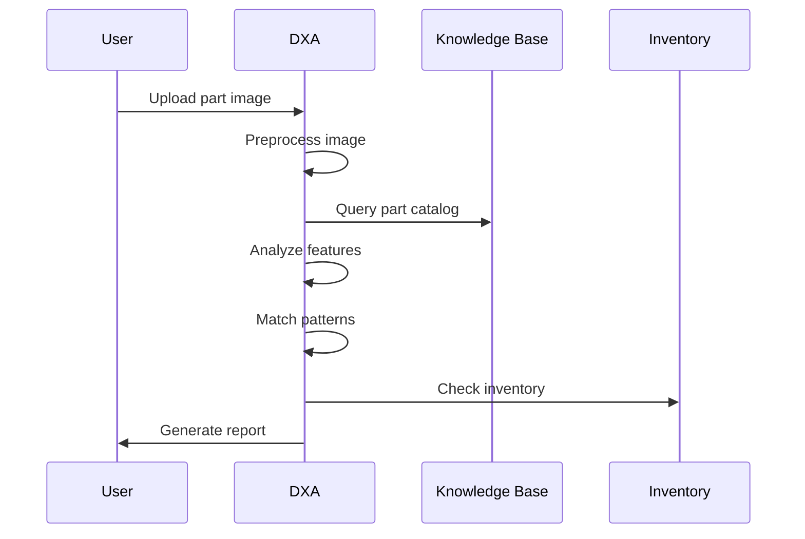
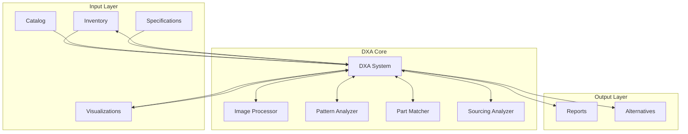

<!-- markdownlint-disable MD041 -->
<!-- markdownlint-disable MD033 -->

  

# Parts Identification System Requirements

  

## Business/Technical Problem Statement

### Persona
**Robert Johnson, Maintenance Technician**
- 12+ years experience in industrial equipment maintenance
- Responsible for maintaining and repairing various types of machinery
- Must quickly identify replacement parts to minimize downtime
- Works across multiple facilities and equipment types
- Reports to the Maintenance Supervisor

### Use Case
Robert needs to quickly identify parts and components through image analysis to retrieve accurate part numbers and inventory information. He must match visual characteristics of parts to database records, find replacement options, and determine availability to minimize equipment downtime.

### Scenario
During an emergency repair of a critical production machine, Robert needs to replace a damaged component. He needs to:
1. Capture a clear image of the damaged part
2. Upload the image to the parts identification system
3. Analyze the part's visual characteristics
4. Match the part to the parts catalog database
5. Find replacement options with inventory availability
6. Order the correct replacement part

Robert is under pressure to identify and order the correct replacement part quickly as the production line is down, costing thousands of dollars per hour in lost production. He needs a system that can help him accurately identify parts from images and provide immediate inventory information.

## Scenario Overview

This document describes the requirements for users who need to identify parts and components through image analysis to retrieve accurate part numbers and inventory information using DXA in a single conversation.

### System Components

1. **Image Processing System**
   - Image preprocessor
   - Feature extractor
   - Pattern analyzer
   - Dimension estimator
   - Material identifier

2. **Knowledge Base**
   - Parts catalog database
   - Technical specifications
   - Inventory data
   - Supplier information
   - Equipment models

3. **Analysis Engine**
   - Part identification
   - Pattern matching
   - Alternative finder
   - Specification matcher
   - Sourcing analyzer

4. **Reporting System**
   - Identification report generator
   - Specification display
   - Inventory checker
   - Sourcing information
   - Alternative part browser

### Example Scenario: Part Identification Process

#### Context

- Parts identification environment
- DXA has access to:
  - Parts catalog database
  - Technical specifications
  - Inventory management system
  - Supplier databases
  - Equipment models

#### Challenge

1. Accurate Identification
   - Process various image qualities
   - Handle multiple angles
   - Account for damage/wear
   - Match specifications
   - Find alternatives

2. Timely Response
   - Quick image processing
   - Rapid pattern matching
   - Fast inventory check
   - Immediate sourcing info
   - Clear documentation

3. Integration
   - Connect with ERP
   - Link to procurement
   - Access supplier portals
   - Update inventory
   - Track orders

#### DXA Actions

1. **Image Analysis**
   - Preprocess images
   - Extract features
   - Analyze patterns
   - Estimate dimensions
   - Identify materials

2. **Part Identification**
   - Match catalog entries
   - Find alternatives
   - Check inventory
   - Get sourcing info
   - Document findings

## Solution Architecture

### 1. Input Components

- Image capture system
- Parts catalog
- Technical specifications
- Inventory data

### 2. DXA Core Components

#### Image Processor

- Image preprocessing
- Feature extraction
- Pattern analysis
- Dimension estimation

#### Pattern Analyzer

- Part classification
- Pattern matching
- Material identification
- Alternative finding

#### Sourcing Analyzer

- Inventory checking
- Supplier finding
- Lead time analysis
- Cost comparison

### Integration Details

#### System Integration

- ERP system
- Procurement system
- Supplier portals
- Inventory management

#### Knowledge Integration

- Parts catalogs
- Technical specs
- Inventory data
- Supplier info

## Success Criteria

- Accurate part identification (>90% confidence)
- Correct specification matching
- Valid alternative identification
- Response time under one minute
- Successful sourcing information

## Performance Metrics

- Image recognition accuracy
- Pattern matching precision
- Alternative part identification rate
- Analysis generation time
- Inventory match rate
- Sourcing success rate
