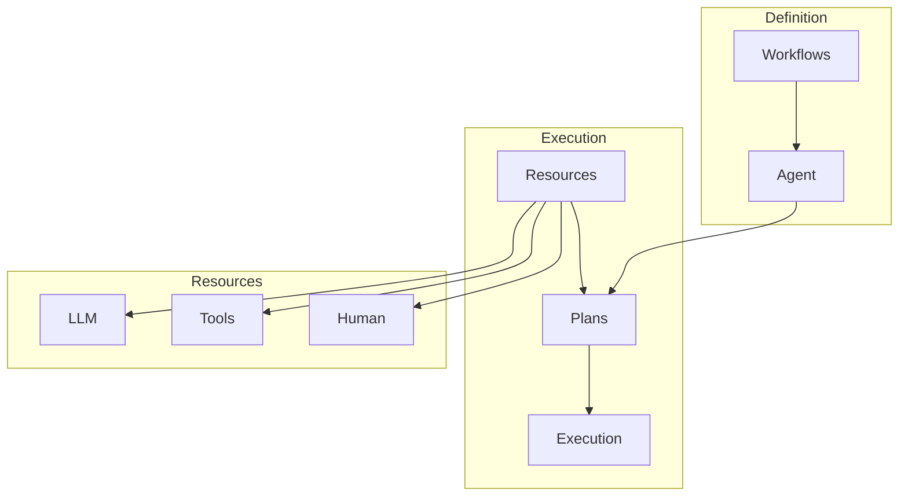

<!-- markdownlint-disable MD041 -->
<!-- markdownlint-disable MD033 -->
<p align="center">
  
</p>

# DXA - Domain-Expert Agent

## dxa Module

DXA is built around Workflows that define what agents can do. From simple Q&A to complex research patterns, workflows provide executable structures that agents can run. These workflows combine:
- Task sequences and decision points
- Resource requirements
- State management
- Execution patterns

## Core Architecture

At the heart of DXA is the `Agent` system, which coordinates cognitive functions through a layered architecture inspired by human decision-making. The `Planning` layer handles strategic decisions - what steps to take - while the `Reasoning` layer determines how to think about each step. Supporting these cognitive functions are `Capabilities` like memory and domain expertise, concrete `Resources` like LLMs and APIs, and an `IO` system for environmental interaction. This separation of concerns allows both high-level strategic thinking and efficient tactical execution while maintaining modularity and extensibility.

Getting started with DXA is straightforward through its `AgentFactory` system. For simple tasks, you can create an agent with a single line of code, selecting from tested configurations optimized for common use cases. As your needs grow more complex, the same agent can be progressively enhanced with additional capabilities, custom reasoning patterns, or specialized domain expertise. This approach embodies our core philosophy: simple things should be easy, complex things should be possible.

1. **[Agent System](agent/README.md)** - The central entity that:
   - Provides factory patterns for quick creation
   - Manages the core LLM that powers cognitive functions
   - Coordinates planning and reasoning
   - Handles resource allocation and state
   - Provides the main interface for users

2. **Core Cognitive Components**:
   - **[Planning](core/planning/README.md)** - Strategic layer that:
     - Understands objectives
     - Generates execution plans
     - Manages goal evolution
     - Coordinates resources

   - **[Reasoning](core/reasoning/README.md)** - Tactical layer that:
     - Executes planned steps
     - Makes detailed decisions
     - Adapts to new information
     - Reports progress

3. **Supporting Systems**:
   - **[Capabilities](core/capability/README.md)** - Core abilities like:
     - Memory management
     - Domain expertise
     - Learning functions

   - **[Resources](core/resource/README.md)** - External tools:
     - LLM interactions
     - Database access
     - API integrations

   - **[IO](core/io/README.md)** - Environmental interaction:
     - User interfaces
     - File operations
     - Network communication

## System Overview



## Core Components

1. **Workflows** define agent behavior:
   ```python
   # Simple Q&A workflow
   answer = Agent().ask("What is quantum computing?")
   
   # Research workflow with steps
   workflow = create_research_workflow()
   result = agent.execute(workflow)
   
   # Custom workflow
   workflow = BaseWorkflow()
   workflow.add_task("gather", "Gather information")
   workflow.add_task("analyze", "Analyze findings")
   ```

2. **Agents** execute workflows through:
   - Planning: Convert workflow to executable plan
   - Reasoning: Execute plan steps
   - Resources: Provide needed capabilities
   - State: Track execution progress

3. **Resources** enable workflow execution:
   - LLM: Core language model
   - Tools: External capabilities
   - Human: Interactive feedback
   - Domain: Expert knowledge

## Getting Started

```python
from dxa.core.agent import Agent
from dxa.core.workflow import create_research_workflow
from dxa.core.resource import LLMResource

# Simple Q&A
answer = Agent().ask("What is quantum computing?")

# Research workflow
workflow = create_research_workflow()
agent = Agent(resources={"llm": LLMResource()})
result = agent.execute(workflow)

# Custom workflow with resources
workflow = BaseWorkflow()
workflow.add_task("research", "Research topic")
workflow.add_task("synthesize", "Synthesize findings")

agent = Agent(resources={
    "llm": LLMResource(),
    "search": SearchResource()
})
result = agent.execute(workflow)
```

## Project Structure

```text
dxa/
|
├── core/           # Core components
│   ├── workflow/   # Workflow definitions
│   ├── agent/      # Agent implementation
│   ├── capability/ # Cognitive abilities
│   ├── io/         # Interaction handling
│   ├── planning/   # Plan generation
│   ├── reasoning/  # Step execution
│   └── resource/   # External tools
|
├── common/         # Shared utilities
│   ├── utils/      # Utility functions
│   └── graph/      # Graph infrastructure
|
└── examples/       # Usage examples
```

## Installation

1. Prerequisites:
   - Python 3.x
   - bash shell (Unix) or Git Bash (Windows)

2. Setup:

   ```bash
   git clone <repository-url>
   cd dxa-prototype
   bash setup_env.sh
   source venv/bin/activate  # Windows: source venv/Scripts/activate
   ```

## Documentation

- [Framework Overview](dxa/README.md) - System architecture and design
- [Agent Documentation](dxa/agent/README.md) - Agent implementation details
- [Examples](examples/README.md) - Implementation examples and patterns
- [API Reference](docs/README.md) - Detailed API documentation

## Contributing

DXA is proprietary software developed by Aitomatic, Inc. Contributions are limited to authorized Aitomatic employees and contractors. If you're an authorized contributor:

1. Please ensure you have signed the necessary Confidentiality and IP agreements
2. Follow the internal development guidelines
3. Submit your changes through the company's approved development workflow
4. Contact the project maintainers for access to the Contributing Guide

For external users or organizations interested in collaborating with Aitomatic on DXA development, please contact our business development team.

## License

This software is proprietary and confidential. Copyright © 2024 Aitomatic, Inc. All rights reserved.

Unauthorized copying, transfer, or reproduction of this software, via any medium, is strictly prohibited. This software is protected by copyright law and international treaties.

---

<p align="center">
<a href="https://aitomatic.com">https://aitomatic.com</a>
</p>

## Core Systems

- [Agent System](agent/README.md) - Agent creation and management
- [Flow System](flow/README.md) - Process and workflow automation
- [Planning System](core/planning/README.md) - Strategic planning
- [Reasoning System](core/reasoning/README.md) - Tactical reasoning
- [Resource System](core/resource/README.md) - Tool and capability integration
