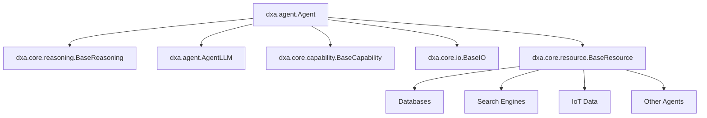

<!-- markdownlint-disable MD041 -->
<!-- markdownlint-disable MD033 -->
<p align="center">
  
</p>

# DXA - Domain-Expert Agent

DXA is a framework for building and deploying intelligent agents powered by Large Language Models (LLMs). Like human beings, these agents possess core cognitive abilities, inherent capabilities, ways to interact with their environment, and access to external resources.

For installation and setup instructions, see the [project README](../README.md). For practical implementation examples, check out our [examples directory](../examples/README.md).

## Documentation Map

### 1. Core Components

Each component has detailed documentation in its respective README:

#### Reasoning System ([docs](dxa/core/reasoning/README.md))

The cognitive engine that drives decision-making:

- **Direct Reasoning**: Simple task execution without complex reasoning
- **Chain of Thought (CoT)**: Linear process (understand → analyze → solve → verify)
- **OODA Loop**: Dynamic adaptation (observe → orient → decide → act)
- **DANA**: Neural-symbolic hybrid combining LLM understanding with precise computation

#### Capabilities ([docs](dxa/core/capability/README.md))

Fundamental agent abilities:

- Memory management for experience and knowledge
- Expertise domains for specialized knowledge
- Core cognitive functions (planning, decision-making)
- Custom capability extensions

#### I/O System ([docs](dxa/core/io/README.md))

Environmental interaction handlers:

- Text interfaces (CLI, chat)
- API endpoints
- File system operations
- Custom I/O handlers

#### Resources ([docs](dxa/core/resource/README.md))

External tool integration:

- Database connections
- Search engines
- IoT devices
- Inter-agent communication

#### Agent System ([docs](dxa/agent/README.md))

Unified agent implementation:

- Composable agent architecture
- Resource management
- Progress tracking
- State management

### 2. Examples & Tutorials ([docs](examples/README.md))

- Getting started guides
- Use case implementations
- Best practices examples

## Architecture Overview

An Agent in DXA, similar to a human being, is composed of:

1. A cognitive core (Reasoning) that drives decision-making and thought processes
2. Inherent capabilities (like Memory and Expertise) that shape its abilities
3. Input/Output channels for environmental interaction
4. Access to external resources and tools



## Examples

The `examples/` directory now includes several implementations demonstrating various use cases:

1. `collaborative_research.py`: Demonstrates multi-agent collaboration for research tasks
2. `websocket_solver.py`: Shows how to create a WebSocket-based problem-solving agent
3. `interactive_math.py`: Implements an interactive math tutor agent
4. `automation_web.py`: Showcases web scraping automation using an agent

These examples cover a range of agent types and scenarios:

- Collaborative problem-solving
- Network-based agent communication
- Interactive console-based agents
- Workflow automation

We encourage you to explore these examples to better understand the full potential of the DXA framework.

## Getting Started

The simplest way to create an agent is to use one of the pre-built agent classes:

```python
from dxa import Agent

agent = Agent("assistant")\
    .with_reasoning("cot")\
    .with_resources({"llm": LLMResource(model="gpt-4")})
await agent.run("Help with this task")
```

## Advanced Usage

For custom agent behaviors, you can use the factory pattern:

```python
from dxa import create_agent

async with create_agent({
    "name": "custom_agent",
    "reasoning": "cot",
    "capabilities": ["research"],
    "resources": {
        "llm": LLMResource(model="gpt-4")
    }
}) as agent:
    result = await agent.run("Research this topic")
```

## Module Structure

```text
dxa/
├── agent/
│   ├── __init__.py
│   ├── unified_agent.py
│   ├── agent_llm.py
│   ├── progress.py
│   ├── config.py
│   └── state.py
├── core/
│   ├── capability/
│   ├── io/
│   ├── reasoning/
│   └── resource/
└── examples/
    ├── __init__.py
    ├── collaborative_research.py
    ├── websocket_solver.py
    ├── interactive_math.py
    └── automation_web.py
```

## Contributing

DXA is proprietary software developed by Aitomatic, Inc. Contributions are limited to authorized Aitomatic employees and contractors. If you're an authorized contributor:

1. Please ensure you have signed the necessary Confidentiality and IP agreements
2. Follow the internal development guidelines
3. Submit your changes through the company's approved development workflow
4. Contact the project maintainers for access to the [Contributing Guide]

For external users or organizations interested in collaborating with Aitomatic on DXA development, please contact our business development team.

## License

This software is proprietary and confidential. Copyright © 2024 Aitomatic, Inc. All rights reserved.

Unauthorized copying, transfer, or reproduction of this software, via any medium, is strictly prohibited. This software is protected by copyright law and international treaties.
