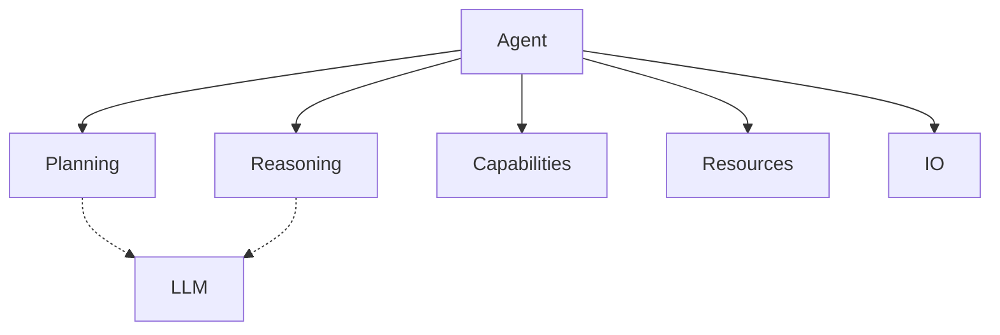

<!-- markdownlint-disable MD041 -->
<!-- markdownlint-disable MD033 -->
<p align="center">
  
</p>

# DXA - Domain-Expert Agent

DXA is a framework for building and deploying intelligent agents powered by Large Language Models (LLMs). Like human beings, these agents possess core cognitive abilities, inherent capabilities, ways to interact with their environment, and access to external resources.

## Core Architecture

At the heart of DXA is the Agent system, which coordinates cognitive functions through a layered architecture:

1. **[Agent System](agent/README.md)** - The central entity that:
   - Provides factory patterns for quick creation
   - Manages the core LLM that powers cognitive functions
   - Coordinates planning and reasoning
   - Handles resource allocation and state
   - Provides the main interface for users

2. **Core Cognitive Components**:
   - **[Planning](core/planning/README.md)** - Strategic layer that:
     - Understands objectives
     - Generates execution plans
     - Manages goal evolution
     - Coordinates resources

   - **[Reasoning](core/reasoning/README.md)** - Tactical layer that:
     - Executes planned steps
     - Makes detailed decisions
     - Adapts to new information
     - Reports progress

3. **Supporting Systems**:
   - **[Capabilities](core/capability/README.md)** - Core abilities like:
     - Memory management
     - Domain expertise
     - Learning functions

   - **[Resources](core/resource/README.md)** - External tools:
     - LLM interactions
     - Database access
     - API integrations

   - **[IO](core/io/README.md)** - Environmental interaction:
     - User interfaces
     - File operations
     - Network communication

## System Overview



[Rest of existing content including Quick Start, Project Structure, etc...]

## Getting Started

The simplest way to create an agent is:

```python
from dxa import AgentFactory

# Quick start with factory
agent = AgentFactory.quick("assistant")
result = await agent.run("Help with this task")

# Or use template with customization
agent = AgentFactory.from_template("researcher")\
    .with_reasoning("cot")\
    .with_resources({"llm": LLMResource(model="gpt-4")})
result = await agent.run("Help with this task")
```

## Examples

The `examples/` directory demonstrates various agent implementations:

1. **Basic Patterns**
   - `chat_bot.py`: Interactive conversational agent
   - `research_assistant.py`: Information gathering and analysis
   - `system_monitor.py`: Continuous system monitoring

2. **Advanced Usage**
   - `collaborative_research.py`: Multi-agent collaboration
   - `websocket_solver.py`: WebSocket-based problem solving
   - `interactive_math.py`: Interactive math tutoring
   - `automation_web.py`: Web scraping automation

These examples showcase different agent configurations and use cases:

- Collaborative problem-solving
- Network-based communication
- Interactive console agents
- Workflow automation

## Advanced Usage

For custom agent behaviors, use the factory pattern:

```python
from dxa import create_agent

async with create_agent({
    "name": "custom_agent",
    "llm": LLMResource("gpt-4"),
    "planning": "hierarchical",
    "reasoning": "cot",
    "capabilities": ["research"]
}) as agent:
    result = await agent.run("Research this topic")
```

## Project Structure

```text
dxa/
├── agent/          # Agent implementation
│   ├── __init__.py
│   ├── agent.py
│   ├── runtime.py
│   └── state.py
├── core/           # Core components
│   ├── planning/   # Strategic planning
│   ├── reasoning/  # Tactical execution
│   ├── capability/ # Core abilities
│   ├── resource/   # External tools
│   └── io/         # Interaction handling
└── examples/       # Usage examples
    ├── basic/      # Basic patterns
    └── advanced/   # Complex scenarios
```

## Installation

1. Prerequisites:
   - Python 3.x
   - bash shell (Unix) or Git Bash (Windows)

2. Setup:

   ```bash
   git clone <repository-url>
   cd dxa-prototype
   bash setup_env.sh
   source venv/bin/activate  # Windows: source venv/Scripts/activate
   ```

## Documentation

- [Framework Overview](dxa/README.md) - System architecture and design
- [Agent Documentation](dxa/agent/README.md) - Agent implementation details
- [Examples](examples/README.md) - Implementation examples and patterns
- [API Reference](docs/README.md) - Detailed API documentation

## Contributing

DXA is proprietary software developed by Aitomatic, Inc. Contributions are limited to authorized Aitomatic employees and contractors. If you're an authorized contributor:

1. Please ensure you have signed the necessary Confidentiality and IP agreements
2. Follow the internal development guidelines
3. Submit your changes through the company's approved development workflow
4. Contact the project maintainers for access to the Contributing Guide

For external users or organizations interested in collaborating with Aitomatic on DXA development, please contact our business development team.

## License

This software is proprietary and confidential. Copyright © 2024 Aitomatic, Inc. All rights reserved.

Unauthorized copying, transfer, or reproduction of this software, via any medium, is strictly prohibited. This software is protected by copyright law and international treaties.

---

<p align="center">
<a href="https://aitomatic.com">https://aitomatic.com</a>
</p>
