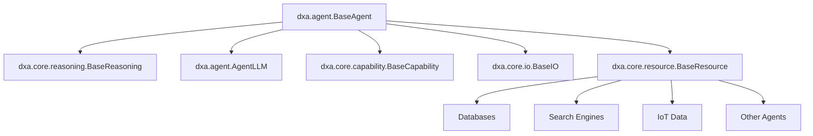

<!-- markdownlint-disable MD041 -->
<!-- markdownlint-disable MD033 -->
<p align="center">
    {: width="400" style="border: 2px solid #666; border-radius: 10px; padding: 20px; box-shadow: 0 4px 8px rgba(0,0,0,0.1);"}
</p>

# DXA - Domain-Expert Agent

DXA is a framework for building and deploying intelligent agents powered by Large Language Models (LLMs). Like human beings, these agents possess core cognitive abilities, inherent capabilities, ways to interact with their environment, and access to external resources.

For installation and setup instructions, see the [project README](../README.md). For practical implementation examples, check out our [examples directory](../examples/README.md).

## Architecture Overview

An Agent in DXA, similar to a human being, is composed of:

1. A cognitive core (Reasoning) that drives decision-making and thought processes
2. Inherent capabilities (like Memory and Expertise) that shape its abilities
3. Input/Output channels for environmental interaction
4. Access to external resources and tools



## Core Components

### Reasoning (`dxa.core.reasoning`)

The reasoning system is the agent's "cognitive core," analogous to human thought processes:

- Planning systems: For creating and executing multi-step plans
- Goal management: For tracking and prioritizing objectives
- Task execution: For carrying out specific actions
- Decision trees: For structured decision-making processes

### Inherent Capabilities (`dxa.core.capability`)

Like human innate abilities, these are fundamental features of the agent:

- Memory management: Handles storage and retrieval of agent experiences and knowledge
- Expertise domains: Defines areas of specialized knowledge and skills
- Core reasoning abilities: Provides basic cognitive functions like planning and decision-making
- Custom capability extensions: Allows for adding new specialized abilities

### I/O (`dxa.core.io`)

Similar to human senses and expression, I/O handlers manage all interaction with the environment:

- Text-based interfaces: For command-line and chat interactions
- API endpoints: For web service integration
- File system operations: For reading and writing files
- Custom I/O handlers: For specialized communication needs

### Resources (`dxa.core.resource`)

Like tools and references that humans use, resources provide access to external capabilities:

- Database connections: For persistent storage
- Search engine integrations: For accessing external knowledge
- IoT device interfaces: For interacting with physical devices
- Inter-agent communication: For coordinating with other agents

### Agents (`dxa.agent`)

The agent module provides several specialized agent types, each designed for specific roles:

- `BaseAgent`: The foundation for all agent types
- `AutonomousAgent`: For agents that operate independently
- `CollaborativeAgent`: For multi-agent systems where agents work together
- `InteractiveAgent`: For direct human interaction with real-time conversation capabilities
- `WebSocketAgent`: For web-based communication, enabling remote agent interactions
- `AutomationAgent`: Specialized for workflow automation tasks

Additional components in the `dxa.agent` module:

- `AgentLLM`: Internal LLM implementation for agents
- `AgentProgress`: For reporting task progress
- `LLMConfig`: For configuration management
- `StateManager`: Manages agent state, observations, and messages

## Examples

The `examples/` directory now includes several implementations demonstrating various use cases:

1. `collaborative_research.py`: Demonstrates multi-agent collaboration for research tasks
2. `websocket_solver.py`: Shows how to create a WebSocket-based problem-solving agent
3. `interactive_math.py`: Implements an interactive math tutor agent
4. `automation_web.py`: Showcases web scraping automation using an agent

These examples cover a range of agent types and scenarios:

- Collaborative problem-solving
- Network-based agent communication
- Interactive console-based agents
- Workflow automation

We encourage you to explore these examples to better understand the full potential of the DXA framework.

## Getting Started

The simplest way to create an agent is to use one of the pre-built agent classes:

```python
from dxa.agent import InteractiveAgent

agent = InteractiveAgent()
agent.run()
```

## Advanced Usage

For custom agent behaviors, you can use the factory pattern:

```python
from dxa.core.factory import create_agent

custom_agent = create_agent(
    agent_type="websocket",
    config={
        "name": "custom_agent",
        "llm_config": {...},
        "reasoning_config": {...},
        "resources_config": {...}
    }
)
```

## Module Structure

```text
dxa/
├── agent/
│   ├── __init__.py
│   ├── base_agent.py
│   ├── autonomous_agent.py
│   ├── collaborative_agent.py
│   ├── interactive_agent.py
│   ├── websocket_agent.py
│   ├── automation_agent.py
│   ├── agent_llm.py
│   ├── progress.py
│   ├── config.py
│   └── state.py
├── core/
│   ├── capability/
│   ├── io/
│   ├── reasoning/
│   └── resource/
└── examples/
    ├── __init__.py
    ├── collaborative_research.py
    ├── websocket_solver.py
    ├── interactive_math.py
    └── automation_web.py
```

## Contributing

DXA is proprietary software developed by Aitomatic, Inc. Contributions are limited to authorized Aitomatic employees and contractors. If you're an authorized contributor:

1. Please ensure you have signed the necessary Confidentiality and IP agreements
2. Follow the internal development guidelines
3. Submit your changes through the company's approved development workflow
4. Contact the project maintainers for access to the [Contributing Guide]

For external users or organizations interested in collaborating with Aitomatic on DXA development, please contact our business development team.

## License

This software is proprietary and confidential. Copyright © 2024 Aitomatic, Inc. All rights reserved.

Unauthorized copying, transfer, or reproduction of this software, via any medium, is strictly prohibited. This software is protected by copyright law and international treaties.
