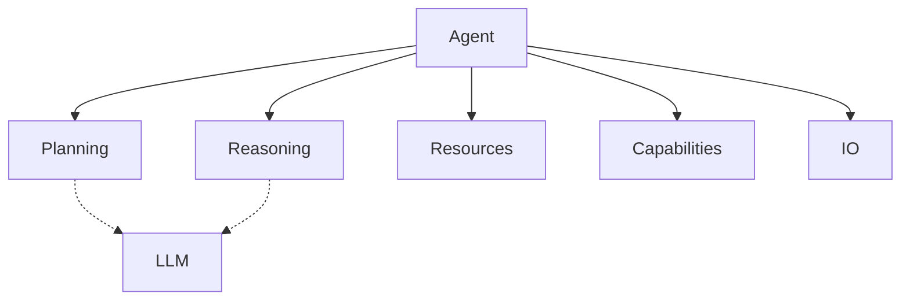

<!-- markdownlint-disable MD041 -->
<!-- markdownlint-disable MD033 -->
<p align="center">
  
</p>

# DXA Agent System

The DXA agent system implements a composable architecture that combines planning, reasoning, and execution to create powerful AI agents.

## Design Philosophy

1. Simple things should be simple, complex things should be possible
2. Composition over inheritance
3. Smart defaults with explicit control when needed

## Core Requirements

Every DXA agent requires a core LLM that powers its cognitive functions:

```python
# The LLM is provided at construction
agent = Agent("assistant", llm=LLMResource("gpt-4"))
```

This LLM is automatically used by the agent's planning and reasoning systems, ensuring consistent cognitive capabilities across all operations.

## Core Components



## Usage

```python
# Simple usage with defaults
agent = Agent("assistant", llm=default_llm)
result = await agent.run("Help me with this task")

# Full control with composition
agent = Agent("expert", llm=my_llm)\
    .with_planning("hierarchical")\
    .with_reasoning("cot")\
    .with_capabilities(["research"])\
    .with_io(custom_io)

# Execution with context
async with agent:
    result = await agent.run(task)
```

## Runtime System

The agent runtime manages execution flow and state:

```python
# Runtime configuration
runtime_config = {
    "max_steps": 100,
    "timeout": 300,
    "error_policy": "retry"
}

# Using the runtime
async with agent.runtime(runtime_config) as runtime:
    result = await runtime.execute(task)
```

## State Management

Agents maintain state across operations:

```python
# Access agent state
current_task = agent.state.current_task
progress = agent.state.progress

# State persistence
await agent.state.save()
await agent.state.restore()
```

## Configuration

Agents can be configured through:

1. Construction parameters
2. Resource configuration
3. Runtime settings
4. State preferences

## Error Handling

The agent system provides several error handling mechanisms:

1. Automatic retries
2. Fallback strategies
3. Error recovery
4. State preservation

## Monitoring

Track agent performance through:

1. Progress metrics
2. Resource usage
3. Success rates
4. Error patterns

## See Also

- [Runtime Documentation](runtime/README.md)
- [Core System](../core/README.md)
- [Examples](../../examples/README.md)

---


<p align="center">
Copyright © 2024 Aitomatic, Inc. All rights reserved.
</p>

<p align="center">
<a href="https://aitomatic.com">https://aitomatic.com</a>
</p>
