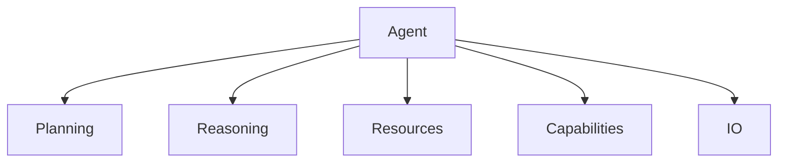

<!-- markdownlint-disable MD041 -->
<!-- markdownlint-disable MD033 -->
<p align="center">
  
</p>

# DXA Agent System

The DXA agent system implements a composable architecture that combines planning, reasoning, and execution to create powerful AI agents.

## Design Philosophy

1. Simple things should be simple, complex things should be possible
2. Composition over inheritance
3. Smart defaults with explicit control when needed

## Core Components



## Usage

```python
# Simple usage with defaults
agent = Agent("assistant")
result = await agent.run("Help me with this task")

# Full control with composition
agent = Agent("expert")\
    .with_planning("hierarchical")\
    .with_reasoning("cot")\
    .with_resources({"llm": my_llm})\
    .with_capabilities(["research"])\
    .with_io(custom_io)

# Execution with context
async with agent:
    result = await agent.run(task)
```

## Agent Construction

+ ### LLM Requirement
+ 
+ Every DXA agent requires an LLM that powers its cognitive functions:
+ ```python
+ # The LLM is provided at construction
+ agent = Agent("assistant", llm=LLMResource("gpt-4"))
+ 
+ # It's automatically used by planning and reasoning
+ agent.with_planning("hierarchical")  # Uses agent's LLM
+ agent.with_reasoning("cot")          # Uses agent's LLM
+ ```
+ 
[Rest of agent-specific documentation...]
