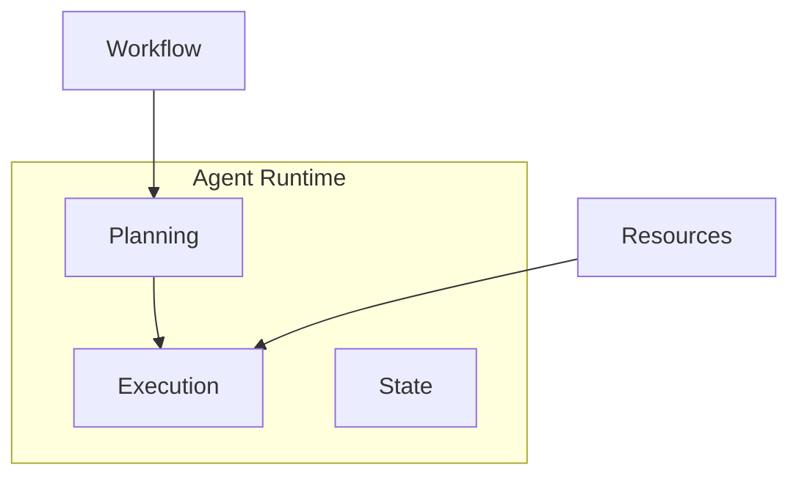
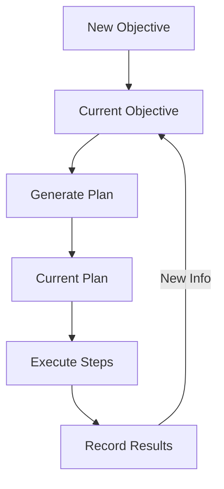

<!-- markdownlint-disable MD041 -->
<!-- markdownlint-disable MD033 -->
<p align="center">
  
</p>

# DXA Agent System

## dxa.agent Module

The DXA agent system executes workflows by:

1. Converting workflows to executable plans
2. Managing required resources
3. Tracking execution state
4. Adapting to new information

For detailed information about how workflows are executed, see the [Execution System](../execution/README.md).

## Design Philosophy

1. Simple things should be simple, complex things should be possible
2. Composition over inheritance
3. Smart defaults with explicit control when needed

## User-Friendly Practices

DXA's agent system is designed with user experience in mind, providing several features that make it easy to use and extend:

1. **Model Context Protocol (MCP)**
   - Standardized interface for all external resources
   - Consistent tool integration
   - Built-in schema validation
   - Robust error handling

2. **Built-in Best Practices**
   - Pre-configured templates
   - Common behavior patterns
   - Optimized defaults
   - Proven configurations

3. **Resource Management**
   - Robust error handling
   - Multiple transport types
   - Automatic cleanup
   - State persistence

4. **Comprehensive Testing**
   - Unit test support
   - Integration testing
   - Performance benchmarks
   - Error scenario coverage

5. **Documentation-First**
   - Clear API documentation
   - Usage examples
   - Best practices
   - Troubleshooting guides

## Agent Factory

The DXA framework provides a factory pattern for creating agents with common configurations. This simplifies agent creation while maintaining access to DXA's full capabilities.

### Why Use AgentFactory

- Simplifies common agent creation patterns
- Provides tested, optimized configurations
- Maintains consistent initialization across applications
- Enables quick starts with progressive enhancement

### Usage

```python
from dxa.agent import Agent
from dxa.agent.resource import LLMResource
from dxa.execution import WorkflowFactory

# Simple workflow execution
answer = Agent().ask("What is quantum computing?")

# Research workflow with resources
workflow = WorkflowFactory.create_default_workflow("Research quantum computing")
agent = Agent(name="researcher").with_llm(LLMResource())
result = agent.run(workflow)

# Custom workflow execution
workflow = WorkflowFactory.create_sequential_workflow(
    objective="Research and synthesize findings", 
    commands=[
        "Research topic",
        "Synthesize findings"
    ]
)

agent = Agent(name="custom_agent").with_llm(LLMResource())
result = agent.run(workflow)
```

## Workflow Execution

Agents execute workflows through:



1. **Planning**
   - Convert workflow to executable plan
   - Allocate required resources
   - Set up execution state

2. **Execution**
   - Run workflow steps
   - Track progress
   - Handle state changes
   - Adapt to new information

3. **Resources**
   - Manage LLM interactions
   - Control tool access
   - Handle I/O operations

## State Management

Agents track:

- Workflow progress
- Resource allocation
- Execution context
- Generated artifacts

## State Components

The DXA agent system uses a centralized state management approach to track the evolution of objectives and plans. This integrates with the [Planning System](../execution/planning/README.md) and [Reasoning System](../execution/reasoning/README.md) to maintain coherent agent state.

## Core State Components

### Objective State

- Current objective being pursued
- History of objective evolution
- Metadata (timestamps, reasons for changes)

### Plan State  

- Current execution plan
- History of plan evolution
- Plan metadata (completion status, timestamps)

### Execution State

- Active step in current plan
- Results from completed steps
- Resource allocations (managed via [Resource System](resource/README.md))

## State Flow



## Resource Integration

```python
from dxa.agent import Agent
from dxa.agent.resource import LLMResource, HumanResource

# Configure agent with resources
agent = Agent(name="assistant")\
    .with_llm(LLMResource(config={"model": "openai:gpt-4"}))\
    .with_resources({
        "human": HumanResource(name="user")
    })

# Resources are available during workflow execution
result = agent.run(workflow)
```

### Domain-Specific Tasks

```python
from dxa.agent import Agent
from dxa.agent.resource import LLMResource
from dxa.execution import PlanStrategy, ReasoningStrategy
from dxa.execution import WorkflowFactory

# Advanced planning and reasoning configuration
agent = Agent(name="optimizer")\
    .with_llm(LLMResource())\
    .with_planning(PlanStrategy.HIERARCHICAL)\
    .with_reasoning(ReasoningStrategy.DEFAULT)

workflow = WorkflowFactory.create_sequential_workflow(
    objective="Optimize system performance",
    commands=[
        "Profile code and identify bottlenecks",
        "Optimize algorithms and tune parameters",
        "Run benchmarks and verify results"
    ]
)

result = await agent.async_run(workflow)
```

### Pattern Selection Guide

Choose patterns based on:

1. **Task Complexity**
   - Simple Q&A → DEFAULT Planning + DEFAULT Reasoning
   - Multi-step Analysis → SEQUENTIAL Planning + Chain of Thought Reasoning
   - Real-time Adaptation → DYNAMIC Planning + State-based Reasoning
   - Domain Expertise → HIERARCHICAL Planning + Domain-specific Reasoning

2. **Resource Requirements**
   - Minimal → DEFAULT (LLM only)
   - Memory Intensive → SEQUENTIAL Planning
   - External Tools → WORKFLOW_IS_PLAN with custom resources
   - Complex Processing → HIERARCHICAL Planning with specialized LLMs

3. **Performance Needs**
   - Quick Response → DEFAULT Planning strategies
   - Verifiable Logic → SEQUENTIAL Planning with detailed reasoning
   - Continuous Operation → DYNAMIC Planning with state tracking
   - Optimal Solutions → HIERARCHICAL Planning with specialized reasoning

## Runtime System

The agent runtime manages execution flow and state:

```python
# Using the agent as an async context manager
async with agent as runtime_agent:
    result = await runtime_agent.async_run(workflow)

# Manual initialization and cleanup
await agent.initialize()
result = await agent.async_run(workflow)
await agent.cleanup()
```

## Key Design Principles

1. **Single Source of Truth**
   - One state object accessed by all components
   - Clear ownership and update patterns
   - Atomic state transitions

2. **History Tracking**
   - Evolution of objectives and plans
   - Timestamps for all changes
   - Reasons for state transitions

3. **Execution Context**
   - Track active work
   - Record step results
   - Monitor resource usage via [I/O System](io/README.md)

## Usage Patterns

Planning and Reasoning layers interact with state through well-defined interfaces:

- Planning reads/writes objectives and plans
- Reasoning reads plans and writes results
- Both can trigger state transitions based on new information

See [Capability System](capability/README.md) for higher-level state operations.

Would you like me to elaborate on any aspect of this design?

## Configuration

Agents can be configured through:

1. Construction parameters
2. Resource configuration
3. Runtime settings
4. State preferences

## Error Handling

Agents provide:

- Automatic retries
- Resource cleanup
- State preservation
- Error recovery

## See Also

- [Workflow System](../execution/workflow/README.md)
- [Resource System](resource/README.md)
- [Capability System](capability/README.md)
- [Examples](../../examples/README.md)

---

<p align="center">
Copyright © 2024 Aitomatic, Inc. All rights reserved.
</p>

<p align="center">
<a href="https://aitomatic.com">https://aitomatic.com</a>
</p>
