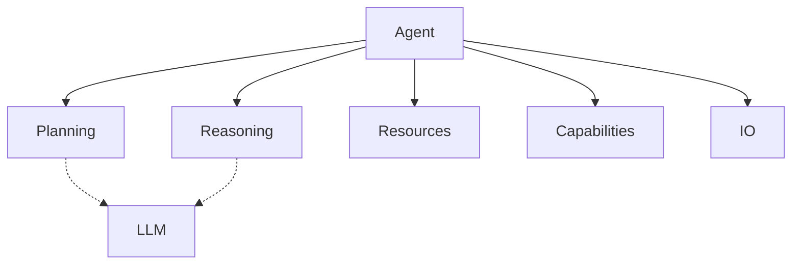
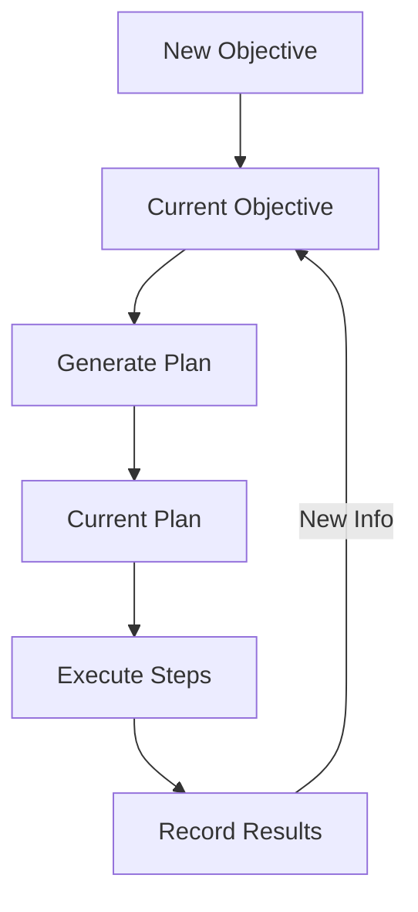

<!-- markdownlint-disable MD041 -->
<!-- markdownlint-disable MD033 -->
<p align="center">
  
</p>

# DXA Agent System

## dxa.agent Module

The DXA agent system implements a composable architecture that combines planning, reasoning, and execution to create powerful AI agents.

## Design Philosophy

1. Simple things should be simple, complex things should be possible
2. Composition over inheritance
3. Smart defaults with explicit control when needed

## Agent Factory

The DXA framework provides a factory pattern for creating agents with common configurations. This simplifies agent creation while maintaining access to DXA's full capabilities.

### Why Use AgentFactory

- Simplifies common agent creation patterns
- Provides tested, optimized configurations
- Maintains consistent initialization across applications
- Enables quick starts with progressive enhancement

### Usage

```python
from dxa import AgentFactory

# Quick start with factory
agent = AgentFactory.quick("assistant")

# Create from template
agent = AgentFactory.from_template("researcher")

# Template with customization
agent = AgentFactory.from_template("researcher")\
    .with_reasoning("cot")\
    .with_resources({"llm": LLMResource(model="gpt-4")})
```

### Built-in Templates

The factory includes tested configurations for common use cases:

- researcher: Optimized for information gathering and analysis
- automator: Configured for simple task automation
- expert: Base configuration for domain expertise
- autonomous: Self-directed agent configuration

### Implementation

```python
class AgentFactory:
    """Creates different types of DXA agents with appropriate configurations"""
    
    def __init__(self):
        self._templates = {
            "researcher": {
                "planning": "hierarchical",
                "reasoning": "cot",
                "resources": ["search", "memory"],
                "capabilities": ["research"]
            },
            "automator": {
                "planning": "direct",
                "reasoning": "simple",
                "resources": ["tools"],
                "capabilities": ["automation"]
            }
            # Additional templates...
        }

    @classmethod
    def quick(cls, name: str) -> Agent:
        """Creates simple agent with sensible defaults"""
        return cls._create_from_template("automator", name)

    @classmethod
    def from_template(cls, template_name: str, name: str = None) -> Agent:
        """Creates agent from predefined template"""
        template = cls._templates[template_name]
        return Agent(name or template_name)\
            .with_planning(template["planning"])\
            .with_reasoning(template["reasoning"])\
            .with_resources(template["resources"])\
            .with_capabilities(template["capabilities"])
```

## Core Requirements

Every DXA agent requires a core LLM that powers its cognitive functions:

```python
# The LLM is provided at construction
agent = Agent("assistant", llm=LLMResource("gpt-4"))
```

This LLM is automatically used by the agent's planning and reasoning systems, ensuring consistent cognitive capabilities across all operations.

## Core Components



## Usage

```python
# Simple usage with defaults
agent = Agent("assistant", llm=default_llm)
result = await agent.run("Help me with this task")

# Full control with composition
agent = Agent("expert", llm=my_llm)\
    .with_planning("hierarchical")\
    .with_reasoning("cot")\
    .with_capabilities(["research"])\
    .with_io(custom_io)

# Execution with context
async with agent:
    result = await agent.run(task)
```

## Runtime System

The agent runtime manages execution flow and state:

```python
# Runtime configuration
runtime_config = {
    "max_steps": 100,
    "timeout": 300,
    "error_policy": "retry"
}

# Using the runtime
async with agent.runtime(runtime_config) as runtime:
    result = await runtime.execute(task)
```

## State Management

The DXA agent system uses a centralized state management approach to track the evolution of objectives and plans. This integrates with the [Planning System](../core/planning/README.md) and [Reasoning System](../core/reasoning/README.md) to maintain coherent agent state.

## Core State Components

### Objective State

- Current objective being pursued
- History of objective evolution
- Metadata (timestamps, reasons for changes)

### Plan State  

- Current execution plan
- History of plan evolution
- Plan metadata (completion status, timestamps)

### Execution State

- Active step in current plan
- Results from completed steps
- Resource allocations (managed via [Resource System](../core/resource/README.md))

## State Flow



## Key Design Principles

1. **Single Source of Truth**
   - One state object accessed by all components
   - Clear ownership and update patterns
   - Atomic state transitions

2. **History Tracking**
   - Evolution of objectives and plans
   - Timestamps for all changes
   - Reasons for state transitions

3. **Execution Context**
   - Track active work
   - Record step results
   - Monitor resource usage via [I/O System](../core/io/README.md)

## Usage Patterns

Planning and Reasoning layers interact with state through well-defined interfaces:

- Planning reads/writes objectives and plans
- Reasoning reads plans and writes results
- Both can trigger state transitions based on new information

See [Capability System](../core/capability/README.md) for higher-level state operations.

Would you like me to elaborate on any aspect of this design?

## Configuration

Agents can be configured through:

1. Construction parameters
2. Resource configuration
3. Runtime settings
4. State preferences

## Error Handling

The agent system provides several error handling mechanisms:

1. Automatic retries
2. Fallback strategies
3. Error recovery
4. State preservation

## Monitoring

Track agent performance through:

1. Progress metrics
2. Resource usage
3. Success rates
4. Error patterns

## See Also

- [Runtime Documentation](runtime/README.md)
- [Core System](../core/README.md)
- [Examples](../../examples/README.md)

---

<p align="center">
Copyright © 2024 Aitomatic, Inc. All rights reserved.
</p>

<p align="center">
<a href="https://aitomatic.com">https://aitomatic.com</a>
</p>
