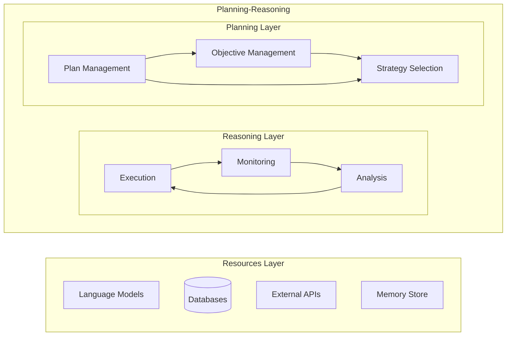
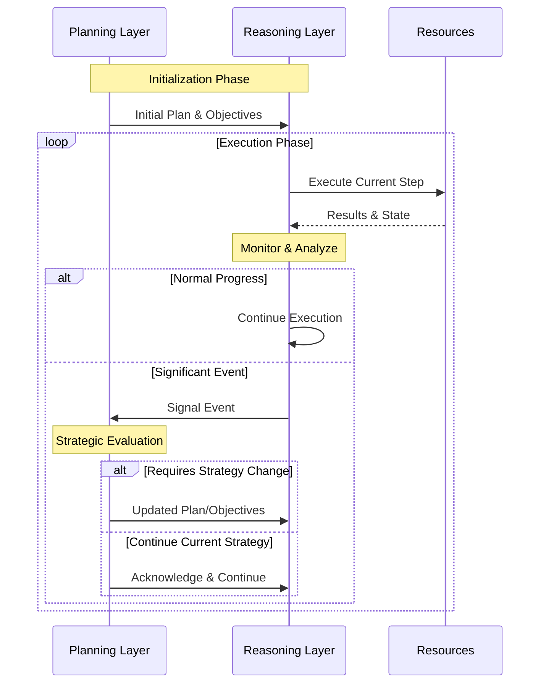

# DXA (Domain-Expert Agents)

This directory contains the core agent implementation for the DXA framework.

A hierarchical agent system that separates strategic planning from
tactical execution through a clean two-layer architecture. The
system emphasizes clear separation of concerns while maintaining
adaptivity through a well-defined signaling system.

## Structure

The system is built on two primary layers with distinct responsibilities:

The Planning Layer operates at a strategic level, maintaining the
agent's overall direction and objectives. It owns the "big picture"
— creating plans, evaluating progress, and making strategic decisions.
This layer deliberately operates at a higher level of abstraction,
focusing on what needs to be done rather than how to do it. It
maintains working memory of recent history and context to inform
its decisions, but delegates all tactical execution.

The Reasoning Layer handles tactical execution and monitoring. It
owns the "how" of execution - taking the current plan step, deciding
the best way to execute it, and managing the actual execution. It
has significant autonomy in how it achieves each step, including
handling minor variations and setbacks without escalation. However,
it maintains clear boundaries by signaling the Planning Layer when
strategic changes might be needed.



The interaction between layers is managed through two primary mechanisms:

1. Plans flow down from Planning to Reasoning, providing clear
direction while leaving tactical decisions to the Reasoning Layer
2. Signals flow up from Reasoning to Planning, alerting to significant
events or changes that might require strategic adjustment

Resources (like language models, databases, or APIs) are primarily
managed by the Reasoning Layer, which has direct control over their
usage. However, resource availability and constraints can trigger
signals to the Planning Layer when strategic adjustments are needed.

## Execution

The execution model emphasizes stability while maintaining adaptivity.
Here's how the system operates:

The Planning Layer initializes execution by creating a plan based
on the current objective. Plans are treated as living documents -
expected to evolve but not constantly changing. The Planning Layer
sets clear success criteria and constraints but leaves tactical
decisions to the Reasoning Layer.

The Reasoning Layer executes through a continuous cycle:

1. Interpret the current plan step and determine best execution approach
2. Execute using available resources
3. Monitor progress and resource health
4. Generate signals when significant events occur



Critical to this model is the signal system between layers. Signals
are generated by the Reasoning Layer when it detects:

1. Changes in objective understanding requiring refinement
2. Resource constraints or failures requiring strategic adjustment
3. Confidence drops suggesting current approach may not succeed
4. Critical new information that could affect strategy
5. Environmental changes impacting execution

The Planning Layer evaluates signals based on significance, not
timing. Major discoveries or failures trigger immediate replanning,
while minor variations are handled by Reasoning Layer flexibility.
This creates stability while maintaining adaptivity to important
changes.

## Configuration

The agent supports progressive complexity through a fluent builder pattern:

### Basic Usage

```python
agent = Agent("researcher")\
            .with_llm(LLMResource(model="gpt-4"))\
            .with_reasoning("cot")
```

### Advanced Usage

```python
agent = Agent("researcher")\
            .with_llm(LLMResource(...))\
            .with_reasoning_pipeline([
                ObjectiveAnalysisStage(),
                PlanValidationStage(),
                ExecutionStage()
            ])\
            .with_plan_modification_strategy(
                AdaptivePlanStrategy(
                    triggers=[ConfidenceThresholdTrigger(0.7)]
                )
            )
```

### Best Practices

1. Keep the Planning Layer focused on strategy - avoid pulling it into tactical decisions
2. Allow the Reasoning Layer appropriate autonomy in tactical execution
3. Set appropriate signal thresholds to avoid unnecessary plan changes
4. Maintain clear separation between strategic and tactical state
5. Monitor and adjust signal thresholds based on execution patterns
6. Implement robust error handling at both layers
7. Maintain audit trails of strategic decisions and their rationale
