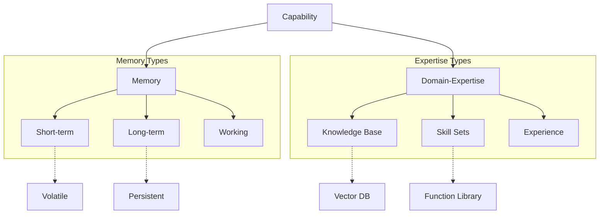

<!-- markdownlint-disable MD041 -->
<!-- markdownlint-disable MD033 -->
<p align="center">
  
</p>

# Capability System

## dxa.core.capability Module

The capability layer provides core cognitive abilities to DXA agents, building on top of the [resource system](../resource/README.md) to create higher-level, more cognitively-aligned interfaces. While resources provide raw functionality (databases, APIs, tools), capabilities represent how an agent thinks and learns. The two primary capabilities - Memory and Domain-Expertise - are fundamental to creating agents that can learn from experience and apply specialized knowledge.

## Design Philosophy

> Simple things should be easy, complex things should be possible.

This principle guides our capability system design:

- Simple memory operations (store/recall)
- Natural knowledge interfaces
- Composable capabilities
- Extensible architecture

## Architecture



## Usage Guide

### Basic Memory Operations

```python
# Simple memory usage
agent = Agent("assistant")\
    .with_memory()  # Default memory configuration

# Store and recall
await agent.memory.store("user_preference", "dark_mode")
preference = await agent.memory.recall("user_preference")

# Short-term memory automatically manages relevance
await agent.memory.short_term.add("current_context", context)
```

### Advanced Memory Management

```python
# Configured memory system
agent = Agent("analyst")\
    .with_memory(
        short_term={"capacity": 100, "decay_rate": 0.1},
        long_term={"storage": "persistent", "index": "semantic"},
        working={"size": "adaptive"}
    )

# Complex memory operations
async with agent.memory.working_session() as session:
    # Load relevant memories
    context = await session.load_relevant("task_context")
    # Process with active recall
    result = await session.process_with_context(task, context)
    # Store important outcomes
    await session.commit_important(result)
```

### Domain Expertise

```python
# Specialized knowledge domain
agent = Agent("medical_assistant")\
    .with_expertise("medical", {
        "knowledge_base": "medical_corpus",
        "credentials": ["general_practice"],
        "specializations": ["diagnosis", "treatment"]
    })

# Expert reasoning
result = await agent.run({
    "task": "diagnose",
    "symptoms": symptoms_list,
    "context": patient_history
})
```

## Implementation Details

### Capability Structure

```python
class Capability:
    """Base class for all capabilities."""
    
    async def initialize(self, config: Dict[str, Any]) -> None:
        """Set up capability with configuration."""
        raise NotImplementedError
        
    async def apply(self, context: Context) -> Result:
        """Use capability in given context."""
        raise NotImplementedError
```

### Memory Implementation

Memory capabilities build on storage resources:

```python
class MemoryCapability(Capability):
    async def initialize(self, config):
        self.short_term = VolatileStore(config.get("short_term", {}))
        self.long_term = PersistentStore(config.get("long_term", {}))
        self.working = WorkingMemory(config.get("working", {}))
        
    async def store(self, key: str, value: Any, memory_type: str = "auto"):
        """Store information with automatic memory type selection."""
        if memory_type == "auto":
            memory_type = self._determine_memory_type(value)
        await getattr(self, memory_type).store(key, value)
```

### Expertise Implementation

Domain expertise builds on knowledge resources:

```python
class DomainExpertise(Capability):
    async def initialize(self, config):
        self.knowledge = VectorDB(config.get("knowledge_base"))
        self.skills = FunctionRegistry(config.get("skills"))
        self.experience = ExperienceTracker(config.get("experience"))
        
    async def apply_expertise(self, task: Task) -> Solution:
        """Apply domain knowledge to solve task."""
        relevant = await self.knowledge.search(task.context)
        solution = await self.skills.execute(task.action, relevant)
        await self.experience.record(task, solution)
        return solution
```

## Integration with Resources

Capabilities are implemented using underlying resources:

1. Memory Uses:
   - Vector stores for semantic search
   - Key-value stores for direct recall
   - Time-series for temporal patterns

2. Expertise Uses:
   - Document stores for knowledge
   - Function registries for skills
   - Learning systems for adaptation

## Testing and Validation

Capabilities should verify:

1. Memory Systems
   - Storage integrity
   - Recall accuracy
   - Relevance ranking
   - Decay behavior

2. Expertise Systems
   - Knowledge coverage
   - Skill execution
   - Learning curves
   - Performance metrics

## Best Practices

1. Memory Management
   - Use appropriate memory types
   - Implement decay strategies
   - Maintain context relevance
   - Clean up stale data

2. Expertise Development
   - Define clear domains
   - Validate knowledge bases
   - Test skill implementations
   - Track performance

3. Integration
   - Compose capabilities cleanly
   - Handle resource dependencies
   - Manage state properly
   - Monitor usage patterns

## Common Patterns

### Memory Patterns

1. Context Management

```python
async with agent.memory.context(task_id) as ctx:
    # Automatically loads/saves relevant context
    result = await agent.process(task, ctx)
```

1. Experience Tracking

```python
# Record and learn from experiences
await agent.memory.record_experience({
    "task": task,
    "outcome": outcome,
    "feedback": feedback
})
```

### Expertise Patterns

1. Knowledge Application

```python
# Apply domain knowledge with confidence
result, confidence = await agent.expertise.apply({
    "domain": "medical",
    "task": "diagnosis",
    "input": symptoms
})
```

1. Skill Learning

```python
# Learn new skills from experience
await agent.expertise.learn_skill(
    domain="coding",
    skill_name="debug_python",
    training_data=examples
)
```

## See Also

- [Resource System](../resource/README.md) - Underlying resource management
- [Agent Documentation](../../agent/README.md) - Agent integration
- [Planning System](../planning/README.md) - Strategic planning
- [Reasoning System](../reasoning/README.md) - Tactical execution

---

<p align="center">
Copyright © 2024 Aitomatic, Inc. All rights reserved.
</p>

<p align="center">
<a href="https://aitomatic.com">https://aitomatic.com</a>
</p>
