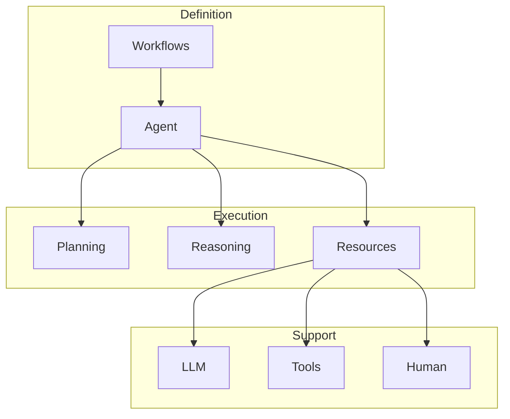

<!-- markdownlint-disable MD041 -->
<!-- markdownlint-disable MD033 -->
<p align="center">
  
</p>

# DXA Core System

## dxa.core Module

The DXA Core system provides the foundational components for building intelligent agents, centered around Workflows that define what agents can do. From this foundation, agents execute workflows through planning and reasoning, supported by capabilities and resources.

## System Architecture



## Core Components

### [Workflow System](workflow/README.md)

- Defines agent behavior patterns
- Structures task sequences
- Manages decision points
- Tracks state changes

```python
# Simple workflow
workflow = create_qa_workflow()

# Research workflow
workflow = create_research_workflow()
workflow.add_task("analyze", "Analyze findings")
```

### [Agent System](agent/README.md)

- Executes workflows
- Manages resources
- Tracks state
- Handles errors

### [Planning System](planning/README.md)

- Converts workflows to plans
- Allocates resources
- Manages execution state
- Adapts to changes

### [Reasoning System](reasoning/README.md)

- Executes workflow steps
- Makes tactical decisions
- Processes results
- Reports progress

### [Resource System](resource/README.md)

- Provides LLM access
- Manages tools
- Enables human interaction
- Tracks usage

### [IO System](io/README.md)

- Handles interaction
- Manages files
- Controls network access
- Logs operations

## Integration

```python
from dxa.core.workflow import create_research_workflow
from dxa.core.agent import Agent

# Create workflow
workflow = create_research_workflow()

# Configure agent
agent = Agent(resources={
    "llm": LLMResource(),
    "search": SearchResource()
})

# Execute workflow
result = agent.execute(workflow)
```

## Development

When developing new components:

1. Start with workflow requirements
2. Define needed resources
3. Implement execution logic
4. Add error handling
5. Document thoroughly

## Testing

Each module has its own test suite:

```bash
pytest tests/core/workflow/
pytest tests/core/agent/
pytest tests/core/resource/
```

## See Also

- [Framework Overview](../README.md)
- [Examples](../../examples/README.md)
- [API Reference](../../docs/api/README.md)

---

<p align="center">
Copyright © 2024 Aitomatic, Inc. All rights reserved.
</p>

<p align="center">
<a href="https://aitomatic.com">https://aitomatic.com</a>
</p>
