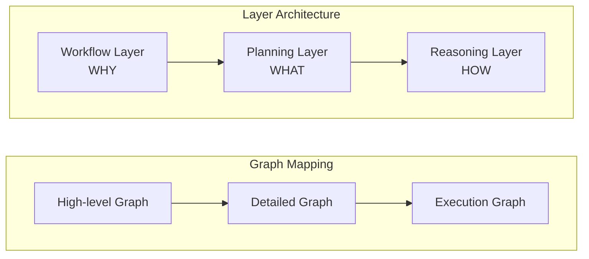
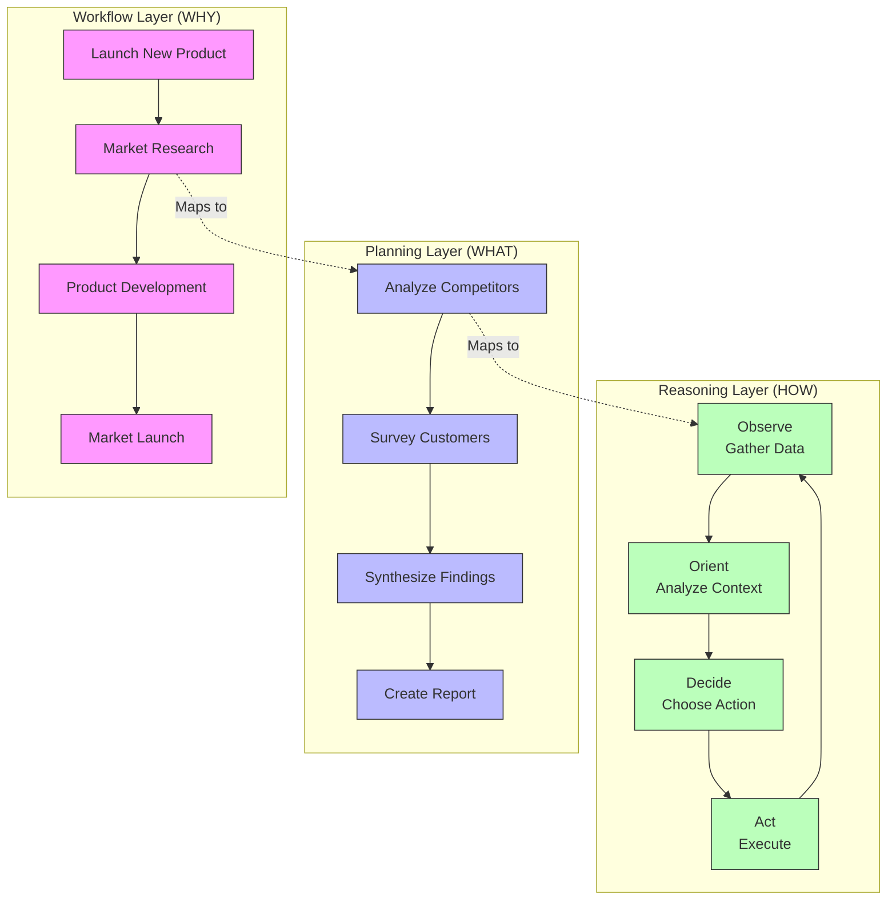

<!-- markdownlint-disable MD041 -->
<!-- markdownlint-disable MD033 -->
<p align="center">
  
</p>

# DXA Core System

The Domain-Expert Agent (DXA) core system is an intelligent agent architecture designed to tackle complex domain-specific tasks with human-like expertise. At its heart is a unique three-layer graph architecture that breaks down high-level objectives into executable actions through a Why-What-How paradigm. The system maps business workflows (WHY) to concrete plans (WHAT), which are then executed through standardized reasoning patterns (HOW). This hierarchical decomposition allows agents to maintain strategic alignment while adapting to changing conditions - similar to how human experts combine domain knowledge with practical execution. Whether automating business processes, conducting research, or managing complex projects, DXA provides a flexible framework that combines strategic thinking with tactical execution.

## Architecture Overview



### Layer Mapping Example



### Core Components

1. **Workflow Layer (WHY)**
   - Defines high-level objectives and goals
   - Manages strategic direction
   - Tracks overall progress
   - See [Flow Documentation](flow/README.md)

2. **Planning Layer (WHAT)**
   - Determines concrete actions
   - Manages resource allocation
   - Adapts plans dynamically
   - See [Planning Documentation](planning/README.md)

3. **Reasoning Layer (HOW)**
   - Implements execution patterns
   - Handles tactical decisions
   - Processes feedback loops
   - See [Reasoning Documentation](reasoning/README.md)

## Key Features

- **Graph-based Architecture**: Each layer is represented as a directed graph
- **Hierarchical Mapping**: Nodes in higher layers map to subgraphs in lower layers
- **Dynamic Adaptation**: Plans and execution patterns adapt to changing conditions
- **State Management**: Each layer maintains its execution context
- **Progress Tracking**: Completion status propagates up through layers

## Core Modules

- [Agent](agent/README.md): Main execution controller
- [Planning](planning/README.md): Strategic action planning
- [Reasoning](reasoning/README.md): Tactical execution patterns
- [Capability](capability/README.md): Agent capabilities and skills
- [Resource](resource/README.md): Resource management
- [IO](io/README.md): Input/Output handling

## Implementation Example

```python
from dxa.core.agent import Agent
from dxa.core.planning import PlanningPattern
from dxa.core.reasoning import ReasoningPattern

# Create agent with layered execution
agent = Agent("expert_agent")\
    .with_workflow("product_launch")\
    .with_planning(PlanningPattern.DYNAMIC)\
    .with_reasoning(ReasoningPattern.OODA)

# Execute with hierarchical decomposition
async with agent:
    result = await agent.run({
        "objective": "Launch new product",
        "constraints": {
            "timeline": "Q3 2024",
            "budget": 1000000
        }
    })
```

## Layer Integration

The three layers work together through:

1. **Top-down Direction**
   - Workflow provides strategic context
   - Planning breaks down objectives
   - Reasoning implements actions

2. **Bottom-up Feedback**
   - Reasoning reports execution results
   - Planning adapts to outcomes
   - Workflow tracks progress

3. **State Management**
   - Each layer maintains graph position
   - Context flows between layers
   - Progress tracked at all levels

## Development Guidelines

1. **Graph Design**
   - Keep nodes focused and single-purpose
   - Define clear success criteria
   - Enable flexible mapping between layers

2. **Layer Separation**
   - Maintain clear Why-What-How separation
   - Avoid cross-layer dependencies
   - Use defined interfaces for communication

3. **State Handling**
   - Track progress explicitly
   - Maintain execution context
   - Enable state recovery

## See Also

- [Examples](../examples/README.md)
- [Documentation](../docs/README.md)
- [Tests](../tests/README.md)

---

<p align="center">
Copyright © 2024 Aitomatic, Inc. All rights reserved.
</p>

<p align="center">
<a href="https://aitomatic.com">https://aitomatic.com</a>
</p>
