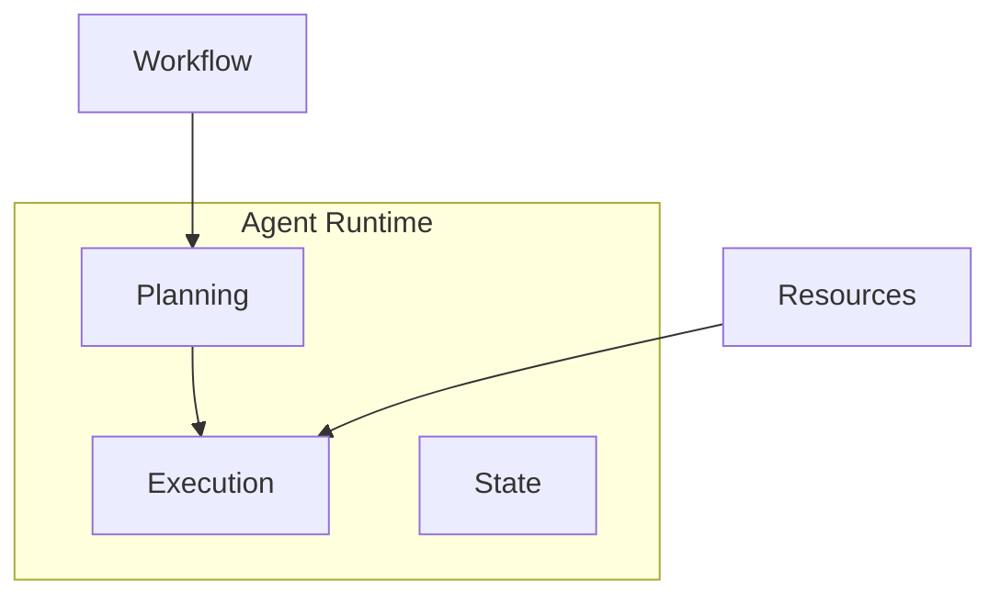
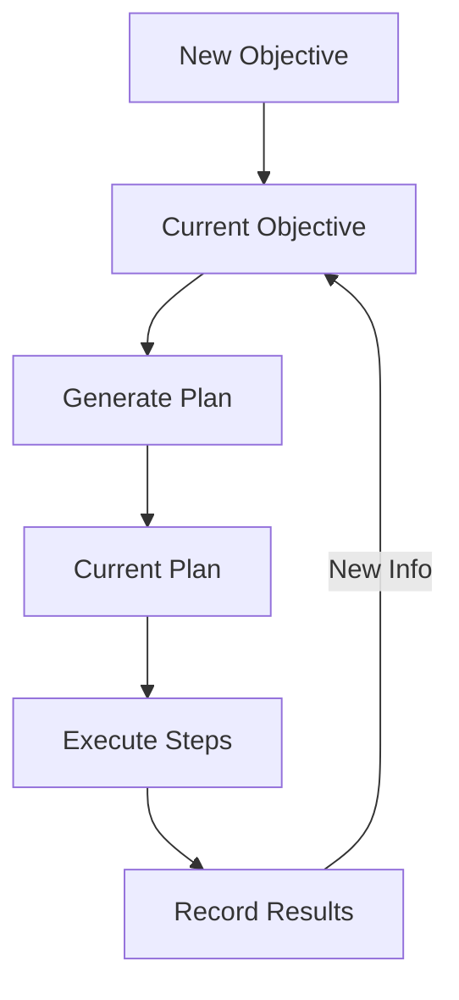

<!-- markdownlint-disable MD041 -->
<!-- markdownlint-disable MD033 -->
<p align="center">
  
</p>

# DXA Agent System

## dxa.core.agent Module

The DXA agent system executes workflows by:

1. Converting workflows to executable plans
2. Managing required resources
3. Tracking execution state
4. Adapting to new information

## Design Philosophy

1. Simple things should be simple, complex things should be possible
2. Composition over inheritance
3. Smart defaults with explicit control when needed

## Agent Factory

The DXA framework provides a factory pattern for creating agents with common configurations. This simplifies agent creation while maintaining access to DXA's full capabilities.

### Why Use AgentFactory

- Simplifies common agent creation patterns
- Provides tested, optimized configurations
- Maintains consistent initialization across applications
- Enables quick starts with progressive enhancement

### Usage

```python
from dxa.core.agent import Agent
from dxa.core.workflow import create_research_workflow

# Simple workflow execution
answer = Agent().ask("What is quantum computing?")

# Research workflow with resources
workflow = create_research_workflow()
agent = Agent(resources={"llm": LLMResource()})
result = agent.execute(workflow)

# Custom workflow execution
workflow = BaseWorkflow()
workflow.add_task("research", "Research topic")
workflow.add_task("synthesize", "Synthesize findings")

agent = Agent(resources={
    "llm": LLMResource(),
    "search": SearchResource()
})
result = agent.execute(workflow)
```

## Workflow Execution

Agents execute workflows through:



1. **Planning**
   - Convert workflow to executable plan
   - Allocate required resources
   - Set up execution state

2. **Execution**
   - Run workflow steps
   - Track progress
   - Handle state changes
   - Adapt to new information

3. **Resources**
   - Manage LLM interactions
   - Control tool access
   - Handle I/O operations

## State Management

Agents track:

- Workflow progress
- Resource allocation
- Execution context
- Generated artifacts

## State Components

The DXA agent system uses a centralized state management approach to track the evolution of objectives and plans. This integrates with the [Planning System](../core/planning/README.md) and [Reasoning System](../core/reasoning/README.md) to maintain coherent agent state.

## Core State Components

### Objective State

- Current objective being pursued
- History of objective evolution
- Metadata (timestamps, reasons for changes)

### Plan State  

- Current execution plan
- History of plan evolution
- Plan metadata (completion status, timestamps)

### Execution State

- Active step in current plan
- Results from completed steps
- Resource allocations (managed via [Resource System](../core/resource/README.md))

## State Flow



## Resource Integration

```python
# Configure agent with resources
agent = Agent(resources={
    "llm": LLMResource(),      # Core LLM
    "search": SearchResource(), # Search capability
    "human": HumanResource()    # Human feedback
})

# Resources are available during workflow execution
result = agent.execute(workflow, context={
    "llm_config": {"temperature": 0.7},
    "search_depth": "comprehensive",
    "require_feedback": True
})
```

### Domain-Specific Tasks

```python
# Hierarchical planning with DANA reasoning
agent = Agent("optimizer")\
    .with_planning("hierarchical")\
    .with_reasoning("dana")\
    .with_resources({
        "vector_db": VectorDB(),     # Pattern matching
        "runtime": CodeExecutor()     # Run generated code
    })

result = await agent.run({
    "objective": "Optimize system performance",
    "subgoals": {
        "analyze": ["profile_code", "identify_bottlenecks"],
        "improve": ["optimize_algorithms", "tune_parameters"],
        "validate": ["run_benchmarks", "verify_results"]
    }
})
```

### Pattern Selection Guide

Choose patterns based on:

1. **Task Complexity**
   - Simple Q&A → Direct Planning + Direct Reasoning
   - Multi-step Analysis → Sequential Planning + Chain of Thought
   - Real-time Adaptation → Dynamic Planning + OODA Loop
   - Domain Expertise → Hierarchical Planning + DANA

2. **Resource Requirements**
   - Minimal → Direct (LLM only)
   - Memory Intensive → Sequential + Chain of Thought
   - Sensor Access → Dynamic + OODA
   - Full Toolkit → Hierarchical + DANA

3. **Performance Needs**
   - Quick Response → Direct patterns
   - Verifiable Logic → Sequential + Chain of Thought
   - Continuous Operation → Dynamic + OODA
   - Optimal Solutions → Hierarchical + DANA

## Runtime System

The agent runtime manages execution flow and state:

```python
# Runtime configuration
runtime_config = {
    "max_steps": 100,
    "timeout": 300,
    "error_policy": "retry"
}

# Using the runtime
async with agent.runtime(runtime_config) as runtime:
    result = await runtime.execute(task)
```

## Key Design Principles

1. **Single Source of Truth**
   - One state object accessed by all components
   - Clear ownership and update patterns
   - Atomic state transitions

2. **History Tracking**
   - Evolution of objectives and plans
   - Timestamps for all changes
   - Reasons for state transitions

3. **Execution Context**
   - Track active work
   - Record step results
   - Monitor resource usage via [I/O System](../core/io/README.md)

## Usage Patterns

Planning and Reasoning layers interact with state through well-defined interfaces:

- Planning reads/writes objectives and plans
- Reasoning reads plans and writes results
- Both can trigger state transitions based on new information

See [Capability System](../core/capability/README.md) for higher-level state operations.

Would you like me to elaborate on any aspect of this design?

## Configuration

Agents can be configured through:

1. Construction parameters
2. Resource configuration
3. Runtime settings
4. State preferences

## Error Handling

Agents provide:

- Automatic retries
- Resource cleanup
- State preservation
- Error recovery

## See Also

- [Workflow System](../workflow/README.md)
- [Resource System](../resource/README.md)
- [Examples](../../examples/README.md)

---

<p align="center">
Copyright © 2024 Aitomatic, Inc. All rights reserved.
</p>

<p align="center">
<a href="https://aitomatic.com">https://aitomatic.com</a>
</p>
