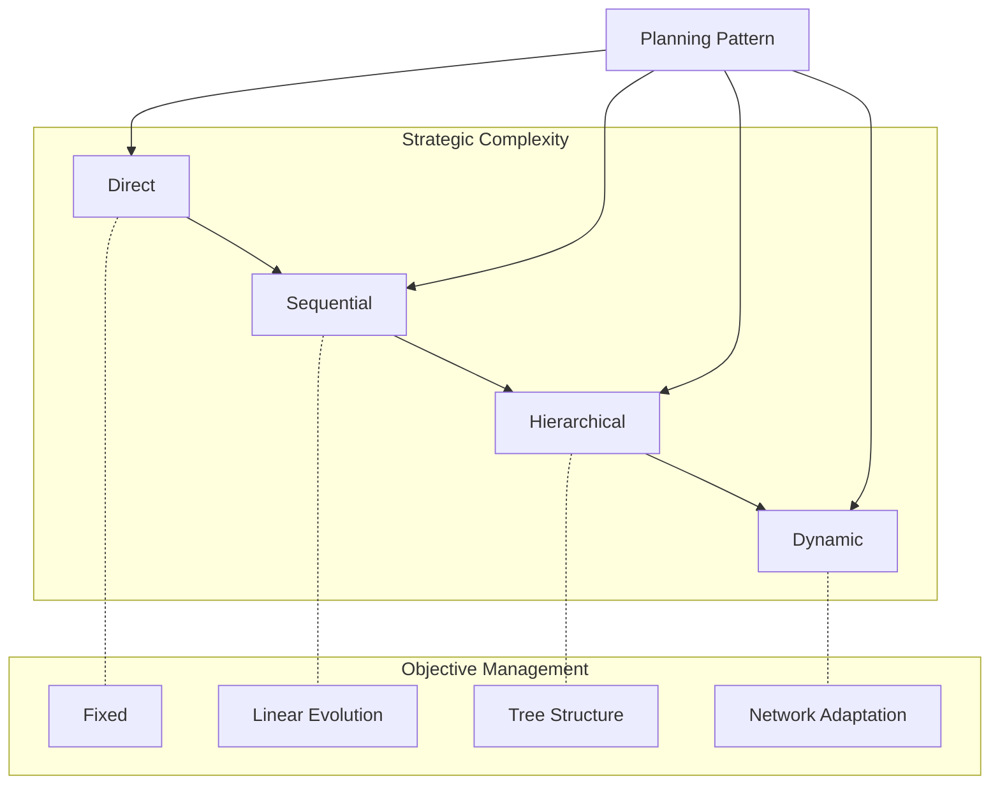

<!-- markdownlint-disable MD041 -->
<!-- markdownlint-disable MD033 -->
<p align="center">
  
</p>

# Planning System

The planning layer is the strategic brain of the DXA agent system, responsible for understanding objectives and generating executable plans. While the [reasoning layer](../reasoning/README.md) determines how to think about individual steps, planning decides what steps to take. It manages the evolution of both objectives and plans, adapting to new information and changing circumstances. This strategic oversight ensures that agents maintain progress toward goals while efficiently using available resources.

## Design Philosophy

> Simple things should be easy, complex things should be possible.

This principle guides our planning system design:

- Direct planning for simple tasks (one-step plans)
- Sequential planning for clear workflows
- Hierarchical planning for complex goals
- Dynamic planning for adaptive scenarios

Each pattern builds on the same foundation but adds strategic capability where needed.

## Architecture



## Usage Guide

### Simple Task

```python
# Direct planning for immediate execution
agent = Agent("assistant")\
    .with_planning("direct")
result = await agent.run("Summarize this text")
```

### Complex Workflow

```python
# Sequential planning for multi-step tasks
agent = Agent("researcher")\
    .with_planning("sequential")\
    .with_resources({
        "search": SearchResource(),    # Find information
        "memory": MemoryResource()     # Track progress
    })

result = await agent.run({
    "objective": "Research quantum computing impact",
    "requirements": [
        "find_key_papers",
        "analyze_trends",
        "synthesize_findings"
    ]
})
```

### Hierarchical Goals

```python
# Hierarchical planning for complex objectives
agent = Agent("project_manager")\
    .with_planning("hierarchical")\
    .with_resources({
        "tasks": TaskManager(),
        "team": TeamResource()
    })

result = await agent.run({
    "objective": "Launch new product",
    "subgoals": {
        "research": ["market", "competition"],
        "development": ["prototype", "testing"],
        "launch": ["marketing", "distribution"]
    }
})
```

### Adaptive Scenarios

```python
# Dynamic planning for evolving situations
agent = Agent("incident_manager")\
    .with_planning("dynamic")\
    .with_resources({
        "monitor": SystemMonitor(),
        "alerts": AlertSystem(),
        "actions": ActionEngine()
    })

async with agent:
    await agent.run({
        "objective": "Maintain system health",
        "adaptation_rules": {
            "high_load": "scale_resources",
            "errors": "activate_fallback",
            "attacks": "enhance_security"
        }
    })
```

### Pattern Selection Guide

Choose your planning pattern based on:

1. Objective Complexity
   - Single goal → Direct
   - Linear sequence → Sequential
   - Nested goals → Hierarchical
   - Evolving goals → Dynamic

2. Environmental Stability
   - Static, known → Direct/Sequential
   - Partially known → Hierarchical
   - Highly dynamic → Dynamic

3. Resource Management
   - Fixed resources → Direct
   - Staged allocation → Sequential
   - Hierarchical sharing → Hierarchical
   - Dynamic reallocation → Dynamic

## Planning Patterns

1. Direct Planning
   - Single-step plans
   - Fixed objectives
   - Immediate execution
   - Minimal overhead

2. Sequential Planning
   - Linear workflows
   - Clear dependencies
   - Progress tracking
   - Resource staging

3. Hierarchical Planning
   - Goal decomposition
   - Nested objectives
   - Resource delegation
   - Parallel execution

4. Dynamic Planning
   - Adaptive replanning
   - Objective evolution
   - Resource reallocation
   - Real-time adjustment

## Implementation Details

### Pattern Structure

```python
class PlanningPattern:
    """Base class for all planning patterns."""
    
    async def create_plan(self, objective: Objective) -> Plan:
        """Generate a plan for the given objective."""
        raise NotImplementedError
        
    async def update_plan(self, plan: Plan, signals: List[Signal]) -> Plan:
        """Update plan based on execution signals."""
        raise NotImplementedError
```

### Objective Management

Each planning pattern manages:

- Original intent
- Current objective state
- Success criteria
- Evolution history

### Plan Management

Plans include:

- Step sequences
- Resource requirements
- Progress metrics
- Adaptation rules

## Pattern Details

### Direct Planning

Best for: Simple, single-objective tasks

```python
class DirectPlanning(PlanningPattern):
    async def create_plan(self, objective):
        return Plan(steps=[{
            "action": "execute",
            "input": objective.current
        }])
```

### Sequential Planning

Best for: Clear, linear workflows

Steps:

1. Break down objective
2. Order dependencies
3. Allocate resources
4. Track completion

```python
class SequentialPlanning(PlanningPattern):
    async def create_plan(self, objective):
        steps = await self._decompose_objective(objective)
        dependencies = self._analyze_dependencies(steps)
        return Plan(
            steps=steps,
            dependencies=dependencies
        )
```

### Hierarchical Planning

Best for: Complex, nested objectives

Process:

1. Create goal tree
2. Assign resources
3. Set dependencies
4. Enable parallel execution

```python
class HierarchicalPlanning(PlanningPattern):
    async def create_plan(self, objective):
        goal_tree = await self._create_goal_tree(objective)
        resources = await self._allocate_resources(goal_tree)
        return Plan(
            steps=self._flatten_tree(goal_tree),
            resources=resources
        )
```

### Dynamic Planning

Best for: Evolving situations

Features:

1. Continuous monitoring
2. Adaptive replanning
3. Resource reallocation
4. Progress optimization

```python
class DynamicPlanning(PlanningPattern):
    async def update_plan(self, plan, signals):
        impact = await self._assess_impact(signals)
        if self._needs_replanning(impact):
            return await self._create_new_plan(plan.objective, impact)
        return await self._adjust_current_plan(plan, impact)
```

## Integration with Reasoning

Planning patterns interact with reasoning through:

1. Plan execution
2. Signal processing
3. Resource coordination
4. Progress tracking

Example:

```python
async def _handle_reasoning_signals(self, signals: List[Signal]) -> None:
    """Process signals from reasoning layer."""
    for signal in signals:
        if signal.type == SignalType.DISCOVERY:
            await self._update_objective(signal.content)
        elif signal.type == SignalType.RESOURCE:
            await self._reallocate_resources(signal.content)
```

## Resource Management

Each pattern has different resource needs:

- Direct: Minimal (basic allocation)
- Sequential: Moderate (staged allocation)
- Hierarchical: Heavy (nested allocation)
- Dynamic: Intensive (continuous reallocation)

## Testing and Validation

Plans should validate:

1. Objective alignment
2. Resource feasibility
3. Step coherence
4. Adaptation rules

## Best Practices

1. Pattern Selection
   - Match to objective complexity
   - Consider environmental stability
   - Account for resource constraints

2. Implementation
   - Clear objective definition
   - Proper resource allocation
   - Signal handling
   - Progress tracking

3. Monitoring
   - Objective evolution
   - Resource utilization
   - Plan effectiveness
   - Adaptation success

---

See [Agent Documentation](../../agent/README.md) for integration details.

---

<p align="center">
Copyright © 2024 Aitomatic, Inc. All rights reserved.
</p>

<p align="center">
<a href="https://aitomatic.com">https://aitomatic.com</a>
</p>
