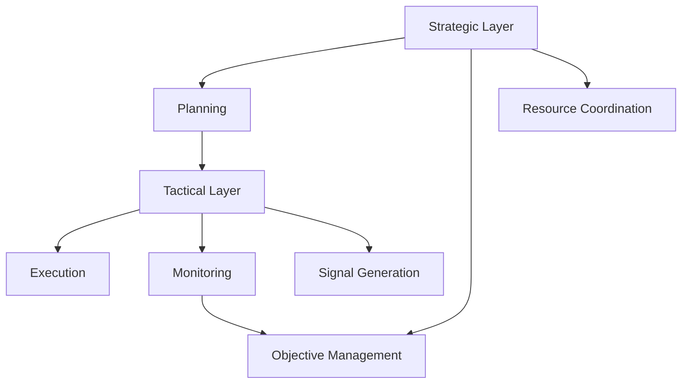
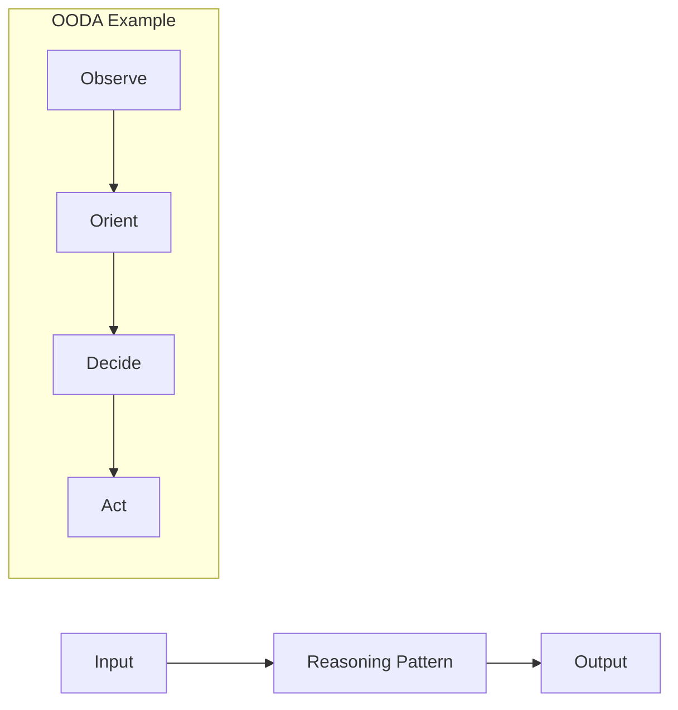
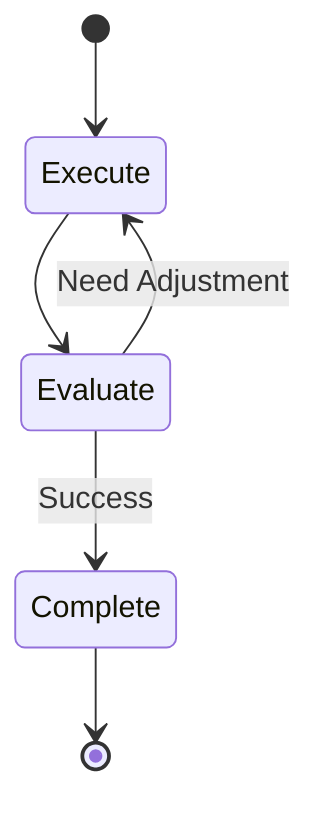
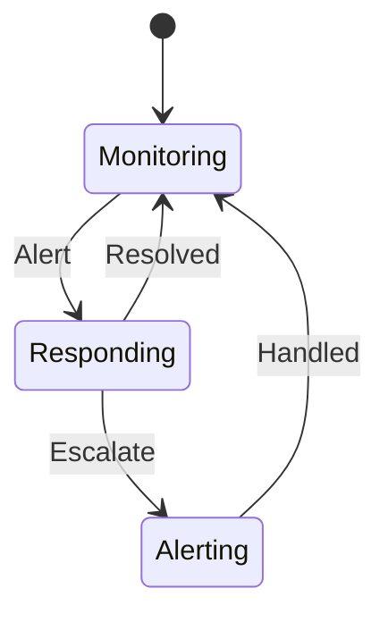
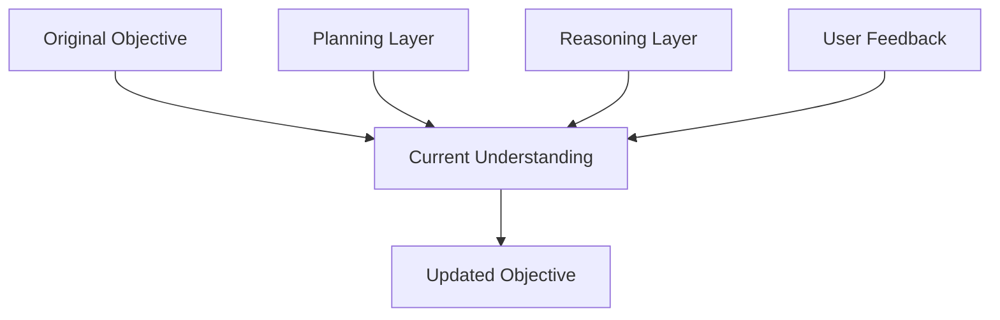
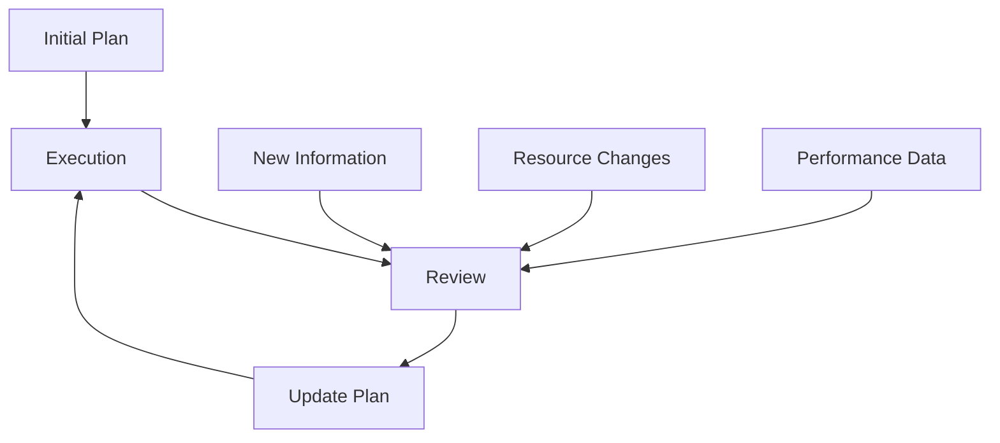

<!-- markdownlint-disable MD041 -->
<!-- markdownlint-disable MD033 -->
<p align="center">
  
</p>

# DXA Reasoning System

The DXA reasoning system implements a two-layer architecture that separates strategic planning from tactical execution. This separation allows the system to maintain high-level objectives and adapt plans while efficiently executing individual steps.

## Design Philosophy

1. Simple things should be simple, complex things should be possible
   - One-liners for common cases
   - Natural language interfaces where sensible
   - Full power available when needed

2. Progressive complexity
   - Start with basic usage
   - Add capabilities as needed
   - No complexity penalty for simple cases

3. Smart defaults, explicit control
   - Auto-configuration for common cases
   - Resource discovery and management
   - Full control available when needed

## Architecture Overview



## Core Concepts

### 1. Reasoning Patterns (How to Think)

Purpose: Define the cognitive approach

Pure Patterns:

- Direct: Single LLM query → response
- Chain-of-Thought: Structured step-by-step thinking
- OODA: Observe-Orient-Decide-Act loop
- DANA: Neural search → symbolic execution



### 2. Execution Strategies (How to Act)

Purpose: Define the execution flow

Pure Strategies:

- Single-Shot: One request → one response
- Iterative: Repeated try-evaluate-adjust
- Continuous: Ongoing operation
- Interactive: User-in-loop operation



### 3. Workflows (What to Do)

Purpose: Define the task structure

Pure Workflows:

- Linear: Sequential steps
- Branching: Decision-based paths
- State Machine: Complex state transitions
- Event-Driven: Response patterns



## Integration Model

### Composition over Inheritance

Components combine through composition:

- Agents combine patterns, strategies, and workflows
- Each component remains pure and focused
- Mix and match based on needs

Example Combinations:

1. System Monitoring
   - Pattern: OODA Reasoning (how to think)
   - Strategy: Continuous Execution (how to act)
   - Workflow: State Machine (what to do)

2. Research Assistant
   - Pattern: Chain-of-Thought Reasoning
   - Strategy: Iterative Execution
   - Workflow: Branching Tasks

3. Chat Bot
   - Pattern: Direct Reasoning
   - Strategy: Interactive Execution
   - Workflow: Event-Driven

## Evolution Mechanisms

### Objective Evolution



### Plan Evolution



## Implementation Notes

1. Simple cases remain simple:
   - Direct reasoning is just one LLM call
   - Basic workflows are natural language → steps
   - Interactive modes use simple patterns

2. Complex cases are possible:
   - Full planning/reasoning cycle
   - Neural-symbolic integration
   - Multi-stage execution

3. User-Defined Workflows:
   - Natural language specifications
   - Runtime translation to plans
   - Flexible execution patterns

## Usage Examples

```python
# Simple: One-liner for common cases
agent = Agent.create("chat")
result = await agent.run("What is quantum computing?")

# Natural language workflow
agent = Agent.create("research", 
    workflow="Research fusion energy breakthroughs, focus on technical details")
result = await agent.run()

# Auto-configured monitoring
agent = Agent("monitor")\
    .with_auto_resources()\
    .with_workflow("Monitor CPU and memory, alert if usage exceeds 80%")

async with agent:
    await agent.run()

# Complex: Full control when needed
agent = Agent("expert")\
    .with_reasoning("dana")\
    .with_strategy("interactive")\
    .with_workflow(ComplexWorkflow(
        steps=[...],
        transitions={...},
        validation={...}
    ))\
    .with_resources({
        "llm": CustomLLM(...),
        "tools": CustomTools(...),
        "memory": PersistentMemory(...)
    })
```

## Resource Management

[All new sections remain exactly the same through Migration Guide section]

---

<p align="center">
Copyright © 2024 Aitomatic, Inc. All rights reserved.
</p>

<p align="center">
<a href="https://aitomatic.com">https://aitomatic.com</a>
</p>
