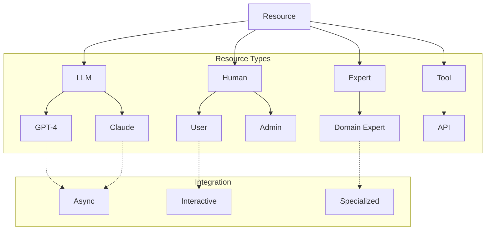

<!-- markdownlint-disable MD041 -->
<!-- markdownlint-disable MD033 -->
<p align="center">
  
</p>

# Resource System

The resource system provides the foundational building blocks for DXA agents, implementing concrete tools and services that agents can use. While [capabilities](../capability/README.md) define how agents think, resources define what agents can do. The system manages everything from LLM interactions to human-in-the-loop operations, providing a consistent interface for all external interactions.

## Design Philosophy

> Simple things should be easy, complex things should be possible.

This principle guides our resource system design:

- Simple resource access (direct queries)
- Consistent interfaces
- Composable resources
- Extensible architecture

## Architecture



## Usage Guide

### Basic LLM Usage

```python
# Simple LLM interaction
agent = Agent("assistant")\
    .with_resource(LLMResource(
        name="gpt4",
        config={"model": "gpt-4"}
    ))

response = await agent.resources.gpt4.query({
    "prompt": "Explain quantum computing"
})
```

### Human-in-the-Loop

```python
# Human interaction
agent = Agent("interactive")\
    .with_resource(HumanResource(
        name="user",
        role="expert"
    ))

response = await agent.resources.user.query({
    "prompt": "Please review this output",
    "content": result
})
```

### Domain Expert

```python
# Expert resource with domain knowledge
expertise = DomainExpertise(
    name="Mathematics",
    capabilities=["algebra", "calculus"],
    keywords=["solve", "equation", "derivative"]
)

agent = Agent("math_tutor")\
    .with_resource(ExpertResource(
        name="math_expert",
        config={
            "expertise": expertise,
            "llm_config": {"model": "gpt-4"}
        }
    ))

response = await agent.resources.math_expert.query({
    "prompt": "Solve x^2 + 2x + 1 = 0"
})
```

## Implementation Details

### Resource Structure

```python
class BaseResource:
    """Base class for all resources."""
    
    async def initialize(self) -> None:
        """Set up resource."""
        raise NotImplementedError
        
    async def query(self, request: Dict[str, Any]) -> ResourceResponse:
        """Query the resource."""
        raise NotImplementedError
        
    def can_handle(self, request: Dict[str, Any]) -> bool:
        """Check if request can be handled."""
        raise NotImplementedError
```

### LLM Implementation

```python
class LLMResource(BaseResource):
    async def query(self, request: Dict[str, Any]) -> LLMResponse:
        """Send query to LLM."""
        prompt = self._prepare_prompt(request)
        response = await self._llm.complete(prompt)
        return LLMResponse(
            content=response.text,
            usage=response.usage
        )
```

### Expert Implementation

```python
class ExpertResource(BaseResource):
    async def query(self, request: Dict[str, Any]) -> ExpertResponse:
        """Query with domain expertise."""
        if not self.can_handle(request):
            raise ResourceError(
                f"Request cannot be handled by {self.expertise.name} expert"
            )
        
        enhanced_request = self._enhance_prompt(request)
        return await self._process_expert_query(enhanced_request)
```

## Integration Patterns

### Resource Composition

```python
# Combine multiple resources
agent = Agent("assistant")\
    .with_resource(LLMResource("gpt4"))\
    .with_resource(HumanResource("user"))\
    .with_resource(ExpertResource("domain_expert"))

# Use resources together
result = await agent.resources.gpt4.query({"prompt": "Draft response"})
feedback = await agent.resources.user.query({"prompt": "Review", "content": result})
final = await agent.resources.domain_expert.query({"prompt": "Validate", "content": result})
```

## Testing and Validation

Resources should verify:

1. Basic Operations
   - Initialization success
   - Query handling
   - Error management
   - Resource cleanup

2. Integration Tests
   - Resource composition
   - Cross-resource interaction
   - State management
   - Performance metrics

## Best Practices

1. Resource Management
   - Initialize explicitly
   - Handle cleanup properly
   - Monitor usage
   - Implement timeouts

2. Error Handling
   - Graceful degradation
   - Clear error messages
   - Retry strategies
   - Fallback options

3. Performance
   - Async operations
   - Resource pooling
   - Caching when appropriate
   - Load balancing

## See Also

- [Capability System](../capability/README.md) - Higher-level cognitive abilities
- [Agent Documentation](../../agent/README.md) - Agent integration
- [Planning System](../planning/README.md) - Strategic planning
- [Reasoning System](../reasoning/README.md) - Tactical execution

---

<p align="center">
Copyright © 2024 Aitomatic, Inc. All rights reserved.
</p>

<p align="center">
<a href="https://aitomatic.com">https://aitomatic.com</a>
</p>
