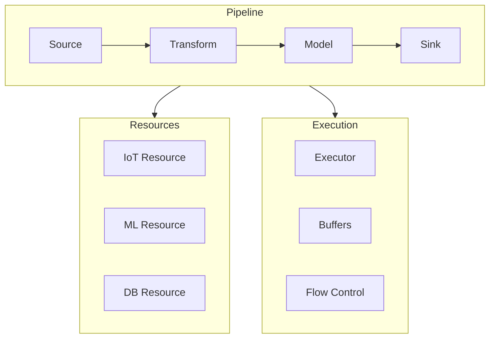
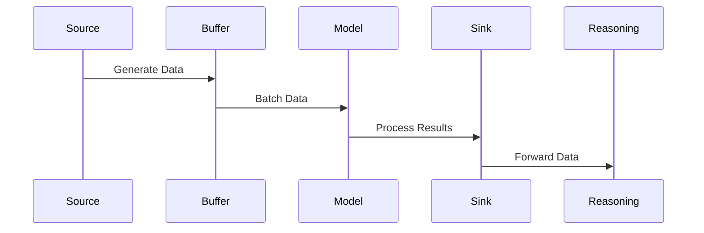

<!-- markdownlint-disable MD041 -->
<!-- markdownlint-disable MD033 -->
<p align="center">
  
</p>

# DXA Pipeline System

## Overview

The Pipeline system provides a flexible framework for creating and executing data processing pipelines within DXA. It combines the Resource interface with graph-based execution to enable complex data flows between components.

### Key Features

- Data flow management between resources
- Async execution with buffering
- Type-safe node connections
- Error handling and recovery
- Monitoring and metrics

## Architecture



## Components

### PipelineResource

Combines `BaseResource` and `ExecutionGraph` to create a queryable pipeline:

```python
from dxa.core.resource.pipeline import PipelineResource

# Create pipeline
pipeline = PipelineResource("anomaly_detection")

# Add nodes
pipeline.add_source(IoTResource("sensor"))
pipeline.add_model(AnomalyDetector("detector"))
pipeline.add_sink(ReasoningInput("reasoning"))

# Initialize and run
await pipeline.initialize()
result = await pipeline.query({"execute": True})
```

### Node Types

1. **Source Nodes**
   - Data input points
   - IoT sensors, databases, streams
   - Configurable output rates

2. **Transform Nodes**
   - Data preprocessing
   - Feature engineering
   - Filtering and validation

3. **Model Nodes**
   - ML model inference
   - Anomaly detection
   - Classification/prediction

4. **Sink Nodes**
   - Data output points
   - Storage, visualization
   - Reasoning system input

### Data Flow



## Implementation

### Pipeline Configuration

```python
config = PipelineConfig(
    name="anomaly_detection",
    buffer_size=1000,
    batch_size=32,
    metadata={
        "description": "IoT anomaly detection pipeline",
        "version": "1.0"
    }
)
```

### Node Configuration

```python
# Add source with config
pipeline.add_source(
    IoTResource("sensor1"),
    buffer_size=500,
    batch_size=16,
    input_schema={"value": "float"},
    output_schema={"normalized": "float"}
)

# Add model with config
pipeline.add_model(
    AnomalyDetector("detector1"),
    buffer_size=100,
    input_schema={"normalized": "float"},
    output_schema={"anomaly_score": "float"}
)
```

### Execution Context

```python
@dataclass
class PipelineContext:
    config: PipelineConfig
    state: PipelineState
    buffers: Dict[str, asyncio.Queue]
```

## Integration

### With Reasoning System

```python
# In reasoning step
pipeline = self.agent.resources.anomaly_pipeline
result = await pipeline.query({
    "execute": True,
    "config": {
        "window_size": 100,
        "threshold": 0.95
    }
})
```

### With Resources

```python
# Create resources
iot = IoTResource("sensor1", endpoint="mqtt://sensor1")
model = ModelResource("anomaly_detector", model_path="models/detector.pkl")
sink = ReasoningInputResource("reasoning_input")

# Build pipeline
pipeline = PipelineResource("anomaly_detection")
pipeline.add_source(iot)
pipeline.add_model(model)
pipeline.add_sink(sink)
```

## Error Handling

1. **Node Failures**
   - Automatic retry
   - Error signals
   - State recovery

2. **Data Validation**
   - Schema checking
   - Type validation
   - Range checks

3. **Resource Management**
   - Buffer overflow protection
   - Resource cleanup
   - Connection management

## Monitoring

### Metrics

- Throughput
- Latency
- Error rates
- Buffer utilization
- Resource usage

### State Tracking

```python
@dataclass
class PipelineState:
    status: ExecutionNodeStatus
    metrics: Dict[str, Any]
    errors: Dict[str, Any]
```

## Best Practices

1. **Pipeline Design**
   - Clear data flow paths
   - Appropriate buffer sizes
   - Error handling at each stage

2. **Resource Management**
   - Proper initialization
   - Cleanup on completion
   - Resource pooling when needed

3. **Performance**
   - Batch processing
   - Async operations
   - Buffer management

## Future Development

1. **Enhanced Features**
   - Dynamic reconfiguration
   - Hot-swappable nodes
   - Advanced monitoring

2. **Optimizations**
   - Parallel processing
   - Memory management
   - Caching strategies

3. **Integration**
   - More resource types
   - Visualization tools
   - Management interface

---

<p align="center">
Copyright © 2024 Aitomatic, Inc. All rights reserved.
</p>

<p align="center">
<a href="https://aitomatic.com">https://aitomatic.com</a>
</p>
