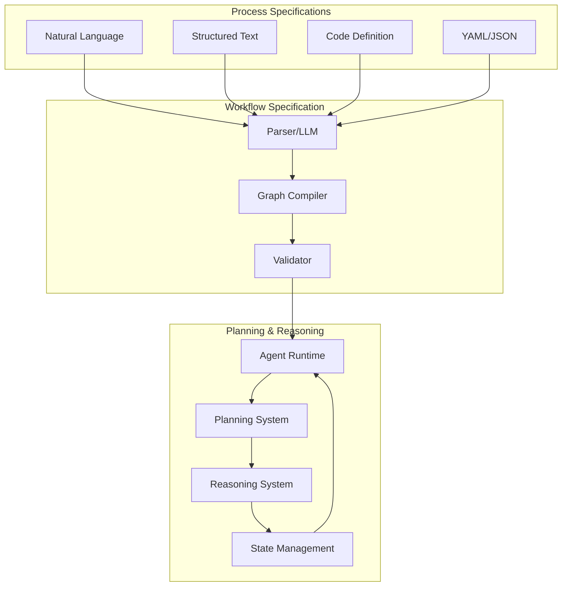
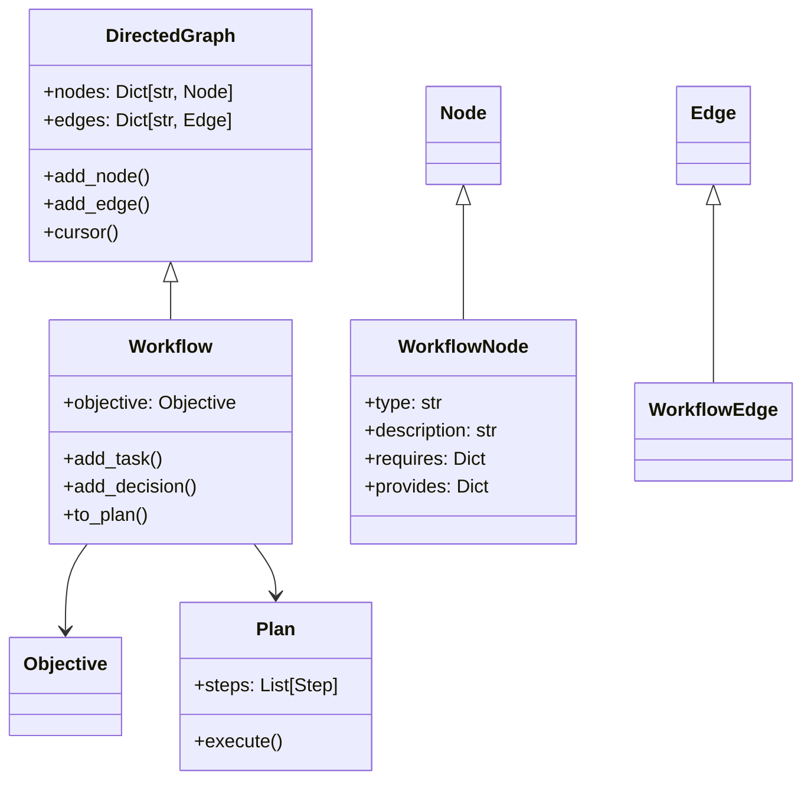
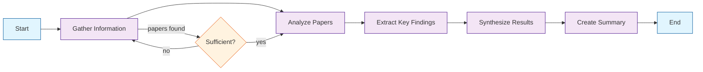
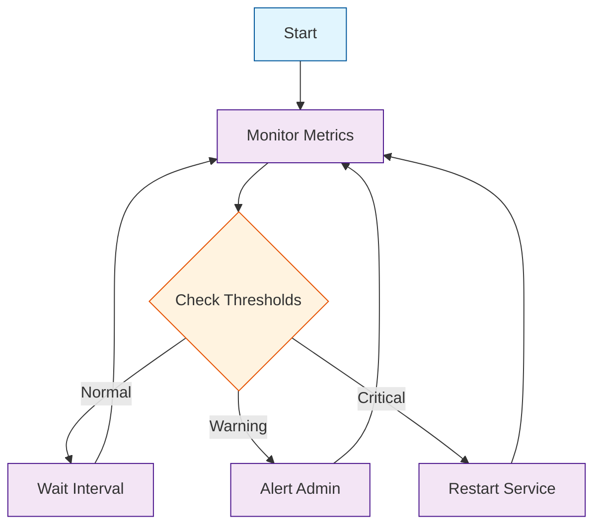

<!-- markdownlint-disable MD041 -->
<!-- markdownlint-disable MD033 -->
<p align="center">
  
</p>

# DXA Workflow System

## 1. Introduction & Context

The DXA Workflow system translates process specifications into executable workflow graphs. It serves as a bridge between human-readable process descriptions and machine-executable plans, enabling agents to perform complex tasks through well-defined workflows.

### System Context



### Design Principles

1. **Natural Language First**: Workflows should be as easy to write as explaining them to a colleague
2. **Clear State Management**: Define requirements and effects without managing state
3. **Flexible Execution**: Define what to do, not how to do it

## 2. System Architecture

### Core Components



### Integration Points

```python
from dxa.core.workflow import Workflow
from dxa.core.planning import SequentialPlanner
from dxa.core.state import WorldState, AgentState
from dxa.core.agent import Agent

# Workflow creation and planning
workflow = create_workflow(objective="Research quantum computing")
planner = SequentialPlanner()
plan = planner.create_plan(workflow)

# Execution
agent = Agent()
world_state = WorldState()
agent_state = AgentState()
result = agent.execute_plan(plan, world_state, agent_state)
```

## 3. Core Concepts

### Workflow Structure

```python
class Workflow(DirectedGraph):
    """Workflow implementation using directed graphs."""
    def __init__(self, objective: Optional[Union[str, Objective]] = None):
        super().__init__()
        self._objective = self._parse_objective(objective)
        
    def add_task(self, id: str, description: str, **kwargs) -> WorkflowNode:
        """Add a task node to the workflow."""
        node = WorkflowNode(id, "TASK", description, **kwargs)
        self.add_node(node)
        return node

    def add_decision(self, id: str, description: str, **kwargs) -> WorkflowNode:
        """Add a decision point to the workflow."""
        node = WorkflowNode(id, "DECISION", description, **kwargs)
        self.add_node(node)
        return node
```

### Node Types

1. **Task Nodes**

```python
task = workflow.add_task(
    id="research",
    description="Search recent papers",
    requires={"api_key": "str"},
    provides={"papers": "List[Paper]"}
)
```

1. **Decision Nodes**

```python
decision = workflow.add_decision(
    id="evaluate",
    description="Check findings",
    requires={"papers": "List[Paper]"},
    provides={"next_action": "str"}
)
```

1. **Control Nodes**

```python
start = workflow.get_start()  # START node
ends = workflow.get_ends()    # END nodes
```

### State Management

```python
# State requirements
node = WorkflowNode(
    id="verify_credit",
    requires={
        "credit_score": "float",
        "income": "float"
    },
    provides={
        "approval_status": "bool",
        "risk_level": "str"
    }
)

# State validation
def validate_node(node: WorkflowNode, state: WorldState) -> bool:
    return all(
        state.has(req) and state.validate(req, spec)
        for req, spec in node.requires.items()
    )
```

## 4. Basic Usage

### Creating Simple Workflows

```python
# Using factory method
workflow = create_sequential_workflow([
    "gather_data",
    "analyze_data",
    "summarize_findings"
], objective="Research topic")

# Using natural language
workflow = create_from_text("""
1. Search for recent papers
2. Analyze methodologies
3. Summarize findings
""")
```

### Adding Decision Points

```python
workflow = create_from_text("""
Process: Credit Application Review
Steps:
1. Check credit score
2. If score > 700:
   - Fast-track approval
   Else:
   - Request additional documents
3. Make final decision
""")
```

### Common Patterns

```python
# Research workflow
workflow = create_research_workflow(
    objective="Research quantum computing"
)

# Q&A workflow
workflow = create_basic_qa_workflow(
    objective="Answer user question"
)
```

## 5. Advanced Features

### Graph Traversal

```python
cursor = workflow.cursor()
while cursor.has_next():
    node = cursor.next()
    if node.type == "DECISION":
        next_node = evaluate_decision(node)
        cursor.set_next(next_node)
```

### Validation Framework

```python
# Structure validation
workflow.validate_structure()  # From DirectedGraph

# Resource validation
def validate_resources(workflow: Workflow) -> bool:
    required = set()
    provided = set()
    for node in workflow.nodes.values():
        required.update(node.requires.keys())
        provided.update(node.provides.keys())
    return required.issubset(provided)

# Add custom validation
workflow.add_validation_rule(validate_resources)
```

### Error Handling

```python
try:
    workflow = create_from_text(spec)
    workflow.validate()
except CycleDetectedError as e:
    logger.error(f"Invalid workflow structure: {e}")
except ResourceValidationError as e:
    logger.error(f"Invalid resource specification: {e}")
```

## 6. Integration Examples

### Research Task Example

```python
from dxa.core.workflow import create_research_workflow
from dxa.core.planning import SequentialPlanner
from dxa.core.agent import Agent

# Create workflow
workflow = create_research_workflow(
    objective="Research quantum computing advances"
)

# Create plan
planner = SequentialPlanner()
plan = planner.create_plan(workflow)

# Execute
agent = Agent(resources={"llm": LLMResource()})
result = agent.execute_plan(plan)
```

Generated workflow structure:



### Monitoring Example

```python
workflow = create_monitoring_workflow(
    target="system_metrics",
    interval="1h",
    thresholds={
        "cpu_usage": "> 90%",
        "memory_usage": "> 85%"
    },
    actions={
        "alert": "notify_admin",
        "critical": "restart_service"
    }
)
```

Generated workflow structure:



## 7. API Reference

### Core Classes

```python
class Workflow(DirectedGraph):
    def add_task(self, id: str, description: str, **kwargs) -> WorkflowNode
    def add_decision(self, id: str, description: str, **kwargs) -> WorkflowNode
    def add_transition(self, from_id: str, to_id: str, condition: Optional[str] = None) -> WorkflowEdge
    def get_start(self) -> WorkflowNode
    def get_ends(self) -> List[WorkflowNode]
```

### Factory Functions

```python
def create_workflow() -> Workflow
def create_sequential_workflow(steps: List[Node], objective: str) -> Workflow
def create_basic_qa_workflow(objective: str = "Answer the question") -> Workflow
def create_research_workflow(objective: str = "Research the topic") -> Workflow
```

## 8. Future Development

1. **Advanced Natural Language Processing**
   - Context-aware parsing
   - Ambiguity resolution
   - Intent recognition

2. **Extended Validation**
   - Resource optimization
   - Path analysis
   - Performance prediction

3. **Pattern Library**
   - Industry-specific templates
   - Best practice patterns
   - Compliance workflows

---

<p align="center">
Copyright © 2024 Aitomatic, Inc. All rights reserved.
</p>

<p align="center">
<a href="https://aitomatic.com">https://aitomatic.com</a>
</p>
