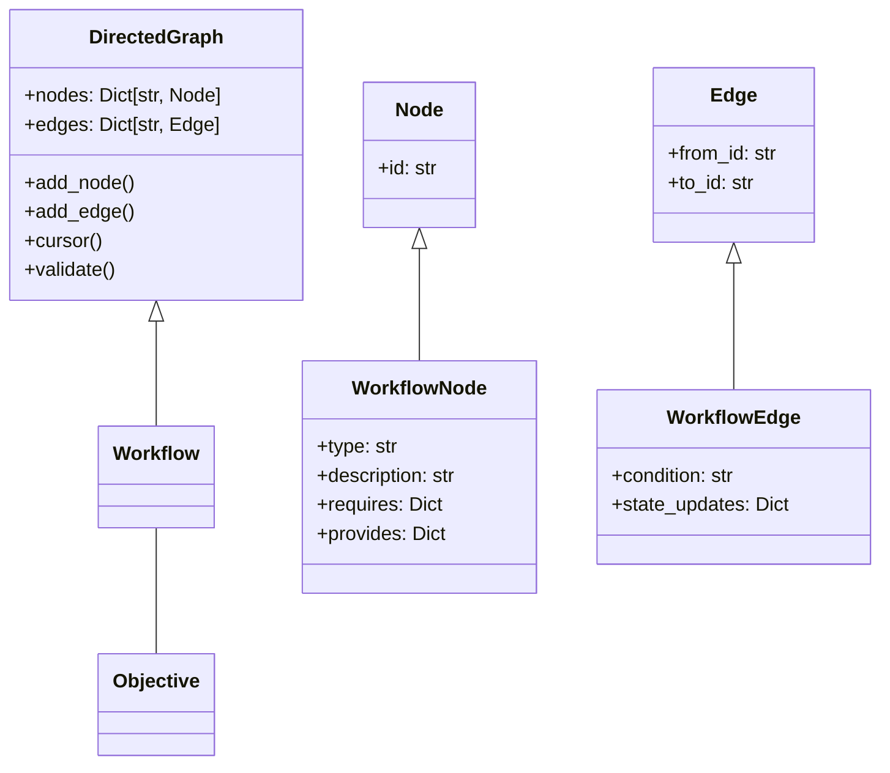
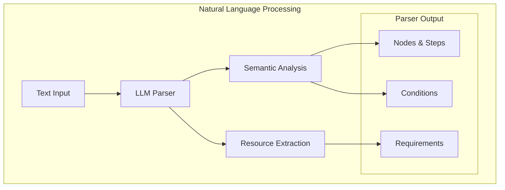
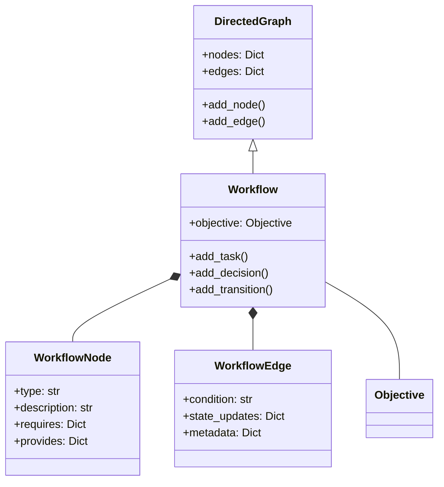
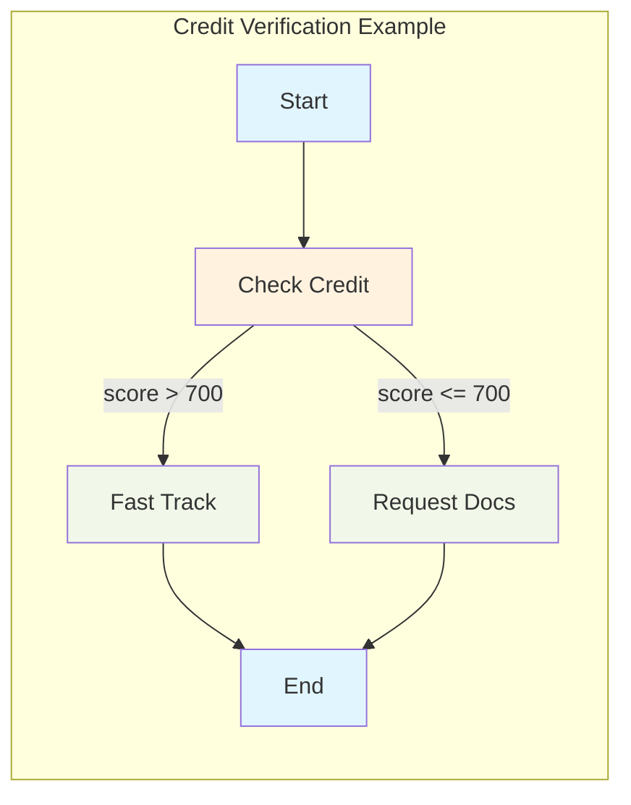

<!-- markdownlint-disable MD041 -->
<!-- markdownlint-disable MD033 -->
<p align="center">
  
</p>

# DXA Workflow System

## Overview

The DXA Workflow system translates process specifications into executable workflow graphs, primarily using LLM-assisted natural language processing. It bridges human-readable process descriptions and machine-executable workflows.

## Core Philosophy

The DXA Workflow system follows the principle: "Make the simple things easy, and complex things possible."

### Simple Things (Should Be Easy)

- Creating sequential workflows from natural language descriptions
- Adding basic decision points and conditions
- Defining common workflow patterns (Q&A, Research, Verification)
- Specifying inputs and outputs for each step

### Complex Things (Should Be Possible)

- Custom validation rules
- Complex branching logic
- Resource management
- Parallel task execution
- Time-based conditions

## Technical Foundation

### Graph-Based Implementation

The workflow system extends DXA's directed graph framework:



### Graph Traversal

```python
# Using cursor for workflow validation
cursor = workflow.cursor()
while cursor.has_next():
    node = cursor.next()
    if node.type == "TASK":
        validate_task_resources(node)
    elif node.type == "DECISION":
        validate_decision_conditions(node)

# Traversal with state tracking
cursor = workflow.cursor()
state = WorldState()
while cursor.has_next():
    node = cursor.next()
    if not validate_node_requirements(node, state):
        raise StateValidationError(f"Node {node.id} requirements not met")
    state.update(node.provides)
```

### Error Handling

```python
try:
    # Creation-time validation
    workflow = create_from_text(spec)
    workflow.validate_structure()  # From DirectedGraph
    workflow.validate_resources()  # Workflow-specific
except CycleDetectedError as e:
    logger.error(f"Invalid workflow structure: {e}")
except ResourceValidationError as e:
    logger.error(f"Invalid resource specification: {e}")

try:
    # Runtime validation
    cursor = workflow.cursor()
    while cursor.has_next():
        node = cursor.next()
        validate_execution(node, world_state)
except ExecutionError as e:
    logger.error(f"Workflow execution failed: {e}")
```

## Natural Language Workflow Creation

### LLM-Assisted Translation



### Input Formats

1. **Free-form Description**

```python
workflow = create_from_text("""
Objective: Evaluate research papers
Process: First search for papers on quantum computing.
Then analyze their methodologies and summarize key findings.
Finally, identify emerging trends and potential applications.
""")
```

1. **Structured Steps**

```python
workflow = create_from_text("""
1. Search papers (needs: api_access, provides: paper_list)
2. For each paper:
   - If year >= 2023: Detailed analysis
   - Otherwise: Basic summary
3. Synthesize findings
""")
```

1. **Decision-Focused**

```python
workflow = create_from_text("""
Process: Credit Application Review
Rules:
- If credit_score > 750: Automatic approval
- If credit_score > 700: Fast-track review
- Otherwise: Detailed assessment needed
Requirements:
- credit_report
- income_verification
- employment_history
""")
```

## Core Components

### Component Structure



## Basic Usage

### Quick Start Examples

```python
# From natural language
workflow = create_from_text("""
    1. Search for recent papers on quantum computing
    2. Summarize key findings
    3. Identify major trends
""")
```

### Decision-based Workflow

```python
workflow = create_from_text("""
    1. Check if customer credit score > 700
    2. If yes: Fast-track application
       If no: Request additional documentation
    3. Make final decision
""")
```



[Continued in next message due to length...]

### Common Patterns

```python
# Monitoring workflow
workflow = create_monitoring_workflow(
    target="system_metrics",
    interval="1h",
    thresholds={
        "cpu_usage": "> 90%",
        "memory_usage": "> 85%"
    },
    actions={
        "alert": "notify_admin",
        "critical": "restart_service"
    }
)

# Verification workflow
workflow = create_verification_workflow(
    checks=[
        "credit_score > 700",
        "income > 50000",
        "debt_ratio < 0.4"
    ],
    on_success="approve_application",
    on_failure="request_additional_docs"
)
```

## Advanced Features

### State Management

Workflows define state requirements without managing state:

```python
# Node state specifications
node = WorkflowNode(
    id="credit_check",
    type="TASK",
    description="Verify credit worthiness",
    requires={
        "credit_score": "float",
        "income": "float",
        "debt_ratio": "float"
    },
    provides={
        "risk_level": "str",
        "approval_status": "bool"
    }
)

# Edge state transitions
edge = WorkflowEdge(
    from_id="credit_check",
    to_id="approval",
    condition="risk_level == 'low'",
    state_updates={
        "approval_status": True,
        "processing_time": "fast_track"
    }
)
```

### Validation

```python
def validate_resources(workflow: Workflow) -> bool:
    """Check if all required resources are provided somewhere."""
    required = set()
    provided = set()
    
    for node in workflow.nodes.values():
        required.update(node.requires.keys())
        provided.update(node.provides.keys())
    
    return required.issubset(provided)

workflow.add_validation_rule(validate_resources)
```

### Planning Integration

```python
# Example of workflow to plan conversion
workflow = create_verification_workflow(...)
planner = SequentialPlanner()
plan = planner.create_plan(workflow)

# Plan execution
agent_state = AgentState()
world_state = WorldState()
plan.execute(agent_state, world_state)
```

## Implementation Details

### Base Classes

The workflow system builds on the DirectedGraph foundation:

```python
class Workflow(DirectedGraph):
    """Workflow implementation using directed graphs."""
    
    def __init__(self, objective: Optional[Union[str, Objective]] = None):
        super().__init__()
        self._objective = self._parse_objective(objective)
```

### Factory Methods

Built-in workflow patterns:

```python
# Sequential workflow
workflow = create_sequential_workflow(
    steps=["research", "analyze", "summarize"],
    objective="Research quantum computing"
)

# Q&A workflow
workflow = create_basic_qa_workflow(
    objective="Answer user questions"
)
```

### API Reference

Core methods for workflow construction and manipulation:

```python
class Workflow:
    def add_task(self, id: str, description: str, **kwargs) -> WorkflowNode
    def add_decision(self, id: str, description: str, **kwargs) -> WorkflowNode
    def add_transition(self, from_id: str, to_id: str, condition: Optional[str] = None) -> WorkflowEdge
    def get_start(self) -> WorkflowNode
    def get_ends(self) -> List[WorkflowNode]
```

### Factory Functions

```python
def create_workflow() -> Workflow
def create_sequential_workflow(steps: List[Node], objective: str) -> Workflow
def create_basic_qa_workflow(objective: str = "Answer the question") -> Workflow
def create_research_workflow(objective: str = "Research the topic") -> Workflow
```

### Extension Points

[New section on customization...]

## Examples

### System Monitoring

```python
workflow = create_monitoring_workflow(
    description="""
    Monitor system health:
    1. Check CPU usage every 5 minutes
    2. If usage > 90% for 15 minutes:
       - Send alert to admin
       - Scale up resources
    3. Log all events
    """,
    resources={"monitoring_api", "alerting_system"}
)
```

### Research Assistant

```python
workflow = create_research_workflow(
    description="""
    Research quantum computing advances:
    1. Search latest papers from top journals
    2. For breakthrough findings:
       - Deep dive analysis
       - Identify practical applications
    3. Compile weekly summary
    """,
    resources={"paper_database", "analysis_tools"}
)
```

### Customer Support

```python
workflow = create_support_workflow(
    description="""
    Handle customer inquiry:
    1. Analyze customer message
    2. If technical issue:
       - Check known solutions
       - If found: Provide solution
       - If not: Escalate to expert
    3. Follow up after 24 hours
    """,
    resources={"knowledge_base", "ticketing_system"}
)
```

## Future Development

1. **Advanced Natural Language Processing**
   - Context-aware parsing
   - Ambiguity resolution
   - Intent recognition

2. **Extended Validation**
   - Resource optimization
   - Path analysis
   - Performance prediction

3. **Pattern Library**
   - Industry-specific templates
   - Best practice patterns
   - Compliance workflows

---

<p align="center">
Copyright © 2024 Aitomatic, Inc. All rights reserved.
</p>

<p align="center">
<a href="https://aitomatic.com">https://aitomatic.com</a>
</p>

### Integration Points

1. **Planning System**

```python
from dxa.core.planning import SequentialPlanner
from dxa.core.state import WorldState, AgentState

# Workflow to executable plan
workflow = create_workflow(...)
planner = SequentialPlanner()
plan = planner.create_plan(workflow)

# Execution with state management
world_state = WorldState()
agent_state = AgentState()
plan.execute(world_state, agent_state)
```

1. **State Management**

```python
from dxa.core.state import WorldState

# State validation
def validate_node_requirements(node: WorkflowNode, state: WorldState) -> bool:
    """Validate node can execute in current state."""
    return all(
        state.has(req) and state.validate(req, spec)
        for req, spec in node.requires.items()
    )

# State updates
def apply_node_effects(node: WorkflowNode, state: WorldState) -> None:
    """Apply node's effects to state."""
    for key, value in node.provides.items():
        state.update(key, value)
```
