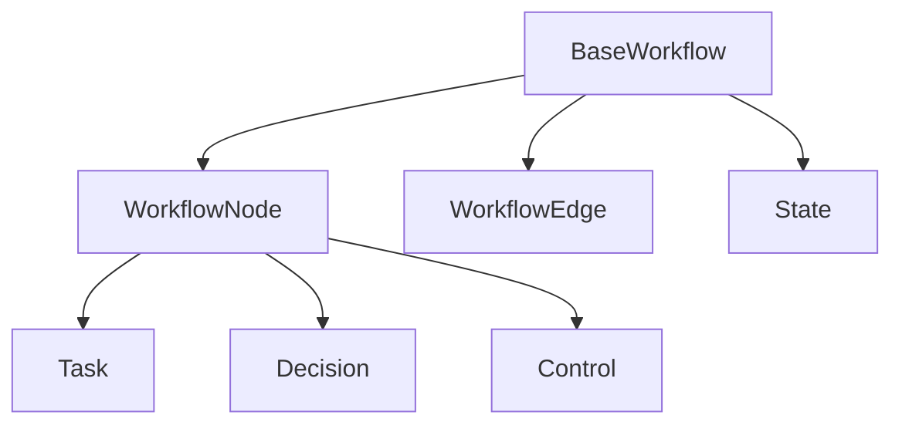

<!-- markdownlint-disable MD041 -->
<!-- markdownlint-disable MD033 -->
<p align="center">
  
</p>

# DXA Workflow System

## Overview

Workflows define what DXA agents can do. They are executable structures that combine:

- Task sequences
- Decision points
- Resource requirements
- State management

```python
# Simple Q&A workflow
answer = Agent().ask("What is quantum computing?")

# Research workflow
workflow = create_research_workflow()
agent = Agent(resources={"llm": LLMResource()})
result = agent.execute(workflow)
```

## Core Concepts



### Nodes

- Tasks: Work to be done
- Decisions: Branch points
- Control: Start/End points

### Edges

- Transitions between nodes
- Optional conditions
- State updates

### State

- Input requirements
- Output provisions
- Resource needs

## Basic Patterns

### Simple Q&A

```python
workflow = create_qa_workflow()
# Single task: Ask LLM -> Get Answer
```

### Research Flow

```python
workflow = create_research_workflow()
# Sequential: Gather -> Analyze -> Synthesize
```

## Creating Custom Workflows

```python
workflow = BaseWorkflow()

# Add nodes
start = workflow.add_task("start", "Begin research")
search = workflow.add_task("search", "Find information")
analyze = workflow.add_task("analyze", "Process findings")
end = workflow.add_task("end", "Complete research")

# Add transitions
workflow.add_transition(start.id, search.id)
workflow.add_transition(search.id, analyze.id)
workflow.add_transition(analyze.id, end.id)
```

## Integration with Agents

Agents execute workflows by:

1. Converting workflow to plan
2. Managing resources
3. Tracking state
4. Handling execution

See [Agent Documentation](../agent/README.md) for execution details.

---

<p align="center">
Copyright © 2024 Aitomatic, Inc. All rights reserved.
</p>

<p align="center">
<a href="https://aitomatic.com">https://aitomatic.com</a>
</p>
