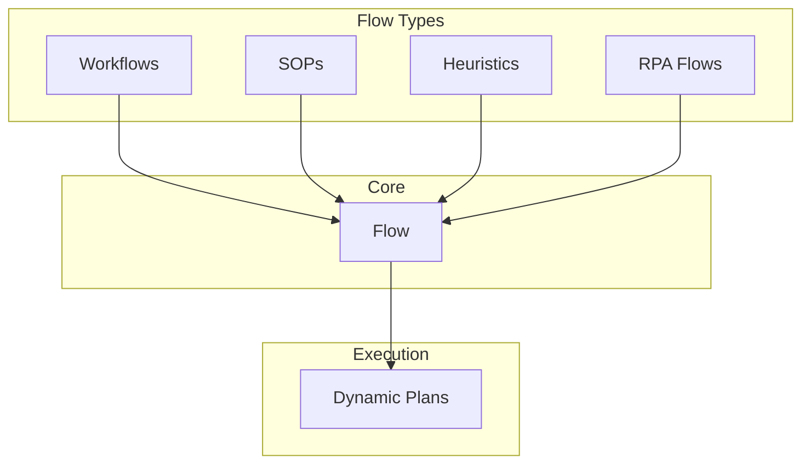
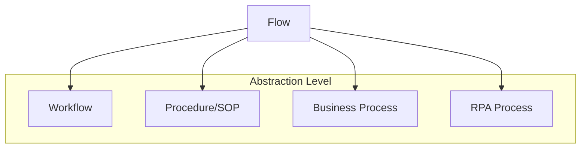

<!-- markdownlint-disable MD041 -->
<!-- markdownlint-disable MD033 -->
<p align="center">
  
</p>

# DXA Flow Architecture

## Overview

The DXA Flow System is built on a fundamental process-flow (flowchart) representation that provides a common foundation for expressing various types of Flows while enabling dynamic execution through Plans.



## Core Flow

### Structure

```typescript
interface Flow {
    nodes: {
        [id: string]: {
            type: "action" | "decision" | "parallel" | "join",
            next?: string | string[],
            condition?: string,
            branches?: {
                [result: string]: string  // result -> next node
            }
        }
    },
    start: string,
    end?: string[]
}
```

### Example

```python
flow = Flow({
    "nodes": {
        "start": {
            "type": "action",
            "next": "check_condition"
        },
        "check_condition": {
            "type": "decision",
            "condition": "value > 10",
            "branches": {
                "true": "path_a",
                "false": "path_b"
            }
        },
        "path_a": {
            "type": "action",
            "next": "end"
        },
        "path_b": {
            "type": "action",
            "next": "end"
        }
    },
    "start": "start",
    "end": ["end"]
})
```

## Flow Types

### Workflow

Compiles to Flow with emphasis on task sequencing and parallel execution.

```python
# High-level syntax
workflow = Flow.workflow([
    "prepare_release",
    {"parallel": ["run_tests", "update_docs"]},
    "deploy"
])

# Compiles to Flow
{
    "nodes": {
        "prepare_release": {
            "type": "action",
            "next": ["run_tests", "update_docs"]  # parallel
        },
        "run_tests": {
            "type": "action",
            "next": "join_1"
        },
        "update_docs": {
            "type": "action",
            "next": "join_1"
        },
        "join_1": {
            "type": "join",
            "next": "deploy",
            "wait_for": ["run_tests", "update_docs"]
        },
        "deploy": {
            "type": "action",
            "next": "end"
        }
    }
}
```

### Heuristic

Compiles to Flow with emphasis on decision trees.

```python
# High-level syntax
heuristic = Flow.heuristic([
    "if pressure > 100 then emergency_shutdown",
    "if pressure > 80 then reduce_flow",
    "else continue_monitoring"
])

# Compiles to Flow
{
    "nodes": {
        "check_pressure_high": {
            "type": "decision",
            "condition": "pressure > 100",
            "branches": {
                "true": "emergency_shutdown",
                "false": "check_pressure_warning"
            }
        },
        "check_pressure_warning": {
            "type": "decision",
            "condition": "pressure > 80",
            "branches": {
                "true": "reduce_flow",
                "false": "continue_monitoring"
            }
        }
    }
}
```

### SOP

Compiles to ProcessFlow with added verification and documentation nodes.

```python
# High-level syntax
sop = Flow.sop([
    "verify_power_off",
    "check_connections",
    "power_on"
])

# Compiles to Flow
{
    "nodes": {
        "verify_power_off": {
            "type": "action",
            "next": "verify_power_off_sign"
        },
        "verify_power_off_sign": {
            "type": "action",
            "next": "check_connections",
            "metadata": {"type": "signoff"}
        },
        "check_connections": {
            "type": "action",
            "next": "check_connections_doc"
        },
        "check_connections_doc": {
            "type": "action",
            "next": "power_on",
            "metadata": {"type": "documentation"}
        }
    }
}
```

## Dynamic Plan Execution

The Plan serves as an execution engine that traverses the Flow:

```python
class Plan:
    def __init__(self, flow: Flow):
        self.flow = flow
        self.current_nodes = [flow.start]
        self.active_paths = set()
        self.history = []
        self.state = {}
        
    async def advance(self) -> List[Step]:
        """Generate next executable steps based on current state"""
        next_steps = []
        
        for node_id in self.current_nodes:
            node = self.flow.nodes[node_id]
            
            if node.type == "decision":
                result = await self.evaluate_condition(node.condition)
                next_node = node.branches[str(result)]
                next_steps.append(self.create_step(next_node))
                
            elif node.type == "parallel":
                self.active_paths.update(node.next)
                next_steps.extend([
                    self.create_step(n) for n in node.next
                ])
                
            elif node.type == "join":
                if self.check_paths_complete(node.wait_for):
                    next_steps.append(self.create_step(node.next))
                    
            else:  # action
                next_steps.append(self.create_step(node.next))
        
        return next_steps

    def create_step(self, node_id: str) -> Step:
        """Create executable step from node"""
        step = Step(
            id=f"{node_id}_{len(self.history)}",
            node=node_id,
            context=self.state
        )
        self.history.append(step)
        return step
```

### Key Features

1. **Dynamic Step Generation**

- Steps are created on-demand based on flow
- Handles parallel paths and joins
- Maintains execution history
- Manages process state

1. **Condition Evaluation**

- Evaluates decisions based on current state
- Supports complex branching logic
- Enables data-driven flow

1. **Parallel Execution**

- Tracks multiple active execution paths
- Coordinates path convergence
- Manages dependencies

1. **State Management**

- Maintains process state
- Tracks path history
- Handles loop iterations
- Enables persistence/recovery

## Implementation Notes

1. All pattern types compile down to ProcessFlow
2. ProcessFlow provides the execution semantics
3. Plan handles the runtime complexity
4. State is maintained separately from flow definition

## Key Benefits

1. **Clean Abstraction**

- Higher-level patterns for usability
- Common execution model
- Clear separation of concerns

1. **Flexibility**

- Supports various pattern types
- Easy to extend
- Natural expression of complex flows

1. **Power**

- True dynamic execution
- Complex branching and loops
- Parallel processing
- State management

## Next Steps

1. Implement core ProcessFlow engine
2. Create compilers for each pattern type
3. Build Plan execution runtime
4. Add persistence layer
5. Create visualization tools

---

<p align="center">
Copyright © 2024 Aitomatic, Inc. All rights reserved.
</p>

<p align="center">
<a href="https://aitomatic.com">https://aitomatic.com</a>
</p>

# Flow System

## Overview of Flows

The DXA Flow system provides a higher-level abstraction for defining complex agent behaviors and business processes. While Plans handle tactical execution, Flows define the strategic patterns that guide plan generation.

## Flow-Plan Relationship

```python
# Flow definition (design time)
flow = Flow("data_analysis")\
    .stage("collect", collector="api")\
    .stage("process", method="pandas")\
    .stage("analyze", model="regression")

# Runtime execution (converts to plans)
async with agent.use_flow(flow):
    result = await agent.run(objective)
```

### Key Concepts

1. **Flow to Plan Translation**
   - Flows define the process template
   - Planning system generates concrete plans
   - Runtime maps flow stages to executable steps

2. **State Management**
   - Flows maintain process state
   - Plans track execution state
   - Runtime synchronizes both

3. **Resource Coordination**
   - Flows declare resource requirements
   - Plans handle resource allocation
   - Runtime manages resource lifecycle

## Implementation Pattern

```python
class FlowExecutor:
    """Converts flows to executable plans"""
    
    async def create_plan(self, flow: Flow, objective: Objective) -> Plan:
        """Generate concrete plan from flow template"""
        stages = flow.get_stages()
        return Plan(
            steps=[self._stage_to_step(stage) for stage in stages],
            context={"flow_id": flow.id}
        )
        
    def _stage_to_step(self, stage: FlowStage) -> Step:
        """Convert flow stage to executable step"""
        return Step(
            description=stage.description,
            resources=stage.required_resources,
            validation=stage.validation_rules
        )
```

## Usage Examples

### Sequential Flow

```python
# Define sequential flow
analysis_flow = Flow("analysis")\
    .then("collect_data")\
    .then("clean_data")\
    .then("analyze")

# Runtime converts to sequential plan
plan = await planning.create_plan(objective, flow=analysis_flow)
```

### Parallel Flow

```python
# Define parallel flow
processing_flow = Flow("processing")\
    .parallel(
        "process_batch_1",
        "process_batch_2",
        "process_batch_3"
    )\
    .then("combine_results")

# Runtime converts to plan with parallel steps
plan = await planning.create_plan(objective, flow=processing_flow)
```

### Conditional Flow

```python
# Define conditional flow
validation_flow = Flow("validation")\
    .if_("valid_data", then="process")\
    .else_("request_fix")

# Runtime generates appropriate plan based on conditions
plan = await planning.create_plan(objective, flow=validation_flow)
```

## Best Practices

1. **Flow Design**
   - Keep flows high-level and declarative
   - Focus on business logic not implementation
   - Define clear stage boundaries

2. **Plan Generation**
   - Let planning system handle details
   - Allow for dynamic optimization
   - Enable runtime adaptation

3. **Resource Management**
   - Declare resource needs in flow
   - Let runtime handle allocation
   - Enable resource sharing

## Flow Relationships with Business Processes

### Conceptual Mapping



### 1. Workflows vs Flows

**Workflows** are typically:

- Sequential task sequences
- Human-centric activities
- Document/approval focused
- Status-driven progression

DXA Flows extend this by adding:

```python
# Traditional workflow
workflow = Flow.from_workflow({
    "steps": ["review", "approve", "publish"],
    "roles": {
        "review": "editor",
        "approve": "manager",
        "publish": "system"
    }
})

# Enhanced with AI capabilities
ai_workflow = workflow.with_ai_assistance({
    "review": "content_checker",
    "approve": "risk_analyzer",
    "publish": "distribution_optimizer"
})
```

### 2. Standard Operating Procedures (SOPs)

**SOPs** traditionally feature:

- Strict sequential steps
- Verification points
- Documentation requirements
- Compliance focus

DXA Flows enhance SOPs with:

```python
# Traditional SOP
sop = Flow.from_sop({
    "procedure": "equipment_startup",
    "steps": [
        {"action": "check_power", "verify": True},
        {"action": "inspect_connections", "document": True},
        {"action": "initiate_sequence", "verify": True}
    ]
})

# AI-enhanced SOP
ai_sop = sop.with_intelligence({
    "monitoring": "sensor_analysis",
    "verification": "visual_inspection",
    "documentation": "auto_report"
})
```

### 3. Business Processes

**Business Processes** typically involve:

- Complex decision trees
- Multiple stakeholders
- Resource coordination
- KPI tracking

DXA Flows augment these with:

```python
# Traditional business process
process = Flow.from_business_process({
    "process": "customer_onboarding",
    "stages": {
        "intake": ["collect_docs", "verify_identity"],
        "review": ["credit_check", "risk_assessment"],
        "setup": ["create_account", "send_welcome"]
    }
})

# AI-enhanced process
ai_process = process.with_optimization({
    "bottleneck_detection": True,
    "resource_optimization": True,
    "predictive_analytics": True
})
```

### 4. RPA (Robotic Process Automation)

**RPA** traditionally focuses on:

- UI automation
- Data entry/extraction
- Rule-based decisions
- System integration

DXA Flows enhance RPA with:

```python
# Traditional RPA
rpa = Flow.from_rpa({
    "automation": "invoice_processing",
    "steps": [
        {"action": "extract_data", "from": "pdf"},
        {"action": "validate_fields", "rules": ["date", "amount"]},
        {"action": "enter_system", "target": "erp"}
    ]
})

# AI-enhanced RPA
ai_rpa = rpa.with_cognitive_automation({
    "document_understanding": True,
    "anomaly_detection": True,
    "adaptive_rules": True
})
```

## Key Differentiators

1. **Intelligence Integration**
   - Traditional processes are static
   - Flows enable dynamic AI assistance
   - Adaptive decision-making
   - Continuous optimization

2. **Flexibility**
   - Traditional processes are rigid
   - Flows allow runtime adaptation
   - Dynamic resource allocation
   - Context-aware execution

3. **Scalability**
   - Traditional processes are linear
   - Flows enable parallel processing
   - Resource-aware scheduling
   - Distributed execution

4. **Monitoring & Optimization**
   - Traditional processes are black-box
   - Flows provide rich telemetry
   - Performance analytics
   - Continuous improvement

## Related Systems

The Flow system integrates closely with other DXA components:

1. **[Agent System](../agent/README.md)**
   - Agents can use flows directly via `.with_flow()`
   - Flow execution is managed by agent runtime
   - Agents provide resources for flow execution

2. **[Planning System](../core/planning/README.md)**
   - Planning converts flows to executable plans
   - Handles dynamic flow adaptation
   - Manages resource allocation for flow stages

3. **[Reasoning System](../core/reasoning/README.md)**
   - Executes individual flow steps
   - Provides cognitive patterns for step execution
   - Generates signals for flow adaptation

4. **[Resource System](../core/resource/README.md)**
   - Provides tools for flow execution
   - Manages resource lifecycle
   - Enables flow capabilities

See also:
- [Core Documentation](../core/README.md) - Core system architecture
- [IO System](../core/io/README.md) - Flow interaction handling
- [Examples](../../examples/README.md) - Flow usage examples

## Integration Examples

```python
# Create flow with resource requirements
flow = Flow("data_processing")\
    .with_resources({
        "database": DatabaseResource(),
        "compute": ComputeResource()
    })

# Use flow with agent
agent = Agent("processor")\
    .with_flow(flow)\
    .with_planning("dynamic")  # For flow adaptation
    .with_reasoning("cot")     # For step execution

# Execute flow
async with agent:
    result = await agent.run(objective)
```
