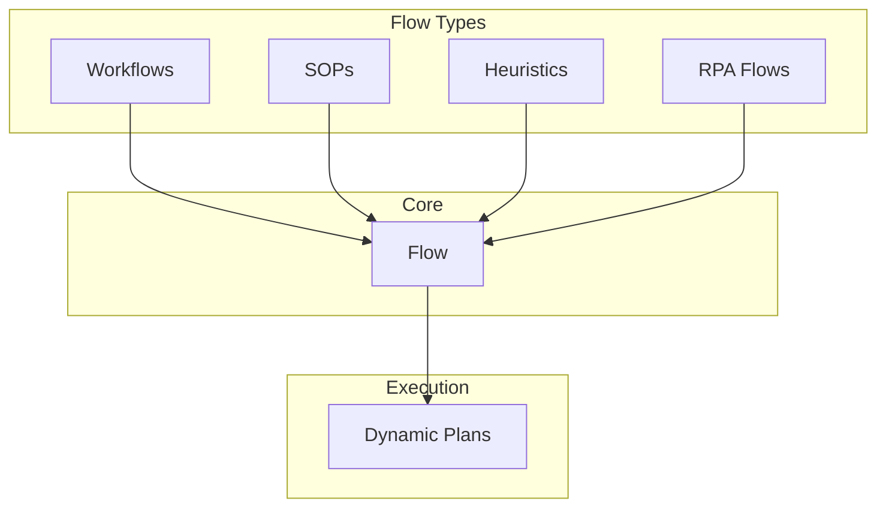

# DXA Flow Architecture

## Overview

The DXA Flow System is built on a fundamental process-flow (flowchart) representation that provides a common foundation for expressing various types of Flows while enabling dynamic execution through Plans.



## Core Flow

### Structure

```typescript
interface Flow {
    nodes: {
        [id: string]: {
            type: "action" | "decision" | "parallel" | "join",
            next?: string | string[],
            condition?: string,
            branches?: {
                [result: string]: string  // result -> next node
            }
        }
    },
    start: string,
    end?: string[]
}
```

### Example

```python
flow = Flow({
    "nodes": {
        "start": {
            "type": "action",
            "next": "check_condition"
        },
        "check_condition": {
            "type": "decision",
            "condition": "value > 10",
            "branches": {
                "true": "path_a",
                "false": "path_b"
            }
        },
        "path_a": {
            "type": "action",
            "next": "end"
        },
        "path_b": {
            "type": "action",
            "next": "end"
        }
    },
    "start": "start",
    "end": ["end"]
})
```

## Flow Types

### Workflow

Compiles to Flow with emphasis on task sequencing and parallel execution.

```python
# High-level syntax
workflow = Flow.workflow([
    "prepare_release",
    {"parallel": ["run_tests", "update_docs"]},
    "deploy"
])

# Compiles to Flow
{
    "nodes": {
        "prepare_release": {
            "type": "action",
            "next": ["run_tests", "update_docs"]  # parallel
        },
        "run_tests": {
            "type": "action",
            "next": "join_1"
        },
        "update_docs": {
            "type": "action",
            "next": "join_1"
        },
        "join_1": {
            "type": "join",
            "next": "deploy",
            "wait_for": ["run_tests", "update_docs"]
        },
        "deploy": {
            "type": "action",
            "next": "end"
        }
    }
}
```

### Heuristic

Compiles to Flow with emphasis on decision trees.

```python
# High-level syntax
heuristic = Flow.heuristic([
    "if pressure > 100 then emergency_shutdown",
    "if pressure > 80 then reduce_flow",
    "else continue_monitoring"
])

# Compiles to Flow
{
    "nodes": {
        "check_pressure_high": {
            "type": "decision",
            "condition": "pressure > 100",
            "branches": {
                "true": "emergency_shutdown",
                "false": "check_pressure_warning"
            }
        },
        "check_pressure_warning": {
            "type": "decision",
            "condition": "pressure > 80",
            "branches": {
                "true": "reduce_flow",
                "false": "continue_monitoring"
            }
        }
    }
}
```

### SOP

Compiles to ProcessFlow with added verification and documentation nodes.

```python
# High-level syntax
sop = Flow.sop([
    "verify_power_off",
    "check_connections",
    "power_on"
])

# Compiles to Flow
{
    "nodes": {
        "verify_power_off": {
            "type": "action",
            "next": "verify_power_off_sign"
        },
        "verify_power_off_sign": {
            "type": "action",
            "next": "check_connections",
            "metadata": {"type": "signoff"}
        },
        "check_connections": {
            "type": "action",
            "next": "check_connections_doc"
        },
        "check_connections_doc": {
            "type": "action",
            "next": "power_on",
            "metadata": {"type": "documentation"}
        }
    }
}
```

## Dynamic Plan Execution

The Plan serves as an execution engine that traverses the Flow:

```python
class Plan:
    def __init__(self, flow: Flow):
        self.flow = flow
        self.current_nodes = [flow.start]
        self.active_paths = set()
        self.history = []
        self.state = {}
        
    async def advance(self) -> List[Step]:
        """Generate next executable steps based on current state"""
        next_steps = []
        
        for node_id in self.current_nodes:
            node = self.flow.nodes[node_id]
            
            if node.type == "decision":
                result = await self.evaluate_condition(node.condition)
                next_node = node.branches[str(result)]
                next_steps.append(self.create_step(next_node))
                
            elif node.type == "parallel":
                self.active_paths.update(node.next)
                next_steps.extend([
                    self.create_step(n) for n in node.next
                ])
                
            elif node.type == "join":
                if self.check_paths_complete(node.wait_for):
                    next_steps.append(self.create_step(node.next))
                    
            else:  # action
                next_steps.append(self.create_step(node.next))
        
        return next_steps

    def create_step(self, node_id: str) -> Step:
        """Create executable step from node"""
        step = Step(
            id=f"{node_id}_{len(self.history)}",
            node=node_id,
            context=self.state
        )
        self.history.append(step)
        return step
```

### Key Features

1. **Dynamic Step Generation**

- Steps are created on-demand based on flow
- Handles parallel paths and joins
- Maintains execution history
- Manages process state

1. **Condition Evaluation**

- Evaluates decisions based on current state
- Supports complex branching logic
- Enables data-driven flow

1. **Parallel Execution**

- Tracks multiple active execution paths
- Coordinates path convergence
- Manages dependencies

1. **State Management**

- Maintains process state
- Tracks path history
- Handles loop iterations
- Enables persistence/recovery

## Implementation Notes

1. All pattern types compile down to ProcessFlow
2. ProcessFlow provides the execution semantics
3. Plan handles the runtime complexity
4. State is maintained separately from flow definition

## Key Benefits

1. **Clean Abstraction**

- Higher-level patterns for usability
- Common execution model
- Clear separation of concerns

1. **Flexibility**

- Supports various pattern types
- Easy to extend
- Natural expression of complex flows

1. **Power**

- True dynamic execution
- Complex branching and loops
- Parallel processing
- State management

## Next Steps

1. Implement core ProcessFlow engine
2. Create compilers for each pattern type
3. Build Plan execution runtime
4. Add persistence layer
5. Create visualization tools
