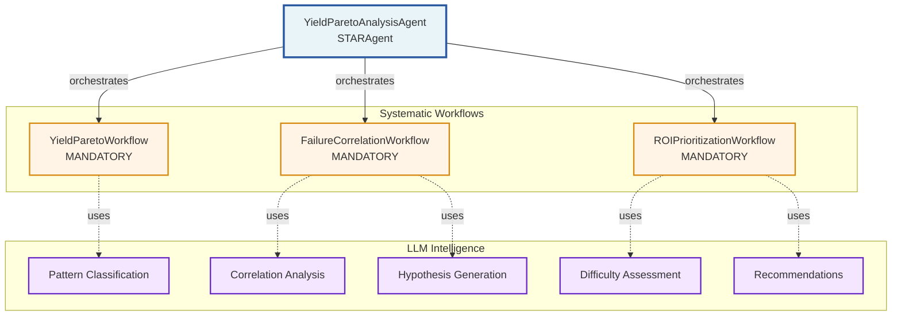
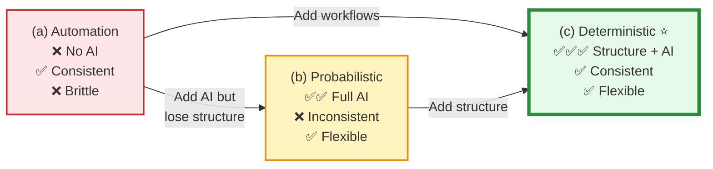
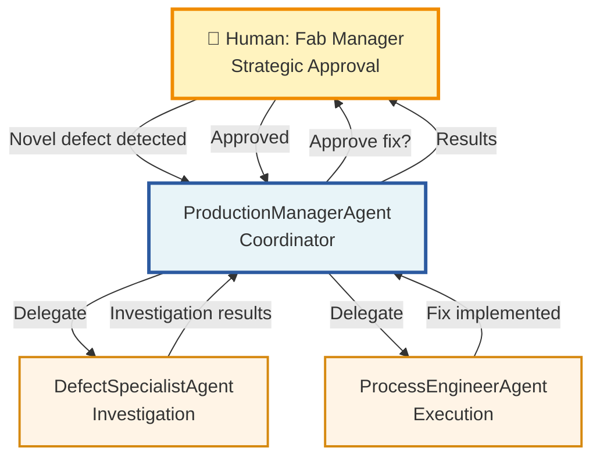

# Semiconductor Industry Demos: Three Modes of Agentic Autonomy

## Overview

This directory contains two comprehensive demonstrations showing the difference between three modes of **agentic autonomy** in high-stakes semiconductor manufacturing use cases.

All three modes are:
- **Agentic**: Agent-driven (not just scripts or tools)
- **Autonomous**: Goal-directed, self-executing (not human-controlled step-by-step)

The difference is in **how** they achieve goals, with **(c) Agentic Deterministic Autonomy** being the strongest and most intelligent approach.

## Visual Comparison: Three Modes of Agentic Autonomy

```mermaid
graph LR
    subgraph C ["(c) Deterministic Autonomy ⭐"]
        direction TB
        C1[Agent receives goal:<br/>Analyze yield failures]
        C2[Workflow 1: Pareto<br/>MANDATORY]
        C3[LLM: Classify each bin<br/>Systematic/Random?]
        C3a{Patterns found?}
        C3b[LLM: Deep analysis<br/>novel patterns]

        C4[Workflow 2: Correlation<br/>MANDATORY]
        C5[LLM: Analyze<br/>process correlations]
        C5a{Similar cases?}
        C5b[LLM: Synthesize<br/>evidence from history]
        C6[LLM: Generate<br/>ranked hypotheses]

        C7[Workflow 3: ROI<br/>MANDATORY]
        C8[LLM: Assess difficulty<br/>for each bin]
        C8a{Complexity?}
        C8b[LLM: Detailed<br/>risk analysis]
        C9[LLM: Generate<br/>specific actions]
        C10[Comprehensive report<br/>GUARANTEED]

        C1 --> C2
        C2 --> C3
        C3 --> C3a
        C3a -->|Yes| C3b
        C3a -->|No| C4
        C3b --> C4

        C4 --> C5
        C5 --> C5a
        C5a -->|Found| C5b
        C5a -->|None| C6
        C5b --> C6
        C6 --> C7

        C7 --> C8
        C8 --> C8a
        C8a -->|High| C8b
        C8a -->|Low/Med| C9
        C8b --> C9
        C9 --> C10
    end

    subgraph B ["(b) Probabilistic Autonomy"]
        direction TB
        B1[Agent receives goal:<br/>Analyze yield failures]
        B2[LLM decides approach]
        B3{LLM: Do Pareto?}
        B4[LLM: Pareto analysis]
        B5{LLM: Check history?}
        B6[LLM: Historical check]
        B7{LLM: Calculate ROI?}
        B8[LLM: ROI analysis]
        B9[LLM: Generate report]
        B10[Skip step]

        B1 --> B2
        B2 --> B3
        B3 -->|Maybe| B4
        B3 -->|Maybe| B10
        B4 --> B5
        B5 -->|Maybe| B6
        B5 -->|Maybe| B10
        B6 --> B7
        B7 -->|Maybe| B8
        B7 -->|Maybe| B10
        B8 --> B9
        B10 --> B9
    end

    subgraph A ["(a) Automation"]
        direction TB
        A1[Agent receives goal:<br/>Analyze yield failures]
        A2{Rule 1:<br/>Known pattern?}
        A3[Apply lookup table]
        A4{Rule 2:<br/>Threshold met?}
        A5[Execute action]
        A6[ESCALATE to human]

        A1 --> A2
        A2 -->|Yes| A3
        A2 -->|No| A6
        A3 --> A4
        A4 -->|Yes| A5
        A4 -->|No| A6
    end

    classDef startNode fill:#e8f4f8,stroke:#2c5aa0,stroke-width:2px
    classDef failNode fill:#ffe6e6,stroke:#c92a2a,stroke-width:2px
    classDef workflowNode fill:#fff4e6,stroke:#d68910,stroke-width:2px
    classDef llmNode fill:#f4e6ff,stroke:#6929c4,stroke-width:2px
    classDef branchNode fill:#e6f7ff,stroke:#1c7ed6,stroke-width:1px
    classDef successNode fill:#e6f9e6,stroke:#2b8a3e,stroke-width:2px
    classDef maybeNode fill:#fff3bf,stroke:#f08c00,stroke-width:2px

    class A1,B1,C1 startNode
    class A6,B10 failNode
    class C2,C4,C7 workflowNode
    class C3,C3b,C5,C5b,C6,C8,C8b,C9 llmNode
    class C3a,C5a,C8a branchNode
    class C10 successNode
    class B3,B5,B7 maybeNode
```



**Legend:**
- **Soft Blue** nodes: Starting point (agent receives goal)
- **Soft Orange/Amber** nodes: Systematic workflow steps (MANDATORY - always execute)
- **Soft Purple** nodes: LLM intelligence (adaptive reasoning)
- **Light Blue** diamonds: Intelligent branching (LLM adapts depth based on findings)
- **Soft Yellow** diamonds: Probabilistic decisions (might skip steps - unreliable)
- **Soft Green** nodes: Success/output guaranteed
- **Soft Red** nodes: Failure modes (escalation, skipped steps)

**Key Difference:**
- **Automation**: Rigid branches (IF pattern==known)
- **Probabilistic**: Uncertain branches (Maybe skip steps)
- **Deterministic** ⭐: Mandatory workflows (can't skip) + Intelligent adaptation (goes deeper when needed)

## The Three Modes of Agentic Autonomy

### (a) Agentic Automation
**Agent uses workflows with rigid rules, no AI intelligence**

- **Agentic**: ✅ Agent orchestrates workflows
- **Autonomous**: ✅ Goal-directed execution
- **Intelligence**: ❌ Rule-based only (no AI)
- ✅ Predictable, compliant
- ❌ Brittle - breaks on novelty
- ❌ Requires manual rules for every scenario
- ❌ Engineering bottleneck for unknowns

**Example:** Agent runs workflow with IF-THEN rules: IF defect_type == "known" THEN action = lookup_table[type] ELSE escalate_to_human

### (b) Agentic Probabilistic Autonomy
**Agent uses LLM to decide everything (no enforced workflows)**

- **Agentic**: ✅ Agent makes decisions
- **Autonomous**: ✅ Goal-directed, self-executing
- **Intelligence**: ✅✅ Full AI reasoning
- ✅ Flexible - handles novelty
- ✅ Intelligent reasoning
- ❌ Unpredictable - might skip critical steps
- ❌ Inconsistent run-to-run
- ❌ No guarantee of compliance
- ❌ **Not production-ready for high-stakes**

**Example:** Agent with LLM decides autonomously whether to investigate thoroughly or jump to conclusions (varies each run)

### (c) Agentic Deterministic Autonomy ⭐
**Agent (LLM) decides which workflows to run; workflows execute deterministically and call back to agent for intelligence**

- **Agentic**: ✅ Agent (LLM) makes decisions
- **Autonomous**: ✅ Goal-directed, agent decides workflow sequence
- **Intelligence**: ✅✅✅ Agent reasoning + deterministic workflows = **STRONGEST**
- ✅ Flexible - agent decides which workflows to invoke
- ✅ Systematic - workflows can't skip steps (deterministic)
- ✅ Intelligent - workflows call `agent.query()` for decisions
- ✅ Consistent - same workflow structure every time
- ✅ Handles novelty - agent adapts approach, workflows ensure quality
- ✅ Compliant - documented workflows with audit trail
- ✅ **Production-ready for high-stakes operations**

**Example:** Agent decides "I need Pareto analysis" → ParetoWorkflow runs deterministically (data collection, sorting, calculation) → workflow lazy-instantiates `WorkflowStepAgent(objective="Classify bin patterns")` → workflow calls `orchestrator.query("Classify these bin patterns...")` → orchestrator provides intelligence → workflow continues → coordinator agent decides next workflow based on results

**Key Architecture (Workflows lazy-instantiate WorkflowStepAgent):**
```
Calling Agent (LLM autonomous decision-making)
  ↓ decides to run
Workflow (deterministic structure - can't skip steps)
  ↓ lazy-instantiates WorkflowStepAgent
  ↓   (WorkflowStepAgent = reusable lib agent with objective-driven prompt)
  ↓ calls orchestrator.query() for intelligence tasks
WorkflowStepAgent (provides objective-driven intelligence)
  ↓ maintains own conversation context (doesn't pollute calling agent)
  ↓ returns answers
Workflow (continues deterministically)
  ↓ completes
Calling Agent (reviews results, decides next workflow or final output)
```

**This enables:**
- **Clean separation:** Calling agent decides workflows, workflows handle their own intelligence
- **Deterministic workflows** ensure systematic process (can't skip steps)
- **Objective-driven intelligence** (each workflow creates orchestrator with specific objective)
- **Context isolation** (orchestrator conversation doesn't pollute calling agent timeline)
- **Reusable component** (WorkflowStepAgent is library utility, not workflow-specific)

### WorkflowStepAgent Pattern: Workflows with Objective-Driven Intelligence

**Critical insight:** Workflows lazy-instantiate their own **WorkflowStepAgent** for intelligence tasks!

This keeps workflows **self-contained and deterministic** while leveraging AI intelligence:
1. Execute systematic steps (can't skip steps within workflow)
2. Lazy-instantiate WorkflowStepAgent when intelligence needed
3. WorkflowStepAgent maintains its own conversation context (doesn't pollute calling agent)

**Example: ParetoWorkflow with WorkflowStepAgent:**
```python
from dana.lib.agents.workflow_step_agent import WorkflowStepAgent

class YieldParetoWorkflow(BaseWorkflow):
    def __init__(self, ...):
        self._orchestrator = None  # Lazy instantiation

    def _get_orchestrator(self) -> WorkflowStepAgent:
        """Lazy-instantiate orchestrator for this workflow."""
        if self._orchestrator is None:
            self._orchestrator = WorkflowStepAgent(
                objective="Classify failure bin patterns and validate Pareto analysis"
            )
        return self._orchestrator

    def _do_execute(self, **kwargs):
        # STEP 1: Collect data (deterministic - can't skip)
        test_data = self.test_data_resource.get_test_results(wafer_id)

        # STEP 2: Sort and calculate (deterministic - can't skip)
        sorted_bins = sorted(test_data, key=lambda x: x['count'], reverse=True)
        pareto_data = calculate_pareto_80_20(sorted_bins)

        # STEP 3: Get orchestrator for intelligence
        orchestrator = self._get_orchestrator()

        # STEP 4: Call orchestrator for pattern classification
        classification = orchestrator.query(
            f"Classify these bin patterns: {bins_summary}"
        )

        # STEP 5: Call orchestrator for statistical validation
        validation = orchestrator.query(
            f"Is this Pareto significant? Data: {pareto_data}"
        )

        # STEP 6: Generate output (deterministic - can't skip)
        return structured_output(pareto_data, classification, validation)
```

**Benefits:**
- ✅ **Clean separation:** Calling agent decides workflows, workflows handle their own intelligence
- ✅ **Context isolation:** WorkflowStepAgent conversation doesn't pollute calling agent timeline
- ✅ **Reusable library:** WorkflowStepAgent is in `lib/agents`, used by all workflows
- ✅ **Objective-driven:** Each workflow creates orchestrator with specific objective
- ✅ **Testable:** Mock WorkflowStepAgent for testing workflow logic
- ✅ **Self-contained:** Workflows don't need agent parameters passed from caller

**Comparison:**
- **(a) Automation:** Workflows have no intelligence (rigid rules)
- **(b) Probabilistic:** Single agent does everything (might skip steps)
- **(c) Deterministic:** Calling agent + deterministic workflows + WorkflowStepAgents (systematic + intelligent + clean)

## The Demos

### Semi-Single: Yield Pareto Analysis Agent

**Directory:** `/examples/agents/semi-single/`

**Use Case:** Yield optimization through Pareto analysis of wafer test failures

**Single agent scenario:** One specialized agent performing systematic analysis

**Why this demonstrates the value:**
- **(a) Agentic Automation:** Agent uses rigid IF-THEN rules to decide workflows (no AI), workflows run without intelligence
- **(b) Agentic Probabilistic Autonomy:** Agent (LLM) decides everything, might skip workflows entirely (e.g., skip correlation or ROI if it "thinks" it's not needed) - inconsistent
- **(c) Agentic Deterministic Autonomy:** Agent (LLM) decides which workflows to run → workflows execute deterministically → workflows call `agent.query()` for intelligence → agent adapts while maintaining systematic structure - **STRONGEST**

**Financial stakes:** 1% yield improvement = $10M+ annual revenue

**Key insight:** Systematic analysis (deterministic) finds 20% more optimization opportunities than probabilistic approaches

---

### Semi-Multi: Production Manager + Specialist Team

**Directory:** `/examples/agents/semi-multi/`

**Use Case:** Novel defect pattern investigation and resolution

**Multi-agent scenario:** Coordinator (ProductionManager) delegates to specialists (DefectSpecialist, ProcessEngineer)

**Why this demonstrates the value:**
- **(a) Agentic Automation:** Agent escalates unknown defects to human queue (rule-based, no AI investigation)
- **(b) Agentic Probabilistic Autonomy:** Single LLM agent sometimes investigates thoroughly, sometimes jumps to conclusions, no guaranteed delegation or approval gates
- **(c) Agentic Deterministic Autonomy:** ProductionManager agent coordinates specialist agents, systematic investigation workflow, human approval at strategic points - **STRONGEST**

**Financial stakes:** Wafer lot = $500K-$1M, production downtime = $1M/day

**Key insights:**
- **Multi-agent coordination:** Mirrors real fab organization (manager → specialists)
- **Human-in-the-loop:** Strategic decisions (approve/reject) not tactical details
- **Systematic investigation:** Every defect gets thorough analysis
- **Consistent quality:** Can rely on process every time

---

## Comparison Matrix: Three Modes of Agentic Autonomy

All three are **agentic** (agent-driven) and **autonomous** (goal-directed). The difference is in **intelligence and reliability**:

| Aspect | (a) Agentic Automation | (b) Agentic Probabilistic | (c) Agentic Deterministic ⭐ |
|--------|-----------|---------------|---------------|
| **Agentic?** | ✅ Agent orchestrates | ✅ Agent decides | ✅ Calling agent decides |
| **Autonomous?** | ✅ Goal-directed | ✅ Goal-directed | ✅ Goal-directed |
| **Agent decides workflows?** | ❌ IF-THEN rules | ✅ LLM decides | ✅ LLM decides |
| **Workflows deterministic?** | ✅ Yes | ❌ No workflows | ✅ Yes (can't skip steps) |
| **Workflows have intelligence?** | ❌ No | ❌ No workflows | ✅ WorkflowStepAgent (lazy) |
| **Calling agent timeline?** | ✅ Clean | ⚠️ Mixed with intelligence | ✅ Clean (orchestrators separate) |
| **Context separation?** | N/A | ❌ No | ✅ Each workflow owns context |
| **Intelligence level** | ❌ Rules only | ✅✅ Full AI (single agent) | ✅✅✅ **Multi-layer intelligence = STRONGEST** |
| **Handles novelty?** | ❌ No - escalates | ✅ Yes | ✅ Yes (calling agent + orchestrators) |
| **Consistent quality?** | ✅ Same rules | ❌ Varies | ✅ Same workflow structure |
| **Might skip critical steps?** | ✅ No | ❌ Yes | ✅ No (workflows enforce) |
| **Compliant?** | ⚠️ If coded | ❌ No guarantee | ✅ Documented workflows |
| **Production-ready?** | ❌ Brittle | ❌ Unreliable | ✅ **YES** |

## Value Proposition

### Why Deterministic Autonomy Matters in Semiconductor Manufacturing

**High Stakes:**
- Wafer lots worth $500K-$1M each
- Production downtime costs $1M+ per day
- Yield improvements worth $10M+ annually
- Customer returns/reputation damage catastrophic
- Regulatory compliance (ISO/IATF) mandatory

**Can't Rely On:**
- **Automation:** Breaks on novel situations (new defects, failure patterns)
- **Probabilistic:** Might skip critical investigation steps, inconsistent quality

**Need:**
- **Systematic investigation:** Every issue gets thorough analysis
- **Intelligent reasoning:** LLM pattern recognition, correlation, prioritization
- **Consistent quality:** Can rely on process every time
- **Compliance:** Documented workflows, audit trail
- **Human involvement:** Strategic decisions, not micro-management

**Deterministic autonomy delivers all of this.**

## Getting Started

### Semi-Single (Yield Pareto Analysis)

```bash
cd examples/agents/semi-single

# See design and implementation plan
cat specs/DESIGN.md
cat specs/IMPLEMENTATION_PLAN.md

# Run demos (once implemented)
python demos/demo_comparison.py  # Compare all three modes
python demos/demo_deterministic.py  # Systematic yield analysis
python demos/demo_probabilistic.py  # LLM-only (inconsistent)
python demos/demo_automation.py  # Rule-based (brittle)
```

**What to observe:**
- Deterministic: Agent decides workflows → each workflow runs deterministically → workflows call agent for intelligence
- Probabilistic: Agent might skip entire workflows (inconsistent)
- Automation: Agent uses IF-THEN rules, workflows have no intelligence

---

### Semi-Multi (Production Manager + Specialists)

```bash
cd examples/agents/semi-multi

# See design and implementation plan
cat specs/DESIGN.md
cat specs/IMPLEMENTATION_PLAN.md

# Run demos (once implemented)
python demos/demo_comparison.py  # Compare all three modes
python demos/demo_deterministic.py  # Multi-agent coordination
python demos/demo_probabilistic.py  # Single LLM (no specialists)
python demos/demo_automation.py  # Rule-based (escalates)
python demos/demo_interactive.py  # Interactive with approval gates
```

**What to observe:**
- Deterministic: ProductionManager → delegates to DefectSpecialist → systematic investigation → user approval → ProcessEngineer executes
- Probabilistic: Single agent, sometimes investigates, sometimes doesn't, no guaranteed delegation
- Automation: Escalates unknown defects to human queue (no investigation)

---

## Key Takeaways

**All three modes are agentic and autonomous** (agent-driven, goal-directed). The difference is in **intelligence and reliability**:

1. **(a) Agentic Automation is too rigid**
   - Agent orchestrates workflows with rigid rules
   - Can't handle novelty, requires manual rules for every scenario
   - No AI intelligence

2. **(b) Agentic Probabilistic Autonomy is too unpredictable**
   - Agent uses LLM to decide everything
   - Might skip critical steps, inconsistent quality
   - Not production-ready for high-stakes operations

3. **(c) Agentic Deterministic Autonomy is the STRONGEST solution** ⭐
   - Agent (LLM) decides which workflows to run (autonomous, goal-directed)
   - Workflows execute deterministically (can't skip steps, ensure quality)
   - Workflows call `agent.query()` for intelligence (LLM reasoning at decision points)
   - Consistent quality (same workflow structure, reliable every time)
   - Handles novelty (agent adapts approach, workflows ensure completeness)
   - Compliant (documented workflows with audit trail)
   - **Production-ready for high-stakes operations**

4. **Multi-agent deterministic autonomy mirrors real organizations:**
   - Coordinator agent manages strategic flow
   - Specialist agents handle technical depth
   - Human-in-the-loop at strategic points
   - Scalable and realistic

---

## Implementation Status

**Semi-Single (Yield Pareto Analysis):**
- [x] Design document
- [x] Implementation plan
- [ ] Implementation (see `semi-single/specs/IMPLEMENTATION_PLAN.md`)

**Semi-Multi (Production Manager + Specialists):**
- [x] Design document
- [x] Implementation plan
- [ ] Implementation (see `semi-multi/specs/IMPLEMENTATION_PLAN.md`)

---

## For Semiconductor Industry Professionals

These demos use realistic scenarios from actual semiconductor manufacturing:

**Semi-Single:** Yield Pareto analysis is standard practice in every fab. The demo shows how deterministic autonomy ensures systematic analysis that finds more opportunities than manual or probabilistic approaches.

**Semi-Multi:** Defect excursion response follows real fab procedures (investigation → risk assessment → corrective action → verification). The demo shows how multi-agent deterministic autonomy mirrors your actual organization structure.

**Financial Impact:**
- Faster defect resolution (automated investigation vs waiting for engineer)
- More optimization opportunities found (systematic vs ad-hoc analysis)
- Consistent quality (every issue gets thorough treatment)
- Compliance ready (documented workflows, audit trail)
- **ROI: Millions in additional revenue from yield improvement and faster issue resolution**

---

## Questions?

These demos are designed to show **why deterministic autonomy matters** in high-stakes industrial settings.

For more information:
- See individual design docs: `semi-single/specs/DESIGN.md` and `semi-multi/specs/DESIGN.md`
- See implementation plans for detailed task breakdown
- Contact: [Your contact info]

---

## Additional Visual Aids

### Architecture: How Deterministic Autonomy Works



**Key Insight:**
- Agent (LLM) **decides** which workflows to invoke (autonomous)
- Workflows execute **deterministically** (can't skip steps within workflow)
- Workflows **call back** to agent via `agent.query()` for intelligence
- Agent provides reasoning → workflow continues → agent decides next action

This architecture combines:
- **Autonomous agent reasoning** (flexible, goal-directed)
- **Deterministic workflow structure** (systematic, compliant)
- **Agent-workflow collaboration** (intelligent + reliable)

### Intelligence Progression



### Multi-Agent Coordination (Semi-Multi)



**Key Insight:** Mirrors real fab organization - strategic human decisions, systematic specialist work, guaranteed quality.
