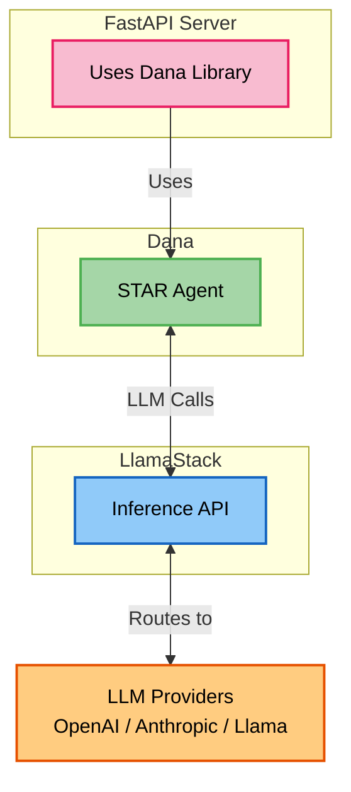
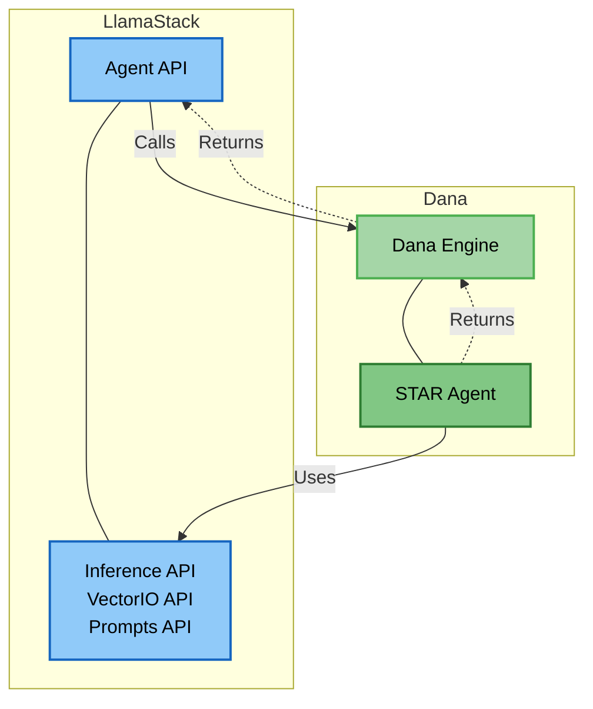

# Dana ↔ LlamaStack Integration Diagrams

This document shows two integration patterns between Dana and LlamaStack.

## Diagram 1: Dana → LlamaStack (Inference API)

This diagram shows how the HVAC example uses LlamaStack as an LLM provider.

This diagram shows how LlamaStack can use Dana as an inline agent provider for its Agent API.

