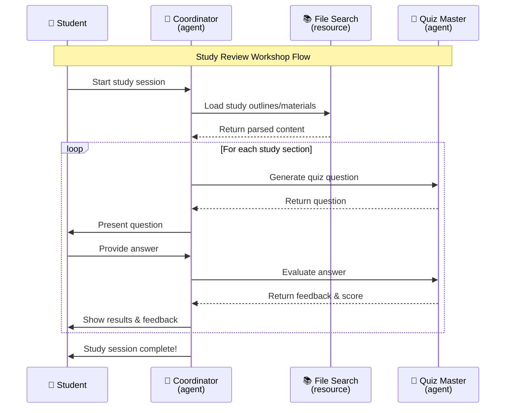
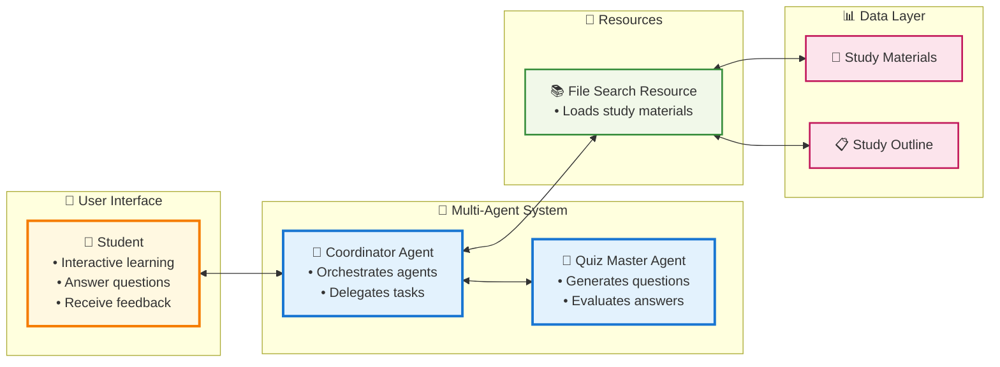

# Study Review Workshop

A hands-on workshop demonstrating **multi-agent architecture** using the Dana framework. Build an intelligent study assistant that creates quizzes and evaluates student progress.

## 🎯 Workshop Goals

- **Learn Multi-Agent Patterns**: Understand how agents collaborate
- **Build Interactive Systems**: Create conversational AI applications  
- **Master Resource Integration**: Connect agents to external tools

## 🔄 Study Session Flow



## 🏗️ Architecture Overview



## 📁 Workshop Files

```
study-review/
├── agents/
│   ├── coordinator_agent.py      # 🎯 Main orchestrator
│   └── quiz_master_agent.py      # 🧠 Quiz generator
├── prompts/
│   ├── CoordinatorAgent.xml      # 🎭 Coordinator identity
│   └── QuizMasterAgent.xml       # 🎭 Quiz master identity
├── resources/
│   └── file_search_resource.py   # 📚 Loads study materials
├── data/
│   ├── study_material.md         # 📖 Study content
│   └── study_outline.md          # 📋 Learning path
└── demo.py                       # 🚀 Workshop demo
```

## 🚀 Workshop Setup

### 1. Prerequisites
```bash
# Install Dana framework
pip install -e .

# Set your API key
export OPENAI_API_KEY=your_openai_api_key
```

### 2. Run the Workshop Demo
```bash
uv sync
source .venv/bin/activate

python examples/agents/study-review/demo.py
```

### 3. What You'll Experience
- **Interactive Quiz Session**: Answer questions about refrigerator design
- **Real-time Evaluation**: Get immediate feedback on your answers
- **Multi-Agent Coordination**: See how agents work together

## 🎯 Workshop Learning Objectives

### What You'll Build
- **Multi-Agent System**: Coordinator + Quiz Master + Resources
- **Interactive Learning**: Real-time quiz generation and evaluation
- **Resource Integration**: File loading and answer evaluation
- **Conversational AI**: Natural language interaction

### Key Concepts Demonstrated
```
┌─────────────────────────────────────────────────────────┐
│                    Workshop Concepts                     │
├─────────────────────────────────────────────────────────┤
│ 🤖 Agent Communication                                 │
│    • How agents delegate tasks                         │
│    • Resource sharing between agents                   │
│    • Conversation flow management                      │
├─────────────────────────────────────────────────────────┤
│ 🔧 Resource Integration                                │
│    • File system access                                │
│    • External tool integration                         │
│    • Data processing and parsing                       │
├─────────────────────────────────────────────────────────┤
│ 💬 Conversational AI                                   │
│    • Natural language interaction                      │
│    • Context management                                │
│    • Adaptive responses                                │
└─────────────────────────────────────────────────────────┘
```

## 🎓 Workshop Content

**Study Topic**: Refrigerator Design Engineering
- **Rubber Gasket Design**: Vibration isolation, frequency requirements
- **Air Duct Design**: Flow calculations, cooling capacity
- **Dryer Specification**: Molecular sieves, moisture control

## ✅ Workshop Success Criteria

- [ ] **Run the demo** and complete a quiz session
- [ ] **Understand agent roles** and how they collaborate  
- [ ] **See resource integration** in action
- [ ] **Experience conversational flow** with the system


## 🛠️ Workshop Troubleshooting

### Quick Fixes
```bash
# 1. Install dependencies
pip install -e ../../../dana_agent

# 2. Set API key
export OPENAI_API_KEY=your_api_key_here

# 3. Run demo
python demo.py
```

### Common Issues
- **Import errors**: Ensure Dana framework is installed
- **API key missing**: Set `OPENAI_API_KEY` environment variable
- **File not found**: Check that `data/` folder contains study materials

## 🎓 Next Steps

After completing this workshop:

1. **Explore the Code**: Study how agents communicate
2. **Modify Resources**: Try adding new file types or evaluation methods
3. **Create New Agents**: Build specialized agents for different tasks
4. **Extend the System**: Add features like progress tracking or analytics

## 📚 Learn More

- [Dana Framework Docs](../../../dana_agent/docs/) - Complete framework documentation
- [Agent Building Guide](../../../dana_agent/docs/ai-building-agents/) - Build your own agents
- [Fraud Detection Example](../fraud-detection/) - Advanced multi-agent patterns

---

**🎯 Workshop Complete!** You've built a multi-agent study system with the Dana framework.
