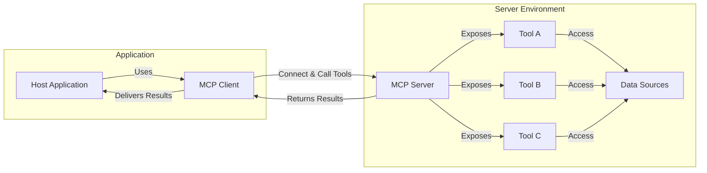
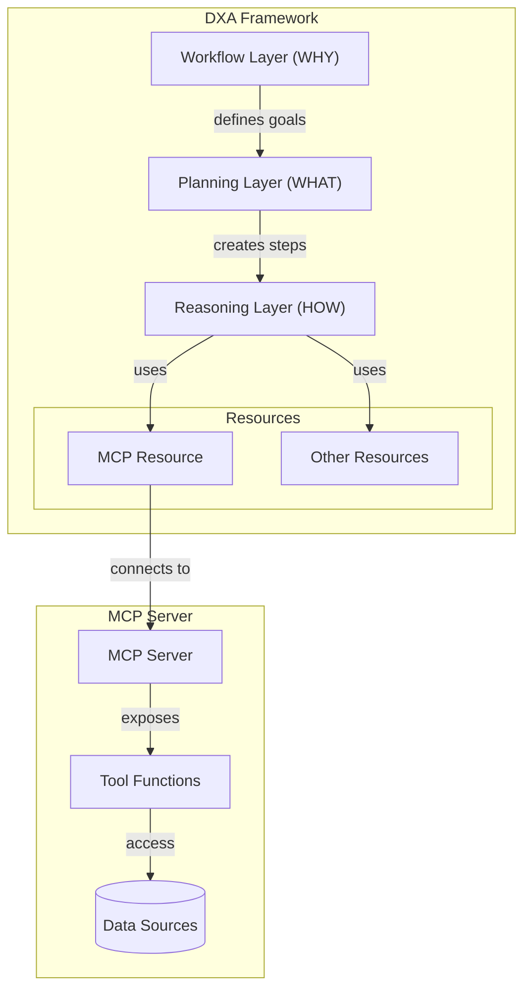

# DXA Framework: Model Control Protocol (MCP) Tutorial
This tutorial introduces how to use the Model Control Protocol (MCP) with the DXA framework, focusing on practical integration rather than MCP fundamentals.

## What is MCP?

[The Model Control Protocol (MCP)](https://modelcontextprotocol.io/introduction) is an open protocol that standardizes how applications provide context to LLMs. It creates a standardized way for AI models to connect with external tools and data sources.

MCP follows a client-server architecture:

- **MCP Server**: Provides tools (functions) that can be called remotely. Servers can be local (using STDIO) or remote (using HTTP/SSE) and can connect to various data sources like databases, APIs, or local files.

- **MCP Client**: Connects to MCP servers to use their tools. The client handles the communication protocol, tool discovery, and calling tools with arguments.

This architecture allows AI applications to access external capabilities in a standardized way, regardless of where those capabilities are hosted.



For detailed MCP fundamentals, refer to the [official MCP documentation](https://modelcontextprotocol.io/introduction).

## Where to Learn MCP Fundamentals

If you're new to MCP, here are resources to learn the basics:
- [Official MCP Website](https://modelcontextprotocol.io/)
- [For Server Developers](https://modelcontextprotocol.io/quickstart/server)
- [For Client Developers](https://modelcontextprotocol.io/quickstart/client)


## DXA Architecture and MCP Integration

The DXA Framework follows a three-layer architecture (to learn more about DXA architecture, see the [DXA Architecture Guide](https://github.com/aitomatic/dxa/blob/main/dxa/README.md)):

1. [**Workflow Layer (WHY)**](https://github.com/aitomatic/dxa/blob/main/dxa/execution/workflow/README.md) - Defines high-level objectives
2. [**Planning Layer (WHAT)**](https://github.com/aitomatic/dxa/blob/main/dxa/execution/planning/README.md) - Breaks down workflows into steps
3. [**Reasoning Layer (HOW)**](https://github.com/aitomatic/dxa/blob/main/dxa/execution/reasoning/README.md) - Implements execution patterns

### Resources in DXA

[Resources in DXA](https://github.com/aitomatic/dxa/blob/main/dxa/agent/resource/README.md) extend agent capabilities by providing access to external functionality. DXA supports various resource types (external services, specialized agents, human input, data sources,...) that agents can use through a unified interface.

In this architecture, **MCP fits in as a specialized resource type** (`McpResource`) that:
- Abstracts protocol communication details
- Connects to both local and remote tools
- Integrates with DXA's reasoning components
- Enables agents to access external capabilities through natural language

MCP resources bridge DXA agents with MCP-compatible tools, allowing seamless integration of specialized functionality.


## DXA Framework Integration with MCP

The DXA Framework provides a streamlined approach to MCP integration through its `McpResource` abstraction, which eliminates the need to deal with low-level protocol details.

### Setup Environment

Before integrating MCP with DXA, make sure to set up your development environment properly:

1. Follow the [DXA Getting Started guide](https://github.com/aitomatic/dxa/tree/main?tab=readme-ov-file#getting-started) to install dependencies
2. Configure your API keys for LLM providers


### Key Integration Patterns

DXA supports three main MCP integration patterns:

1. **Local MCP Servers** - Run MCP servers as part of your application
2. **Remote MCP Servers** - Connect to MCP servers running elsewhere
3. **Community MCP Servers** - Use pre-built MCP servers from the community

### Quick Example: Creating an MCP-Enabled Agent

```python
from dxa.agent import Agent
from dxa.agent.resource import McpResource, StdioTransportParams

def main():
    # Create an MCP resource for weather data
    weather_resource = McpResource(
        name="weather_resource",
        transport_params=StdioTransportParams(
            command="npx",
            args=["-y", "@h1deya/mcp-server-weather"],
        ),
    )

    # Create an agent with the MCP resource
    agent = Agent(name="weather_agent")
    agent.with_llm({"model": "openai:gpt-4o-mini"})
    agent.with_resources({"weather_resource": weather_resource})

    # Use MCP tools through natural language
    response = agent.ask("What's the weather forecast for New York?")
    print(response)

if __name__ == "__main__":
    main()
```

## MCP Resource Configuration

### Connect To Local MCP Server

```python
from dxa.agent.resource import McpResource, StdioTransportParams

# Connect to a local MCP server
local_resource = McpResource(
    name="local_mcp",
    transport_params=StdioTransportParams(
        server_script="path/to/my_mcp_server.py",  # Python script path
    ),
)
```

### Connect To Remote MCP Server

```python
from dxa.agent.resource import McpResource, HttpTransportParams

# Connect to a remote MCP server
remote_resource = McpResource(
    name="remote_mcp",
    transport_params=HttpTransportParams(
        url="https://api.mcp.example.com/endpoint",
        timeout=5.0,
        headers={"Authorization": "Bearer your-token"},
    ),
)
```

### Connect To Community MCP Server

```python
from dxa.agent.resource import McpResource, StdioTransportParams

# Connect to a community npm package
npm_resource = McpResource(
    name="weather_mcp",
    transport_params=StdioTransportParams(
        command="npx",
        args=["-y", "@h1deya/mcp-server-weather"],
    ),
)

# Connect to a community Python package
python_resource = McpResource(
    name="python_mcp",
    transport_params=StdioTransportParams(
        command="uvx",
        args=["some-python-mcp-package"],
    ),
)
```
## Creating a Simple MCP Server for DXA

If you want to create your own MCP server to use with DXA, use the `BaseMcpService` class:

```python
"""A simple MCP server that provides basic tools."""

from dxa.agent.resource.mcp import BaseMcpService

class MyMcpServer(BaseMcpService):
    """Simple MCP server implementation with basic tools."""
    
    @BaseMcpService.tool(name="add", description="Add two numbers together")
    def add(self, a: float, b: float) -> float:
        """Add two numbers together."""
        return a + b

if __name__ == "__main__":
    # Start the server
    print("Starting MCP Server...")
    MyMcpServer().run()
```

### Example MCP Servers

To see complete examples of MCP servers, check:
- [mcp_echo.py](./mcp_servers/mcp_echo.py) - Simple echo server
- [mcp_sqlite.py](./mcp_servers/mcp_sqlite.py) - SQLite database interface

## Best Practices

1. **Server Design**
   - Keep servers focused on specific functionality
   - Implement proper error handling
   - Use type hints and docstrings
   - Follow the single responsibility principle

2. **Client Usage**
   - Always initialize resources before use
   - Implement proper error handling
   - Use appropriate timeouts for remote servers
   - Validate tool arguments before calling

3. **Security**
   - Use HTTPS for remote servers
   - Implement proper authentication
   - Validate all inputs
   - Use environment variables for sensitive data

4. **Performance**
   - Keep tool implementations efficient
   - Use appropriate timeouts
   - Implement connection pooling for remote servers
   - Cache tool results when appropriate

## Troubleshooting

Common issues and solutions:

1. **Connection Issues**
   - Check server is running
   - Verify connection parameters
   - Check network connectivity for remote servers
   - Verify environment variables

2. **Tool Execution Errors**
   - Check tool arguments match schema
   - Verify server implementation
   - Check server logs
   - Validate input data

3. **Performance Issues**
   - Check server resource usage
   - Verify network connectivity
   - Implement caching if appropriate
   - Use connection pooling

## Resources for Learning DXA

To learn more about the DXA framework:

- [DXA GitHub Repository](https://github.com/aitomatic/dxa)
- [DXA Architecture Guide](https://github.com/aitomatic/dxa/blob/main/dxa/README.md)
- [DXA Examples](https://github.com/aitomatic/dxa/tree/main/examples)


## Next Steps

1. Explore the example MCP servers in the DXA codebase
2. Create your own MCP server for specific functionality
3. Integrate MCP resources into your agents
4. Check out community MCP servers for pre-built functionality