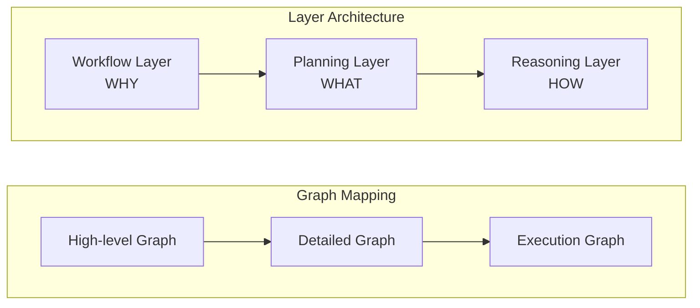
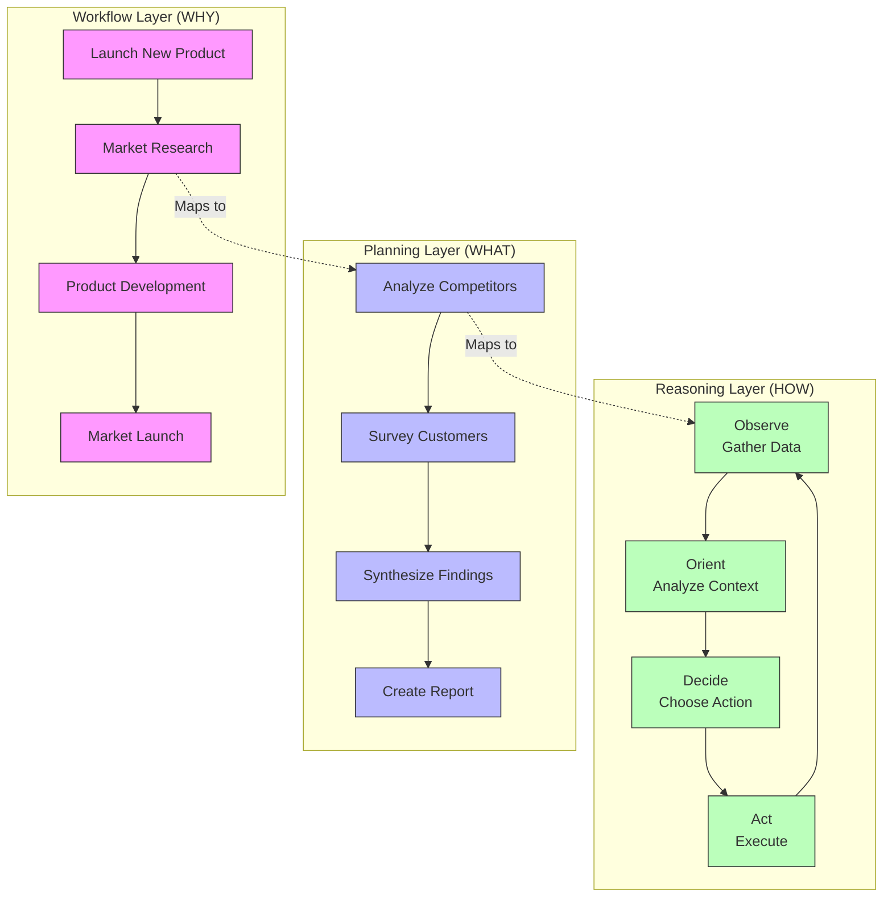

<p align="center">
  
</p>

# OpenDXA - Domain-Expert Agent

The Domain-Expert Agent (OpenDXA) is an intelligent agent architecture designed to tackle complex domain-specific tasks with human-like expertise. At its heart is a unique three-layer graph architecture that breaks down high-level objectives into executable actions through a Why-What-How paradigm.

## Architecture Overview

OpenDXA maps business workflows (WHY) to concrete plans (WHAT), which are then executed through standardized reasoning patterns (HOW). This hierarchical decomposition allows agents to maintain strategic alignment while adapting to changing conditions - similar to how human experts combine domain knowledge with practical execution.



### Layer Mapping Example



## System Architecture

### Agent System ([documentation](agent/README.md))

1. **Core Components**
   - Agent Factory & Runtime ([documentation](agent/README.md))
   - [Capabilities](agent/capability/README.md) - Cognitive abilities
   - [Resources](agent/resource/README.md) - Tools and services
   - IO System - Environmental interaction
   - State System - Execution state management

2. **Key Features**
   - Factory patterns for quick creation
   - Resource and capability management
   - State tracking and persistence
   - I/O handling and environmental interaction

### Execution System ([documentation](execution/README.md))

1. **Components**
   - [Workflow](execution/workflow/README.md) - Process definition and control
   - [Planning](execution/planning/README.md) - Strategic decomposition
   - [Reasoning](execution/reasoning/README.md) - Tactical execution
   - [Pipeline](execution/pipeline/README.md) - Execution flow management

2. **Key Features**
   - Graph-based execution
   - Hierarchical decomposition
   - Dynamic adaptation
   - Progress tracking

## Engineering Approaches

OpenDXA follows three key engineering principles that guide its architecture and implementation:

1. **Progressive Complexity**
   - Start with simple implementations
   - Add complexity incrementally
   - Maintain clarity at each level
   - Enable gradual learning curve

2. **Composable Architecture**
   - Mix and match components
   - Highly customizable agents
   - Flexible integration points
   - Reusable building blocks

3. **Clean Separation of Concerns**
   - Clear component boundaries
   - Well-defined interfaces
   - Minimal dependencies
   - Maintainable codebase

## Implementation Examples

### Basic Usage

```python
# Simple Q&A
from opendxa.agent import Agent
from opendxa.agent.resource import LLMResource
answer = Agent().ask("What is quantum computing?")
```

### Workflow Execution

```python
# Basic Workflow Execution
from opendxa.execution import WorkflowExecutor, ExecutionContext
from opendxa.execution.workflow import Workflow
from opendxa.common.graph import NodeType

# Create a workflow
workflow = Workflow(objective="Analyze customer feedback")
workflow.add_node(ExecutionNode(
    node_id="ANALYZE",
    node_type=NodeType.TASK,
    objective="Analyze feedback data"
))

# Set up execution
context = ExecutionContext(
    reasoning_llm=LLMResource(),
    planning_llm=LLMResource(),
    workflow_llm=LLMResource()
)
executor = WorkflowExecutor()
result = await executor.execute(workflow, context)
```

### Advanced Usage

```python
# Advanced Usage with Custom Workflows
from opendxa.execution import ExecutionNode
from opendxa.common import DXA_LOGGER

# Configure logging
DXA_LOGGER.configure(level=DXA_LOGGER.DEBUG, console=True)

# Create complex workflow with data dependencies
workflow = Workflow(objective="Research quantum computing")
workflow.add_node(ExecutionNode(
    node_id="GATHER",
    node_type=NodeType.TASK,
    objective="Gather research data",
    metadata={"output_key": "research_data"}
))
workflow.add_node(ExecutionNode(
    node_id="ANALYZE",
    node_type=NodeType.TASK,
    objective="Analyze findings",
    metadata={"input_key": "research_data"}
))
workflow.add_edge_between("GATHER", "ANALYZE")
```

## Project Structure

```text
opendxa/
├── agent/                  # Agent system
│   ├── capability/        # Cognitive abilities
│   ├── resource/         # External tools & services
│   ├── io/              # Input/Output handling
│   └── state/           # State management
├── common/               # Shared utilities
│   └── utils/           # Utility functions
│       └── logging.py   # Logging configuration
├── execution/            # Execution system
│   ├── pipeline/       # Pipeline execution
│   │   └── executor.py # WorkflowExecutor
│   ├── planning/       # Strategic planning
│   ├── workflow/       # Process workflows
│   │   └── workflow.py # Workflow implementation
│   └── reasoning/      # Reasoning patterns
└── factory/            # Factory components
```

## Documentation Map

- **Agent System**
  - [Agent Core](agent/README.md) - Factory and runtime
  - [Capabilities](agent/capability/README.md) - Cognitive abilities
  - [Resources](agent/resource/README.md) - Tools and services
  - [IO System](agent/io/README.md) - Environmental interaction
  - [State System](agent/state/README.md) - Execution state management

- **Execution System**
  - [Workflow](execution/workflow/README.md) - Process definition
  - [Planning](execution/planning/README.md) - Strategic planning
  - [Reasoning](execution/reasoning/README.md) - Tactical execution
  - [Pipeline](execution/pipeline/README.md) - Execution orchestration

- [Examples](../examples/README.md) - Usage patterns and tutorials

## Contributing

DXA is proprietary software developed by Aitomatic, Inc. Contributions are limited to authorized Aitomatic employees and contractors. If you're an authorized contributor:

1. Please ensure you have signed the necessary Confidentiality and IP agreements
2. Follow the internal development guidelines
3. Submit your changes through the company's approved development workflow
4. Contact the project maintainers for access to the Contributing Guide

For external users or organizations interested in collaborating with Aitomatic on DXA development, please contact our business development team.

## License

This software is proprietary and confidential. Copyright © 2024 Aitomatic, Inc. All rights reserved.

Unauthorized copying, transfer, or reproduction of this software, via any medium, is strictly prohibited. This software is protected by copyright law and international treaties.

---

<p align="center">
Copyright © 2024 Aitomatic, Inc. All rights reserved.
</p>

<p align="center">
<a href="https://aitomatic.com">https://aitomatic.com</a>
</p>
