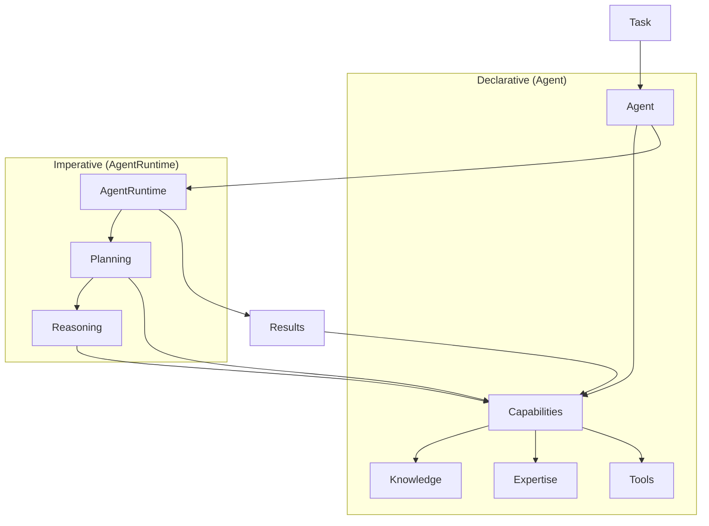
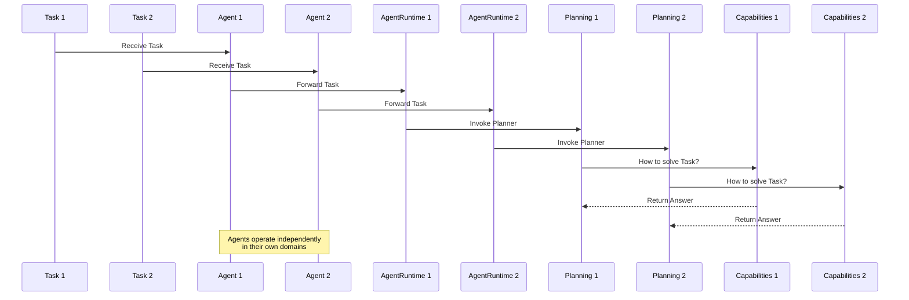
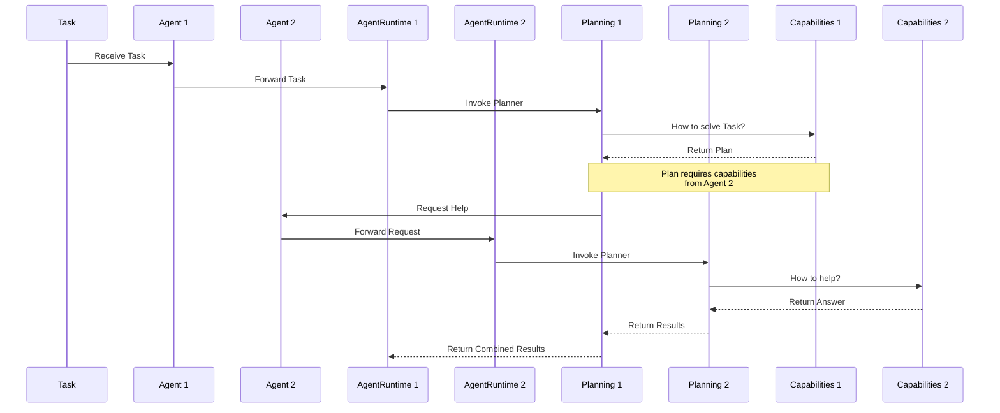
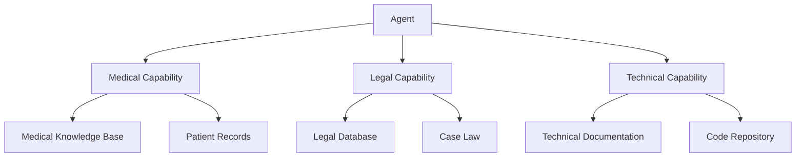

<p align="center">
  
</p>

# OpenDXA - Domain-Expert Agent

The Domain-Expert Agent (OpenDXA) is an intelligent agent architecture designed to tackle complex domain-specific tasks with human-like expertise. At its heart is a unique architecture that combines declarative capabilities with imperative execution through a clear separation of concerns. The framework features advanced memory management with both short-term and long-term memory capabilities, enabling agents to learn from interactions and maintain context over extended periods. It includes robust knowledge-base management for structured storage and retrieval of domain knowledge, with support for versioning, evolution, and integration with external knowledge sources.

## Core Concepts

### Architecture Overview

OpenDXA's architecture is built around two core aspects:

1. **Declarative Aspect (Agent)**
   - Defines what the agent can do
   - Owns and describes capabilities
   - Specifies available knowledge and expertise
   - Receives tasks and objectives

2. **Imperative Aspect (AgentRuntime)**
   - Thin layer connecting Agent to Planning
   - Simply invokes the Planner
   - No additional responsibilities



### Core Components

| Component | Role | Relationship |
|-----------|------|--------------|
| Agent | Declarative/Descriptive | Owns Capabilities, Receives Tasks |
| AgentRuntime | Imperative/Executive | Contains Planning & Reasoning |
| Capabilities | Bridge | Owned by Agent, Used by AgentRuntime |
| Planning | Strategic | Part of AgentRuntime |
| Reasoning | Tactical | Part of AgentRuntime |

## Interaction Patterns

### Basic Interaction Pattern

The heart of OpenDXA is a consistent Planning-Capability interaction pattern:

1. **Basic Interaction Loop**:
   - Planning asks Capability: "How to solve X?"
   - Capability responds with either:
     a. **Direct Answer**: Complete solution (terminal)
     b. **Executable Plan**: Steps to solution (recursive)

2. **Recursive Nature**:
   - For each step in a plan:
     - Same Planning-Capability interaction
     - All resolution through Capabilities
     - Natural termination at direct answers

3. **Key Aspects**:
   - Consistent interaction pattern throughout
   - All knowledge access through Capabilities
   - Fundamental capabilities prevent unnecessary recursion
   - Natural termination at direct answers

### Single Agent Scenarios

#### 1. Simple Task


#### 2. Complex Task


### Multi-Agent Scenarios

OpenDXA supports three main types of multi-agent interactions:

1. **Separate Tasks**
   - Multiple Agents working on different, independent tasks
   - Each Agent operates in its own domain
   - No coordination needed
   - Like different specialists in different fields



2. **Collaborative Tasks**
   - Multiple Agents working together on same task
   - Agents with complementary capabilities
   - Need to coordinate and share knowledge
   - Like a team of specialists working together



3. **Hierarchical Tasks**
   - One Agent delegating to other Agents
   - Parent Agent breaks down task
   - Child Agents handle specific aspects
   - Results flow back up the hierarchy

```mermaid
sequenceDiagram
    participant T as Task
    participant PA as Parent Agent
    participant CA1 as Child Agent 1
    participant CA2 as Child Agent 2
    participant PAR as Parent Runtime
    participant CAR1 as Child Runtime 1
    participant CAR2 as Child Runtime 2
    participant PP as Parent Planning
    participant CP1 as Child Planning 1
    participant CP2 as Child Planning 2

    T->>PA: Receive Task
    PA->>PAR: Forward Task
    PAR->>PP: Invoke Planner
    PP->>PP: Break Down Task
    PP->>CA1: Delegate Subtask 1
    PP->>CA2: Delegate Subtask 2
    CA1->>CAR1: Forward Subtask
    CA2->>CAR2: Forward Subtask
    CAR1->>CP1: Invoke Planner
    CAR2->>CP2: Invoke Planner
    CP1-->>PP: Return Results
    CP2-->>PP: Return Results
    PP-->>PAR: Return Combined Results
```

## Architecture Details

### System Architecture

#### Agent System ([documentation](agent/README.md))

1. **Core Components**
   - Agent - Declarative interface
   - AgentRuntime - Imperative execution
   - Capabilities - Agent abilities and knowledge
   - State System - Execution state management

2. **Key Features**
   - Clear separation of declarative and imperative aspects
   - Capability-based architecture
   - State tracking and persistence
   - Adaptive execution

#### Execution System ([documentation](execution/README.md))

1. **Components**
   - Planning - Strategic decomposition
   - Reasoning - Tactical execution

2. **Key Features**
   - Hierarchical execution
   - Dynamic adaptation
   - Progress tracking
   - Capability utilization

### Motivation

The Agent->Capabilities->Resources architecture provides two key benefits:

1. **Composable Capabilities**
   - An Agent can comprise multiple Capabilities
   - Each Capability represents a distinct area of expertise or functionality
   - Capabilities can be added, removed, or updated independently
   - Enables building specialized agents by combining relevant Capabilities

2. **Hierarchical Knowledge Organization**
   - Capabilities can be hierarchically deep
   - Allows natural division of knowledge bases
   - Enables compartmentalization of expertise
   - Supports both broad and deep knowledge organization
   - Makes it easy to manage and apply knowledge:
     * Knowledge is organized by capability
     * Each capability knows how to apply its knowledge
     * Knowledge updates are localized to relevant capabilities
     * Capabilities can combine knowledge from multiple sources

For example:


## Implementation

### Engineering Approaches

OpenDXA follows three key engineering principles that guide its architecture and implementation:

1. **Progressive Complexity**
   - Start with simple implementations
   - Add complexity incrementally
   - Maintain clarity at each level
   - Enable gradual learning curve

2. **Composable Architecture**
   - Mix and match components
   - Highly customizable agents
   - Flexible integration points
   - Reusable building blocks

3. **Clean Separation of Concerns**
   - Clear component boundaries
   - Well-defined interfaces
   - Minimal dependencies
   - Maintainable codebase

### Implementation Examples

#### Basic Usage

```python
# Simple Q&A
from opendxa.agent import Agent
from opendxa.agent.resource import LLMResource
answer = Agent().ask("What is quantum computing?")
```

#### Workflow Execution

```python
# Basic Workflow Execution
from opendxa.execution import WorkflowExecutor, ExecutionContext
from opendxa.execution.workflow import Workflow
from opendxa.common.graph import NodeType

# Create a workflow
workflow = Workflow(objective="Analyze customer feedback")
workflow.add_node(ExecutionNode(
    node_id="ANALYZE",
    node_type=NodeType.TASK,
    objective="Analyze feedback data"
))

# Set up execution
context = ExecutionContext(
    reasoning_llm=LLMResource(),
    planning_llm=LLMResource(),
    workflow_llm=LLMResource()
)
executor = WorkflowExecutor()
result = await executor.execute(workflow, context)
```

#### Advanced Usage

```python
# Advanced Usage with Custom Workflows
from opendxa.execution import ExecutionNode
from opendxa.common import DXA_LOGGER

# Configure logging
DXA_LOGGER.configure(level=DXA_LOGGER.DEBUG, console=True)

# Create complex workflow with data dependencies
workflow = Workflow(objective="Research quantum computing")
workflow.add_node(ExecutionNode(
    node_id="GATHER",
    node_type=NodeType.TASK,
    objective="Gather research data",
    metadata={"output_key": "research_data"}
))
workflow.add_node(ExecutionNode(
    node_id="ANALYZE",
    node_type=NodeType.TASK,
    objective="Analyze findings",
    metadata={"input_key": "research_data"}
))
workflow.add_edge_between("GATHER", "ANALYZE")
```

## Project Structure

```text
opendxa/
├── agent/                  # Agent system
│   ├── capability/        # Cognitive abilities
│   ├── resource/         # External tools & services
│   ├── io/              # Input/Output handling
│   └── state/           # State management
├── common/               # Shared utilities
│   └── utils/           # Utility functions
│       └── logging.py   # Logging configuration
├── execution/            # Execution system
│   ├── pipeline/       # Pipeline execution
│   │   └── executor.py # WorkflowExecutor
│   ├── planning/       # Strategic planning
│   ├── workflow/       # Process workflows
│   │   └── workflow.py # Workflow implementation
│   └── reasoning/      # Reasoning patterns
└── factory/            # Factory components
```

## Documentation Map

- **Agent System**
  - [Agent Core](agent/README.md) - Factory and runtime
  - [Capabilities](agent/capability/README.md) - Cognitive abilities
  - [Resources](agent/resource/README.md) - Tools and services
  - [IO System](agent/io/README.md) - Environmental interaction
  - [State System](agent/state/README.md) - Execution state management

- **Execution System**
  - [Workflow](execution/workflow/README.md) - Process definition
  - [Planning](execution/planning/README.md) - Strategic planning
  - [Reasoning](execution/reasoning/README.md) - Tactical execution
  - [Pipeline](execution/pipeline/README.md) - Execution orchestration

- [Examples](../examples/README.md) - Usage patterns and tutorials

## Contributing

DXA is proprietary software developed by Aitomatic, Inc. Contributions are limited to authorized Aitomatic employees and contractors. If you're an authorized contributor:

1. Please ensure you have signed the necessary Confidentiality and IP agreements
2. Follow the internal development guidelines
3. Submit your changes through the company's approved development workflow
4. Contact the project maintainers for access to the Contributing Guide

For external users or organizations interested in collaborating with Aitomatic on DXA development, please contact our business development team.

## License

This software is proprietary and confidential. Copyright © 2024 Aitomatic, Inc. All rights reserved.

Unauthorized copying, transfer, or reproduction of this software, via any medium, is strictly prohibited. This software is protected by copyright law and international treaties.

---

<p align="center">
Copyright © 2024 Aitomatic, Inc. All rights reserved.
</p>

<p align="center">
<a href="https://aitomatic.com">https://aitomatic.com</a>
</p>
