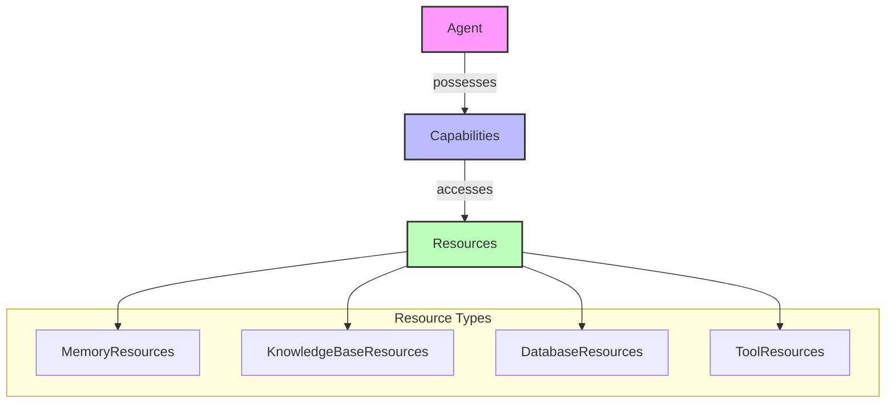
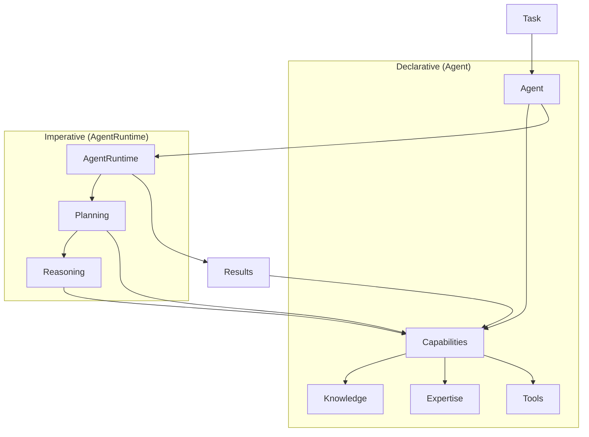

<!-- markdownlint-disable MD041 -->
<!-- markdownlint-disable MD033 -->
<p align="center">
  
</p>

# OpenDXA Agent System

## opendxa.agent Module

The OpenDXA agent system executes tasks through a two-layer architecture:

1. Planning - Converting objectives into executable plans
2. Reasoning - Executing plans and adapting to new information

For detailed information about execution, see the [Execution System](../../base/execution/README.md).

## Design Philosophy

1. Simple things should be simple, complex things should be possible
2. Composition over inheritance
3. Smart defaults with explicit control when needed

## User-Friendly Practices

OpenDXA's agent system is designed with user experience in mind, providing several features that make it easy to use and extend:

1. **Built-in Best Practices**
   - Pre-configured templates
   - Common behavior patterns
   - Optimized defaults
   - Proven configurations

2. **Resource Management**
   - Robust error handling
   - Multiple transport types
   - Automatic cleanup
   - State persistence

3. **Comprehensive Testing**
   - Unit test support
   - Integration testing
   - Performance benchmarks
   - Error scenario coverage

4. **Documentation-First**
   - Clear API documentation
   - Usage examples
   - Best practices
   - Troubleshooting guides

## Agent Factory

The OpenDXA framework provides a factory pattern for creating agents with common configurations. This simplifies agent creation while maintaining access to OpenDXA's full capabilities.

### Why Use AgentFactory

- Simplifies common agent creation patterns
- Provides tested, optimized configurations
- Maintains consistent initialization across applications
- Enables quick starts with progressive enhancement

### Core Concepts

1. **Agents** - The core execution units that:
   - Possess capabilities to perform tasks
   - Manage access to resources
   - Execute workflows and plans
   - Maintain state and context

2. **Capabilities** - What an agent can do:
   - Higher-level cognitive functions
   - Composed of resources + specific cognition
   - Examples: Memory, Domain Expertise, Planning, Reasoning
   - Each capability combines resources with specialized logic
   - An agent can have multiple capabilities working together
   - Capabilities can share and reuse the same resources

3. **Resources** - What capabilities have access to:
   - MemoryResources (short-term and long-term memory)
   - KnowledgeBaseResources (domain knowledge, facts)
   - DatabaseResources (structured data storage)
   - ToolResources (APIs, external services)
   - ModelResources (LLMs, specialized ML models)
   - InterfaceResources (I/O handlers, communication channels)
   - Resources can be accessed by multiple capabilities
   - Resources provide raw functionality that capabilities build upon

4. **Relationship**:
   - Agents possess capabilities
   - Capabilities access resources to perform their functions
   - Multiple capabilities can share the same resources
   - A single agent can combine multiple capabilities to achieve complex tasks
   - Resources provide the foundation for capabilities to operate
   - Capabilities orchestrate resources to achieve specific goals

### Architecture Overview



### Usage

```python
from dxa.agent import Agent
from dxa.agent.resource import LLMResource
from dxa.base.execution import PlanStrategy, ReasoningStrategy

# Simple task execution
answer = Agent().ask("What is quantum computing?")

# Research task with resources
agent = Agent(name="researcher").with_llm(LLMResource())
result = agent.execute(
    objective="Research quantum computing",
    plan_strategy=PlanStrategy.SEQUENTIAL,
    reasoning_strategy=ReasoningStrategy.CHAIN_OF_THOUGHT
)

# Custom task execution
agent = Agent(name="custom_agent").with_llm(LLMResource())
result = agent.execute(
    objective="Research and synthesize findings",
    plan_strategy=PlanStrategy.HIERARCHICAL,
    reasoning_strategy=ReasoningStrategy.DOMAIN_SPECIFIC
)
```

## Execution System

Agents execute tasks through a two-layer architecture:



1. **Planning**
   - Convert objectives to executable plans
   - Allocate required resources
   - Set up execution state

2. **Reasoning**
   - Execute plans
   - Track progress
   - Handle state changes
   - Adapt to new information

3. **Resources**
   - Manage LLM interactions
   - Control tool access
   - Handle I/O operations

## Resource Integration

```python
from dxa.agent import Agent
from dxa.agent.resource import LLMResource, HumanResource

# Configure agent with resources
agent = Agent(name="assistant")\
    .with_llm(LLMResource(config={"model": "openai:gpt-4"}))\
    .with_resources({
        "human": HumanResource(name="user")
    })

# Resources are available during execution
result = agent.execute(
    objective="Assist with task",
    plan_strategy=PlanStrategy.DEFAULT,
    reasoning_strategy=ReasoningStrategy.DEFAULT
)
```

### Domain-Specific Tasks

```python
from dxa.agent import Agent
from dxa.agent.resource import LLMResource
from dxa.base.execution import PlanStrategy, ReasoningStrategy

# Advanced planning and reasoning configuration
agent = Agent(name="optimizer")\
    .with_llm(LLMResource())\
    .with_planning(PlanStrategy.HIERARCHICAL)\
    .with_reasoning(ReasoningStrategy.DOMAIN_SPECIFIC)

result = agent.execute(
    objective="Optimize system performance",
    plan_strategy=PlanStrategy.HIERARCHICAL,
    reasoning_strategy=ReasoningStrategy.DOMAIN_SPECIFIC
)
```

## Runtime System

The agent runtime manages execution flow and state:

```python
# Using the agent as an async context manager
async with agent as runtime_agent:
    result = await runtime_agent.async_execute(
        objective="Process task",
        plan_strategy=PlanStrategy.DEFAULT,
        reasoning_strategy=ReasoningStrategy.DEFAULT
    )

# Manual initialization and cleanup
await agent.initialize()
result = await agent.async_execute(
    objective="Process task",
    plan_strategy=PlanStrategy.DEFAULT,
    reasoning_strategy=ReasoningStrategy.DEFAULT
)
await agent.cleanup()
```

## Key Design Principles

1. **Single Source of Truth**
   - One state object accessed by all components
   - Clear ownership and update patterns
   - Atomic state transitions

2. **History Tracking**
   - Evolution of objectives and plans
   - Timestamps for all changes
   - Reasons for state transitions

3. **Execution Context**
   - Track active work
   - Record step results
   - Monitor resource usage via [I/O System](io/README.md)

## Usage Patterns

Planning and Reasoning layers interact with state through well-defined interfaces:

- Planning reads/writes objectives and plans
- Reasoning reads plans and writes results
- Both can trigger state transitions based on new information

See [Capability System](capability/README.md) for higher-level state operations.

Would you like me to elaborate on any aspect of this design?

## Configuration

Agents can be configured through:

1. Construction parameters
2. Resource configuration
3. Runtime settings
4. State preferences

## Error Handling

Agents provide:

- Automatic retries
- Resource cleanup
- State preservation
- Error recovery

## See Also

- [Execution System](../../base/execution/README.md)
- [Resource System](resource/README.md)
- [Capability System](capability/README.md)
- [Examples](../../examples/README.md)

---

<p align="center">
Copyright © 2025 Aitomatic, Inc. Licensed under the MIT License.
</p>

<p align="center">
<a href="https://aitomatic.com">https://aitomatic.com</a>
</p>
