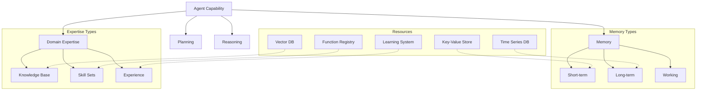

<!-- markdownlint-disable MD041 -->
<!-- markdownlint-disable MD033 -->
<p align="center">
  
</p>

# Agent Capability System

The Agent Capability System builds upon the base capability framework to provide specialized, domain-specific capabilities for OpenDXA agents. It extends the foundational interfaces with concrete implementations, advanced resource management, and domain expertise integration.

## Overview

The Agent Capability System provides:

- Specialized capability implementations
- Advanced resource management
- Domain expertise integration
- Memory and knowledge management
- Capability composition and orchestration



## Key Components

### 1. Memory Capability

The memory capability provides different types of memory management:

```python
class MemoryCapability(BaseCapability):
    """Memory management capability for agents."""
    
    async def initialize(self, config):
        self.short_term = VolatileStore(config.get("short_term", {}))
        self.long_term = PersistentStore(config.get("long_term", {}))
        self.working = WorkingMemory(config.get("working", {}))
        
    async def store(self, key: str, value: Any, memory_type: str = "auto"):
        """Store information with automatic memory type selection."""
        if memory_type == "auto":
            memory_type = self._determine_memory_type(value)
        await getattr(self, memory_type).store(key, value)
```

### 2. Domain Expertise

Domain expertise capabilities integrate specialized knowledge:

```python
class DomainExpertise(BaseCapability):
    """Domain-specific expertise capability."""
    
    async def initialize(self, config):
        self.knowledge = VectorDB(config.get("knowledge_base"))
        self.skills = FunctionRegistry(config.get("skills"))
        self.experience = ExperienceTracker(config.get("experience"))
        
    async def apply_expertise(self, task: Task) -> Solution:
        """Apply domain knowledge to solve task."""
        relevant = await self.knowledge.search(task.context)
        solution = await self.skills.execute(task.action, relevant)
        await self.experience.record(task, solution)
        return solution
```

### 3. Capability Composition

Capabilities can be composed to create more complex behaviors:

```python
class CompositeCapability(BaseCapability):
    """Capability that combines multiple capabilities."""
    
    async def initialize(self, config):
        self.capabilities = {}
        for cap_name, cap_config in config.get("capabilities", {}).items():
            self.capabilities[cap_name] = await self._initialize_capability(
                cap_name,
                cap_config
            )
            
    async def apply(self, context):
        results = {}
        for name, capability in self.capabilities.items():
            results[name] = await capability.apply(context)
        return self._combine_results(results)
```

## Usage Guide

### Basic Memory Operations

```python
# Simple memory usage
agent = Agent("assistant")\
    .with_memory()  # Default memory configuration

# Store and recall
await agent.memory.store("user_preference", "dark_mode")
preference = await agent.memory.recall("user_preference")

# Short-term memory automatically manages relevance
await agent.memory.short_term.add("current_context", context)
```

### Domain Expertise

```python
# Specialized knowledge domain
agent = Agent("medical_assistant")\
    .with_expertise("medical", {
        "knowledge_base": {
            "type": "vector_db",
            "config": {"index": "medical_corpus"}
        },
        "credentials": ["general_practice"],
        "specializations": ["diagnosis", "treatment"]
    })

# Expert reasoning
result = await agent.run({
    "task": "diagnose",
    "symptoms": symptoms_list,
    "context": patient_history
})
```

### Capability Composition

```python
# Create a composite capability
class AnalysisCapability(CompositeCapability):
    def __init__(self):
        super().__init__({
            "capabilities": {
                "memory": {"type": "memory"},
                "expertise": {"type": "domain_expertise"},
                "reasoning": {"type": "reasoning"}
            }
        })
        
    async def analyze(self, data):
        # Use composed capabilities
        context = await self.capabilities["memory"].get_context()
        expertise = await self.capabilities["expertise"].apply_expertise(data)
        result = await self.capabilities["reasoning"].reason(expertise, context)
        return result
```

## Best Practices

1. **Memory Management**
   - Use appropriate memory types
   - Implement decay strategies
   - Maintain context relevance
   - Clean up stale data

2. **Expertise Development**
   - Define clear domains
   - Validate knowledge bases
   - Test skill implementations
   - Track performance

3. **Resource Integration**
   - Compose capabilities cleanly
   - Handle resource dependencies
   - Manage state properly
   - Monitor usage patterns

4. **Capability Composition**
   - Design for reusability
   - Maintain clear boundaries
   - Handle dependencies
   - Manage complexity

## Integration with Base Framework

The agent capability system extends the base capability framework (`opendxa.base.capability`) by providing:

- Concrete implementations of base interfaces
- Specialized capability types
- Advanced resource management
- Domain-specific functionality

For more information on the foundational interfaces, see the [Base Capability Documentation](../base/capability/README.md).

---

<p align="center">
Copyright © 2024 Aitomatic, Inc. All rights reserved.
</p>

<p align="center">
<a href="https://aitomatic.com">https://aitomatic.com</a>
</p>
