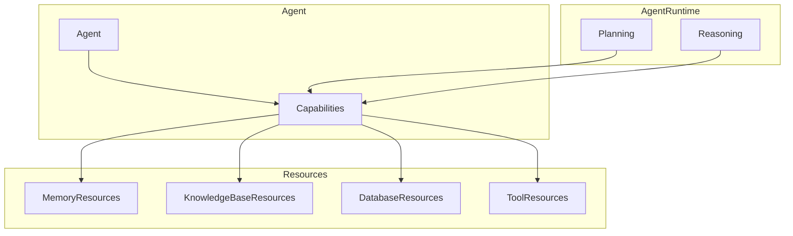

<!-- markdownlint-disable MD041 -->
<!-- markdownlint-disable MD033 -->
<p align="center">
  
</p>

# Agent Capability System

The Agent Capability System provides the bridge between Agents and Resources, enabling agents to access and utilize various resources through well-defined capabilities. Capabilities serve as the interface through which Planning and Reasoning interact with Resources.

## Overview

The Agent Capability System provides:

- Resource access through capabilities
- Knowledge and expertise integration
- Memory management
- Tool access and execution
- Capability composition and orchestration



## Key Components

### 1. Memory Capability

The memory capability provides access to memory resources:

```python
class MemoryCapability(BaseCapability):
    """Memory management capability for agents."""
    
    async def initialize(self, config):
        self.memory = MemoryResource(config)
        
    async def store(self, key: str, value: Any):
        """Store information in memory."""
        await self.memory.store(key, value)
        
    async def recall(self, key: str) -> Any:
        """Recall information from memory."""
        return await self.memory.recall(key)
```

### 2. Knowledge Capability

Knowledge capabilities provide access to knowledge base resources:

```python
class KnowledgeCapability(BaseCapability):
    """Knowledge access capability."""
    
    async def initialize(self, config):
        self.knowledge = KnowledgeBaseResource(config)
        
    async def query(self, query: str) -> List[Knowledge]:
        """Query knowledge base."""
        return await self.knowledge.search(query)
```

### 3. Tool Capability

Tool capabilities provide access to external tools and services:

```python
class ToolCapability(BaseCapability):
    """Tool access capability."""
    
    async def initialize(self, config):
        self.tools = ToolResource(config)
        
    async def execute(self, tool_name: str, params: Dict) -> Any:
        """Execute a tool with parameters."""
        return await self.tools.execute(tool_name, params)
```

## Usage Guide

### Basic Capability Usage

```python
# Configure agent with capabilities
agent = Agent("assistant")\
    .with_capability("memory", MemoryCapability())\
    .with_capability("knowledge", KnowledgeCapability())\
    .with_capability("tools", ToolCapability())

# Capabilities are accessed through planning and reasoning
result = await agent.execute(
    objective="Answer question",
    plan_strategy=PlanStrategy.DEFAULT,
    reasoning_strategy=ReasoningStrategy.DEFAULT
)
```

### Resource Access

```python
# Access resources through capabilities
memory = agent.capabilities["memory"]
knowledge = agent.capabilities["knowledge"]
tools = agent.capabilities["tools"]

# Use resources
await memory.store("context", current_context)
facts = await knowledge.query("relevant facts")
result = await tools.execute("calculator", {"operation": "add", "values": [1, 2]})
```

### Capability Composition

```python
# Create a composite capability
class AnalysisCapability(BaseCapability):
    def __init__(self):
        super().__init__()
        self.memory = MemoryCapability()
        self.knowledge = KnowledgeCapability()
        self.tools = ToolCapability()
        
    async def analyze(self, data):
        # Use multiple capabilities
        context = await self.memory.recall("current_context")
        facts = await self.knowledge.query(data)
        result = await self.tools.execute("analyzer", {"data": data, "context": context})
        return result
```

## Best Practices

1. **Resource Access**
   - Access resources only through capabilities
   - Handle resource errors gracefully
   - Clean up resources when done
   - Monitor resource usage

2. **Capability Design**
   - Define clear interfaces
   - Handle resource dependencies
   - Manage state properly
   - Document usage patterns

3. **Composition**
   - Design for reusability
   - Maintain clear boundaries
   - Handle dependencies
   - Manage complexity

## Integration with Base Framework

The agent capability system extends the base capability framework by providing:

- Resource access through capabilities
- Integration with Planning and Reasoning
- Standardized resource interfaces
- Capability composition patterns

For more information on the foundational interfaces, see the [Base Capability Documentation](../base/capability/README.md).

## License

This project is licensed under the MIT License - see the [LICENSE](../../LICENSE) file for details.

---

<p align="center">
<a href="https://aitomatic.com">https://aitomatic.com</a>
</p>
