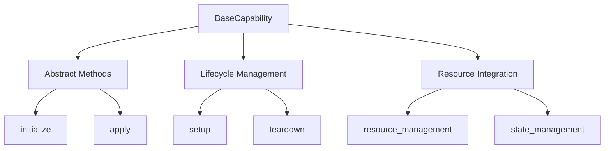

<!-- markdownlint-disable MD041 -->
<!-- markdownlint-disable MD033 -->
<p align="center">
  
</p>

[Project Overview](../../../README.md) | [Main Documentation](../../../docs/README.md)

# Base Capability Framework

The Base Capability framework provides the foundational interfaces and abstractions for building capabilities in the OpenDXA system. It defines the core structure and behavior that all capabilities must implement, ensuring consistency and interoperability across the framework.

## Overview

The Base Capability framework serves as the foundation for all specialized capabilities in OpenDXA. It provides:

- Core interfaces and abstract classes
- Standardized capability lifecycle
- Basic capability management
- Resource integration patterns



## Key Components

### 1. BaseCapability Class

The `BaseCapability` class defines the fundamental interface that all capabilities must implement:

```python
class BaseCapability:
    """Base class for all capabilities in OpenDXA."""
    
    async def initialize(self, config: Dict[str, Any]) -> None:
        """Initialize the capability with configuration.
        
        Args:
            config: Configuration dictionary for the capability
        """
        raise NotImplementedError
        
    async def apply(self, context: Context) -> Result:
        """Apply the capability in the given context.
        
        Args:
            context: Execution context for the capability
            
        Returns:
            Result of applying the capability
        """
        raise NotImplementedError
```

### 2. Capability Lifecycle

The framework defines a standard lifecycle for capabilities:

1. **Initialization**
   - Configuration loading
   - Resource setup
   - State initialization

2. **Execution**
   - Context processing
   - Resource utilization
   - Result generation

3. **Cleanup**
   - Resource release
   - State cleanup
   - Error handling

### 3. Resource Integration

The base framework provides patterns for resource integration:

```python
class ResourceAwareCapability(BaseCapability):
    """Capability that requires specific resources."""
    
    def __init__(self):
        self.resources = {}
        
    async def initialize(self, config):
        # Initialize required resources
        for resource_name, resource_config in config.get("resources", {}).items():
            self.resources[resource_name] = await self._initialize_resource(
                resource_name,
                resource_config
            )
```

## Usage Guide

### Creating a Base Capability

```python
from opendxa.base.capability import BaseCapability

class MyBaseCapability(BaseCapability):
    async def initialize(self, config):
        # Initialize your capability
        self.config = config
        
    async def apply(self, context):
        # Implement your capability logic
        return await self._process_context(context)
```

### Extending Base Capability

```python
class SpecializedCapability(BaseCapability):
    async def initialize(self, config):
        await super().initialize(config)
        # Add specialized initialization
        
    async def apply(self, context):
        # Add specialized processing
        base_result = await super().apply(context)
        return await self._specialize_result(base_result)
```

## Best Practices

1. **Interface Compliance**
   - Implement all required methods
   - Follow method signatures
   - Handle errors appropriately

2. **Resource Management**
   - Initialize resources properly
   - Clean up resources
   - Handle resource errors

3. **State Management**
   - Maintain consistent state
   - Handle state transitions
   - Clean up state properly

4. **Error Handling**
   - Define clear error types
   - Provide meaningful messages
   - Handle errors gracefully

## Integration with Agent Capabilities

The base capability framework is designed to be extended by the agent capability system (`opendxa.agent.capability`). While this framework provides the foundation, the agent capability system adds:

- Higher-level abstractions
- Domain-specific implementations
- Advanced resource management
- Specialized capabilities

For more information on building specialized capabilities, see the [Agent Capability Documentation](../agent/capability/README.md).

---
<p align="center">
Copyright © 2024 Aitomatic, Inc. Licensed under the [MIT License](../../../LICENSE.md).
<br/>
<a href="https://aitomatic.com">https://aitomatic.com</a>
</p>
