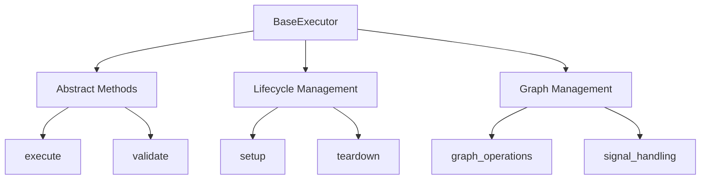

<!-- markdownlint-disable MD041 -->
<!-- markdownlint-disable MD033 -->
<p align="center">
  
</p>

# Base Execution Framework

The Base Execution framework provides the foundational interfaces and abstractions for executing tasks in the OpenDXA system. It defines the core structure and behavior that all execution components must implement, ensuring consistency and interoperability across the framework.

## Overview

The Base Execution framework serves as the foundation for all specialized execution components in OpenDXA. It provides:

- Core interfaces and abstract classes
- Standardized execution lifecycle
- Basic execution management
- Execution graph structure
- Signal-based communication



## Key Components

### 1. BaseExecutor Class

The `BaseExecutor` class defines the fundamental interface that all executors must implement:

```python
class BaseExecutor:
    """Base class for all executors in OpenDXA."""
    
    async def execute(self, context: ExecutionContext) -> ExecutionResult:
        """Execute the task in the given context.
        
        Args:
            context: Execution context containing state and resources
            
        Returns:
            Result of the execution
        """
        raise NotImplementedError
        
    async def validate(self, context: ExecutionContext) -> bool:
        """Validate the execution context.
        
        Args:
            context: Execution context to validate
            
        Returns:
            True if the context is valid
        """
        raise NotImplementedError
```

### 2. Execution Graph

The framework provides the base structure for execution graphs:

```python
class ExecutionGraph:
    """Base class for execution graphs."""
    
    def __init__(self, objective: str):
        self.objective = objective
        self.nodes = {}
        self.edges = {}
        
    def add_node(self, node: ExecutionNode) -> None:
        """Add a node to the graph."""
        self.nodes[node.node_id] = node
        
    def add_edge(self, edge: ExecutionEdge) -> None:
        """Add an edge to the graph."""
        self.edges[edge.edge_id] = edge
```

### 3. Execution Context

The execution context manages state and resources:

```python
class ExecutionContext:
    """Context for execution containing state and resources."""
    
    def __init__(self, resources: Dict[str, Any] = None):
        self.resources = resources or {}
        self.state = ExecutionState()
        self.signals = []
        
    async def get_resource(self, name: str) -> Any:
        """Get a resource by name."""
        return self.resources.get(name)
```

**Note:** For a detailed explanation of how `ExecutionContext` manages state and facilitates data flow between execution steps using `StateManager` and `ExecutionContextHelper`, please see the [Execution Context State Management and Data Flow](./CONTEXT_DATA_FLOW.md) documentation.

### 4. Execution Signal

Standardized communication between components:

```python
@dataclass
class ExecutionSignal:
    """Signal for execution communication."""
    type: ExecutionSignalType
    result: Dict[str, Any]
    metadata: Dict[str, Any] = field(default_factory=dict)
```

## Usage Guide

### Creating a Base Executor

```python
from opendxa.base.execution import BaseExecutor, ExecutionContext

class MyBaseExecutor(BaseExecutor):
    async def execute(self, context: ExecutionContext) -> ExecutionResult:
        # Execute your task
        result = await self._process_task(context)
        return ExecutionResult(
            success=True,
            data=result
        )
        
    async def validate(self, context: ExecutionContext) -> bool:
        return await self._validate_context(context)
```

### Using Execution Graph

```python
from opendxa.base.execution import ExecutionGraph, ExecutionNode, ExecutionEdge
from opendxa.common.graph import NodeType

# Create a graph
graph = ExecutionGraph(objective="Process data")

# Add nodes
graph.add_node(ExecutionNode(
    node_id="START",
    node_type=NodeType.START
))
graph.add_node(ExecutionNode(
    node_id="PROCESS",
    node_type=NodeType.TASK
))

# Add edges
graph.add_edge(ExecutionEdge(
    edge_id="START_TO_PROCESS",
    source="START",
    target="PROCESS"
))
```

## Best Practices

1. **Interface Compliance**
   - Implement all required methods
   - Follow method signatures
   - Handle errors appropriately

2. **Graph Management**
   - Maintain graph consistency
   - Handle dependencies properly
   - Validate graph structure

3. **State Management**
   - Maintain consistent state
   - Handle state transitions
   - Clean up state properly

4. **Signal Handling**
   - Use appropriate signal types
   - Handle signals properly
   - Maintain signal context

## Integration with Execution System

The base execution framework is designed to be extended by the execution system (`opendxa.execution`). While this framework provides the foundation, the execution system adds:

- Higher-level abstractions
- Specialized implementations
- Advanced execution patterns
- Domain-specific functionality

For more information on building specialized execution components, see the [Execution System Documentation](../execution/README.md). 