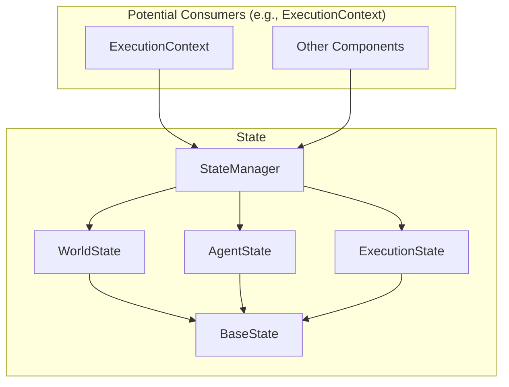
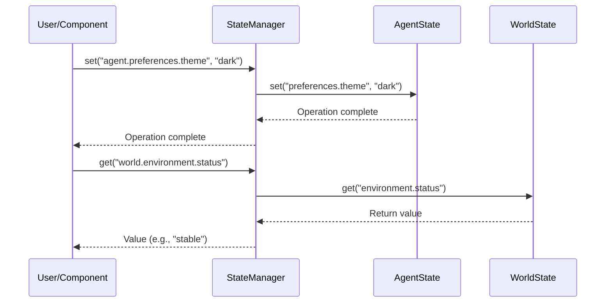
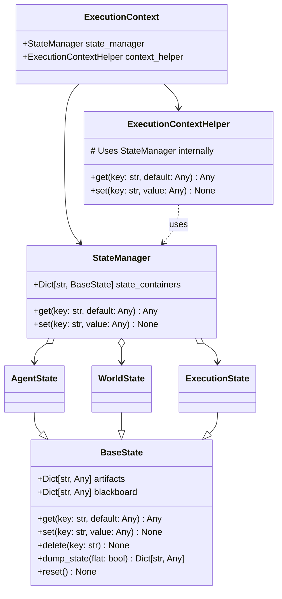
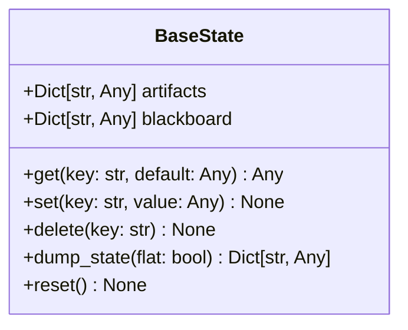
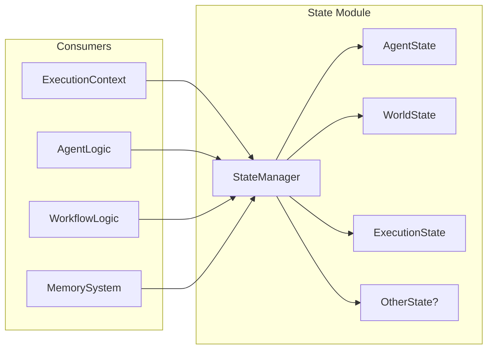

<p align="center">
  
</p>

[Project Overview](../../../README.md) | [Main Documentation](../../../docs/README.md)

# OpenDXA State Management

The state management module in OpenDXA provides a robust foundation for managing and maintaining state across the framework. It implements a flexible and extensible state management system that supports both simple and complex state requirements.

## Overview

The state management system is built around the `BaseState` class, which provides core functionality for state storage, retrieval, and manipulation. It also includes a `StateManager` that acts as a unified interface for accessing different state containers (`AgentState`, `WorldState`, `ExecutionState`) using a prefix-based system. The system features:

- **Blackboard Pattern**: A shared knowledge space (`blackboard` field in `BaseState`) for storing and accessing structured state.
- **Artifact Storage**: A dictionary (`artifacts` field in `BaseState`) for storing arbitrary, non-structured data.
- **Dot Notation Access**: Intuitive access to nested state within the `blackboard` using dot notation (e.g., "user.preferences.theme").
- **Prefix-Based Routing**: `StateManager` routes access to the correct state container based on a key prefix (e.g., "agent.", "world.").
- **Type Safety**: Built on Pydantic for robust type checking and validation.
- **Flexible Storage**: Support for both flat and nested state structures within the blackboard.

For example, imagine a workflow where one node asks the user for their name and stores it in the agent's state (`state_manager.set("agent.user.name", user_input)`). A subsequent node can then retrieve this name (`state_manager.get("agent.user.name")`) to personalize a greeting, demonstrating how state facilitates communication and data flow between different processing steps.

### State Management Architecture



*Diagram Note: `ExecutionContext` typically resides outside this module and uses `StateManager` to interact with the various state objects.*

### State Access Patterns via StateManager



## Key State Classes

The state management system includes several specialized state classes that are integrated into the `ExecutionContext`:

1. **BaseState**: The foundation class providing core state management functionality
   - Manages artifacts and blackboard storage
   - Provides dot notation access to state
   - Supports state dumping and reset operations

2. **AgentState**: Tracks agent-specific state
   - Manages agent's internal state and progress
   - Stores agent preferences and configurations
   - Maintains agent-specific artifacts

3. **WorldState**: Represents the external environment state
   - Tracks environment status and changes
   - Manages available resources and constraints
   - Stores world-related artifacts

4. **ExecutionState**: Manages execution-specific state
   - Tracks current execution status
   - Records node execution results
   - Maintains execution history and path
   - Manages visited nodes and their outcomes

5. **StateManager**: Provides a unified interface for state access
   - Routes `get` and `set` operations based on prefixes (e.g., "agent", "world")
   - Can register custom state handlers for specific prefixes
   - Used by components like `ExecutionContext` to interact with state

### State Integration (Conceptual Example with ExecutionContext)

*Note: `ExecutionContext` and `ExecutionContextHelper` are typically defined outside this state module.*



The `ExecutionContext` typically holds an instance of `StateManager` and may provide helper methods (like `ExecutionContextHelper`) that use the `StateManager` internally. The `StateManager` routes requests to the appropriate state container (`AgentState`, `WorldState`, `ExecutionState`) based on the key prefix.

## Key Components

### BaseState

The `BaseState` class is the foundation of the state management system, providing:

- **Artifacts Storage**: A dictionary for storing arbitrary artifacts
- **Blackboard**: A shared space for structured state data
- **Dot Notation Operations**: Methods for getting, setting, and deleting state using dot notation
- **State Dumping**: Capability to export state in both flat and nested formats
- **State Reset**: Ability to reset state to initial values

### StateManager

The `StateManager` class (`state_manager.py`) acts as a central hub for accessing different state containers.

- **Prefix Routing**: Directs `get` and `set` calls to the correct `BaseState` instance (e.g., `AgentState`, `WorldState`) based on the first part of the key (e.g., `agent.name` routes to `AgentState`).
- **State Containers**: Holds references to the actual state objects (`AgentState`, `WorldState`, `ExecutionState`, etc.).
- **Custom Handlers**: Supports registering specific functions to handle `get` or `set` operations for certain prefixes, allowing for custom logic beyond simple storage.
- **Unified Interface**: Provides `get(key, default)` and `set(key, value)` methods for consistent state interaction.

### Blackboard vs Artifacts

- **`blackboard`**: Intended for structured, nested data that can be accessed via dot notation. Use this for configuration, status, results, etc.
- **`artifacts`**: Intended for arbitrary data blobs, files, or complex objects that don't fit neatly into the dot-notation structure.

### State Structure



## Usage Examples

```python
from opendxa.base.state import BaseState

# Create a new state instance
state = BaseState()

# Set values using dot notation
state.set("user.preferences.theme", "dark")
state.set("user.preferences.language", "en")

# Get values using dot notation
theme = state.get("user.preferences.theme")  # Returns "dark"
language = state.get("user.preferences.language")  # Returns "en"

# Delete values
state.delete("user.preferences.theme")

# Dump state
nested_state = state.dump_state()  # Returns nested dictionary
flat_state = state.dump_state(flat=True)  # Returns flattened dictionary with dot notation keys

# Reset state
state.reset()  # Resets all fields to their default values

# Create state instances
agent_state = AgentState()
world_state = WorldState()
exec_state = ExecutionState()

# Create a StateManager
state_manager = StateManager(
    state_containers={
        "agent": agent_state,
        "world": world_state,
        "exec": exec_state
    }
)

# Set values using StateManager and prefixes
state_manager.set("agent.preferences.theme", "dark")
state_manager.set("world.location.city", "London")
state_manager.set("exec.status", ExecutionStatus.RUNNING) # Assuming ExecutionStatus enum is imported

# Get values using StateManager
theme = state_manager.get("agent.preferences.theme")  # Returns "dark"
city = state_manager.get("world.location.city")  # Returns "London"
status = state_manager.get("exec.status") # Returns ExecutionStatus.RUNNING

# Direct access to BaseState methods is still possible if needed
agent_name = agent_state.get("preferences.theme") # Returns "dark"
world_state.set("weather.condition", "cloudy")

# Dump state (from a specific state container)
nested_agent_state = agent_state.dump_state() 
flat_agent_state = agent_state.dump_state(flat=True) 

# Reset state (on a specific state container)
agent_state.reset() 

#### Passing Data Between Execution Steps (e.g., Plan Nodes)

A common use case for state management is passing information generated in one step of a process (like a node in an execution plan) to a subsequent step. Components can use the `StateManager` to store results or intermediate data in a shared state container (often `AgentState`'s blackboard using a specific key prefix like `agent.scratchpad.` or `agent.intermediate_results.`). Later steps can then retrieve this data using the same key via the `StateManager`.

This allows for building complex workflows where nodes depend on the output of previous nodes. For example, one node might fetch user details and store them under `agent.user.details`, and a later node could retrieve these details using `state_manager.get("agent.user.details")` to personalize a response.

### Cross-Node State Example (Conceptual)

# Assume state_manager is already initialized as above, typically part of an ExecutionContext

# --- Simulation of Node A Execution --- 
def execute_node_a(state_manager: StateManager):
    # Node A calculates something or gets a result
    intermediate_result = "result_from_node_a"
    print(f"Node A: Calculated result: {intermediate_result}")
    
    # Store the result using the StateManager, likely in ExecutionState or AgentState blackboard
    # Option 1: Storing in ExecutionState node_results (common for direct outputs)
    # state_manager.set("exec.node_results.node_a", intermediate_result) 
    
    # Option 2: Storing in a general agent scratchpad area within the blackboard
    state_manager.set("agent.scratchpad.node_a_output", intermediate_result)
    print("Node A: Stored result in agent.scratchpad.node_a_output")

# --- Simulation of Node B Execution --- 
def execute_node_b(state_manager: StateManager):
    # Node B needs the result from Node A
    print("\nNode B: Attempting to retrieve result from Node A...")
    
    # Retrieve the value using the same key via StateManager
    retrieved_result = state_manager.get("agent.scratchpad.node_a_output")
    
    if retrieved_result:
        print(f"Node B: Successfully retrieved result: {retrieved_result}")
        # Node B can now use the retrieved_result for its logic
    else:
        print("Node B: Failed to retrieve result from Node A.")

# --- Running the simulation ---
print("--- Executing Node A ---")
execute_node_a(state_manager)

print("\n--- Executing Node B ---")
execute_node_b(state_manager)

# You can also inspect the state directly (if needed)
# print("\nFinal Agent State Blackboard:", agent_state.dump_state()) 
```

## Design Principles

1. **Simplicity**: Easy to use with intuitive dot notation access via `BaseState` and prefix-based routing via `StateManager`.
2. **Flexibility**: Supports both simple and complex state structures (`blackboard`) and arbitrary data (`artifacts`).
3. **Type Safety**: Built on Pydantic for robust type checking.
4. **Extensibility**: `BaseState` can be extended; `StateManager` allows custom handlers.
5. **Encapsulation**: `StateManager` provides a single point of access, decoupling components from specific state implementations.
6. **Thread Safety**: `BaseState` operations on the underlying dictionaries are generally thread-safe for atomic operations, but complex multi-step operations might require external locking depending on usage.

## Integration

The state management system, primarily through the `StateManager`, integrates with other OpenDXA components:

- **ExecutionContext**: Uses `StateManager` to manage and access `AgentState`, `WorldState`, and `ExecutionState` during runs.
- **Agents**: Maintains agent-specific state
- **Workflows**: Tracks workflow execution state
- **Knowledge Base**: Manages knowledge base state and metadata
- **Memory Systems**: State objects can be persisted or loaded as part of memory management.

### Integration Flow (Conceptual)



*Components interact with the `StateManager`, which routes requests to the appropriate underlying state container.*

## Best Practices

1. **Use StateManager**: Interact with state primarily through `StateManager` (often via `ExecutionContext`) for consistency and proper routing.
2. **Prefix Clarity**: Use clear and consistent prefixes for different state containers.
3. **Blackboard for Structure**: Use the `blackboard` for structured data accessible via dot notation.
4. **Artifacts for Blobs**: Use `artifacts` for larger, opaque data or file-like objects.
5. **Type Safety**: Always use type hints when extending BaseState
6. **State Isolation**: Keep different types of state separate using appropriate prefixes
7. **Error Handling**: Always handle potential KeyError exceptions when accessing state
8. **State Reset**: Implement proper cleanup in reset() when extending BaseState

## Contributing

Contributions to the state management system should:

1. Maintain backward compatibility
2. Follow the existing design patterns
3. Include comprehensive tests
4. Update documentation as needed
5. Follow the project's coding standards 

---

<p align="center">
Copyright © 2024 Aitomatic, Inc. Licensed under the [MIT License](../../../LICENSE.md).
<br/>
<a href="https://aitomatic.com">https://aitomatic.com</a>
</p> 