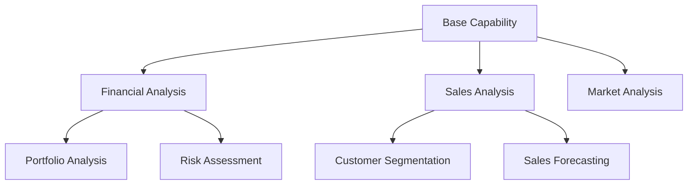
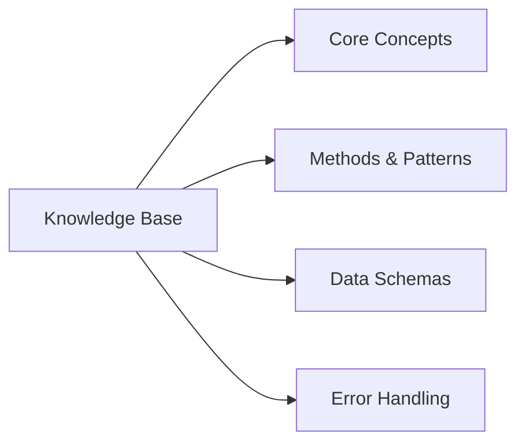
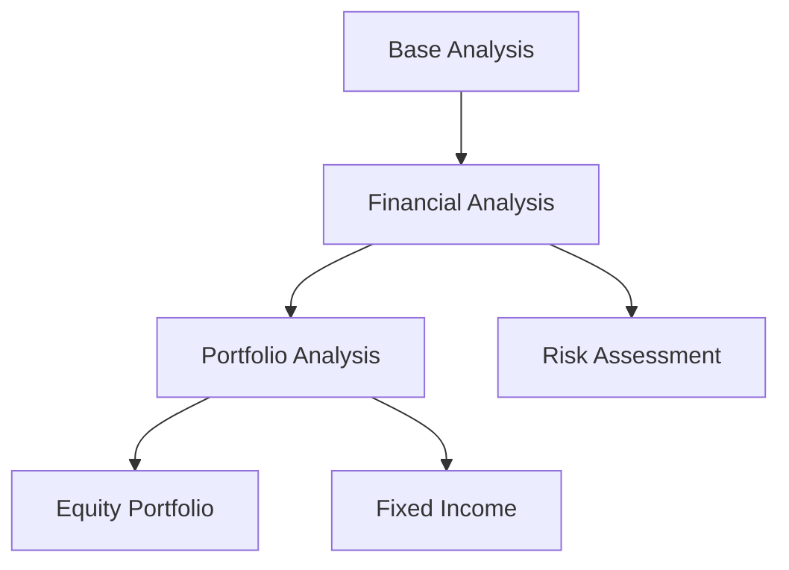

<!-- markdownlint-disable MD041 -->
<!-- markdownlint-disable MD033 -->
<p align="center">
  
</p>

# DXA Capability Framework

The Capability framework provides a structured way to create and manage domain-specific knowledge and functionality in the DXA system. It enables the creation of specialized capabilities that build upon base knowledge while maintaining clear boundaries and consistent behavior.

## Overview

A Capability is a self-contained unit of domain expertise that can be specialized for specific use cases. The framework provides:

- Structured knowledge management
- Specialization mechanisms
- Consistent behavior patterns
- Clear domain boundaries



## Key Concepts

### 1. Knowledge Base

Each capability maintains its own knowledge base, structured for optimal LLM processing:



- **Core Concepts**: Essential domain knowledge
- **Methods & Patterns**: Common approaches and solutions
- **Data Schemas**: Input/output expectations
- **Error Handling**: Common pitfalls and recovery strategies

### 2. Specialization

Capabilities can be specialized to handle specific domains or use cases:



Specialization allows:
- Extending base knowledge
- Refining behavior
- Adding domain-specific features
- Maintaining consistency

### 3. Knowledge Base Structure

The knowledge base is structured as JSON, optimized for LLM processing. The schema supports workflow generation and knowledge representation through a unified structure:

```json
{
  "knowledge_base": {
    "concepts": [
      {
        "id": "string",
        "name": "string",
        "description": "string",
        "category": "string",
        "relationships": [
          {
            "type": "string",
            "target_id": "string"
          }
        ]
      }
    ],
    "methods": [
      {
        "id": "string",
        "name": "string",
        "description": "string",
        "inputs": [
          {
            "name": "string",
            "type": "string",
            "description": "string"
          }
        ],
        "outputs": [
          {
            "name": "string",
            "type": "string",
            "description": "string"
          }
        ],
        "steps": [
          {
            "description": "string",
            "dependencies": ["string"]
          }
        ]
      }
    ],
    "patterns": [
      {
        "id": "string",
        "name": "string",
        "description": "string",
        "context": "string",
        "application": "string",
        "examples": ["string"]
      }
    ],
    "rules": [
      {
        "id": "string",
        "name": "string",
        "condition": "string",
        "action": "string",
        "priority": "number",
        "context": "string"
      }
    ],
    "workflow_templates": [
      {
        "id": "string",
        "name": "string",
        "description": "string",
        "objective": "string",
        "input_parameters": [
          {
            "name": "string",
            "type": "string",
            "description": "string"
          }
        ],
        "knowledge_requirements": {
          "concepts": ["string"],
          "methods": ["string"],
          "patterns": ["string"],
          "rules": ["string"]
        },
        "steps": [
          {
            "id": "string",
            "name": "string",
            "purpose": "string",
            "knowledge_used": {
              "concepts": ["string"],
              "methods": ["string"],
              "patterns": ["string"],
              "rules": ["string"]
            },
            "execution": {
              "sequence": ["string"],
              "conditions": ["string"]
            }
          }
        ]
      }
    ]
  }
}
```

#### Key Components

1. **Core Knowledge Types**
   - `concepts`: Fundamental ideas and their relationships
   - `methods`: Executable procedures with inputs/outputs
   - `patterns`: Reusable solutions and approaches
   - `rules`: Conditional logic and actions

2. **Workflow Templates**
   - Define complete workflows
   - Specify knowledge requirements
   - Structure execution steps
   - Include conditions and sequences

3. **Relationships**
   - Concepts link to other concepts
   - Methods depend on other methods
   - Patterns apply in specific contexts
   - Rules trigger based on conditions

4. **Execution Support**
   - Clear input/output specifications
   - Step-by-step procedures
   - Conditional logic
   - Dependency tracking

Here's an example implementation for a Financial Analysis capability:

```json
{
  "capability": {
    "name": "financial_analysis",
    "version": "1.0.0",
    "description": "Base financial analysis capability for analyzing financial statements and performance metrics",
    
    "core_concepts": {
      "financial_statements": {
        "balance_sheet": "A snapshot of a company's financial position at a specific point in time",
        "income_statement": "Shows a company's revenues and expenses over a period",
        "cash_flow": "Tracks the movement of cash in and out of a business"
      },
      "key_metrics": {
        "profitability": ["gross_margin", "operating_margin", "net_margin"],
        "liquidity": ["current_ratio", "quick_ratio", "cash_ratio"],
        "leverage": ["debt_to_equity", "interest_coverage"]
      }
    },
    
    "methods": {
      "ratio_analysis": {
        "description": "Analysis of financial ratios to assess company performance",
        "steps": [
          "Calculate key financial ratios",
          "Compare with industry benchmarks",
          "Identify trends over time",
          "Assess implications"
        ]
      },
      "trend_analysis": {
        "description": "Analysis of financial performance over time",
        "steps": [
          "Collect historical data",
          "Calculate growth rates",
          "Identify patterns",
          "Project future performance"
        ]
      }
    },
    
    "data_schemas": {
      "input": {
        "financial_statements": {
          "required": ["balance_sheet", "income_statement", "cash_flow"],
          "optional": ["notes", "supplementary_data"]
        },
        "parameters": {
          "time_period": "string",
          "comparison_basis": ["year_over_year", "quarter_over_quarter"],
          "benchmarks": ["industry", "historical"]
        }
      },
      "output": {
        "analysis_results": {
          "metrics": "object",
          "trends": "array",
          "insights": "array",
          "recommendations": "array"
        }
      }
    },
    
    "error_handling": {
      "common_errors": {
        "missing_data": {
          "description": "Required financial data is missing",
          "resolution": "Request missing data or adjust analysis scope"
        },
        "data_inconsistency": {
          "description": "Financial data shows inconsistencies",
          "resolution": "Validate data sources and reconcile differences"
        }
      },
      "validation_rules": [
        "Check for required financial statements",
        "Verify data completeness",
        "Validate calculation methods"
      ]
    }
  }
}
```

Key aspects of the knowledge base structure:
- **Unified Organization**: Single schema for all knowledge types
- **Natural Language**: Descriptions use clear, natural language
- **LLM-Friendly**: Structured for easy LLM processing
- **Comprehensive**: Covers all aspects of the capability
- **Maintainable**: Easy to update and extend
- **Workflow-Ready**: Supports automatic workflow generation

## Usage

### Creating a Base Capability

```python
from dxa.common.capability import BaseCapability

class FinancialAnalysis(BaseCapability):
    def __init__(self):
        super().__init__(
            name="financial_analysis",
            description="Base financial analysis capability"
        )
```

### Specializing a Capability

```python
class PortfolioAnalysis(FinancialAnalysis):
    def __init__(self):
        super().__init__(
            name="portfolio_analysis",
            description="Specialized portfolio analysis capability"
        )
```

### Using a Capability

```python
# Initialize capability
portfolio_analysis = PortfolioAnalysis()

# Execute analysis
result = await portfolio_analysis.analyze(
    portfolio_data=portfolio_data,
    analysis_type="risk_assessment"
)
```

## Best Practices

1. **Knowledge Management**
   - Keep knowledge bases focused and concise
   - Structure knowledge for LLM processing
   - Maintain clear domain boundaries

2. **Specialization**
   - Extend capabilities logically
   - Preserve base behavior
   - Document specialization points

3. **Error Handling**
   - Define clear error types
   - Provide recovery strategies
   - Maintain error context

4. **Performance**
   - Optimize knowledge base size
   - Cache frequently used data
   - Monitor execution patterns

## Examples

See the `examples` directory for detailed examples of:
- Base capability creation
- Capability specialization
- Knowledge base structure
- Error handling patterns

## Example: Financial Health Analysis Flow

This example demonstrates how the capability framework processes a user request through the complete system:

1. **User Request**:
```
User: "I need help analyzing Company X's financial health"
```

2. **Agent Capability Selection**:
```
Agent: [Internal Processing]
Prepares capability selection prompt for LLM:
"Given the user request 'analyze Company X's financial health', select the most appropriate capability from:
- Liquidity Analysis
- Profitability Analysis
- Solvency Analysis
- Comprehensive Financial Analysis

Consider:
- User's stated need
- Capability scope
- Expected outcomes

Return:
- Selected capability
- Reasoning
- Required inputs"
```

3. **LLM Capability Selection Response**:
```
LLM: "Selected Capability: Comprehensive Financial Analysis

Reasoning:
- User request is broad ('financial health')
- Comprehensive analysis provides complete picture
- Can later focus on specific aspects
- Better for initial assessment

Required Inputs:
1. Balance Sheet data
2. Income Statement data
3. Cash Flow Statement data
4. Industry context (optional)"
```

4. **Agent KB Integration**:
```
Agent: [Internal Processing]
Prepares KB query prompt for LLM:
"Using the Comprehensive Financial Analysis capability knowledge base:

Knowledge Base Structure:
{
  "concepts": [...],
  "methods": [...],
  "patterns": [...],
  "rules": [...],
  "workflow_templates": [...]
}

For a new analysis request:
1. Identify relevant knowledge items
2. Structure the analysis workflow
3. Determine required data
4. Plan the execution sequence

Return:
- Selected knowledge items
- Workflow structure
- Data requirements
- Execution plan"
```

5. **LLM Workflow Specification**:
```
LLM: "Based on the Comprehensive Financial Analysis capability KB, here is the workflow specification:

{
  "workflow_id": "comprehensive_financial_analysis_v1",
  "name": "Comprehensive Financial Health Analysis",
  "description": "Complete analysis of company's financial position",
  "input_parameters": {
    "required": {
      "balance_sheet": {
        "type": "object",
        "description": "Current balance sheet data",
        "fields": ["current_assets", "current_liabilities", "total_assets", "total_liabilities", "shareholders_equity"]
      },
      "income_statement": {
        "type": "object",
        "description": "Current income statement data",
        "fields": ["revenue", "cost_of_goods_sold", "operating_expenses", "net_income"]
      }
    }
  },
  "steps": [
    {
      "id": "initial_ratio_analysis",
      "name": "Initial Ratio Analysis",
      "description": "Calculate and analyze key financial ratios",
      "methods": ["calculate_financial_ratios"],
      "concepts": ["ratio_analysis"],
      "rules": ["warning_thresholds"]
    },
    {
      "id": "trend_analysis",
      "name": "Historical Trend Analysis",
      "description": "Analyze financial performance over time",
      "methods": ["analyze_trends"],
      "concepts": ["trend_analysis"],
      "rules": ["trend_alerts"]
    },
    {
      "id": "risk_assessment",
      "name": "Financial Risk Assessment",
      "description": "Evaluate financial risks and stability",
      "methods": ["assess_risks"],
      "concepts": ["risk_analysis"],
      "rules": ["risk_thresholds"]
    }
  ],
  "execution_sequence": [
    "initial_ratio_analysis",
    "trend_analysis",
    "risk_assessment"
  ]
}"
```

6. **Workflow Execution**:
```
Agent: [Internal Processing]
1. Passes workflow specification to Workflow subsystem
2. Workflow subsystem:
   - Validates specification
   - Executes defined steps
   - Handles dependencies
   - Produces results
3. Returns results to Agent
```

7. **Agent to User**:
```
Agent: "Here are the results of the financial health analysis for Company X:

[Results from workflow execution]

Would you like to:
1. Explore specific aspects in detail?
2. Get implementation guidance?
3. Consider alternative scenarios?"
```

This example demonstrates:
- Clear separation of components
- Proper use of knowledge base
- Structured workflow execution
- Natural user interaction

## Design Flexibility and Positioning

The DXA Capability Framework is designed to be flexible and adaptable to various complexity levels while maintaining a consistent architecture. This section explains how the framework can adapt to different use cases and complexity levels.

### Architecture Flexibility

Our design (Multi-Agent with Multi-Capabilities with Resources) is positioned as an advanced, flexible solution that can adapt to simpler scenarios without architectural changes:

1. **Downward Compatibility**
   - Can operate as simple Multi-Agent with Resources by:
     - Using single capability per agent
     - Not composing capabilities
     - Treating capabilities as fixed units
   - Example: Manufacturing QC can use our system by simply not using capability composition

2. **Upward Flexibility**
   - Can handle complex scenarios by:
     - Composing multiple capabilities
     - Sharing resources between capabilities
     - Dynamic workflow generation
   - Example: Financial analysis can leverage full system capabilities

3. **Architectural Benefits**
   - Single codebase for all complexity levels
   - Consistent patterns across use cases
   - Easier to evolve from simple to complex
   - No need to rewrite for different scenarios

### Use Case Mapping

The framework can adapt to various industries and use cases:

1. **Simple Use Cases** (Using Basic Patterns)
   - Manufacturing Process Control
   - Basic Customer Service
   - Simple Data Processing
   - Implementation: Use single capability per agent

2. **Complex Use Cases** (Using Full Capabilities)
   - Financial Services
   - Healthcare Diagnosis
   - Supply Chain Optimization
   - Implementation: Leverage capability composition

3. **Regulated Industries** (Using Structured Patterns)
   - Regulatory Compliance
   - Quality Management
   - Implementation: Use predefined capability combinations

### Implementation Strategy

1. **Start Simple**
   - Begin with basic patterns
   - Use single capabilities
   - Focus on core functionality

2. **Add Complexity**
   - Introduce capability composition
   - Enable resource sharing
   - Add dynamic workflow generation

3. **Maintain Consistency**
   - Use same architecture throughout
   - Preserve patterns
   - Enable smooth transitions

This flexible design makes the framework:
- Future-proof
- Cost-effective
- Easy to maintain
- Adaptable to changing requirements

## Contributing

When contributing new capabilities:
1. Follow the knowledge base structure
2. Document specialization points
3. Include error handling
4. Add unit tests
5. Update documentation

## See Also

- [DXA Common Utilities](../README.md)
- [Capability API Reference](./api.md)
- [Knowledge Base Guidelines](./knowledge_base.md)
