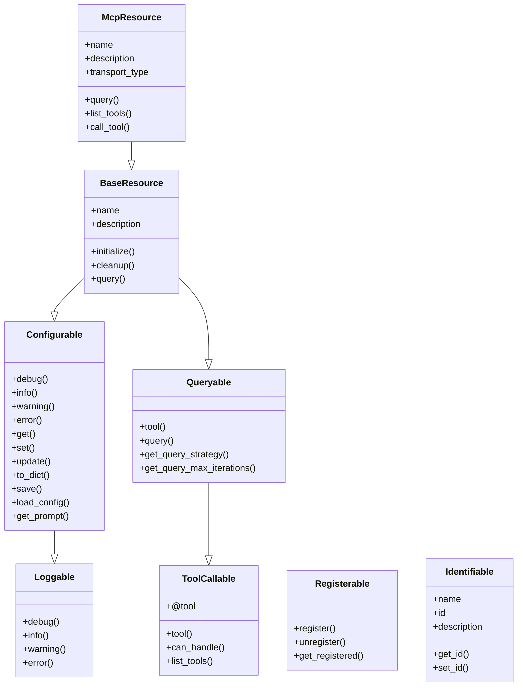

<p align="center">
  
</p>

# OpenDXA Mixins

OpenDXA's mixins provide a powerful and flexible way to add specific "abilities" to classes in a light yet principled manner. These mixins follow a consistent naming pattern ending in "-able" to indicate the capability they add to a class.

## Overview

Mixins in OpenDXA are designed to:
- Add specific capabilities to classes without complex inheritance hierarchies
- Provide consistent interfaces for common functionality
- Enable composition of capabilities through multiple inheritance
- Maintain clean separation of concerns
- Follow the principle of least surprise with standardized patterns

## Available Mixins

### Loggable
The foundation mixin that provides standardized logging capabilities across OpenDXA. It automatically configures a logger with appropriate naming and formatting.

### Configurable
Adds configuration management capabilities, including:
- YAML file loading with defaults and overrides
- Configuration validation
- Path resolution for config files
- Configuration access methods

### ToolCallable
Enables objects to be called as tools within the tool-calling ecosystem, providing a standardized interface for tool execution.

### Queryable
Adds query capabilities to objects, allowing them to be both queried directly and called as tools. Inherits from ToolCallable.

### Registerable
Provides registration capabilities for components that need to be discoverable and accessible by name.

### Identifiable
Adds unique identification capabilities to objects, enabling tracking and referencing of specific instances.

## Mixin Hierarchy



## Usage Example

```python
from opendxa.common.mixins import Loggable, Configurable, Queryable

class MyComponent(Loggable, Configurable, Queryable):
    def __init__(self, config_path=None, **overrides):
        super().__init__(config_path=config_path, **overrides)
        
    async def query(self, params=None):
        self.info("Processing query with params: %s", params)
        return QueryResponse(success=True, content=params)
```

## Best Practices

1. **Order Matters**: When using multiple mixins, list them in order of dependency (most dependent last)
2. **Minimal Inheritance**: Use only the mixins you need to avoid unnecessary complexity
3. **Consistent Initialization**: Always call `super().__init__()` to ensure proper mixin initialization
4. **Clear Documentation**: Document which mixins are used and why in class docstrings

## License

OpenDXA is released under the [MIT License](../../../LICENSE.md). 