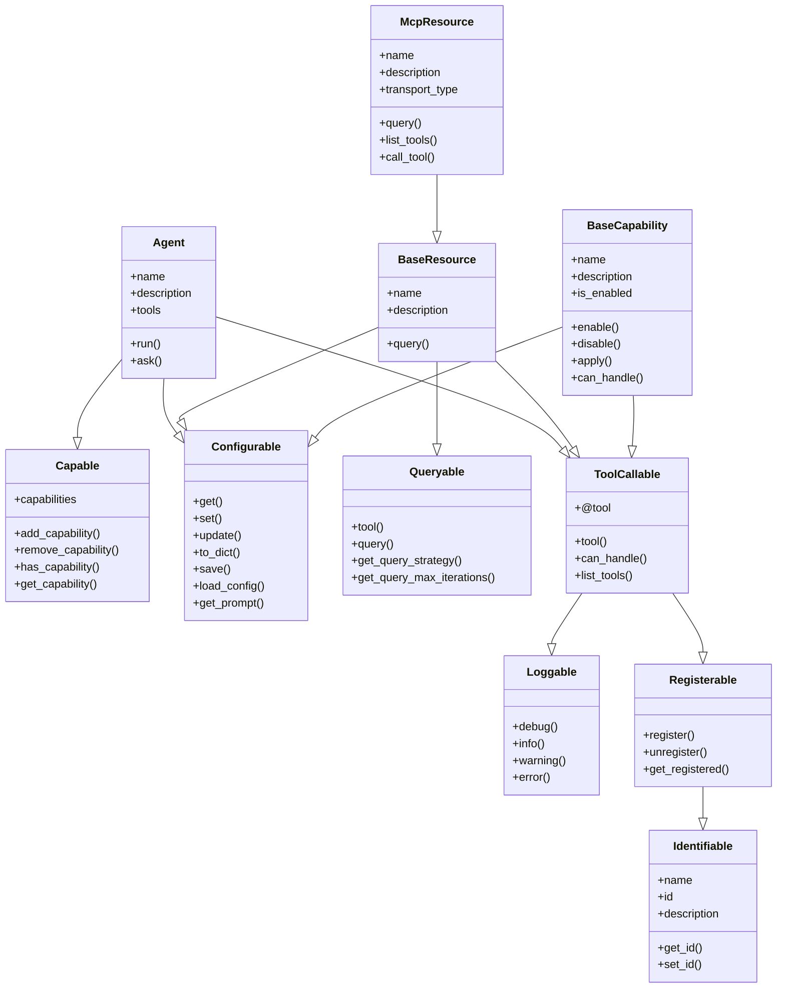

<p align="center">
  
</p>

[Project Overview](../../../README.md) | [Main Documentation](../../../docs/README.md)

# Mixins Module (`opendxa.common.mixins`)

This module provides reusable mixin classes that add common capabilities (like logging, configuration, identification) to other classes in the framework through multiple inheritance.

For detailed explanations of the available mixins, their purpose, hierarchy, and usage patterns, please refer to the **[Mixin Classes Documentation](../../../docs/details/mixins.md)**.

## Key Mixins

- `Loggable`
- `Configurable`
- `Identifiable`
- `Registerable`
- `ToolCallable`
- `Queryable`
- `Capable`

## Overview

Mixins in OpenDXA are designed to:
- Add specific capabilities to classes without complex inheritance hierarchies
- Provide consistent interfaces for common functionality
- Enable composition of capabilities through multiple inheritance
- Maintain clean separation of concerns
- Follow the principle of least surprise with standardized patterns

## Available Mixins

### Loggable
The foundation mixin that provides standardized logging capabilities across OpenDXA. It automatically configures a logger with appropriate naming and formatting.

### Configurable
Adds configuration management capabilities, including:
- YAML file loading with defaults and overrides
- Configuration validation
- Path resolution for config files
- Configuration access methods

### ToolCallable
Enables objects to be called as tools within the tool-calling ecosystem, providing a standardized interface for tool execution.

### Queryable
Adds query capabilities to objects, allowing them to be both queried directly and called as tools. Inherits from ToolCallable.

### Registerable
Provides registration capabilities for components that need to be discoverable and accessible by name.

### Identifiable
Adds unique identification capabilities to objects, enabling tracking and referencing of specific instances.

### Capable
Adds capabilities management capabilities to objects.

## Mixin Hierarchy



## Usage Examples

### Basic Usage
```python
from opendxa.common.mixins import Loggable, Identifiable, Configurable

class MyResource(Loggable, Identifiable, Configurable):
    def __init__(self):
        Loggable.__init__(self)
        Identifiable.__init__(self)
        Configurable.__init__(self)
        # Your initialization code here
```

### Advanced Usage
```python
from opendxa.common.mixins import (
    Loggable,
    Identifiable,
    Configurable,
    Registerable,
    Queryable,
    ToolCallable
)

class AdvancedResource(Loggable, Identifiable, Configurable, Registerable, Queryable, ToolCallable):
    def __init__(self):
        Loggable.__init__(self)
        Identifiable.__init__(self)
        Configurable.__init__(self)
        Registerable.__init__(self)
        Queryable.__init__(self)
        ToolCallable.__init__(self)
        # Your initialization code here
```

### Agent Usage
```python
from opendxa.common.mixins import Configurable, Loggable, ToolCallable
from opendxa.base.capability import Capable

class Agent(Configurable, Loggable, Capable, ToolCallable):
    def __init__(self):
        Configurable.__init__(self)
        Loggable.__init__(self)
        Capable.__init__(self)
        ToolCallable.__init__(self)
        # Agent initialization code here
```

## Best Practices

1. **Order Matters**: When using multiple mixins, list them in order of dependency (most dependent last)
2. **Minimal Inheritance**: Use only the mixins you need to avoid unnecessary complexity
3. **Consistent Initialization**: Always call `super().__init__()` to ensure proper mixin initialization
4. **Clear Documentation**: Document which mixins are used and why in class docstrings

## License

OpenDXA is released under the [MIT License](../../../LICENSE.md).

---
<p align="center">
Copyright © 2024 Aitomatic, Inc. Licensed under the [MIT License](../../../LICENSE.md).
<br/>
<a href="https://aitomatic.com">https://aitomatic.com</a>
</p>
