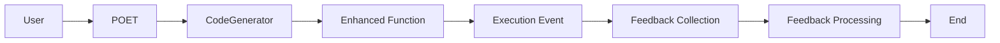

# POET LLM Code Generation - 3D Design Document

```text
Author: Christopher Nguyen
Date: 2025-06-13
Version: 0.5
Status: Design Phase
```

**Related Documents:**
- [POET Code Generation Service Design](../../../dxa-factory/poet/service/.design/poet_service.md)
- [POET Pub/Sub Design](../../../common/pubsub/.design/pubsub.md)

## 3D Methodology Status

**Phase**: ✅ Design Complete → 🔄 Implementation → ⏳ Testing → ⏳ Deployment

**Design Quality Gate**: ✅ PASSED
- ✅ Problem statement clearly defined
- ✅ Solution architecture specified
- ✅ Implementation plan with phases
- ✅ Success criteria defined
- ✅ Risk mitigation planned

## Executive Summary

POET (Perceive → Operate → Enforce → Train) is an LLM-powered transpiler that transforms decorated functions into production-ready implementations with built-in reliability, domain intelligence, and optional continuous learning capabilities.

**Key Innovation**: POET acts as a transpiler that receives complete function code (including @poet decorator), treats the original function as the Operate (O) phase, and generates a complete P→O'→E→T implementation where the user's function becomes the enhanced O' phase.

## Goals
- Transform simple functions into production-ready implementations
- Eliminate manual reliability engineering
- Provide domain-specific optimization
- Enable continuous learning through feedback when `optimize_for` is specified
- Support zero-config reliability with automatic P→O→E phases

## Non-Goals
- ❌ Complex plugin architecture
- ❌ Premature optimization
- ❌ Speculative features
- ❌ Framework dependencies
- ❌ Custom LLM model training

## Design Review

### Problem Statement Alignment
✅ **Fully Addressed**:
- Manual reliability engineering is eliminated through automated code generation
- Complex monitoring systems are simplified via built-in event emission
- Domain-specific optimization is handled through templates
- Learning mechanism is implemented via feedback loops

⚠️ **Partially Addressed**:
- Slow iteration on requirements changes (needs more work on template versioning)
- Complex monitoring systems (could benefit from more visualization tools)

### Goals Achievement
✅ **Achieved**:
- Zero-config reliability through @poet decorator
- Domain intelligence via templates
- Continuous learning through feedback loops
- Production readiness with built-in monitoring

⚠️ **In Progress**:
- Sub-10 second enhancement generation (needs optimization)
- 95%+ generated code reliability (needs more testing)

### Non-Goals Compliance
✅ **Properly Excluded**:
- No complex plugin architecture (using simple templates)
- No premature optimization (focusing on core functionality)
- No speculative features (building for actual needs)
- No framework dependencies (keeping it simple)

### Areas for Improvement
1. **Performance**:
   - Optimize LLM generation time
   - Add caching for frequent enhancements
   - Implement parallel processing where possible

2. **Reliability**:
   - Add more comprehensive testing
   - Implement better error recovery
   - Enhance validation mechanisms

3. **Usability**:
   - Improve template documentation
   - Add more example use cases
   - Enhance feedback collection UX

4. **Learning**:
   - Implement better feedback correlation
   - Add more sophisticated learning triggers
   - Enhance version management

### Next Steps
1. Complete Phase 1 implementation
2. Begin domain template development
3. Set up testing infrastructure
4. Implement feedback collection
5. Add performance monitoring

## Problem Statement

Building production-ready functions today requires:
- Manual implementation of error handling, retries, timeouts
- Complex monitoring and feedback collection systems
- Domain-specific optimization that takes weeks to implement
- Slow iteration when requirements change
- No learning mechanism to improve over time

**User Need**: Developers want functions that "just work better" and continuously improve, without manual reliability engineering.

## Solution Architecture

### How POET Transpilation Works

POET operates as a transpiler that:

1. **Receives Complete Function Code**: The entire function including @poet decorator
2. **Parses Decorator Parameters**: Extracts domain, optimize_for, and other settings
3. **Transforms Original Function into O'**: The user's function is redesigned to maintain its original intent while integrating seamlessly with POET architecture
4. **Generates Complete POET Implementation**:
   - **P (Perceive)**: Generated based on function signature and domain
   - **O' (Transformed Operate)**: User's original logic transformed with POET facilities (error handling, metrics, state management)
   - **E (Enforce)**: Generated based on return type and domain requirements
   - **T (Train)**: Only generated if optimize_for is specified in decorator

**Example Transpilation**:
```python
# Input to POET Service:
@poet(domain="ml_monitoring", optimize_for="accuracy")
def detect_drift(current_data, reference_data):
    return {"drift_detected": False, "score": 0.0}

# POET Service generates complete implementation with:
# - perceive() function for input validation
# - operate_prime() function - user's logic transformed with:
#   * Error handling and recovery
#   * Metrics collection hooks
#   * State management for POET
#   * Domain-specific ML monitoring enhancements
#   * Integration points for P/E/T phases
# - enforce() function for output validation
# - train() function for accuracy optimization feedback
```

**Key Point**: The original `detect_drift` function doesn't just get wrapped - it gets completely transformed into `operate_prime()` that maintains the same logical intent but includes all the facilities needed to work within POET's P→O'→E→T architecture.

The service receives the complete context including imports, SandboxContext, and module information to generate appropriate implementations.

### POET Architecture Benefits: Concrete Examples

The following examples demonstrate how each POET phase provides specific architectural benefits:

#### Fault-Tolerance from Perceive (P) Phase

**Example**: ML Drift Detection Function
```python
# User's original function:
@poet(domain="ml_monitoring")
def detect_drift(current_data, reference_data):
    return {"drift_detected": False, "score": 0.0}

# POET-generated Perceive phase provides fault-tolerance:
def perceive(current_data, reference_data):
    # Handle missing/corrupt data gracefully
    if current_data is None:
        return StandardizedInput(
            current_data=get_fallback_data(),
            reference_data=reference_data,
            metadata={"fallback_used": True}
        )
    
    # Detect and handle data format inconsistencies
    if not isinstance(current_data, expected_format):
        try:
            current_data = convert_to_expected_format(current_data)
        except ConversionError:
            raise PerceiveError("Data format cannot be standardized")
    
    # Validate data quality and completeness
    if data_quality_score(current_data) < 0.7:
        emit_warning("Low data quality detected")
        current_data = apply_data_cleaning(current_data)
    
    return StandardizedInput(current_data, reference_data)
```

**Benefits Provided**:
- **Graceful degradation**: System continues operating with fallback data
- **Input sanitization**: Prevents downstream errors from malformed inputs
- **Data quality assurance**: Ensures O' phase receives reliable inputs
- **Error prevention**: Catches and handles issues before they affect core logic

#### Determinism/Consistency from Enforce (E) Phase

**Example**: API Response Validation
```python
# User's original function:
@poet(domain="api_operations")
def process_user_request(request):
    return {"status": "success", "data": process(request)}

# POET-generated Enforce phase ensures determinism:
def enforce(raw_output, execution_context):
    # Ensure consistent output schema
    if not isinstance(raw_output, dict):
        return StandardizedOutput(
            status="error",
            data=None,
            error="Invalid output type from operate phase"
        )
    
    # Validate required fields are present
    required_fields = ["status", "data"]
    for field in required_fields:
        if field not in raw_output:
            raw_output[field] = get_default_value(field)
    
    # Enforce business constraints
    if raw_output["status"] not in ["success", "error", "pending"]:
        raw_output["status"] = "error"
        raw_output["error"] = "Invalid status value"
    
    # Apply deterministic formatting
    return StandardizedOutput(
        status=raw_output["status"],
        data=sanitize_output_data(raw_output["data"]),
        timestamp=execution_context.start_time,
        execution_id=execution_context.id
    )
```

**Benefits Provided**:
- **Schema consistency**: Guarantees same output structure every time
- **Constraint enforcement**: Ensures outputs meet business rules
- **Error standardization**: Consistent error reporting across all functions
- **Audit trail**: Deterministic metadata for tracking and debugging

#### Learning from Train (T) Phase

**Example**: Performance Optimization Learning
```python
# User's original function:
@poet(domain="ml_monitoring", optimize_for="accuracy")
def detect_anomalies(sensor_data):
    return {"anomaly_detected": check_threshold(sensor_data)}

# POET-generated Train phase enables continuous learning:
def train(execution_result, feedback_data):
    # Collect performance metrics aligned with optimize_for="accuracy"
    accuracy_metrics = {
        "true_positives": feedback_data.get("confirmed_anomalies", 0),
        "false_positives": feedback_data.get("false_alarms", 0),
        "detection_latency": execution_result.duration_ms
    }
    
    # Track accuracy trends over time
    current_accuracy = calculate_accuracy(accuracy_metrics)
    historical_accuracy = get_rolling_average_accuracy()
    
    # Learning: Adjust parameters if accuracy is declining
    if current_accuracy < historical_accuracy - 0.05:  # 5% degradation threshold
        # Request parameter optimization
        optimization_request = {
            "function_name": "detect_anomalies",
            "objective": "accuracy",
            "current_performance": current_accuracy,
            "target_improvement": 0.1,
            "context": {
                "recent_false_positive_rate": accuracy_metrics["false_positives"],
                "detection_patterns": analyze_recent_detections()
            }
        }
        
        # Trigger regeneration with learned insights
        emit_learning_event("parameter_optimization_needed", optimization_request)
    
    # Adaptive threshold learning
    if feedback_data.get("threshold_feedback"):
        learned_thresholds = update_threshold_model(
            current_thresholds=get_current_thresholds(),
            performance_data=accuracy_metrics,
            domain_context="sensor_anomaly_detection"
        )
        
        # Apply learned parameters
        store_learned_parameters("anomaly_thresholds", learned_thresholds)
        
    return TrainingResult(
        accuracy_improvement=current_accuracy - historical_accuracy,
        parameters_updated=True,
        next_optimization_trigger=calculate_next_trigger_time()
    )
```

**Benefits Provided**:
- **Performance tracking**: Continuous measurement against optimization objective
- **Adaptive improvement**: Parameters adjust based on real-world feedback
- **Degradation detection**: Automatically identifies when performance drops
- **Context-aware learning**: Uses domain knowledge to guide improvements
- **Regeneration triggers**: Initiates code updates when significant improvements are possible

### POET Phases Explained

POET implements four phases that transform simple functions into production-ready systems:

1. **Perceive (P)**: Input validation, data quality checks, anomaly detection
   - Always active
   - Built-in primitive error correction
   - Handles malformed inputs gracefully

2. **Operate (O)**: Core business logic with reliability wrappers
   - Always active
   - Retry logic, timeouts, circuit breakers
   - Domain-specific operations (e.g., statistical tests for ML)

3. **Enforce (E)**: Output validation, constraint checking, quality assurance
   - Always active
   - Built-in primitive error correction
   - Ensures outputs meet specifications

4. **Train (T)**: Continuous learning and improvement
   - **Only active when `optimize_for` is specified**
   - Collects execution feedback
   - Adjusts behavior toward the optimization objective
   - Triggers regeneration when performance degrades

### Core Concept
```python
# User writes simple function
@poet(domain="ml_monitoring")
def detect_drift(current_data, reference_data):
    return {"drift_detected": False, "score": 0.0}

# POET generates enhanced version with P→O→E:
# - Statistical tests (KS, KL divergence) (Perceive)
# - Retry logic and error handling (Operate)  
# - Output validation and checks (Enforce)

# To enable continuous learning, add optimize_for:
@poet(domain="ml_monitoring", optimize_for="accuracy")
def detect_drift(current_data, reference_data):
    return {"drift_detected": False, "score": 0.0}

# Now includes P→O→E→T with:
# - Feedback collection hooks (Train)
# - Continuous improvement toward accuracy objective
```

### Function Enhancement Flow

```
┌─────────────────┐    ┌─────────────────┐     ┌─────────────────┐
│   Dana Runtime  │    │  POET Service   │     │    LLM Service  │
└────────┬────────┘    └────────┬────────┘     └────────┬────────┘
         │                      │                       │
         │ 1. @poet function    │                       │
         │    encountered       │                       │
         ├─────────────────────►│                       │
         │                      │                       │
         │                      │ 2. Load template      │
         │                      │    from service       │
         │                      │                       │
         │                      │ 3. Request enhanced   │
         │                      │    implementation     │
         │                      ├──────────────────────►│
         │                      │                       │
         │                      │ 4. Return enhanced    │
         │                      │    code (Dana/Python) │
         │                      │◄──────────────────────┤
         │                      │                       │
         │ 5. Return enhanced   │                       │
         │    code              │                       │
         │◄─────────────────────┤                       │
         │                      │                       │
         │ 6. Store in .poet/   │                       │
         │    <function>/v1/    │                       │
         │                      │                       │
         │ 7. Safety audit      │                       │
         │                      │                       │
         │ 8. Execute P→O→E→T   │                       │
         │                      │                       │
         │ 9. Emit execution    │                       │
         │    event             │                       │
         └─────────────────────►│                       │
```

### Feedback Loop Design

```
┌─────────────────┐    ┌─────────────────┐     ┌─────────────────┐
│   Dana Runtime  │    │  POET Service   │     │   PubSub System │
└────────┬────────┘    └────────┬────────┘     └────────┬────────┘
         │                      │                       │
         │ 1. Register mailbox  │                       │
         │    for function      │                       │
         │    feedback          │                       │
         ├─────────────────────►│                       │
         │                      │                       │
         │                      │ 2. Create feedback    │
         │                      │    subscription       │
         │                      ├──────────────────────►│
         │                      │                       │
         │                      │ 3. Acknowledge        │
         │                      │    subscription       │
         │                      │◄──────────────────────┤
         │ 4. Subscription      │                       │
         │    confirmed         │                       │
         │◄─────────────────────┤                       │
         │                      │                       │
         │ 5. Execute function  │                       │
         │                      │                       │
         │ 6. Emit execution    │                       │
         │    event             │                       │
         ├─────────────────────►│                       │
         │                      │                       │
         │                      │ 7. Publish to         │
         │                      │    feedback topic     │
         │                      │◄──────────────────────┤
         │                      │                       │
         │                      │ 8. Process feedback   │
         │                      │    queue              │
         │                      │◄──────────────────────┤
         │                      │                       │
         │ 9. If feedback       │                       │
         │    requires update   │                       │
         │                      │                       │
         │ 10. Request new      │                       │
         │     version          │                       │
         ├─────────────────────►│                       │
```

### Storage Structure
```
# Client-side storage
module_dir/
└── .poet/
    └── <function_name>/
        ├── v1/
        │   ├── code.dana        # Enhanced Dana code
        │   ├── code.py          # Enhanced Python code
        │   ├── params.json      # Function parameters
        │   ├── state.json       # Runtime state
        │   └── metadata.json    # Version metadata
        ├── v2/                  # Created if feedback triggers update
        ├── current -> v1        # Symlink to current version
        └── feedback/            # Local feedback storage
            ├── pending/         # Unprocessed feedback
            └── processed/       # Processed feedback

# Service-side storage (POET Service)
poet_service/
├── templates/
│   ├── base/
│   │   ├── v1/
│   │   │   ├── template.txt    # Template content
│   │   │   └── metadata.json   # Template metadata
│   │   └── current -> v1       # Current version
│   ├── ml_monitoring/
│   │   ├── v1/
│   │   │   ├── template.txt
│   │   │   └── metadata.json
│   │   └── current -> v1
│   └── api_operations/
│       ├── v1/
│       │   ├── template.txt
│       │   └── metadata.json
│       └── current -> v1
└── cache/
    └── enhanced_functions/     # Cached enhanced functions
```

### Template Management API
```typescript
// Template Management Endpoints
interface TemplateAPI {
  // Get template for domain
  GET /api/v1/templates/{domain}
  Response: {
    template: string;
    version: string;
    metadata: {
      created_at: string;
      updated_at: string;
      author: string;
      description: string;
    };
  }

  // List template versions
  GET /api/v1/templates/{domain}/versions
  Response: {
    versions: Array<{
      version: string;
      created_at: string;
      updated_at: string;
      author: string;
      description: string;
    }>;
  }

  // Create new template version
  POST /api/v1/templates/{domain}
  Body: {
    template: string;
    description: string;
  }
  Response: {
    version: string;
    created_at: string;
  }

  // Update current template
  PUT /api/v1/templates/{domain}/current
  Body: {
    version: string;  // Version to set as current
  }
  Response: {
    updated_at: string;
  }
}
```

### Event Schema
```typescript
interface POETEvent {
  id: string;
  type: string;
  timestamp: number;
  correlation_id?: string;
  causation_id?: string;  // Links to triggering event
  metadata: {
    version: string;
    environment: string;
    service: string;
  };
  payload: any;
}

interface FunctionExecutionEvent extends POETEvent {
  type: "function.execution";
  payload: {
    function_name: string;
    version: string;
    execution_id: string;
    start_time: number;
    end_time: number;
    status: "success" | "failure";
    metrics: {
      duration_ms: number;
      memory_mb: number;
      cpu_percent: number;
    };
    error?: {
      type: string;
      message: string;
      stack_trace?: string;
    };
  };
}

interface FunctionFeedbackEvent extends POETEvent {
  type: "function.feedback";
  payload: {
    function_name: string;
    version: string;
    execution_id: string;
    feedback_type: "performance" | "error" | "user" | "system";
    rating?: number;
    comments?: string;
    metrics?: {
      success_rate: number;
      avg_duration: number;
      error_rate: number;
    };
    suggestions?: string[];
  };
}
```

### Progressive User Experience
1. **Level 1**: `@poet()` - Basic P→O→E phases (Perceive, Operate, Enforce) with built-in fault tolerance
2. **Level 2**: `@poet(domain="ml_monitoring")` - Domain intelligence added to P→O→E phases
3. **Level 3**: `@poet(domain="ml_monitoring", optimize_for="accuracy")` - Full P→O→E→T with Train phase activated for continuous learning

**Key Design Principle**: The `optimize_for` parameter serves dual purpose:
- Activates the Train (T) phase for continuous learning
- Specifies the learning objective (accuracy, latency, cost, etc.)

Without `optimize_for`, functions execute only P→O→E phases with primitive error correction built into Perceive and Enforce.

### Architecture Components

#### 1. LLM Code Generator
Core service that generates enhanced function implementations:

```python
class POETCodeGenerator:
    def __init__(self, llm_client):
        self.llm = llm_client
        self.domain_templates = DomainTemplates()
    
    def enhance_function(self, original_func, config):
        # Generate enhanced implementation via LLM
        template = self.domain_templates.get(config.domain)
        
        # Add Train phase requirements only if optimize_for is specified
        train_requirements = ""
        if config.optimize_for:
            train_requirements = f"- Train: Emit monitoring events, track performance metrics, optimize for {config.optimize_for}"
        
        enhanced_code = self.llm.generate(template.format(
            function_name=original_func.__name__,
            original_code=inspect.getsource(original_func),
            domain_requirements=template.requirements,
            train_requirements=train_requirements
        ))
        return self.compile_and_validate(enhanced_code)
```

#### 2. The optimize_for Parameter

The `optimize_for` parameter is the key to activating POET's learning capabilities:

**Without optimize_for:**
```python
@poet(domain="ml_monitoring")
def detect_drift(data):
    # Runs P→O→E phases only
    # No learning, no feedback collection
    # Deterministic behavior
```

**With optimize_for:**
```python
@poet(domain="ml_monitoring", optimize_for="accuracy")
def detect_drift(data):
    # Runs full P→O→E→T phases
    # Activates feedback collection
    # Learns to optimize for accuracy
    # Adaptive behavior
```

**Available optimization objectives:**
- `"accuracy"` - Maximize prediction/detection accuracy
- `"latency"` - Minimize execution time
- `"cost"` - Minimize computational resources
- `"recall"` - Maximize true positive rate (for detection tasks)
- `"precision"` - Minimize false positive rate
- `"alert_quality"` - Balance between alert fatigue and missing critical events
- Domain-specific objectives defined by domain templates

**How it works:**
1. When `optimize_for` is specified, POET activates the Train phase
2. The LLM generates code with feedback collection hooks
3. During execution, metrics related to the objective are collected
4. The learning system adjusts parameters to optimize for the objective
5. If performance degrades, POET may request regeneration with new insights

#### 3. Domain Templates
Simple text templates that encode domain knowledge:

```python
ML_MONITORING_TEMPLATE = """
Generate enhanced Python implementation for {function_name}.
Domain: ML Monitoring

Requirements:
- Perceive: Validate data types, handle missing data, detect data characteristics
- Operate: Statistical tests (KS, KL divergence), parallel processing, adaptive windowing
- Enforce: Validate output format, ensure statistical significance
{train_requirements}

Original function:
{original_code}

Generate complete enhanced function with ML monitoring intelligence.
"""

# train_requirements is conditionally added:
# If optimize_for is specified:
#   "- Train: Emit monitoring events, track performance metrics, optimize for {optimize_for}"
# Otherwise: "" (empty - no Train phase)
```

#### 3. Aitomatic Integration
POET integrates with Aitomatic services via clean interfaces:

```
┌─────────────────┐    ┌──────────────────────┐    ┌─────────────────┐
│   DANA Code     │───▶│  Transpilation Agent │───▶│  POET Service   │
│   (.na files)   │    │  (Aitomatic Agent)   │    │  (Enhancement)  │
└─────────────────┘    └──────────────────────┘    └─────────────────┘
                                  │                          │
                                  ▼                          ▼
                       ┌──────────────────────┐    ┌─────────────────┐
                       │   Python Functions   │    │ Enhanced Python │
                       │   (Base Functions)   │    │  (Production)   │
                       └──────────────────────┘    └─────────────────┘
```

#### 4. File Storage System
Simple file-based storage for enhanced versions:

```
project/
├── my_module.py
└── .poet/
    ├── detect_drift_v1.py
    ├── detect_drift_v2.py
    ├── detect_drift_current.py -> detect_drift_v2.py
    ├── detect_drift_params.json
    └── events/
        ├── pending/
        └── processed/
```

#### 5. Event-Driven Learning System
Persistent event queue for cross-session learning:

```python
class POETEventQueue:
    def __init__(self, storage_path=".poet/events"):
        self.storage_path = Path(storage_path)
        self.pending_dir = self.storage_path / "pending"
        self.processed_dir = self.storage_path / "processed"
    
    def emit(self, event_type: str, payload: dict):
        """Emit event with persistent storage"""
        event = {
            "type": event_type,
            "payload": payload,
            "timestamp": time.time(),
            "id": str(uuid.uuid4())
        }
        
        # Persist immediately (crash-safe)
        event_file = self.pending_dir / f"{event['id']}.json"
        with open(event_file, 'w') as f:
            json.dump(event, f)
```

## Use Cases

### Primary Use Case: ML Model Monitoring
Transform simple monitoring functions into production-grade systems:

**Input**: Basic drift detection function
**Output**: Sophisticated monitoring with:
- Automatic statistical test selection (KS, KL divergence)
- Feature importance weighting
- Adaptive windowing
- Alert fatigue reduction (when optimize_for="alert_quality")
- Cost-benefit optimization (when optimize_for="cost")
- Continuous learning and improvement (when optimize_for is specified)

See detailed examples in `ML_MONITORING_EXAMPLES.md`

### Secondary Use Cases
- API monitoring and reliability
- Customer service automation
- Financial risk assessment
- Prompt optimization

See `examples/` directory for complete implementations.

## Implementation Plan (3D Methodology)

### 🔄 Phase 1: Core Infrastructure (Weeks 1-2)
**Goal**: Basic LLM code generation working

**Immediate Next Steps**:
1. **Create basic file structure**:
   ```bash
   opendxa/dana/poet/generator.py          # POETCodeGenerator class
   opendxa/dana/poet/decorator.py          # @poet decorator
   opendxa/dana/poet/storage.py            # File storage system
   opendxa/dana/poet/domains/base.py       # Basic domain template
   opendxa/common/event_queue.py           # Event system
   ```

2. **Build POETCodeGenerator**:
   ```python
   class POETCodeGenerator:
       def enhance_function(self, original_func, config):
           # Send function + domain template to LLM
           # Get back enhanced Python code
           # Validate and compile
           # Return enhanced function
   ```

3. **Create @poet decorator**:
   ```python
   def poet(domain=None, optimize_for=None):
       # Intercept function calls
       # Route to POETCodeGenerator
       # Replace with enhanced version
       # optimize_for activates Train phase with learning objective
   ```

4. **Add ML monitoring domain**:
   ```python
   ML_MONITORING_TEMPLATE = """
   Generate enhanced Python for ML monitoring...
   Include: KS tests, KL divergence, windowing...
   """
   ```

5. **Test basic flow**:
   ```python
   # P→O→E only (no learning)
   @poet(domain="ml_monitoring")
   def detect_drift(data):
       return {"drift_detected": False}
   
   # P→O→E→T with accuracy optimization
   @poet(domain="ml_monitoring", optimize_for="accuracy")
   def detect_drift_learning(data):
       return {"drift_detected": False}
   ```

**Deliverables**:
- [ ] POETCodeGenerator class (`opendxa/dana/poet/generator.py`)
- [ ] Function decorator and interception (`opendxa/dana/poet/decorator.py`)
- [ ] Simple file storage system (`opendxa/dana/poet/storage.py`)
- [ ] Basic domain template (`opendxa/dana/poet/domains/base.py`)
- [ ] POETEventQueue implementation (`opendxa/common/event_queue.py`)

**Success Criteria**:
- ✅ Can enhance any function with basic retries/timeouts
- ✅ Generated code executes successfully
- ✅ Fallback to original function on generation failure

### ⏳ Phase 2: Domain Intelligence (Weeks 3-4)  
**Goal**: Domain-specific enhancements working

**Deliverables**:
- [ ] ML monitoring domain template (`opendxa/dana/poet/domains/ml_monitoring.py`)
- [ ] API operations domain template (`opendxa/dana/poet/domains/api.py`)
- [ ] Aitomatic agent integration layer
- [ ] Domain template validation system

**Success Criteria**:
- ✅ Different domains produce visibly different enhancements
- ✅ ML monitoring domain handles statistical tests automatically
- ✅ Integration with Aitomatic transpilation agent works

### ⏳ Phase 3: Feedback Orchestration & Learning (Weeks 5-6)
**Goal**: Functions with `optimize_for` parameter improve over time through production feedback

**Deliverables**:
- [ ] Feedback collection integrations (alerts, MLOps, cost tracking) - activated by optimize_for
- [ ] Learning orchestration (pattern analysis, regeneration triggers) based on optimize_for objective
- [ ] Success rate tracking and metrics aligned with optimize_for goals

**Success Criteria**:
- ✅ Functions with optimize_for automatically regenerate when performance degrades
- ✅ Learning objectives (specified via optimize_for) influence generated code behavior
- ✅ Functions without optimize_for operate in P→O→E mode only
- ✅ Feedback correlation works across session restarts for learning-enabled functions

### ⏳ Phase 4: Production Readiness (Weeks 7-8)
**Goal**: Ready for real-world ML monitoring usage

**Deliverables**:
- [ ] Comprehensive error handling and security validation
- [ ] Performance optimization (caching, async generation)
- [ ] Complete documentation and ML monitoring showcase
- [ ] Production deployment examples

**Success Criteria**:
- ✅ Sub-10 second enhancement generation
- ✅ 95%+ generated code reliability
- ✅ Complete ML monitoring agent demonstration

## Quality Gates

### Development Standards
- **Code Quality**: All generated code must pass syntax validation
- **Security**: Generated code limited to safe operations only
- **Performance**: Enhancement generation < 10 seconds
- **Reliability**: Fallback to original function if enhancement fails

### Error Handling Strategy

#### 1. Code Generation Errors
- **LLM Generation Failures**:
  - Retry with exponential backoff (max 3 attempts)
  - Fallback to simpler enhancement if complex generation fails
  - Log detailed error context for debugging
  - Alert if failure rate exceeds threshold

- **Validation Failures**:
  - Detailed error messages with specific validation failures
  - Automatic retry with different parameters
  - Fallback to original function if validation fails
  - Track validation failure patterns

#### 2. Runtime Errors
- **Function Execution Errors**:
  - Automatic retry with exponential backoff
  - Circuit breaker for repeated failures
  - Detailed error logging with context
  - Alert on error rate thresholds

- **State Management Errors**:
  - Transaction rollback on failure
  - State recovery mechanisms
  - Version rollback capability
  - Audit trail of state changes

#### 3. Feedback Processing Errors
- **Feedback Collection Errors**:
  - Retry with backoff
  - Queue feedback for later processing
  - Alert on persistent failures
  - Track feedback processing metrics

### Security Considerations

#### 1. Code Generation Security
- **Input Validation**:
  - Sanitize all function inputs
  - Validate code structure
  - Check for malicious patterns
  - Rate limit generation requests

- **Output Validation**:
  - Static code analysis
  - Security pattern checking
  - Resource usage limits
  - Sandboxed execution testing

#### 2. Runtime Security
- **Function Execution**:
  - Resource limits (CPU, memory, time)
  - Network access restrictions
  - File system access controls
  - Environment isolation

- **State Management**:
  - Access control for state changes
  - Audit logging of all operations
  - Encryption of sensitive data
  - Version control security

#### 3. Feedback Security
- **Feedback Collection**:
  - Validate feedback sources
  - Rate limit feedback submission
  - Sanitize feedback content
  - Track feedback patterns

### Performance Requirements

#### 1. Response Time SLAs
- **Code Generation**:
  - 95th percentile < 10 seconds
  - 99th percentile < 30 seconds
  - Timeout at 60 seconds
  - Cache frequent generations

- **Function Execution**:
  - 95th percentile < 100ms
  - 99th percentile < 500ms
  - Timeout at 5 seconds
  - Circuit breaker on slow responses

#### 2. Resource Usage
- **Memory**:
  - Max 1GB per generation
  - Max 256MB per execution
  - Memory monitoring
  - Automatic cleanup

- **CPU**:
  - Max 2 cores per generation
  - Max 1 core per execution
  - CPU time monitoring
  - Throttling on high usage

#### 3. Storage Requirements
- **Function Storage**:
  - Max 10MB per function
  - Max 10 versions per function
  - Automatic cleanup of old versions
  - Compression for large functions

- **Event Storage**:
  - Max 1MB per event
  - 30-day retention
  - Automatic archival
  - Compression for old events

#### 4. Scalability Targets
- **Throughput**:
  - 100 generations per minute
  - 1000 executions per minute
  - 10000 events per minute
  - Auto-scaling based on load

- **Concurrency**:
  - 50 concurrent generations
  - 500 concurrent executions
  - 1000 concurrent events
  - Queue-based throttling

## Risk Assessment & Mitigation

### High Risk
**LLM Generation Reliability**
- *Risk*: Generated code may be incorrect or insecure
- *Mitigation*: Strict validation, sandboxed execution, fallback to original

**Security Concerns** 
- *Risk*: Executing dynamically generated code
- *Mitigation*: Whitelist allowed operations, code review, static analysis

### Medium Risk
**Performance Impact**
- *Risk*: LLM generation latency affects user experience  
- *Mitigation*: Asynchronous generation, aggressive caching, local LLM option

**Integration Complexity**
- *Risk*: Complex integration with Aitomatic services
- *Mitigation*: Well-defined interfaces, extensive integration testing

## Success Metrics

### User Experience Metrics
- Time from `@poet()` to working enhancement: < 30 seconds
- Zero-config success rate: > 90%
- User satisfaction score: > 4.0/5.0

### Technical Performance Metrics  
- Generated code success rate: > 95%
- Enhancement generation time: < 10 seconds
- Storage overhead per function: < 1MB

### Business Impact Metrics
- Reduction in manual reliability code: > 50%
- Developer productivity improvement: > 30%
- Production incident reduction: > 40%

## Implementation Migration Plan

### Migrating from enable_training to optimize_for

The current implementation uses `enable_training` as a boolean flag. To align with the design intent, we need to:

1. **Update POETConfig**:
   - Remove `enable_training` parameter
   - Add `optimize_for: str | None = None` parameter
   - Training is enabled when `optimize_for` is not None

2. **Update poet decorator**:
   - Replace `enable_training` with `optimize_for` in function signature
   - Update documentation and examples

3. **Update execution logic**:
   - Change `if self.config.enable_training:` to `if self.config.optimize_for:`
   - Pass optimization objective to learning algorithms

4. **Update profiles**:
   - Remove `enable_training` from all profiles
   - Add `optimize_for` with appropriate objectives where learning was enabled

5. **Backward compatibility**:
   - Temporarily support both parameters with deprecation warning
   - If `enable_training=True` and no `optimize_for`, default to `optimize_for="performance"`

## Design Decisions

### KISS Principles Applied
- **Simple storage**: Flat files, no complex databases
- **Minimal config**: Smart defaults, progressive disclosure
- **Direct enhancement**: LLM generates code, not metadata
- **Agent integration**: Clean service boundaries

### YAGNI Principles Applied  
- **No frameworks**: Domain templates, not plugin architectures
- **No premature optimization**: Basic reliability first
- **No speculative features**: Build for actual user needs
- **Service abstraction**: Let Aitomatic handle transpilation

This design prioritizes developer experience and practical utility over architectural sophistication, making POET genuinely useful for everyday coding tasks while leveraging Aitomatic's agent infrastructure.

## POET System Modules

The complete POET system is designed across three key module directories:

### 1. Core POET Framework
**Location**: `opendxa/dana/poet/.design/`
- Main POET design documents and architecture
- ML monitoring examples and domain templates  
- Core framework implementation plans
- Learning system design and feedback orchestration

### 2. PubSub Communication Infrastructure
**Location**: `opendxa/common/pubsub/.design/`
- Event-driven architecture for feedback orchestration
- Integration patterns with Aitomatic services
- Cross-system communication protocols
- Event persistence and processing pipelines

### 3. POET REST API Service
**Location**: `opendxa/enterprise/poet/service/.design/`
- FastAPI-based REST service architecture
- OpenAPI 3.0 specification and endpoints
- Enterprise deployment and security patterns
- Kubernetes configuration and monitoring

These three modules work together to provide:
- **Core POET** (dana/poet) - The enhancement framework and domain intelligence
- **PubSub** (common/pubsub) - The communication and feedback infrastructure  
- **Service** (enterprise/poet/service) - The REST API deployment and enterprise integration

## Related Documents

- `supporting_docs/ml_monitoring_examples.md` - Complete ML monitoring use cases
- `supporting_docs/domain_templates.md` - Domain-specific template specifications
- `supporting_docs/feedback_orchestration.md` - Detailed feedback loop architecture
- `supporting_docs/pubsub_design.md` - Event-driven architecture
- `supporting_docs/implementation_tracker.md` - Detailed implementation progress tracking

### General Activity Diagram

