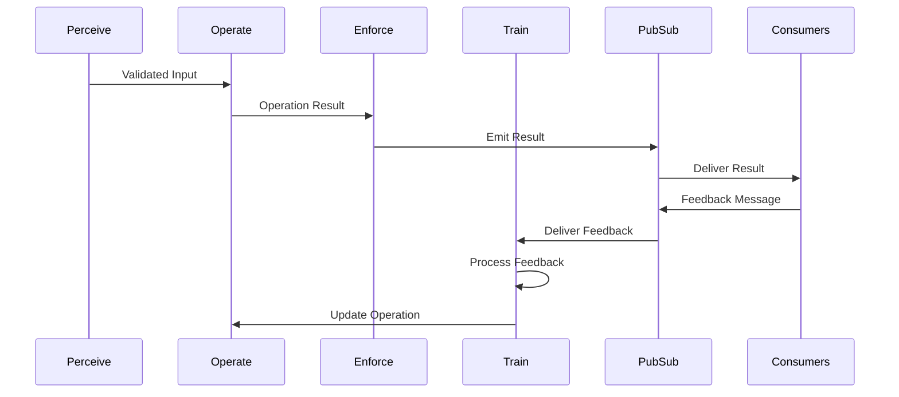

# POET Design

```text
Author: Christopher Nguyen
Date: 2025-06-13
Version: 0.5
Status: Design Phase
```

**Related Documents:**
- [POET Implementation](poet-implementation.md)
- [POET Alpha Plan](poet-alpha.md)
- [OpenDXA API Service Design](../../../api/.design/opendxa_api_service.md)
- [POET Pub/Sub Design](../../../common/pubsub/.design/pubsub.md)

## Overview

POET (Perceive → Operate → Enforce → Train) is an LLM-powered transpiler that transforms decorated functions into production-ready implementations with built-in reliability, domain intelligence, and optional continuous learning capabilities.

**Key Innovation**: POET acts as a transpiler that receives complete function code (including @poet decorator), treats the original function as the Operate (O) phase, and generates a complete P→O'→E→T implementation where the user's function becomes the enhanced O' phase.

## Goals
- Transform simple functions into production-ready implementations
- Eliminate manual reliability engineering
- Provide domain-specific optimization
- Enable continuous learning through feedback when `optimize_for` is specified
- Support zero-config reliability with automatic P→O→E phases

## Non-Goals
- ❌ Complex plugin architecture
- ❌ Premature optimization
- ❌ Speculative features
- ❌ Framework dependencies
- ❌ Custom LLM model training

## Problem Statement

Building production-ready functions today requires:
- Manual implementation of error handling, retries, timeouts
- Complex monitoring and feedback collection systems
- Domain-specific optimization that takes weeks to implement
- Slow iteration when requirements change
- No learning mechanism to improve over time

**User Need**: Developers want functions that "just work better" and continuously improve, without manual reliability engineering.

## Solution Architecture

### Core Concept
```python
# User interface
@poet(domain="ml_monitoring")
def detect_drift(current_data, reference_data):
    return {"drift_detected": False, "score": 0.0}

# Generated phases (illustrative fragments)
def perceive(data: dict) -> dict:
    # Input validation, data characteristics
    return {"valid": True, "stats": {...}}

def operate(data: dict) -> dict:
    # Core logic with retries/timeouts
    return {"result": {...}}

def enforce(result: dict) -> bool:
    # Output validation
    return True

def train(feedback: dict) -> None:
    # Learning from execution
    pass
```

### Progressive User Experience
1. **Level 1**: `@poet()` - Instant reliability (retries, timeouts)
2. **Level 2**: `@poet(domain="ml_monitoring")` - Domain intelligence  
3. **Level 3**: `@poet(optimize_for="accuracy")` - Specific optimization goals

## Design Components

### Learning Process & Feedback Flow



### Feedback Message Structure
```python
class FeedbackMessage:
    function_id: str
    execution_id: str
    timestamp: datetime
    feedback_type: str  # "success", "error", "performance", "quality"
    metrics: dict[str, float]
    context: dict[str, Any]
    suggestions: list[str]
```

### Learning Flow
1. **Feedback Collection**:
   - Downstream consumers emit feedback via pubsub
   - Feedback includes metrics, errors, performance data
   - Each feedback message is tagged with function and execution IDs

2. **Feedback Processing**:
   ```python
   class Train:
       def process_feedback(
           self,
           feedback: FeedbackMessage,
           current_impl: FunctionImplementation
       ) -> LearningDecision:
           """Process feedback and decide on learning actions."""
           pass

       def update_implementation(
           self,
           decision: LearningDecision,
           current_impl: FunctionImplementation
       ) -> FunctionImplementation:
           """Update function implementation based on learning."""
           pass
   ```

3. **Learning Triggers**:
   - Performance degradation (response time, resource usage)
   - Error rate increase
   - Quality metric changes
   - New patterns in feedback

4. **Implementation Updates**:
   - Incremental improvements to existing implementation
   - Complete regeneration for significant changes
   - A/B testing of new implementations
   - Rollback on performance regression

## Design Considerations

### Scalability
- Distributed execution
- Parallel processing
- Resource management
- Load balancing

### Reliability
- Error handling
- Recovery mechanisms
- State management
- Consistency checks

### Security
- Input validation
- Output sanitization
- Access control
- Rate limiting

### Performance
- Response time targets
- Throughput requirements
- Resource utilization
- Caching strategy

## Future Extensions

### Advanced Learning
- Multi-objective optimization
- Transfer learning
- Ensemble methods
- Active learning

### Enhanced Monitoring
- Real-time analytics
- Predictive maintenance
- Anomaly detection
- Performance forecasting

### Extended Domains
- Natural language processing
- Computer vision
- Time series analysis
- Graph processing