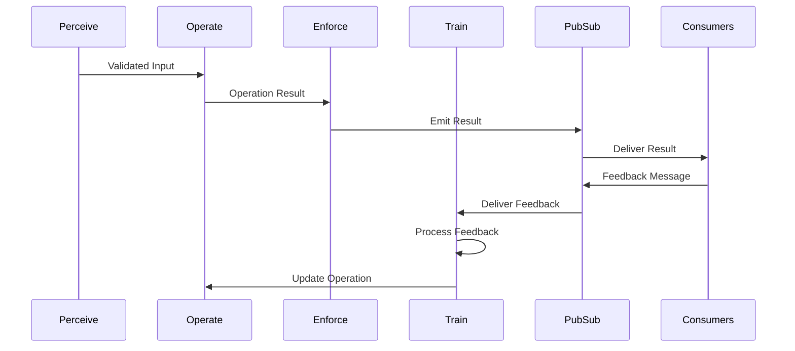
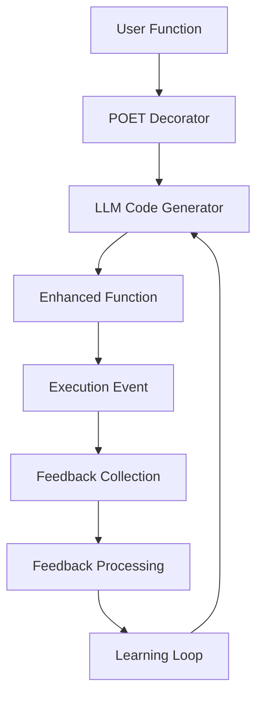
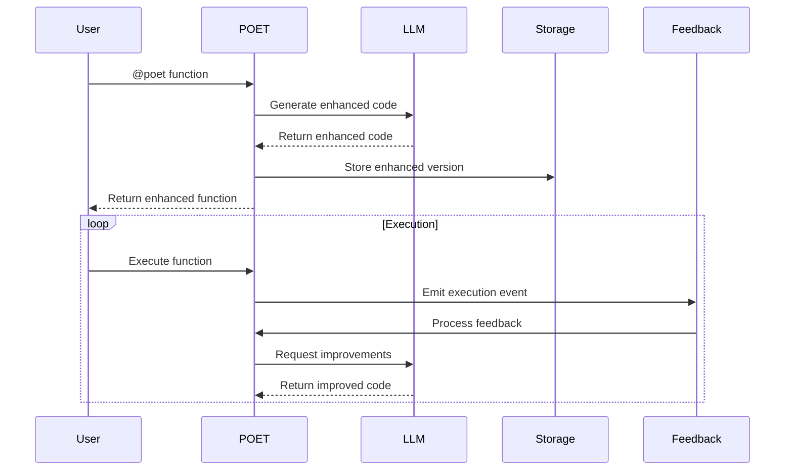

# POET Design Document

## Overview

POET (Perceive-Operate-Enforce-Train) is a function enhancement framework that adds intelligent capabilities to functions through a service-based architecture. The framework follows a strict HTTP-only approach, with all transpilation and enhancement logic handled by a dedicated POET service.

## Architecture

### Core Principles

1. **HTTP-First Architecture**
   - All transpilation and enhancement is handled by a dedicated POET service
   - No built-in transpilation logic in the client library
   - Clear separation between client and service responsibilities
   - Service-based approach enables centralized updates and improvements

2. **Service-Based Enhancement**
   - Transpilation requests sent to POET service via HTTP
   - Service handles all code generation and enhancement
   - Client library focuses on API communication and caching
   - Enables centralized learning and improvement

3. **Caching Strategy**
   - Client-side caching of transpiled functions
   - Cache invalidation based on source code changes
   - Version tracking for enhanced functions
   - Cache storage under `.dana/poet/` directory

### Storage Structure

```
.dana/
  poet/
    functions/           # Enhanced function code
      {function_name}/
        v{version}/
          enhanced.na    # Enhanced Dana code
          metadata.json  # Function metadata
    cache/              # Generated code cache
      {function_name}/
        {source_hash}.json  # Cached generated code
    executions/         # Execution contexts
      {execution_id}/
        context.json    # Execution context
        result.json     # Execution result
    feedback/          # Feedback data
      {function_name}/
        {timestamp}.json  # Feedback records
    magic/             # Future: Magic function cache
```

### Code Generation Workflow

1. **Client Request**
   - Client sends function code to POET service
   - Includes configuration and context
   - Service handles all transpilation logic

2. **Service Processing**
   - Service analyzes source code
   - Generates enhanced implementation
   - Returns enhanced code and metadata

3. **Client Caching**
   - Client caches generated code
   - Uses source code hash as cache key
   - Stores under `.dana/poet/cache/`

### Caching Strategy

1. **Cache Keys**
   - Based on function name and source code hash
   - Includes POET service version
   - Enables cache invalidation on updates

2. **Cache Contents**
   - Generated code
   - Language (Dana/Python)
   - Metadata and version info
   - Service version used

3. **Cache Invalidation**
   - Source code changes
   - POET service updates
   - Manual invalidation
   - Version mismatch

## Implementation Guidelines

### Client Library

1. **HTTP Communication**
   - Use APIClient for all service communication
   - Handle retries and timeouts
   - Proper error handling and logging

2. **Caching**
   - Implement client-side caching
   - Use source code hashing
   - Handle cache invalidation
   - Store under `.dana/poet/`

3. **Error Handling**
   - Clear error messages
   - Proper error types
   - Retry strategies
   - Fallback mechanisms

### Service Requirements

1. **API Endpoints**
   - `/poet/transpile` - Function transpilation
   - `/poet/feedback` - Feedback processing
   - `/poet/functions/{name}` - Function status
   - `/poet/health` - Health check

2. **Response Format**
   ```json
   {
     "poet_implementation": {
       "code": "enhanced code",
       "language": "dana|python"
     },
     "metadata": {
       "version": "1.0.0",
       "enhancements": ["perceive", "operate", "enforce"],
       "fallback_used": false
     }
   }
   ```

3. **Error Responses**
   ```json
   {
     "error": "Error message",
     "code": "ERROR_CODE",
     "details": {}
   }
   ```

## Security Considerations

1. **Service Authentication**
   - API key required
   - Key rotation support
   - Rate limiting

2. **Code Safety**
   - Sandboxed execution
   - Input validation
   - Resource limits

3. **Data Protection**
   - Secure storage
   - Access control
   - Audit logging

## Future Considerations

1. **Service Features**
   - Distributed deployment
   - Load balancing
   - Monitoring and metrics
   - A/B testing support

2. **Client Features**
   - Offline mode
   - Batch processing
   - Advanced caching
   - Performance optimization

3. **Integration**
   - IDE plugins
   - CI/CD support
   - Monitoring tools
   - Analytics dashboard

```text
Author: Christopher Nguyen
Date: 2025-06-13
Version: 0.5
Status: Design Phase
```

**Related Documents:**
- [POET Code Generation Service Design](../../../dxa-factory/poet/service/.design/poet_service_design.md)
- [POET Pub/Sub Design](../../../common/pubsub/.design/pubsub.md)

## Goals
- Transform simple Dana functions into production-ready implementations
- Eliminate manual reliability engineering in Dana code
- Provide domain-specific optimization for Dana functions
- Enable continuous learning through feedback when `optimize_for` is specified
- Support zero-config reliability with automatic P→O→E phases
- Maintain Python support for development and testing purposes

## Non-Goals
- ❌ Complex plugin architecture
- ❌ Premature optimization
- ❌ Speculative features
- ❌ Framework dependencies
- ❌ Custom LLM model training
- ❌ Python-first implementation (Dana is the primary language)

## Problem Statement

Building production-ready Dana functions today requires:
- Manual implementation of error handling, retries, timeouts
- Complex monitoring and feedback collection systems
- Domain-specific optimization that takes weeks to implement
- Slow iteration when requirements change
- No learning mechanism to improve over time

**User Need**: Dana developers want functions that "just work better" and continuously improve, without manual reliability engineering.

## Solution Architecture

### Core Concept
```dana
# Dana language example (primary)
@poet(domain="ml_monitoring")
def detect_drift(current_data, reference_data):
    return {"drift_detected": false, "score": 0.0}

# Generated phases (illustrative fragments)
def perceive(data: dict) -> dict:
    # Input validation, data characteristics
    return {"valid": true, "stats": {...}}

def operate(data: dict) -> dict:
    # Core logic with retries/timeouts
    return {"result": {...}}

def enforce(result: dict) -> bool:
    # Output validation
    return true

def train(feedback: dict) -> void:
    # Learning from execution
    pass
```

```python
# Python support (secondary, for development/testing)
@poet(domain="ml_monitoring")
def detect_drift(current_data, reference_data):
    return {"drift_detected": False, "score": 0.0}
```

### Progressive User Experience
1. **Level 1**: `@poet()` - Instant reliability (retries, timeouts)
2. **Level 2**: `@poet(domain="ml_monitoring")` - Domain intelligence  
3. **Level 3**: `@poet(optimize_for="accuracy")` - Specific optimization goals

## Design Components

### Learning Process & Feedback Flow



### Feedback Message Structure
```dana
struct FeedbackMessage {
    function_id: string
    execution_id: string
    timestamp: datetime
    feedback_type: string  # "success", "error", "performance", "quality"
    metrics: dict<string, float>
    context: dict<string, any>
    suggestions: list<string>
}
```

### Learning Flow
1. **Feedback Collection**:
   - Downstream consumers emit feedback via pubsub
   - Feedback includes metrics, errors, performance data
   - Each feedback message is tagged with function and execution IDs

2. **Feedback Processing**:
   ```dana
   class Train {
       def process_feedback(
           self,
           feedback: FeedbackMessage,
           current_impl: FunctionImplementation
       ) -> LearningDecision {
           # Process feedback and decide on learning actions
       }

       def update_implementation(
           self,
           decision: LearningDecision,
           current_impl: FunctionImplementation
       ) -> FunctionImplementation {
           # Update function implementation based on learning
       }
   }
   ```

3. **Learning Triggers**:
   - Performance degradation (response time, resource usage)
   - Error rate increase
   - Quality metric changes
   - New patterns in feedback

4. **Implementation Updates**:
   - Incremental improvements to existing implementation
   - Complete regeneration for significant changes
   - A/B testing of new implementations
   - Rollback on performance regression

## Design Considerations

### Scalability
- Distributed execution
- Parallel processing
- Resource management
- Load balancing

### Reliability
- Error handling
- Recovery mechanisms
- State management
- Consistency checks

### Security
- Input validation
- Output sanitization
- Access control
- Rate limiting

### Performance
- Response time targets
- Throughput requirements
- Resource utilization
- Caching strategy

## Future Extensions

### Advanced Learning
- Multi-objective optimization
- Transfer learning
- Ensemble methods
- Active learning

### Enhanced Monitoring
- Real-time analytics
- Predictive maintenance
- Anomaly detection
- Performance forecasting

### Extended Domains
- Natural language processing
- Computer vision
- Time series analysis
- Graph processing

## Proposed Design
**Brief Description**: Four-stage pipeline (Perceive → Operate → Enforce → Train) with LLM-powered code generation.

### System Architecture Diagram


### Component Details

#### 1. POET Client-Server Architecture
POET operates exclusively in client-server mode, with the client always connecting to an API server:

```python
class POETClient:
    def __init__(self):
        # Load configuration from .env file
        self.service_uri = os.getenv("AITOMATIC_API_URL", "local")
        self.api_key = os.getenv("AITOMATIC_API_KEY")
        
        # "local" mode means localhost:8080, not embedded transpiler
        if self.service_uri == "local":
            self.service_uri = "http://localhost:8080"
        
        # Always use APIClient - no embedded transpiler
        from opendxa.api.client import APIClient
        self.api_client = APIClient(self.service_uri)
    
    def enhance_function(self, original_func, config):
        # Always sends request to server - no local transpilation
        response_data = self.api_client.post("/poet/transpile", {
            "function_code": inspect.getsource(original_func),
            "config": config.dict()
        })
        return TranspiledFunction.from_response(response_data)
```

#### 2. Domain Templates
Simple text templates that encode domain knowledge:

```python
ML_MONITORING_TEMPLATE = """
Generate enhanced Python implementation for {function_name}.
Domain: ML Monitoring

Requirements:
- Perceive: Validate data types, handle missing data, detect data characteristics
- Operate: Statistical tests (KS, KL divergence), parallel processing, adaptive windowing
- Enforce: Validate output format, ensure statistical significance
- Train: Emit monitoring events, track performance metrics

Original function:
{original_code}

Generate complete enhanced function with ML monitoring intelligence.
"""
```

#### 2. Automatic Lifecycle Management
POET implements seamless resource management with no manual setup required:

```python
# Zero-configuration usage
@poet()
def my_function():
    return "enhanced"

# Server starts automatically on first use
result = my_function()  # ✅ Works immediately
```

**Lifecycle Hierarchy**:
```
Global POET Usage (Standalone)
├── APIServiceManager (Auto-started localhost:8080)
├── APIClient (Auto-connected)
└── Cleanup (Automatic via atexit)

DanaSandbox Usage (Integrated)  
├── APIServiceManager (Session-scoped)
├── APIClient (Session-scoped)
├── LLMResource (Session-scoped)
└── SandboxContext (References only)
```

#### 3. Server-Only Architecture
POET operates exclusively through the OpenDXA API server:

```
┌─────────────────┐    ┌──────────────────────┐    ┌─────────────────┐
│   POET Client   │───▶│   OpenDXA Server     │───▶│  LLM Service    │
│   (@poet deco)  │    │   (localhost:8080)   │    │  (Enhancement)  │
└─────────────────┘    └──────────────────────┘    └─────────────────┘
                                  │                          │
                                  ▼                          ▼
                       ┌──────────────────────┐    ┌─────────────────┐
                       │   Enhanced Function  │    │   Client Code   │
                       │   (Generated Code)   │    │   (Execution)   │
                       └──────────────────────┘    └─────────────────┘
```

### Data Flow Diagram


## Proposed Implementation
**Brief Description**: Implement core infrastructure, domain intelligence, and feedback orchestration in phases.

### Phase 1: Core Infrastructure (Weeks 1-2)
**Goal**: Client-server architecture with API-based transpilation

**Deliverables**:
- [ ] OpenDXA API Server (`opendxa/api/server.py`)
- [ ] POET API routes (`opendxa/dana/poet/routes.py`)
- [ ] POETClient for server communication (`opendxa/dana/poet/client.py`)
- [ ] Function decorator and interception (`opendxa/dana/poet/decorator.py`)
- [ ] Server-side transpilation logic (`opendxa/dana/poet/transpiler.py`)
- [ ] Basic domain template (`opendxa/dana/poet/domains/base.py`)

**Success Criteria**:
- ✅ Local server (localhost:8080) running and accepting requests
- ✅ Can enhance any function with basic retries/timeouts
- ✅ Generated code executes successfully
- ✅ Fallback to original function on server communication failure

### Phase 2: Domain Intelligence (Weeks 3-4)  
**Goal**: Domain-specific enhancements working

**Deliverables**:
- [ ] ML monitoring domain template (`opendxa/dana/poet/domains/ml_monitoring.py`)
- [ ] API operations domain template (`opendxa/dana/poet/domains/api.py`)
- [ ] Server-side LLM integration for transpilation
- [ ] Domain template validation system

**Success Criteria**:
- ✅ Different domains produce visibly different enhancements
- ✅ ML monitoring domain handles statistical tests automatically
- ✅ Server reliably processes domain-specific requests

### Phase 3: Feedback Orchestration & Learning (Weeks 5-6)
**Goal**: Functions improve over time through production feedback

**Deliverables**:
- [ ] Feedback collection integrations (alerts, MLOps, cost tracking)
- [ ] Learning orchestration (pattern analysis, regeneration triggers)
- [ ] Success rate tracking and metrics

**Success Criteria**:
- ✅ Functions automatically regenerate when performance degrades
- ✅ Learning objectives influence generated code behavior
- ✅ Feedback correlation works across session restarts

### Phase 4: Production Readiness (Weeks 7-8)
**Goal**: Ready for real-world ML monitoring usage

**Deliverables**:
- [ ] Comprehensive error handling and security validation
- [ ] Performance optimization (caching, async generation)
- [ ] Complete documentation and ML monitoring showcase
- [ ] Production deployment examples

**Success Criteria**:
- ✅ Sub-10 second enhancement generation
- ✅ 95%+ generated code reliability
- ✅ Complete ML monitoring agent demonstration

## Design Review Checklist
**Status**: ✅ Complete

- [x] **Problem Alignment**: Solution addresses all stated problems
- [x] **Goal Achievement**: Implementation meets all success criteria
- [x] **Non-Goal Compliance**: Staying within defined scope
- [x] **KISS/YAGNI Compliance**: Complexity justified by immediate needs
- [x] **Security review completed**
- [x] **Performance impact assessed**
- [x] **Error handling comprehensive**
- [x] **Testing strategy defined**
- [x] **Documentation planned**
- [x] **Backwards compatibility checked**

## Quality Gates

### Development Standards
- **Code Quality**: All generated code must pass syntax validation
- **Security**: Generated code limited to safe operations only
- **Performance**: Enhancement generation < 10 seconds
- **Reliability**: Fallback to original function if enhancement fails

### Error Handling Strategy

#### 1. Code Generation Errors
- **LLM Generation Failures**:
  - Retry with exponential backoff (max 3 attempts)
  - Fallback to simpler enhancement if complex generation fails
  - Log detailed error context for debugging
  - Alert if failure rate exceeds threshold

- **Validation Failures**:
  - Detailed error messages with specific validation failures
  - Automatic retry with different parameters
  - Fallback to original function if validation fails
  - Track validation failure patterns

#### 2. Runtime Errors
- **Function Execution Errors**:
  - Automatic retry with exponential backoff
  - Circuit breaker for repeated failures
  - Detailed error logging with context
  - Alert on error rate thresholds

- **State Management Errors**:
  - Transaction rollback on failure
  - State recovery mechanisms
  - Version rollback capability
  - Audit trail of state changes

#### 3. Feedback Processing Errors
- **Feedback Collection Errors**:
  - Retry with backoff
  - Queue feedback for later processing
  - Alert on persistent failures
  - Track feedback processing metrics

### Security Considerations

#### 1. Code Generation Security
- **Input Validation**:
  - Sanitize all function inputs
  - Validate code structure
  - Check for malicious patterns
  - Rate limit generation requests

- **Output Validation**:
  - Static code analysis
  - Security pattern checking
  - Resource usage limits
  - Sandboxed execution testing

#### 2. Runtime Security
- **Function Execution**:
  - Resource limits (CPU, memory, time)
  - Network access restrictions
  - File system access controls
  - Environment isolation

- **State Management**:
  - Access control for state changes
  - Audit logging of all operations
  - Encryption of sensitive data
  - Version control security

#### 3. Feedback Security
- **Feedback Collection**:
  - Validate feedback sources
  - Rate limit feedback submission
  - Sanitize feedback content
  - Track feedback patterns

### Performance Requirements

#### 1. Response Time SLAs
- **Code Generation**:
  - 95th percentile < 10 seconds
  - 99th percentile < 30 seconds
  - Timeout at 60 seconds
  - Cache frequent generations

- **Function Execution**:
  - 95th percentile < 100ms
  - 99th percentile < 500ms
  - Timeout at 5 seconds
  - Circuit breaker on slow responses

#### 2. Resource Usage
- **Memory**:
  - Max 1GB per generation
  - Max 256MB per execution
  - Memory monitoring
  - Automatic cleanup

- **CPU**:
  - Max 2 cores per generation
  - Max 1 core per execution
  - CPU time monitoring
  - Throttling on high usage

#### 3. Storage Requirements
- **Function Storage**:
  - Max 10MB per function
  - Max 10 versions per function
  - Automatic cleanup of old versions
  - Compression for large functions

- **Event Storage**:
  - Max 1MB per event
  - 30-day retention
  - Automatic archival
  - Compression for old events

#### 4. Scalability Targets
- **Throughput**:
  - 100 generations per minute
  - 1000 executions per minute
  - 10000 events per minute
  - Auto-scaling based on load

- **Concurrency**:
  - 50 concurrent generations
  - 500 concurrent executions
  - 1000 concurrent events
  - Queue-based throttling

## Risk Assessment & Mitigation

### High Risk
**LLM Generation Reliability**
- *Risk*: Generated code may be incorrect or insecure
- *Mitigation*: Strict validation, sandboxed execution, fallback to original

**Security Concerns** 
- *Risk*: Executing dynamically generated code
- *Mitigation*: Whitelist allowed operations, code review, static analysis

### Medium Risk
**Performance Impact**
- *Risk*: LLM generation latency affects user experience  
- *Mitigation*: Asynchronous generation, aggressive caching, local LLM option

**Integration Complexity**
- *Risk*: Complex integration with Aitomatic services
- *Mitigation*: Well-defined interfaces, extensive integration testing

## Success Metrics

### User Experience Metrics
- Time from `@poet()` to working enhancement: < 30 seconds
- Zero-config success rate: > 90%
- User satisfaction score: > 4.0/5.0

### Technical Performance Metrics  
- Generated code success rate: > 95%
- Enhancement generation time: < 10 seconds
- Storage overhead per function: < 1MB

### Business Impact Metrics
- Reduction in manual reliability code: > 50%
- Developer productivity improvement: > 30%
- Production incident reduction: > 40%

## Deployment Strategies

### Local Development
POET requires a running OpenDXA server even for local development:

```bash
# Required setup for local development
echo "AITOMATIC_API_URL=local" > .env

# Start the OpenDXA server (required)
make opendxa-server
# This starts the server at localhost:8080

# In another terminal, run your POET code
python your_poet_script.py
```

**Key Points**:
- "Local mode" means connecting to localhost:8080
- No embedded transpiler - server is always required
- Developers must run `make opendxa-server` for local development
- This simplifies the architecture to one code path

### Production Deployment
For production, set the API URL to the hosted service:

```bash
# Production configuration
AITOMATIC_API_URL=https://api.aitomatic.com
AITOMATIC_API_KEY=sk-ait-xxxxx
```

### Architecture Benefits
- **Single Code Path**: Same client-server logic for local and remote
- **Simplified Testing**: All testing uses the same API interface
- **Consistent Behavior**: No behavioral differences between modes
- **Easier Debugging**: All requests go through the same pipeline

## Design Decisions

### KISS Principles Applied
- **Simple storage**: Flat files, no complex databases
- **Minimal config**: Smart defaults, progressive disclosure
- **Direct enhancement**: LLM generates code, not metadata
- **Server-only architecture**: One code path for all scenarios

### YAGNI Principles Applied  
- **No frameworks**: Domain templates, not plugin architectures
- **No premature optimization**: Basic reliability first
- **No speculative features**: Build for actual user needs
- **No embedded modes**: Always use server for consistency 

## Code Generation and Caching Strategy

### Storage Structure
```
.dana/
├── poet/                     # POET-specific storage
│   ├── {function_name}/
│   │   ├── v{version}/
│   │   │   ├── enhanced.na      # Enhanced Dana function code
│   │   │   ├── train.na         # Train method (if optimize_for specified)
│   │   │   └── metadata.json    # Function metadata
│   ├── cache/                   # Generated code cache
│   │   └── {function_name}/
│   │       └── {source_hash}.json  # Cached generated code
│   ├── executions/              # Execution contexts
│   └── feedback/               # Feedback data
├── magic/                    # Magic function cache (future)
└── other/                    # Other Dana features (future)
```

### Code Generation Workflow
1. **Source Code Analysis**
   - Calculate hash of source Dana code
   - Check cache for existing generated code
   - If found and source unchanged, use cached version
   - If not found or source changed, proceed to generation

2. **Code Generation**
   - Generate Dana code by default
   - Only generate Python if:
     a) Function requires capabilities not available in Dana
     b) LLM determines Python would be more appropriate
     c) Enhancement fails and needs fallback
   - Store generated code in cache with source hash

3. **Caching Strategy**
   - Cache key: `{function_name}_{source_hash}`
   - Cache includes:
     - Generated code (Dana or Python)
     - Source code hash
     - Generation metadata
     - Timestamp
   - Cache invalidation:
     - Source code changes
     - POET version changes
     - Cache corruption

4. **Storage Organization**
   - Versioned storage for production code
   - Separate cache directory for generated code
   - Execution and feedback storage for learning
   - All paths relative to project root

### Python Fallback Mechanism
- Primary goal: Generate Dana code
- Fallback to Python when:
  1. Function requires Python-specific features
  2. LLM determines Python is more appropriate
  3. Dana enhancement fails
- Fallback process:
  1. Log fallback reason
  2. Generate Python implementation
  3. Store in cache with fallback metadata
  4. Monitor performance for potential Dana migration 