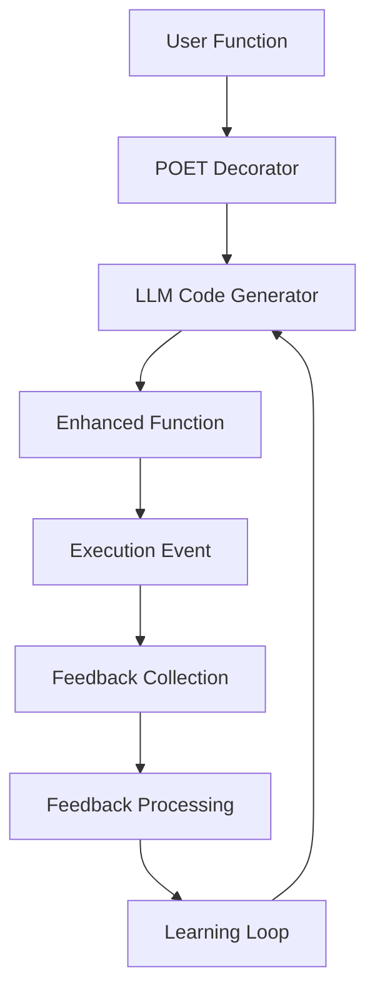
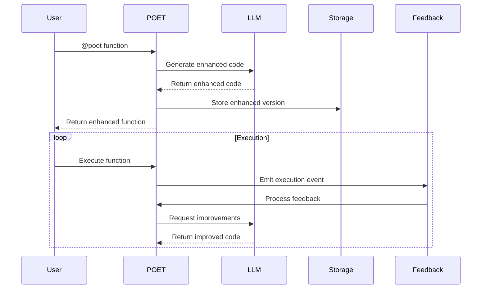

# POET LLM Code Generation - 3D Design Document

```text
Author: Christopher Nguyen
Date: 2025-06-13
Version: 0.5
Status: Design Phase
```

**Related Documents:**
- [POET Code Generation Service Design](../../../dxa-factory/poet/service/.design/poet_service_design.md)
- [POET Pub/Sub Design](../../../common/pubsub/.design/pubsub_design.md)

## Problem Statement
**Brief Description**: Building production-ready functions today requires manual implementation of reliability patterns, complex monitoring systems, and domain-specific optimization, with no built-in learning mechanism.

- Manual implementation of error handling, retries, timeouts
- Complex monitoring and feedback collection systems
- Domain-specific optimization that takes weeks to implement
- Slow iteration when requirements change
- No learning mechanism to improve over time

**User Need**: Developers want functions that "just work better" and continuously improve, without manual reliability engineering.

## Goals
**Brief Description**: Transform simple functions into production-ready implementations with built-in reliability, domain intelligence, and continuous learning capabilities.

- Transform simple functions into production-ready implementations
- Eliminate manual reliability engineering
- Provide domain-specific optimization
- Enable continuous learning through feedback
- Support zero-config reliability

## Non-Goals
**Brief Description**: Focus on core functionality without unnecessary complexity.

- ❌ Complex plugin architecture
- ❌ Premature optimization
- ❌ Speculative features
- ❌ Framework dependencies
- ❌ Custom LLM model training

## Proposed Solution
**Brief Description**: Use LLM to generate enhanced function implementations with built-in reliability, domain intelligence, and learning capabilities.

### Core Concept
```python
# User writes simple function
@poet(domain="ml_monitoring")
def detect_drift(current_data, reference_data):
    return {"drift_detected": False, "score": 0.0}

# POET generates enhanced version with:
# - Statistical tests (KS, KL divergence) (Perceive)
# - Retry logic and error handling (Operate)  
# - Output validation and checks (Enforce)
# - Feedback collection hooks (Train)
```

### Progressive User Experience
1. **Level 1**: `@poet()` - Instant reliability (retries, timeouts)
2. **Level 2**: `@poet(domain="ml_monitoring")` - Domain intelligence  
3. **Level 3**: `@poet(optimize_for="accuracy")` - Specific optimization goals

## Proposed Design
**Brief Description**: Four-stage pipeline (Perceive → Operate → Enforce → Train) with LLM-powered code generation.

### System Architecture Diagram


### Component Details

#### 1. LLM Code Generator
Core service that generates enhanced function implementations:

```python
class POETCodeGenerator:
    def __init__(self, llm_client):
        self.llm = llm_client
        self.domain_templates = DomainTemplates()
    
    def enhance_function(self, original_func, config):
        # Generate enhanced implementation via LLM
        template = self.domain_templates.get(config.domain)
        enhanced_code = self.llm.generate(template.format(
            function_name=original_func.__name__,
            original_code=inspect.getsource(original_func),
            domain_requirements=template.requirements
        ))
        return self.compile_and_validate(enhanced_code)
```

#### 2. Domain Templates
Simple text templates that encode domain knowledge:

```python
ML_MONITORING_TEMPLATE = """
Generate enhanced Python implementation for {function_name}.
Domain: ML Monitoring

Requirements:
- Perceive: Validate data types, handle missing data, detect data characteristics
- Operate: Statistical tests (KS, KL divergence), parallel processing, adaptive windowing
- Enforce: Validate output format, ensure statistical significance
- Train: Emit monitoring events, track performance metrics

Original function:
{original_code}

Generate complete enhanced function with ML monitoring intelligence.
"""
```

#### 3. Aitomatic Integration
POET integrates with Aitomatic services via clean interfaces:

```
┌─────────────────┐    ┌──────────────────────┐    ┌─────────────────┐
│   DANA Code     │───▶│  Transpilation Agent │───▶│  POET Service   │
│   (.na files)   │    │  (Aitomatic Agent)   │    │  (Enhancement)  │
└─────────────────┘    └──────────────────────┘    └─────────────────┘
                                  │                          │
                                  ▼                          ▼
                       ┌──────────────────────┐    ┌─────────────────┐
                       │   Python Functions   │    │ Enhanced Python │
                       │   (Base Functions)   │    │  (Production)   │
                       └──────────────────────┘    └─────────────────┘
```

### Data Flow Diagram


## Proposed Implementation
**Brief Description**: Implement core infrastructure, domain intelligence, and feedback orchestration in phases.

### Phase 1: Core Infrastructure (Weeks 1-2)
**Goal**: Basic LLM code generation working

**Deliverables**:
- [ ] POETCodeGenerator class (`opendxa/dana/poet/generator.py`)
- [ ] Function decorator and interception (`opendxa/dana/poet/decorator.py`)
- [ ] Simple file storage system (`opendxa/dana/poet/storage.py`)
- [ ] Basic domain template (`opendxa/dana/poet/domains/base.py`)
- [ ] POETEventQueue implementation (`opendxa/common/event_queue.py`)

**Success Criteria**:
- ✅ Can enhance any function with basic retries/timeouts
- ✅ Generated code executes successfully
- ✅ Fallback to original function on generation failure

### Phase 2: Domain Intelligence (Weeks 3-4)  
**Goal**: Domain-specific enhancements working

**Deliverables**:
- [ ] ML monitoring domain template (`opendxa/dana/poet/domains/ml_monitoring.py`)
- [ ] API operations domain template (`opendxa/dana/poet/domains/api.py`)
- [ ] Aitomatic agent integration layer
- [ ] Domain template validation system

**Success Criteria**:
- ✅ Different domains produce visibly different enhancements
- ✅ ML monitoring domain handles statistical tests automatically
- ✅ Integration with Aitomatic transpilation agent works

### Phase 3: Feedback Orchestration & Learning (Weeks 5-6)
**Goal**: Functions improve over time through production feedback

**Deliverables**:
- [ ] Feedback collection integrations (alerts, MLOps, cost tracking)
- [ ] Learning orchestration (pattern analysis, regeneration triggers)
- [ ] Success rate tracking and metrics

**Success Criteria**:
- ✅ Functions automatically regenerate when performance degrades
- ✅ Learning objectives influence generated code behavior
- ✅ Feedback correlation works across session restarts

### Phase 4: Production Readiness (Weeks 7-8)
**Goal**: Ready for real-world ML monitoring usage

**Deliverables**:
- [ ] Comprehensive error handling and security validation
- [ ] Performance optimization (caching, async generation)
- [ ] Complete documentation and ML monitoring showcase
- [ ] Production deployment examples

**Success Criteria**:
- ✅ Sub-10 second enhancement generation
- ✅ 95%+ generated code reliability
- ✅ Complete ML monitoring agent demonstration

## Design Review Checklist
**Status**: ✅ Complete

- [x] **Problem Alignment**: Solution addresses all stated problems
- [x] **Goal Achievement**: Implementation meets all success criteria
- [x] **Non-Goal Compliance**: Staying within defined scope
- [x] **KISS/YAGNI Compliance**: Complexity justified by immediate needs
- [x] **Security review completed**
- [x] **Performance impact assessed**
- [x] **Error handling comprehensive**
- [x] **Testing strategy defined**
- [x] **Documentation planned**
- [x] **Backwards compatibility checked**

## Quality Gates

### Development Standards
- **Code Quality**: All generated code must pass syntax validation
- **Security**: Generated code limited to safe operations only
- **Performance**: Enhancement generation < 10 seconds
- **Reliability**: Fallback to original function if enhancement fails

### Error Handling Strategy

#### 1. Code Generation Errors
- **LLM Generation Failures**:
  - Retry with exponential backoff (max 3 attempts)
  - Fallback to simpler enhancement if complex generation fails
  - Log detailed error context for debugging
  - Alert if failure rate exceeds threshold

- **Validation Failures**:
  - Detailed error messages with specific validation failures
  - Automatic retry with different parameters
  - Fallback to original function if validation fails
  - Track validation failure patterns

#### 2. Runtime Errors
- **Function Execution Errors**:
  - Automatic retry with exponential backoff
  - Circuit breaker for repeated failures
  - Detailed error logging with context
  - Alert on error rate thresholds

- **State Management Errors**:
  - Transaction rollback on failure
  - State recovery mechanisms
  - Version rollback capability
  - Audit trail of state changes

#### 3. Feedback Processing Errors
- **Feedback Collection Errors**:
  - Retry with backoff
  - Queue feedback for later processing
  - Alert on persistent failures
  - Track feedback processing metrics

### Security Considerations

#### 1. Code Generation Security
- **Input Validation**:
  - Sanitize all function inputs
  - Validate code structure
  - Check for malicious patterns
  - Rate limit generation requests

- **Output Validation**:
  - Static code analysis
  - Security pattern checking
  - Resource usage limits
  - Sandboxed execution testing

#### 2. Runtime Security
- **Function Execution**:
  - Resource limits (CPU, memory, time)
  - Network access restrictions
  - File system access controls
  - Environment isolation

- **State Management**:
  - Access control for state changes
  - Audit logging of all operations
  - Encryption of sensitive data
  - Version control security

#### 3. Feedback Security
- **Feedback Collection**:
  - Validate feedback sources
  - Rate limit feedback submission
  - Sanitize feedback content
  - Track feedback patterns

### Performance Requirements

#### 1. Response Time SLAs
- **Code Generation**:
  - 95th percentile < 10 seconds
  - 99th percentile < 30 seconds
  - Timeout at 60 seconds
  - Cache frequent generations

- **Function Execution**:
  - 95th percentile < 100ms
  - 99th percentile < 500ms
  - Timeout at 5 seconds
  - Circuit breaker on slow responses

#### 2. Resource Usage
- **Memory**:
  - Max 1GB per generation
  - Max 256MB per execution
  - Memory monitoring
  - Automatic cleanup

- **CPU**:
  - Max 2 cores per generation
  - Max 1 core per execution
  - CPU time monitoring
  - Throttling on high usage

#### 3. Storage Requirements
- **Function Storage**:
  - Max 10MB per function
  - Max 10 versions per function
  - Automatic cleanup of old versions
  - Compression for large functions

- **Event Storage**:
  - Max 1MB per event
  - 30-day retention
  - Automatic archival
  - Compression for old events

#### 4. Scalability Targets
- **Throughput**:
  - 100 generations per minute
  - 1000 executions per minute
  - 10000 events per minute
  - Auto-scaling based on load

- **Concurrency**:
  - 50 concurrent generations
  - 500 concurrent executions
  - 1000 concurrent events
  - Queue-based throttling

## Risk Assessment & Mitigation

### High Risk
**LLM Generation Reliability**
- *Risk*: Generated code may be incorrect or insecure
- *Mitigation*: Strict validation, sandboxed execution, fallback to original

**Security Concerns** 
- *Risk*: Executing dynamically generated code
- *Mitigation*: Whitelist allowed operations, code review, static analysis

### Medium Risk
**Performance Impact**
- *Risk*: LLM generation latency affects user experience  
- *Mitigation*: Asynchronous generation, aggressive caching, local LLM option

**Integration Complexity**
- *Risk*: Complex integration with Aitomatic services
- *Mitigation*: Well-defined interfaces, extensive integration testing

## Success Metrics

### User Experience Metrics
- Time from `@poet()` to working enhancement: < 30 seconds
- Zero-config success rate: > 90%
- User satisfaction score: > 4.0/5.0

### Technical Performance Metrics  
- Generated code success rate: > 95%
- Enhancement generation time: < 10 seconds
- Storage overhead per function: < 1MB

### Business Impact Metrics
- Reduction in manual reliability code: > 50%
- Developer productivity improvement: > 30%
- Production incident reduction: > 40%

## Design Decisions

### KISS Principles Applied
- **Simple storage**: Flat files, no complex databases
- **Minimal config**: Smart defaults, progressive disclosure
- **Direct enhancement**: LLM generates code, not metadata
- **Agent integration**: Clean service boundaries

### YAGNI Principles Applied  
- **No frameworks**: Domain templates, not plugin architectures
- **No premature optimization**: Basic reliability first
- **No speculative features**: Build for actual user needs
- **Service abstraction**: Let Aitomatic handle transpilation 