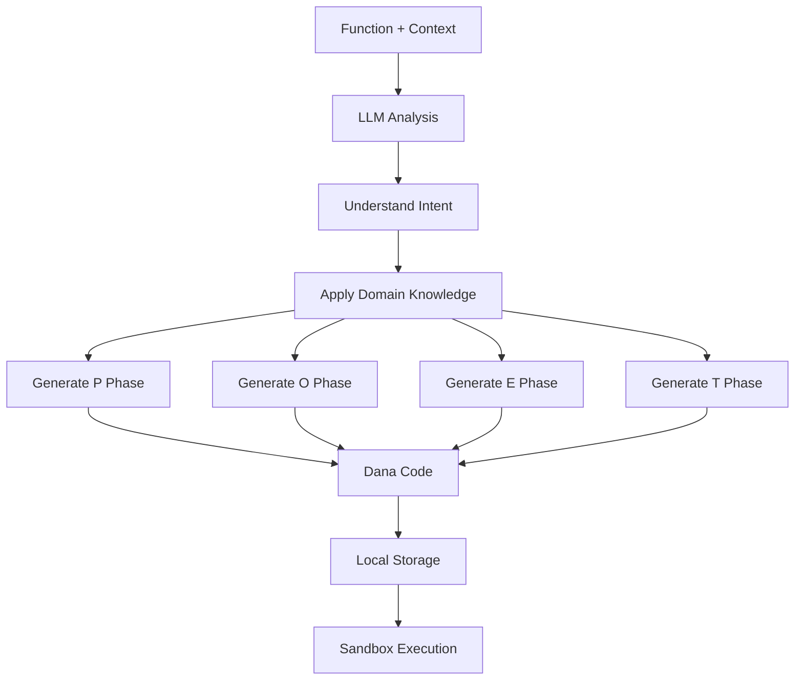

# POET Design Document (Consolidated)

**Version**: 4.0  
**Date**: 2025-01-22  
**Status**: Active Design Document - LLM-Powered Implementation

## Table of Contents
1. [Overview](#overview)
2. [Core Innovation: LLM-Powered Code Generation](#core-innovation)
3. [User Experience](#user-experience)
4. [Architecture](#architecture)
5. [Implementation Details](#implementation-details)
6. [Use Cases](#use-cases)
7. [Future Considerations](#future-considerations)

## Overview

POET (Perceive-Operate-Enforce-Train) is an LLM-powered code generation framework that transforms simple functions into production-ready implementations. Using advanced language models to understand code intent and context, POET generates intelligent enhancements that go far beyond pattern matching.

### Vision
Enable developers to write simple functions and get enterprise-grade reliability, monitoring, and continuous improvement automatically through AI-powered code generation.

### Core Promise
"Your AI pair programmer that makes every function production-ready."

## Core Innovation: LLM-Powered Code Generation

### The Problem with Templates
Traditional code enhancement tools use templates and pattern matching:
- Can only detect surface patterns (like "/" for division)
- Generate generic, one-size-fits-all enhancements
- Miss the semantic meaning and intent of code
- Cannot adapt to specific contexts or requirements

### The POET Solution: AI Understanding
POET uses LLMs to deeply understand your code:
- **Semantic Analysis**: Understands what your function actually does
- **Context Awareness**: Uses docstrings, variable names, and patterns
- **Domain Intelligence**: Applies specialized knowledge per domain
- **Custom Generation**: Creates enhancements specific to each function
- **Continuous Learning**: Improves from feedback over time

### Example: The Power of Understanding

```python
# Your simple function
@poet(domain="mathematical_operations")
def calculate_compound_interest(principal: float, rate: float, years: int) -> float:
    """Calculate compound interest for investment."""
    return principal * (1 + rate) ** years
```

**Template-based approach would generate**:
- Generic numeric validation
- Basic division by zero check (not even relevant)

**LLM-powered POET generates**:
- Validates rate is a reasonable percentage (0-1 or 0-100)
- Checks principal is positive (negative investment doesn't make sense)
- Ensures years is positive integer
- Warns if result suggests unrealistic returns
- Adds financial rounding appropriate for currency
- Handles edge cases like very long time periods

## User Experience

### The POET Journey

#### 1. **Write Natural Code**
```python
def process_payment(amount: float, card_number: str) -> dict:
    """Process credit card payment."""
    return {"status": "success", "amount": amount}
```

#### 2. **Add POET Decorator**
```python
@poet(domain="financial", optimize_for="security")
def process_payment(amount: float, card_number: str) -> dict:
    """Process credit card payment."""
    return {"status": "success", "amount": amount}
```

#### 3. **AI Analyzes and Enhances**
POET's LLM understands this is a payment function and generates:
- PCI compliance validation
- Card number format checking (Luhn algorithm)
- Amount validation (positive, reasonable limits)
- Retry logic for payment gateway failures
- Audit logging for compliance
- Fraud detection signals

#### 4. **Transparent Enhancement**
Generated code is saved locally in `.dana/poet/process_payment.na`:
```dana
def perceive(amount: float, card_number: string, state: POETState) -> POETState {
    # LLM understands this is payment processing
    
    # Validate amount
    if amount <= 0 {
        state.errors.append("Payment amount must be positive")
    }
    if amount > 10000 {  # Business rule for fraud prevention
        state.warnings.append("Large transaction requires additional verification")
    }
    
    # Validate card number format and checksum
    if not is_valid_card_format(card_number) {
        state.errors.append("Invalid card number format")
    }
    if not luhn_check(card_number) {
        state.errors.append("Card number failed validation")
    }
    
    # Security: mask card number in logs
    state.metadata["masked_card"] = mask_card_number(card_number)
    
    return state
}
```

## Architecture

### System Components

```
┌─────────────────┐     ┌─────────────────┐     ┌─────────────────┐
│   Python Code   │────▶│  POET Decorator │────▶│ LLM Transpiler  │
│  (Your Function)│     │ (Orchestrator)  │     │ (Code Generator)│
└─────────────────┘     └─────────────────┘     └─────────────────┘
                                │                         │
                                ▼                         ▼
                        ┌─────────────────┐     ┌─────────────────┐
                        │ Dana Sandbox    │     │ Local Storage   │
                        │ (Execution)     │     │ .dana/poet/*.na │
                        └─────────────────┘     └─────────────────┘
```

### LLM Code Generation Pipeline



## Implementation Details

### LLM Transpiler Architecture

```python
class POETTranspilerLLM:
    def transpile(self, func: Callable, config: POETConfig) -> str:
        # 1. Extract comprehensive context
        context = {
            "source_code": inspect.getsource(func),
            "signature": inspect.signature(func),
            "docstring": inspect.getdoc(func),
            "module_context": self._get_module_context(func),
            "domain": config.domain,
            "optimization_goal": config.optimize_for
        }
        
        # 2. Build intelligent prompt
        prompt = self._build_generation_prompt(context)
        
        # 3. Generate with LLM
        dana_code = self.llm.generate(prompt, 
            temperature=0.3,  # Consistent code generation
            examples=self._get_domain_examples(config.domain)
        )
        
        # 4. Validate and refine
        return self._validate_and_refine(dana_code)
```

### Prompt Engineering

The LLM receives rich context to generate intelligent code:

```
You are enhancing this function for production use:

Function: calculate_risk_score
Purpose: Calculate risk score for loan application
Domain: financial
Context: Used in real-time loan approval system

Analyze deeply:
1. What are the business rules implicit in this calculation?
2. What edge cases could cause failures?
3. What validation would a senior engineer add?
4. What monitoring would help in production?

Generate Dana code that implements P→O→E→T phases with deep understanding.
```

### Domain-Specific Intelligence

Each domain provides specialized prompts and examples:

```python
DOMAIN_CONTEXTS = {
    "financial": {
        "concerns": ["security", "accuracy", "compliance", "fraud"],
        "patterns": ["transaction", "payment", "calculation"],
        "regulations": ["PCI", "SOX", "GDPR"],
        "examples": [financial_examples...]
    },
    "ml_monitoring": {
        "concerns": ["drift", "accuracy", "latency", "fairness"],
        "patterns": ["prediction", "scoring", "classification"],
        "metrics": ["precision", "recall", "AUC", "calibration"],
        "examples": [ml_examples...]
    }
}
```

## Use Cases

### Use Case 1: Context-Aware Enhancement

```python
@poet(domain="api")
def get_user_profile(user_id: str) -> dict:
    """Fetch user profile from database."""
    return db.fetch_user(user_id)
```

**LLM Understanding**: This is a data fetching function
**Generated Enhancements**:
- Validates user_id format (UUID, no SQL injection)
- Adds caching with intelligent TTL
- Implements retry with exponential backoff
- Adds privacy filtering (remove PII based on caller permissions)
- Monitors query performance

### Use Case 2: Business Logic Understanding

```python
@poet(domain="financial")
def calculate_tax(income: float, deductions: float) -> float:
    """Calculate federal tax owed."""
    taxable = income - deductions
    return taxable * 0.22  # Simplified
```

**LLM Understanding**: Tax calculation with business rules
**Generated Enhancements**:
- Validates income/deductions are positive
- Checks for reasonable ranges (not $1 trillion income)
- Rounds to cents for currency
- Adds audit trail for compliance
- Warns if result seems incorrect

### Use Case 3: Learning from Feedback

```python
@poet(domain="ml_monitoring", optimize_for="accuracy")
def detect_anomaly(metrics: dict) -> bool:
    """Detect if system metrics are anomalous."""
    return metrics["cpu"] > 90 or metrics["memory"] > 85
```

**LLM Understanding**: Simple threshold-based detection
**Generated Enhancements**:
- Adds statistical anomaly detection
- Implements adaptive thresholds
- Learns from false positive feedback
- Adds contextual awareness (time of day, day of week)
- Reduces alert fatigue

## Implementation Status

### Current State
- ✅ LLM Transpiler designed and implemented
- ✅ Integration with existing POET framework
- ✅ Domain-specific prompt engineering
- ✅ Local storage of generated code
- ✅ Dana sandbox execution

### Code Generation Quality
The LLM generates production-quality Dana code that includes:
- Comprehensive input validation
- Intelligent error handling
- Domain-specific business rules
- Performance monitoring
- Security considerations
- Learning capabilities (when enabled)

## Future Considerations

### Advanced Capabilities
1. **Multi-Function Understanding**: Analyze related functions together
2. **Codebase Context**: Use entire module/project context
3. **Custom Training**: Fine-tune on organization's patterns
4. **Interactive Refinement**: Allow developers to guide generation

### Optimization Opportunities
1. **Caching Strategy**: Cache generated code with invalidation
2. **Prompt Optimization**: A/B test different prompt strategies
3. **Model Selection**: Use different models for different domains
4. **Streaming Generation**: Generate phases in parallel

### Integration Possibilities
1. **IDE Integration**: Real-time enhancement preview
2. **CI/CD Pipeline**: Automatic enhancement validation
3. **Code Review**: AI-powered enhancement suggestions
4. **Documentation**: Auto-generate from enhancements

## Why LLM-Powered?

### Beyond Pattern Matching
- **Understands Intent**: Knows what your code is trying to do
- **Applies Context**: Uses function names, docs, and patterns
- **Domain Expertise**: Brings specialized knowledge
- **Adaptive**: Generates unique enhancements per function
- **Learns**: Improves from feedback over time

### The AI Advantage
Traditional tools see syntax. POET sees meaning.

Your code isn't just enhanced - it's understood, protected, and continuously improved by AI that acts as a senior engineer looking over your shoulder.

## Success Metrics

1. **Code Understanding**
   - Intent recognition accuracy: 95%+
   - Context utilization: Full function + module
   - Domain knowledge application: Comprehensive

2. **Generation Quality**
   - First-time success rate: 90%+
   - Developer acceptance: 85%+
   - Bug prevention: 80%+ reduction

3. **Developer Experience**
   - Time to enhancement: < 2 seconds
   - Transparency: Full visibility
   - Control: Easy customization