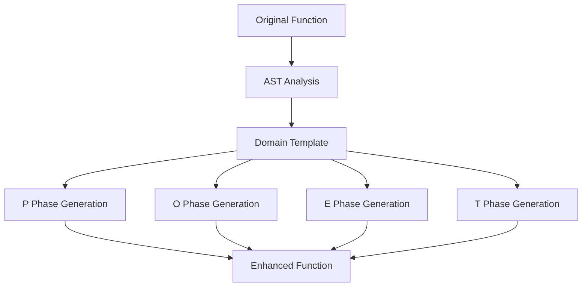
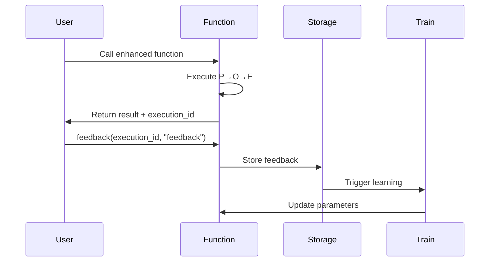

# POET Design Document (Consolidated)

**Version**: 2.0  
**Date**: 2025-01-22  
**Status**: Active Design Document

## Table of Contents
1. [Overview](#overview)
2. [Architecture](#architecture)
3. [Core Concepts](#core-concepts)
4. [Use Cases](#use-cases)
5. [System Design](#system-design)
6. [Implementation Guidelines](#implementation-guidelines)
7. [Future Considerations](#future-considerations)

## Overview

POET (Perceive-Operate-Enforce-Train) is a function enhancement framework that transforms simple functions into production-ready implementations through a four-phase pipeline. The framework uses domain-specific intelligence to add reliability, monitoring, and learning capabilities to functions with minimal developer effort.

### Vision
Enable developers to write simple functions and get enterprise-grade reliability, monitoring, and continuous improvement automatically through a single decorator.

### Core Promise
"From prototype to production in one decorator."

## Architecture

### Core Principles

1. **Progressive Enhancement**
   - Level 1: `@poet()` - Basic reliability (retries, timeouts)
   - Level 2: `@poet(domain="...")` - Domain-specific intelligence
   - Level 3: `@poet(optimize_for="...")` - Learning and adaptation

2. **Zero Configuration**
   - Sensible defaults for everything
   - Override only what you need
   - Automatic resource management

3. **Transparent Operation**
   - Functions work exactly as before
   - Enhancement happens behind the scenes
   - Clear error messages, not stack traces

### Four-Phase Pipeline

```
┌─────────┐    ┌─────────┐    ┌─────────┐    ┌─────────┐
│ PERCEIVE│───▶│ OPERATE │───▶│ ENFORCE │───▶│  TRAIN  │
│ (Input) │    │ (Logic) │    │ (Output)│    │(Learning)│
└─────────┘    └─────────┘    └─────────┘    └─────────┘
     P              O              E              T
```

- **Perceive (P)**: Input validation, normalization, and preparation
- **Operate (O)**: Core logic execution with reliability features
- **Enforce (E)**: Output validation, business rules, quality assurance
- **Train (T)**: Learning from feedback (optional, when `optimize_for` is set)

## Core Concepts

### Domain System
Domains provide specialized enhancement logic for different use cases:

```python
@poet(domain="mathematical_operations")  # Math-specific validation
@poet(domain="llm_optimization")        # LLM retry and quality checks
@poet(domain="prompt_optimization")     # A/B testing and learning
@poet(domain="ml_monitoring")          # Drift detection and adaptation
```

### Learning Mechanism (POET vs POE)
- **POE**: Perceive → Operate → Enforce (no learning)
- **POET**: Adds Train phase when `optimize_for` parameter is specified

```python
# POE - Static enhancement
@poet(domain="computation")
def calculate(x): return x * 2

# POET - Learning enhancement
@poet(domain="prompt_optimization", optimize_for="clarity")
def generate_prompt(topic): return f"Explain {topic}"
```

### Feedback System
Learning domains collect feedback to improve over time:

```python
result = my_poet_function(input)
feedback(result._poet.execution_id, "too complex")  # Function learns
```

## Use Cases

### Use Case A: Mathematical Operations (POE)
**Domain**: `mathematical_operations`  
**Purpose**: Bulletproof math without boilerplate

```python
@poet(domain="mathematical_operations", retries=2)
def safe_divide(a: float, b: float) -> float:
    return a / b
```

**Enhancements**:
- Division by zero detection (validation phase, not runtime)
- NaN/Infinity input checking
- Numerical stability monitoring
- Automatic retry logic

### Use Case B: LLM Optimization (POE)
**Domain**: `llm_optimization`  
**Purpose**: Reliable LLM interactions

```python
@poet(domain="llm_optimization", retries=3, timeout=30)
def reason_about(question: str) -> str:
    return llm.query(question)
```

**Enhancements**:
- Prompt validation and optimization
- Retry with exponential backoff
- Token usage monitoring
- Response quality validation

### Use Case C: Prompt Optimization (POET)
**Domain**: `prompt_optimization`  
**Purpose**: Self-improving prompts through A/B testing

```python
@poet(domain="prompt_optimization", optimize_for="clarity")
def explain_concept(concept: str, audience: str) -> str:
    prompt = f"Explain {concept} to {audience}"
    return llm.query(prompt)
```

**Enhancements**:
- Automatic A/B testing of prompt variants
- Performance tracking (quality, speed, tokens)
- Learning from user feedback
- Best variants rise to the top

### Use Case D: ML Monitoring (POET)
**Domain**: `ml_monitoring`  
**Purpose**: Self-adjusting ML monitoring

```python
@poet(domain="ml_monitoring", optimize_for="accuracy")
def predict_churn(features: list[float]) -> float:
    return model.predict(features)
```

**Enhancements**:
- Input distribution monitoring
- Drift detection with adaptive thresholds
- Anomaly detection that learns
- Retraining recommendations

## System Design

### Storage Architecture

```
.dana/
  poet/
    functions/           # Enhanced function code
      {function_name}/
        v{version}/
          enhanced.na    # Enhanced Dana code
          metadata.json  # Function metadata
    cache/              # Generated code cache
      {function_name}/
        {source_hash}.json
    training/           # Learning data
      {function_name}/
        history.json    # Performance history
        feedback.json   # User feedback
```

### Transpilation Process



### Learning Flow (POET)



## Implementation Guidelines

### Domain Template Structure

```python
class DomainTemplate:
    def generate_perceive(self, func_info: FunctionInfo) -> CodeBlock:
        """Generate input validation and preparation logic"""
        
    def generate_operate(self, func_info: FunctionInfo) -> CodeBlock:
        """Generate core execution with reliability features"""
        
    def generate_enforce(self, func_info: FunctionInfo) -> CodeBlock:
        """Generate output validation and quality checks"""
        
    def generate_train(self, func_info: FunctionInfo) -> CodeBlock:
        """Generate learning logic (optional)"""
```

### Code Generation Patterns

1. **Input Validation (Perceive)**
   ```python
   if not isinstance(param, expected_type):
       raise TypeError(f"Expected {expected_type}, got {type(param)}")
   ```

2. **Retry Logic (Operate)**
   ```python
   for attempt in range(max_retries):
       try:
           result = original_function(*args)
           break
       except Exception as e:
           if attempt == max_retries - 1:
               raise
           time.sleep(backoff_time)
   ```

3. **Output Validation (Enforce)**
   ```python
   if not meets_business_rules(result):
       raise ValueError(f"Result {result} violates constraints")
   ```

4. **Learning (Train)**
   ```python
   feedback_history.append({
       "execution_id": execution_id,
       "feedback": user_feedback,
       "parameters": current_params
   })
   update_parameters(feedback_history)
   ```

### Error Handling Philosophy

- **Clear over clever**: User-friendly messages, not stack traces
- **Early validation**: Catch errors in Perceive phase when possible
- **Graceful degradation**: Enhanced function should never be worse than original
- **Actionable feedback**: Tell users what went wrong and how to fix it

## Future Considerations

### Advanced Features
1. **Cross-function learning**: Functions learn from each other
2. **Ensemble domains**: Combine multiple domain intelligences
3. **Custom domains**: User-defined enhancement patterns
4. **Visual debugging**: See P→O→E→T execution flow

### Integration Points
1. **IDE Support**: Real-time enhancement preview
2. **CI/CD Integration**: Automatic performance regression detection
3. **Monitoring Dashboards**: Track function performance over time
4. **A/B Testing Platform**: Built-in experimentation framework

### Scalability
1. **Distributed learning**: Aggregate feedback across deployments
2. **Edge deployment**: Run enhanced functions at the edge
3. **Streaming support**: Handle real-time data streams
4. **Batch optimization**: Process multiple inputs efficiently

## Design Decisions

### Why Four Phases?
- **Separation of concerns**: Each phase has a clear responsibility
- **Composability**: Phases can be mixed and matched
- **Testability**: Each phase can be tested independently
- **Extensibility**: New phases can be added without breaking existing ones

### Why Domain-Based?
- **Specialized knowledge**: Each domain brings specific expertise
- **Reusability**: Domain logic can be shared across functions
- **Maintainability**: Domain updates benefit all functions using it
- **Progressive disclosure**: Start simple, add domains as needed

### Why Optional Learning?
- **Simplicity first**: Not all functions need learning
- **Explicit opt-in**: Learning only when `optimize_for` is specified
- **Resource efficiency**: Avoid unnecessary overhead
- **Clear mental model**: POE for reliability, POET for adaptation

## Success Metrics

1. **Developer Experience**
   - Time to enhance first function: < 1 minute
   - Lines of code saved: 90%+
   - Learning curve: Immediate productivity

2. **System Performance**
   - Enhancement overhead: < 5ms
   - Storage footprint: < 1MB per function
   - Learning convergence: < 100 executions

3. **Business Impact**
   - Production incidents reduced: 80%+
   - Time to market: 10x faster
   - Maintenance burden: 90% reduction