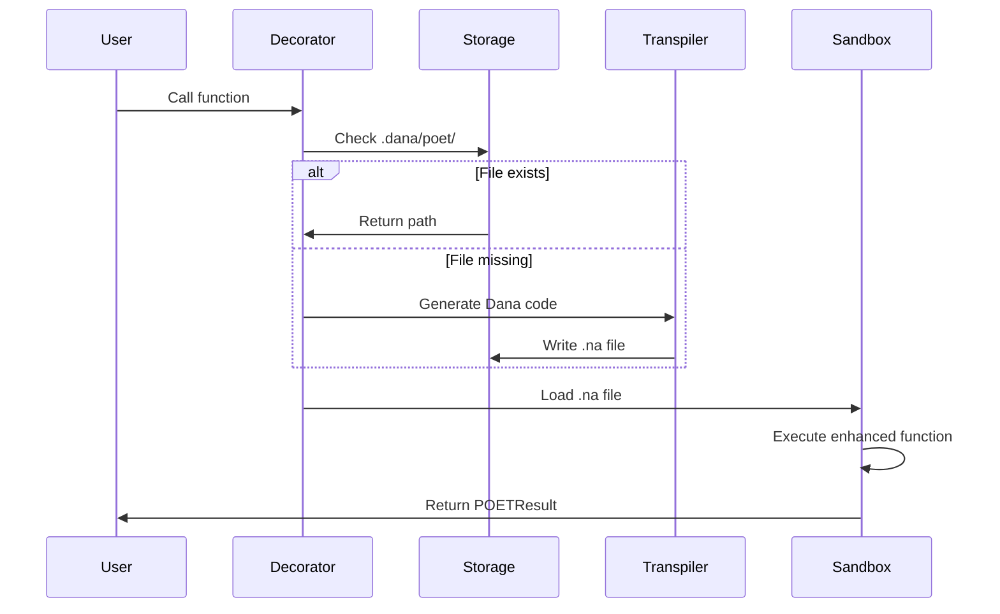

# POET Design Document (Consolidated)

**Version**: 3.0  
**Date**: 2025-01-22  
**Status**: Active Design Document - Local Storage Implementation

## Table of Contents
1. [Overview](#overview)
2. [User Experience](#user-experience)
3. [Architecture](#architecture)
4. [Storage Design](#storage-design)
5. [Implementation Details](#implementation-details)
6. [Use Cases](#use-cases)
7. [Future Considerations](#future-considerations)

## Overview

POET (Perceive-Operate-Enforce-Train) is a function enhancement framework that transforms simple functions into production-ready implementations through a four-phase pipeline. The framework generates Dana code that runs in a secure sandbox, providing enterprise-grade reliability with zero configuration.

### Vision
Enable developers to write simple functions and get enterprise-grade reliability, monitoring, and continuous improvement automatically through a single decorator.

### Core Promise
"From prototype to production in one decorator."

## User Experience

### The POET Journey

#### 1. **Starting Simple**
Developer writes a basic function:
```python
# my_project/calculations.py
def safe_divide(a: float, b: float) -> float:
    """Divide two numbers."""
    return a / b
```

#### 2. **Adding POET**
Add one decorator:
```python
from opendxa.dana.poet import poet

@poet(domain="mathematical_operations")
def safe_divide(a: float, b: float) -> float:
    """Divide two numbers."""
    return a / b
```

#### 3. **What Happens Behind the Scenes**
On first call:
1. POET generates enhanced Dana code
2. Stores it locally in `.dana/poet/safe_divide.na`
3. Executes the enhanced version in Dana sandbox

The generated file structure:
```
my_project/
├── calculations.py
└── .dana/
    └── poet/
        └── safe_divide.na  # Auto-generated enhancement
```

#### 4. **Using the Enhanced Function**
Works exactly like before, but now bulletproof:
```python
# Normal usage - no changes needed
result = safe_divide(10, 2)  # Returns 5.0

# Previously crashed, now handles gracefully
result = safe_divide(10, 0)  
# Raises: ValueError: POET validation failed: Division by zero: parameter 'b' cannot be zero

# Get detailed execution info
result = safe_divide(10, 2)
print(result._poet.execution_id)  # For feedback tracking
```

#### 5. **Enabling Learning (POET)**
Add `optimize_for` to enable the Train phase:
```python
@poet(domain="prompt_optimization", optimize_for="clarity")
def generate_prompt(topic: str, audience: str) -> str:
    return f"Explain {topic} to {audience}"

# Use the function
prompt = generate_prompt("quantum computing", "5-year-old")

# Provide feedback to improve it
from opendxa.dana.poet import feedback
feedback(prompt._poet.execution_id, "too complex for audience")
```

### Key User Benefits

1. **Zero Learning Curve**: Functions work exactly as before
2. **Progressive Enhancement**: Start simple, add features as needed
3. **Transparent Operation**: See generated code in `.dana/poet/`
4. **Local Development**: No external services required
5. **Production Ready**: Enterprise features from day one

## Architecture

### Core Principles

1. **Local-First Storage**
   - Enhanced code lives next to original
   - No global registry or database
   - Easy to version control
   - Simple to understand

2. **Dana-Native Execution**
   - All enhancements run in Dana sandbox
   - Secure by default
   - Full language features available
   - Consistent execution model

3. **Transparent Generation**
   - Generated code is readable
   - Easy to debug and inspect
   - No magic, just code
   - Can be manually edited if needed

### Four-Phase Pipeline

```
Original Function → POET Decorator → Dana Code Generation → Sandbox Execution
                                           ↓
                                    .dana/poet/{function}.na
```

Each generated file contains four phase functions:

1. **perceive()** - Input validation and preparation
2. **operate()** - Core logic with reliability features  
3. **enforce()** - Output validation and quality checks
4. **train()** - Learning from feedback (if enabled)

## Storage Design

### File Organization

```
project_root/
├── module_a/
│   ├── calculations.py      # Contains @poet decorated functions
│   └── .dana/
│       └── poet/
│           ├── safe_divide.na
│           └── calculate_risk.na
├── module_b/
│   ├── api_calls.py
│   └── .dana/
│       └── poet/
│           └── fetch_data.na
```

### Generated Dana Code Structure

```dana
# .dana/poet/safe_divide.na

import math
import time

# State management
struct POETState {
    inputs: dict
    perceive_result: dict
    operate_result: dict
    enforce_result: dict
    metadata: dict
    errors: list[string]
    warnings: list[string]
}

# Phase 1: Input validation
def perceive(a: float, b: float, state: POETState) -> POETState {
    # Validation logic
    if b == 0 {
        state.errors.append("Division by zero: parameter 'b' cannot be zero")
    }
    state.perceive_result = {"valid": len(state.errors) == 0}
    return state
}

# Phase 2: Core execution
def operate(a: float, b: float, state: POETState) -> POETState {
    # Original logic with enhancements
    for attempt in range(3) {
        try {
            result = a / b  # Original logic embedded
            state.operate_result = {"success": true, "value": result}
            break
        } except Exception as e {
            # Retry logic
        }
    }
    return state
}

# Phase 3: Output validation
def enforce(state: POETState) -> POETState {
    # Business rules
    return state
}

# Phase 4: Learning (if enabled)
def train(state: POETState, feedback: dict) -> void {
    # Update parameters based on feedback
}

# Main orchestrator
def enhanced_safe_divide(a: float, b: float) -> float {
    state = POETState(...)
    state = perceive(a, b, state)
    state = operate(a, b, state)  
    state = enforce(state)
    
    if not state.enforce_result["valid"] {
        raise ValueError(f"POET validation failed: {state.errors}")
    }
    
    return state.enforce_result["final_value"]
}
```

## Implementation Details

### Decorator Flow

```python
@poet(domain="...", **options)
def my_function(...):
    ...

# When called:
1. Decorator checks for .dana/poet/my_function.na
2. If missing, calls transpiler to generate it
3. Loads file into Dana sandbox
4. Executes enhanced_my_function()
5. Returns POETResult with value and metadata
```

### Transpiler Process

1. **Extract Function Info**
   - Parse Python AST
   - Get signature, annotations, body
   - Extract docstring

2. **Apply Domain Template**
   - Get domain-specific enhancements
   - Generate phase implementations
   - Add domain intelligence

3. **Generate Dana Code**
   - Convert Python → Dana syntax
   - Build POETState struct
   - Create phase functions
   - Generate orchestrator

4. **Write Local File**
   - Create .dana/poet/ directory
   - Write {function_name}.na
   - Make it readable/debuggable

### Execution Model



## Use Cases

### Use Case A: Mathematical Operations
```python
@poet(domain="mathematical_operations")
def safe_divide(a: float, b: float) -> float:
    return a / b

# Generated enhancements:
# - Division by zero validation
# - NaN/Infinity checking
# - Numerical stability
# - Retry on transient errors
```

### Use Case B: LLM Interactions
```python
@poet(domain="llm_optimization", retries=3)
def query_ai(prompt: str) -> str:
    return llm.complete(prompt)

# Generated enhancements:
# - Prompt validation
# - Token monitoring
# - Response quality checks
# - Retry with backoff
```

### Use Case C: Prompt Engineering (with Learning)
```python
@poet(domain="prompt_optimization", optimize_for="clarity")
def explain_concept(concept: str, level: str) -> str:
    return f"Explain {concept} at {level} level"

# Generated enhancements:
# - A/B testing variants
# - Performance tracking
# - Learning from feedback
# - Automatic optimization
```

### Use Case D: ML Monitoring (with Learning)
```python
@poet(domain="ml_monitoring", optimize_for="accuracy")
def detect_anomaly(data: list[float]) -> bool:
    return statistical_test(data)

# Generated enhancements:
# - Adaptive thresholds
# - Drift detection
# - Learning baselines
# - Alert optimization
```

## Future Considerations

### Advanced Features
1. **Hot Reloading**: Detect changes to .na files
2. **Version Control**: Track enhancement evolution
3. **Debugging Tools**: Step through phases
4. **Performance Profiling**: Phase-level metrics

### Ecosystem Integration
1. **IDE Support**: Syntax highlighting for .na files
2. **Testing Framework**: Phase-specific tests
3. **CI/CD Pipeline**: Enhancement validation
4. **Documentation**: Auto-generate from phases

### Scalability Options
1. **Shared Enhancements**: Reuse across projects
2. **Template Library**: Common patterns
3. **Cloud Sync**: Share learnings
4. **Enterprise Features**: Governance, audit

## Design Philosophy

### Why Local Storage?
- **Simplicity**: No complex infrastructure
- **Transparency**: See what's generated
- **Control**: Edit if needed
- **Versioning**: Git-friendly
- **Debugging**: Easy to inspect

### Why Dana?
- **Security**: Sandboxed execution
- **Features**: Rich language capabilities
- **Consistency**: One runtime for all
- **Integration**: Native to OpenDXA

### Why Four Phases?
- **Separation**: Clear responsibilities
- **Testability**: Isolate concerns
- **Extensibility**: Add phases later
- **Clarity**: Easy to understand

## Success Metrics

1. **Developer Experience**
   - Time to first enhancement: < 30 seconds
   - Learning curve: Immediate productivity
   - Debugging time: 50% reduction

2. **System Quality**
   - Error reduction: 90%+
   - Performance impact: < 5ms
   - Code reuse: 80%+

3. **Business Value**
   - Time to production: 10x faster
   - Maintenance cost: 70% reduction
   - Reliability: 99.9%+