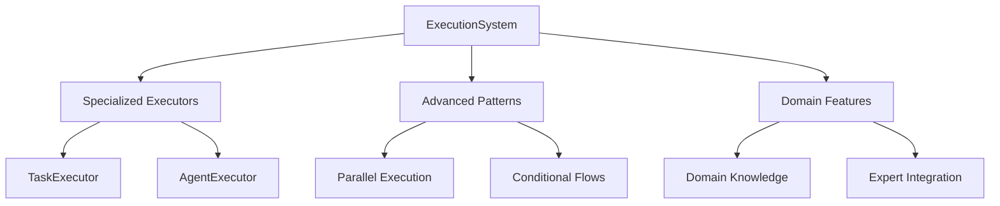
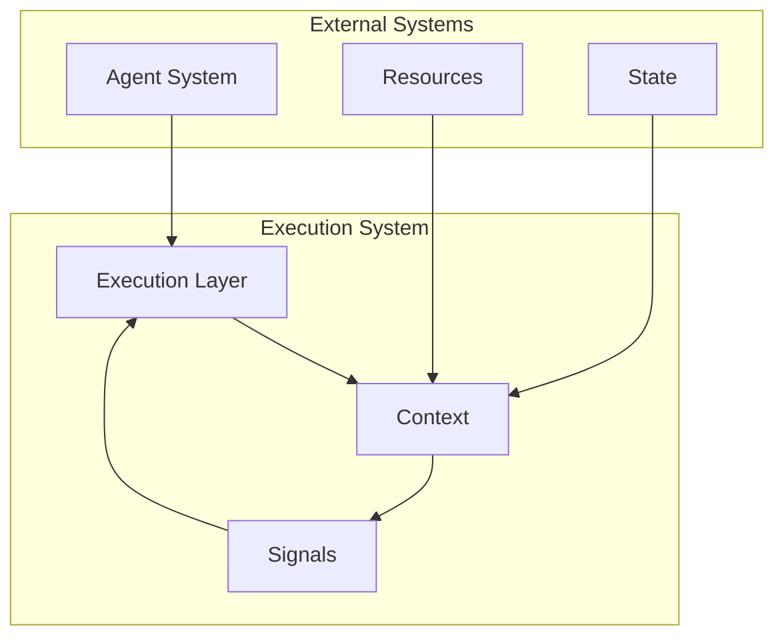

<!-- markdownlint-disable MD041 -->
<!-- markdownlint-disable MD033 -->
<p align="center">
  
</p>

[Project Overview](../../README.md) | [Main Documentation](../../docs/README.md)

# OpenDXA Execution System

The OpenDXA Execution System provides specialized implementations and advanced features for executing tasks in the OpenDXA framework. It builds upon the base execution framework to deliver domain-specific functionality and enhanced execution patterns.

## Overview

The Execution System extends the base framework with:

- Specialized executor implementations
- Advanced execution patterns
- Domain-specific functionality
- Enhanced graph operations
- Sophisticated signal handling



## Key Components

### 1. TaskExecutor

Specialized executor for task-based execution:

```python
class TaskExecutor(BaseExecutor):
    """Executor for task-based execution."""
    
    def __init__(self, task: Task, resources: Dict[str, Any]):
        self.task = task
        self.resources = resources
        
    async def execute(self, context: ExecutionContext) -> ExecutionResult:
        # Execute task with specialized handling
        result = await self._execute_task(context)
        return ExecutionResult(
            success=True,
            data=result,
            metadata={"task_id": self.task.id}
        )
```

### 2. AgentExecutor

Executor for agent-based execution:

```python
class AgentExecutor(BaseExecutor):
    """Executor for agent-based execution."""
    
    def __init__(self, agent: Agent, capabilities: List[Capability]):
        self.agent = agent
        self.capabilities = capabilities
        
    async def execute(self, context: ExecutionContext) -> ExecutionResult:
        # Execute with agent capabilities
        result = await self._execute_with_agent(context)
        return ExecutionResult(
            success=True,
            data=result,
            metadata={"agent_id": self.agent.id}
        )
```

### 3. ExecutionManager

Advanced execution management:

```python
class ExecutionManager:
    """Manages execution of tasks and agents."""
    
    def __init__(self, config: ExecutionConfig):
        self.config = config
        self.executors = {}
        self.graphs = {}
        
    async def execute_graph(self, graph: ExecutionGraph) -> ExecutionResult:
        """Execute a graph with advanced features."""
        return await self._execute_with_features(graph)
        
    async def parallel_execute(self, tasks: List[Task]) -> List[ExecutionResult]:
        """Execute tasks in parallel."""
        return await self._execute_parallel(tasks)
```

### 4. SignalProcessor

Enhanced signal processing:

```python
class SignalProcessor:
    """Processes execution signals with advanced features."""
    
    def __init__(self, handlers: Dict[SignalType, SignalHandler]):
        self.handlers = handlers
        
    async def process_signal(self, signal: ExecutionSignal) -> None:
        """Process signal with specialized handling."""
        await self._process_with_features(signal)
        
    async def handle_error(self, error: Exception) -> None:
        """Handle errors with advanced recovery."""
        await self._handle_with_recovery(error)
```

## Usage Guide

### Basic Execution

```python
from opendxa.execution import TaskExecutor, ExecutionManager

# Create executor
executor = TaskExecutor(task=my_task, resources=resources)

# Execute task
result = await executor.execute(context)

# Use execution manager
manager = ExecutionManager(config=config)
graph_result = await manager.execute_graph(graph)
```

### Advanced Execution

```python
from opendxa.execution import AgentExecutor, ParallelExecutor

# Create agent executor
agent_executor = AgentExecutor(agent=my_agent, capabilities=capabilities)

# Execute with agent
result = await agent_executor.execute(context)

# Parallel execution
parallel_executor = ParallelExecutor(executors=[executor1, executor2])
results = await parallel_executor.execute(context)
```

### Signal Handling

```python
from opendxa.execution import SignalProcessor, ExecutionSignal

# Create processor
processor = SignalProcessor(handlers=handlers)

# Process signals
await processor.process_signal(ExecutionSignal(
    type=SignalType.TASK_COMPLETE,
    result={"data": "result"}
))
```

## Best Practices

1. **Executor Selection**
   - Choose appropriate executor type
   - Configure resources properly
   - Handle dependencies correctly

2. **Advanced Features**
   - Use parallel execution when appropriate
   - Implement conditional flows
   - Handle complex scenarios

3. **Signal Management**
   - Use appropriate signal types
   - Implement proper handlers
   - Handle errors gracefully

4. **Resource Management**
   - Manage resources efficiently
   - Handle resource dependencies
   - Clean up resources properly

## Integration with Base Framework

The execution system builds upon the base execution framework (`opendxa.base.execution`). While the base framework provides the foundation, this system adds:

- Specialized implementations
- Advanced execution patterns
- Domain-specific features
- Enhanced management capabilities

For more information on the foundational aspects, see the [Base Execution Framework Documentation](../base/execution/README.md).

## Architecture

The Execution System consists of multiple layers that work together to execute tasks:

1. **Graph-Based Execution**
   - Directed graphs represent execution flows
   - Nodes represent executable steps
   - Edges define dependencies and transitions

2. **Execution Context**
   - Manages execution state
   - Provides resources for execution
   - Handles communication between components

3. **Signal-Based Communication**
   - Standardized data passing
   - Control flow management
   - Error handling

## Layer Interaction



## Key Concepts

### Execution Graph

The base execution structure:

- **Graph**: Directed graph representing execution flow
- **Node**: Individual steps in execution
- **NodeType**: Different types of nodes (START, TASK, END)
- **Edge**: Connections between nodes

### Execution Context

Manages execution state and resources:

- **Context**: Execution environment
- **Resources**: Available capabilities
- **State**: Current execution state
- **Metadata**: Additional context information

### Execution Signal

Standardized communication between components:

- **Signal**: Data and control information
- **Type**: Signal category (DATA, CONTROL)
- **Result**: Execution output
- **Status**: Execution state

### Layer Awareness

The execution system is designed to be layer-aware, allowing different layers to interact while maintaining separation of concerns:

1. **Layer Identification**
   - Each layer has a unique identifier
   - Layers can query their position in the hierarchy
   - Context maintains layer-specific information

2. **Layer Interaction**
   - Upper layers delegate to lower layers
   - Results flow back up through the hierarchy
   - Each layer processes results according to its role

3. **Layer Independence**
   - Layers can be used independently
   - Custom layer implementations are supported
   - Layer-specific strategies can be configured

### Derived Classes

The base execution system is extended by specialized implementations:

- [Workflow](workflow/README.md) - Process execution
- [Pipeline](pipeline/README.md) - Data flow execution

## Execution Signal Design

The execution system uses signals for communication between components. Signals provide a standardized way to pass data and control information:

```python
@dataclass
class ExecutionSignal:
    type: ExecutionSignalType  # For control flow and error handling
    result: Dict[str, Any]    # For the actual data
```

### Signal Types

Base signal types include:
- `DATA_RESULT`: Node output data
- `CONTROL_ERROR`: Error information
- `CONTROL_START`: Node begins execution
- `CONTROL_COMPLETE`: Node completed
- `CONTROL_SKIP`: Node was skipped

### Result Structure

Signals contain a result dictionary with:
```python
{
    "node": str,           # ID of the node that produced the result
    "content": Any,        # The actual result data
    "status": str,         # Status of the execution
    "metadata": Dict       # Optional context
}
```

### Example Usage

```python
# Create a result signal
signal = ExecutionSignal(
    type=ExecutionSignalType.DATA_RESULT,
    result={
        "node": "node_id",
        "content": "actual result",
        "status": "completed"
    }
)
```

## Usage Examples

### Basic Execution

```python
from dxa.execution import ExecutionContext, ExecutionGraph
from dxa.common.graph import NodeType
from dxa.agent.resource import LLMResource

# Create an execution graph
graph = ExecutionGraph(objective="Execute task")
graph.add_node(ExecutionNode(
    node_id="TASK",
    node_type=NodeType.TASK,
    objective="Execute step"
))

# Set up execution
context = ExecutionContext(
    resources={"llm": LLMResource()}
)
result = await graph.execute(context)
```

## Design Principles

1. **Separation of Concerns**
   - Clear interfaces between components
   - Minimal dependencies
   - Focused responsibilities

2. **Progressive Complexity**
   - Start with simple implementations
   - Add complexity incrementally
   - Maintain clarity at each level

3. **Flexible Execution**
   - Support for different strategies
   - Adaptable to requirements
   - Extensible for custom behaviors

4. **State Management**
   - Clear state transitions
   - Consistent state access
   - Proper error handling

## Integration with Agent System

The Execution System integrates with the Agent System through:

1. **Resource Access**
   - Execution components access agent resources
   - Resources provide capabilities to execution
   - Consistent resource management

2. **State Management**
   - Execution state is part of agent state
   - State changes trigger agent updates
   - Consistent state access patterns

3. **IO Handling**
   - Execution uses agent IO capabilities
   - IO operations are tracked in state
   - Consistent error handling

## See Also

- [Agent System](../agent/README.md) - Agent components

---

<p align="center">
Copyright © 2024 Aitomatic, Inc. Licensed under the <a href="../../LICENSE.md">MIT License</a>.
<br/>
<a href="https://aitomatic.com">https://aitomatic.com</a>
</p> 