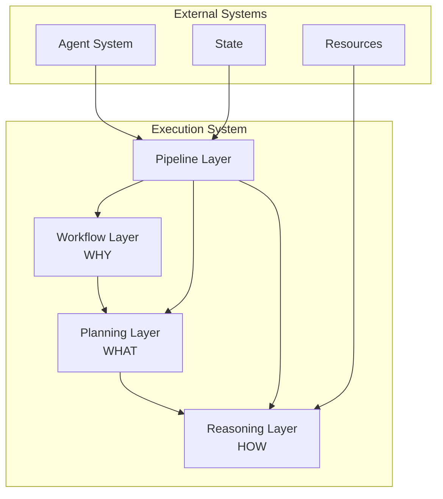

<!-- markdownlint-disable MD041 -->
<!-- markdownlint-disable MD033 -->
<p align="center">
  
</p>

# OpenDXA Execution System

## Overview

The OpenDXA Execution System implements the three-layer architecture that maps business workflows to concrete plans to reasoning patterns. This system is responsible for translating high-level objectives into executable actions through a structured approach to agent execution.

## Architecture

The Execution System consists of four main components:

1. **[Workflow Layer](workflow/README.md)** - Defines what agents can do (WHY)
   - Translates process specifications into executable workflow graphs
   - Provides natural language interfaces for workflow definition
   - Manages workflow structure and validation

2. **[Planning Layer](planning/README.md)** - Converts workflows to executable plans (WHAT)
   - Transforms high-level workflows into concrete steps
   - Manages dependencies between steps
   - Handles data flow between nodes

3. **[Reasoning Layer](reasoning/README.md)** - Executes plans with thinking patterns (HOW)
   - Implements specific reasoning strategies
   - Processes execution signals
   - Manages state and context

4. **[Pipeline Layer](pipeline/README.md)** - Orchestrates execution flow
   - Coordinates between layers
   - Manages execution state
   - Handles communication between components

## Layer Interaction



## Key Concepts

### Workflow Layer

The Workflow Layer translates business objectives into structured workflows:

- **Workflow**: A directed graph representing a process
- **ExecutionNode**: Individual steps in a workflow
- **NodeType**: Different types of nodes (START, TASK, END)
- **Objective**: Goal definition for workflows and nodes

### Planning Layer

The Planning Layer converts workflows into executable plans:

- **Plan**: A sequence of concrete steps to execute
- **Step**: An individual action to perform
- **Dependency**: Relationship between steps
- **DataFlow**: Information passing between steps

### Reasoning Layer

The Reasoning Layer executes plans using thinking patterns:

- **ReasoningStrategy**: Approach to executing steps
- **ExecutionSignal**: Communication between components
- **Context**: Information needed for execution
- **Result**: Output from step execution

### Pipeline Layer

The Pipeline Layer orchestrates the execution flow:

- **WorkflowExecutor**: Main execution engine
- **ExecutionContext**: Manages execution state and resources
- **ExecutionSignal**: Communication between layers
- **ExecutionStatus**: Current state of execution

## Usage Examples

### Basic Workflow Execution

```python
from dxa.execution import WorkflowExecutor, ExecutionContext
from dxa.execution.workflow import Workflow
from dxa.common.graph import NodeType
from dxa.agent.resource import LLMResource

# Create a workflow
workflow = Workflow(objective="Analyze customer feedback")
workflow.add_node(ExecutionNode(
    node_id="ANALYZE",
    node_type=NodeType.TASK,
    objective="Analyze feedback data"
))

# Set up execution
context = ExecutionContext(
    reasoning_llm=LLMResource(),
    planning_llm=LLMResource(),
    workflow_llm=LLMResource()
)
executor = WorkflowExecutor()
result = await executor.execute(workflow, context)
```

### Advanced Workflow with Planning

```python
from dxa.execution import PlanStrategy
from dxa.execution.workflow import WorkflowFactory

# Create a complex workflow
workflow = WorkflowFactory.create_sequential_workflow(
    objective="Research quantum computing",
    commands=[
        "Gather recent papers",
        "Analyze methodologies",
        "Synthesize findings",
        "Create summary report"
    ]
)

# Execute with hierarchical planning
executor = WorkflowExecutor(plan_strategy=PlanStrategy.HIERARCHICAL)
result = await executor.execute(workflow, context)
```

### Custom Reasoning Strategy

```python
from dxa.execution import ReasoningStrategy
from dxa.agent import Agent

# Configure agent with custom reasoning
agent = Agent(name="researcher")\
    .with_reasoning(ReasoningStrategy.CHAIN_OF_THOUGHT)

# Execute workflow
result = agent.run(workflow)
```

## Design Principles

1. **Separation of Concerns**
   - Each layer has a specific responsibility
   - Clear interfaces between components
   - Minimal dependencies between layers

2. **Progressive Complexity**
   - Start with simple implementations
   - Add complexity incrementally
   - Maintain clarity at each level

3. **Flexible Execution**
   - Support for different execution strategies
   - Adaptable to changing requirements
   - Extensible for custom behaviors

4. **State Management**
   - Clear state transitions
   - Consistent state access
   - Proper error handling

## Integration with Agent System

The Execution System integrates with the Agent System through:

1. **Resource Access**
   - Execution components access agent resources
   - Resources provide capabilities to execution
   - Consistent resource management

2. **State Management**
   - Execution state is part of agent state
   - State changes trigger agent updates
   - Consistent state access patterns

3. **IO Handling**
   - Execution uses agent IO capabilities
   - IO operations are tracked in state
   - Consistent error handling

## See Also

- [Workflow System](workflow/README.md) - Process definition and control
- [Planning System](planning/README.md) - Strategic decomposition
- [Reasoning System](reasoning/README.md) - Tactical execution
- [Pipeline System](pipeline/README.md) - Execution orchestration
- [Agent System](../agent/README.md) - Agent components

---

<p align="center">
Copyright © 2024 Aitomatic, Inc. All rights reserved.
</p>

<p align="center">
<a href="https://aitomatic.com">https://aitomatic.com</a>
</p> 