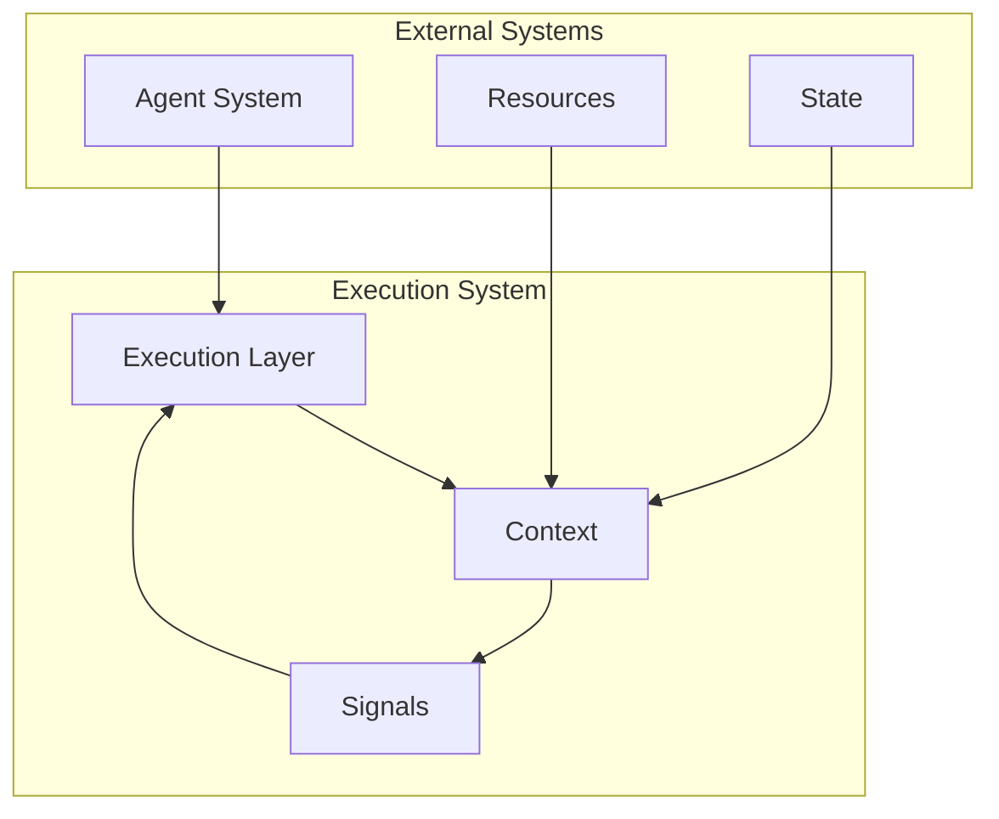

<!-- markdownlint-disable MD041 -->
<!-- markdownlint-disable MD033 -->
<p align="center">
  
</p>

# OpenDXA Execution System

## Overview

The OpenDXA Execution System provides a framework for executing tasks through a layered architecture. It manages the translation of high-level objectives into executable actions through structured execution patterns.

## Architecture

The Execution System consists of multiple layers that work together to execute tasks:

1. **Graph-Based Execution**
   - Directed graphs represent execution flows
   - Nodes represent executable steps
   - Edges define dependencies and transitions

2. **Execution Context**
   - Manages execution state
   - Provides resources for execution
   - Handles communication between components

3. **Signal-Based Communication**
   - Standardized data passing
   - Control flow management
   - Error handling

## Layer Interaction



## Key Concepts

### Execution Graph

The base execution structure:

- **Graph**: Directed graph representing execution flow
- **Node**: Individual steps in execution
- **NodeType**: Different types of nodes (START, TASK, END)
- **Edge**: Connections between nodes

### Execution Context

Manages execution state and resources:

- **Context**: Execution environment
- **Resources**: Available capabilities
- **State**: Current execution state
- **Metadata**: Additional context information

### Execution Signal

Standardized communication between components:

- **Signal**: Data and control information
- **Type**: Signal category (DATA, CONTROL)
- **Result**: Execution output
- **Status**: Execution state

### Layer Awareness

The execution system is designed to be layer-aware, allowing different layers to interact while maintaining separation of concerns:

1. **Layer Identification**
   - Each layer has a unique identifier
   - Layers can query their position in the hierarchy
   - Context maintains layer-specific information

2. **Layer Interaction**
   - Upper layers delegate to lower layers
   - Results flow back up through the hierarchy
   - Each layer processes results according to its role

3. **Layer Independence**
   - Layers can be used independently
   - Custom layer implementations are supported
   - Layer-specific strategies can be configured

### Derived Classes

The base execution system is extended by specialized implementations:

- [Workflow](workflow/README.md) - Process execution
- [Pipeline](pipeline/README.md) - Data flow execution

## Execution Signal Design

The execution system uses signals for communication between components. Signals provide a standardized way to pass data and control information:

```python
@dataclass
class ExecutionSignal:
    type: ExecutionSignalType  # For control flow and error handling
    result: Dict[str, Any]    # For the actual data
```

### Signal Types

Base signal types include:
- `DATA_RESULT`: Node output data
- `CONTROL_ERROR`: Error information
- `CONTROL_START`: Node begins execution
- `CONTROL_COMPLETE`: Node completed
- `CONTROL_SKIP`: Node was skipped

### Result Structure

Signals contain a result dictionary with:
```python
{
    "node": str,           # ID of the node that produced the result
    "content": Any,        # The actual result data
    "status": str,         # Status of the execution
    "metadata": Dict       # Optional context
}
```

### Example Usage

```python
# Create a result signal
signal = ExecutionSignal(
    type=ExecutionSignalType.DATA_RESULT,
    result={
        "node": "node_id",
        "content": "actual result",
        "status": "completed"
    }
)
```

## Usage Examples

### Basic Execution

```python
from dxa.execution import ExecutionContext, ExecutionGraph
from dxa.common.graph import NodeType
from dxa.agent.resource import LLMResource

# Create an execution graph
graph = ExecutionGraph(objective="Execute task")
graph.add_node(ExecutionNode(
    node_id="TASK",
    node_type=NodeType.TASK,
    objective="Execute step"
))

# Set up execution
context = ExecutionContext(
    resources={"llm": LLMResource()}
)
result = await graph.execute(context)
```

## Design Principles

1. **Separation of Concerns**
   - Clear interfaces between components
   - Minimal dependencies
   - Focused responsibilities

2. **Progressive Complexity**
   - Start with simple implementations
   - Add complexity incrementally
   - Maintain clarity at each level

3. **Flexible Execution**
   - Support for different strategies
   - Adaptable to requirements
   - Extensible for custom behaviors

4. **State Management**
   - Clear state transitions
   - Consistent state access
   - Proper error handling

## Integration with Agent System

The Execution System integrates with the Agent System through:

1. **Resource Access**
   - Execution components access agent resources
   - Resources provide capabilities to execution
   - Consistent resource management

2. **State Management**
   - Execution state is part of agent state
   - State changes trigger agent updates
   - Consistent state access patterns

3. **IO Handling**
   - Execution uses agent IO capabilities
   - IO operations are tracked in state
   - Consistent error handling

## See Also

- [Agent System](../agent/README.md) - Agent components

---

<p align="center">
Copyright © 2024 Aitomatic, Inc. All rights reserved.
</p>

<p align="center">
<a href="https://aitomatic.com">https://aitomatic.com</a>
</p> 