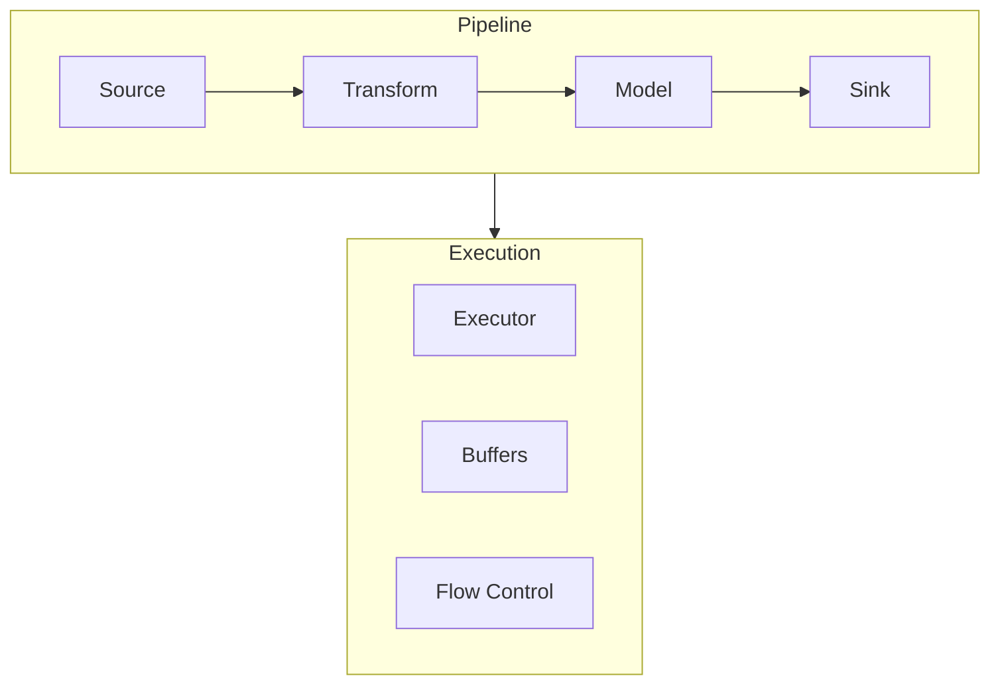
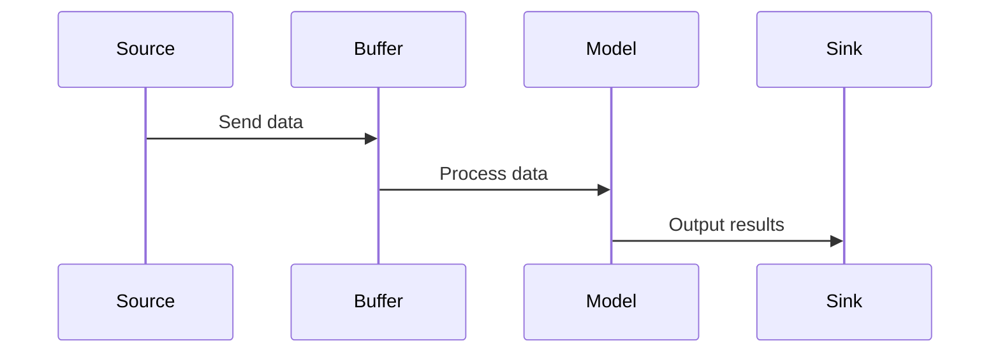

<!-- markdownlint-disable MD041 -->
<!-- markdownlint-disable MD033 -->
<p align="center">
  
</p>

[Project Overview](../../../README.md) | [Main Documentation](../../../docs/README.md)

# DXA Pipeline System

## Overview

The Pipeline system provides a flexible framework for creating and executing data processing pipelines within DXA. It uses graph-based execution to enable complex data flows between components, while also functioning as a discoverable and manageable resource.

### Key Features

- Data flow management between components
- Async execution with buffering
- Type-safe node connections
- Error handling and recovery
- Monitoring and metrics
- Resource discovery and management

## Architecture



## Components

### Pipeline

The Pipeline class inherits from both ExecutionGraph and BaseResource to provide dual functionality:

1. As an ExecutionGraph, it manages data processing flow
2. As a BaseResource, it can be discovered and used through the resource system

```python
from dxa.execution.pipeline import Pipeline

# Create pipeline as both a graph and a resource
pipeline = Pipeline(
    name="anomaly_detection",
    objective="Detect anomalies in sensor data",
    steps=[preprocess, detect_anomalies, store_results],
    description="Pipeline for anomaly detection in sensor data"
)

# Add nodes
pipeline.add_node(PipelineNode(
    node_id="source",
    node_type=NodeType.SOURCE,
    objective="Data source"
))

pipeline.add_node(PipelineNode(
    node_id="transform",
    node_type=NodeType.TASK,
    objective="Data transformation"
))

pipeline.add_node(PipelineNode(
    node_id="sink",
    node_type=NodeType.SINK,
    objective="Data output"
))

# Connect nodes
pipeline.add_edge("source", "transform")
pipeline.add_edge("transform", "sink")

# Execute pipeline
context = PipelineContext()
result = await pipeline.execute(context)

# Or use as a resource
response = await pipeline.query({
    "data": input_data,
    "options": {"context": context}
})
```

### Node Types

1. **Source Nodes**
   - Data input points
   - IoT sensors, databases, streams
   - Configurable output rates

2. **Transform Nodes**
   - Data preprocessing
   - Feature engineering
   - Filtering and validation

3. **Model Nodes**
   - ML model inference
   - Anomaly detection
   - Classification/prediction

4. **Sink Nodes**
   - Data output points
   - Storage, visualization
   - Reasoning system input

### Data Flow



## Resource Integration

The Pipeline class inherits from BaseResource, making it a first-class resource in the DXA system:

1. **Resource Interface**
   - Implements standard resource methods (initialize, cleanup, query)
   - Can be discovered and managed like other resources
   - Supports resource configuration and status tracking

2. **Pipeline as Resource**
   - Can be initialized and cleaned up through resource interface
   - Accepts queries to execute pipeline processing
   - Reports status and availability through resource methods

3. **Example Resource Usage**
   ```python
   # Initialize pipeline as resource
   await pipeline.initialize()
   
   # Execute pipeline through resource interface
   response = await pipeline.query({
       "data": input_data,
       "options": {"batch_size": 100}
   })
   
   # Clean up when done
   await pipeline.cleanup()
   ```

## Execution Flow

1. **Initialization**
   - Create pipeline with nodes and edges
   - Initialize pipeline as resource
   - Set up execution buffers

2. **Execution**
   - Start from source nodes
   - Process data through transform nodes
   - Apply models and transformations
   - Output results to sink nodes

3. **Completion**
   - Clean up buffers
   - Return final results
   - Update execution state

## Best Practices

1. **Pipeline Configuration**
   - Set appropriate buffer sizes for data volume
   - Configure batch processing if needed
   - Provide clear objectives for nodes

2. **Buffer Configuration**
   - Configure buffers based on data volume
   - Use streaming mode for continuous data
   - Set appropriate timeouts for async operations

3. **Error Handling**
   - Implement proper error handling in node steps
   - Handle resource initialization errors
   - Provide fallback behavior for failures

4. **Performance Optimization**
   - Use appropriate batch sizes
   - Configure buffer sizes based on memory constraints
   - Profile pipeline execution for bottlenecks

## See Also

- [Execution System](../README.md) - Overview of the execution system
- [Workflow System](../workflow/README.md) - Process definition and control
- [Planning System](../planning/README.md) - Strategic decomposition
- [Reasoning System](../reasoning/README.md) - Tactical execution
- [Agent System](../../agent/README.md) - Agent components and resources

---

<p align="center">
Copyright © 2024 Aitomatic, Inc. Licensed under the [MIT License](../../../LICENSE.md).
<br/>
<a href="https://aitomatic.com">https://aitomatic.com</a>
</p>
