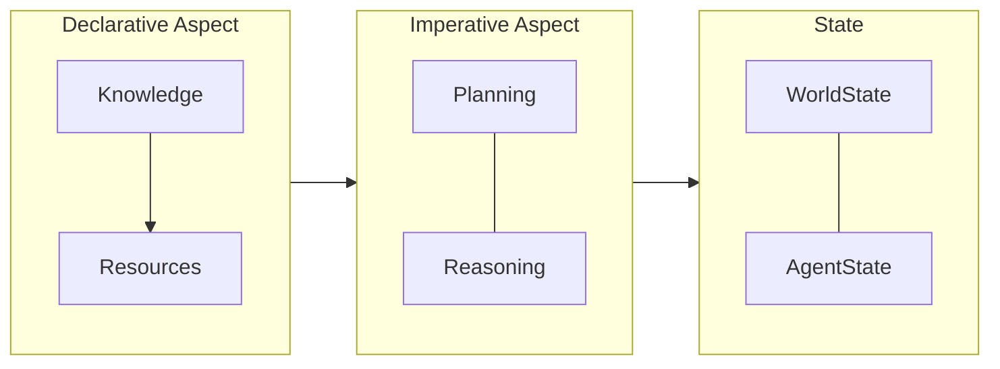
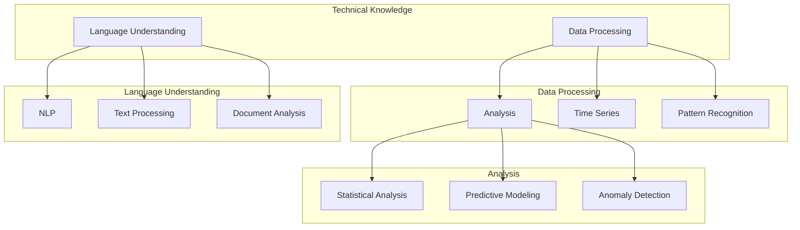
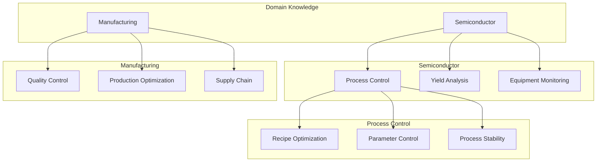

<p align="center">
  
</p>

[Project Overview](../../../README.md) | [Main Documentation](../../../docs/README.md)

# Planning System

The planning system is a core component of OpenDXA's Imperative Aspect, responsible for generating and managing executable plans based on objectives and available knowledge. It works in conjunction with the reasoning system to ensure effective task execution.

## Architecture



## Knowledge Structure

### Technical Knowledge



### Domain Knowledge



## Planning Patterns

The planning system supports four fundamental patterns, each building on the previous to handle increasing complexity:

1. **Direct Planning**
   - Single-step execution
   - Fixed objectives
   - Minimal overhead
   - Best for simple, well-defined tasks

2. **Sequential Planning**
   - Linear workflows
   - Clear dependencies
   - Progress tracking
   - Best for multi-step tasks with known sequences

3. **Hierarchical Planning**
   - Goal decomposition
   - Nested objectives
   - Resource delegation
   - Best for complex, structured goals

4. **Dynamic Planning**
   - Adaptive replanning
   - Objective evolution
   - Resource reallocation
   - Best for uncertain or changing environments

## Usage Examples

### Direct Planning
```python
from opendxa.execution.planning import DirectPlanner
from opendxa.execution.context import ExecutionContext

planner = DirectPlanner()
context = ExecutionContext(
    objective="Summarize this text",
    capabilities=["text_analysis"]
)
plan = await planner.create_plan(context)
```

### Sequential Planning
```python
from opendxa.execution.planning import SequentialPlanner

planner = SequentialPlanner()
context = ExecutionContext(
    objective="Research quantum computing",
    capabilities=["search", "analysis", "synthesis"],
    requirements=["find_papers", "analyze_trends", "synthesize_findings"]
)
plan = await planner.create_plan(context)
```

### Hierarchical Planning
```python
from opendxa.execution.planning import HierarchicalPlanner

planner = HierarchicalPlanner()
context = ExecutionContext(
    objective="Launch new product",
    capabilities=["research", "development", "marketing"],
    subgoals={
        "research": ["market", "competition"],
        "development": ["prototype", "testing"],
        "launch": ["marketing", "distribution"]
    }
)
plan = await planner.create_plan(context)
```

### Dynamic Planning
```python
from opendxa.execution.planning import DynamicPlanner

planner = DynamicPlanner()
context = ExecutionContext(
    objective="Maintain system health",
    capabilities=["monitoring", "scaling", "security"],
    adaptation_rules={
        "high_load": "scale_resources",
        "errors": "activate_fallback",
        "attacks": "enhance_security"
    }
)
plan = await planner.create_plan(context)
```

## Implementation Details

### Core Components

1. **Planning Pattern Base**
```python
class PlanningPattern:
    """Base class for all planning patterns."""
    
    async def create_plan(self, context: ExecutionContext) -> Plan:
        """Generate a plan for the given execution context."""
        raise NotImplementedError
        
    async def update_plan(self, plan: Plan, state: ExecutionState) -> Plan:
        """Update plan based on execution state."""
        raise NotImplementedError
```

2. **Plan Structure**
```python
class Plan:
    """Represents an executable plan."""
    
    def __init__(self):
        self.steps: List[Step]
        self.dependencies: Dict[str, List[str]]
        self.resources: Dict[str, Resource]
        self.metrics: Dict[str, Metric]
```

### Pattern Selection Guide

Choose a planning pattern based on:

1. **Objective Complexity**
   - Single goal → Direct
   - Linear sequence → Sequential
   - Nested goals → Hierarchical
   - Evolving goals → Dynamic

2. **Environmental Stability**
   - Static, known → Direct/Sequential
   - Partially known → Hierarchical
   - Highly dynamic → Dynamic

3. **Resource Management**
   - Fixed resources → Direct
   - Staged allocation → Sequential
   - Hierarchical sharing → Hierarchical
   - Dynamic reallocation → Dynamic

## Integration with Reasoning

Planning patterns interact with reasoning through:

1. Plan execution
2. Signal processing
3. Resource coordination
4. Progress tracking

Example:

```python
async def _handle_reasoning_signals(self, signals: List[Signal]) -> None:
    """Process signals from reasoning layer."""
    for signal in signals:
        if signal.type == SignalType.DISCOVERY:
            await self._update_objective(signal.content)
        elif signal.type == SignalType.RESOURCE:
            await self._reallocate_resources(signal.content)
```

## Resource Management

Each pattern has different resource needs:

- Direct: Minimal (basic allocation)
- Sequential: Moderate (staged allocation)
- Hierarchical: Heavy (nested allocation)
- Dynamic: Intensive (continuous reallocation)

## Testing and Validation

Plans should validate:

1. Objective alignment
2. Resource feasibility
3. Step coherence
4. Adaptation rules

## Best Practices

1. Pattern Selection
   - Match to objective complexity
   - Consider environmental stability
   - Account for resource constraints

2. Implementation
   - Clear objective definition
   - Proper resource allocation
   - Signal handling
   - Progress tracking

3. Monitoring
   - Objective evolution
   - Resource utilization
   - Plan effectiveness
   - Adaptation success

---

See [Agent Documentation](../../agent/README.md) for integration details.

---

<p align="center">
Copyright © 2024 Aitomatic, Inc. Licensed under the [MIT License](../../../LICENSE.md).
<br/>
<a href="https://aitomatic.com">https://aitomatic.com</a>
</p>

## Integration with Flows

The planning system works closely with the Flow system:

1. Flows define high-level process templates
2. Planning converts flows to executable plans
3. Runtime manages execution

See [Flow Documentation](../../flow/README.md) for more details on process automation.
